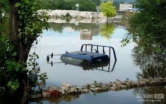
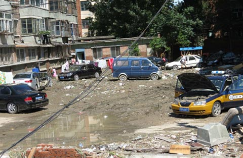

# ＜摇光＞如果我们连算个数字都需要摇号

**他在微博上告诉我，不在辖区范围死亡的人不在统计之列，这是什么概念呢。打个比方，如果你在洪山区工作，家住武昌区，不幸在单位门口淹死了，你是不会被统计的。也许你会以为，死在那个地方，那个地方的政府会把你统计在死亡人数内，对不起，也没可能，不属于本辖区管辖的人口在本辖区死亡的，也不在本辖区统计范围内。这是什么意思呢，你死在洪山区，洪山区也不会把你统计在本辖区死亡人口范围内的。北京有多少外来人口暂且不论，就是拥有北京户籍的人，谁能保证事发时候就在自己的辖区？家住朝阳，有可能在海淀上班，也有可能在东城。** **奇怪么，怨，只能怪你没摇号。**

# 如果我们连算个数字都需要摇号

 文/王成栋 [ 中国地质大学（武汉）] 

#### 一

我在经济观察报实习的同事，这几天一直在房山区采访跟踪。

他在微博上告诉我，不在辖区范围死亡的人不在统计之列，这是什么概念呢。打个比方，如果你在洪山区工作，家住武昌区，不幸在单位门口淹死了，你是不会被统计的。

也许你会以为，死在那个地方，那个地方的政府会把你统计在死亡人数内，对不起，也没可能，不属于本辖区管辖的人口在本辖区死亡的，也不在本辖区统计范围内。

这是什么意思呢，你死在洪山区，洪山区也不会把你统计在本辖区死亡人口范围内的。

北京有多少外来人口暂且不论，就是拥有北京户籍的人，谁能保证事发时候就在自己的辖区？家住朝阳，有可能在海淀上班，也有可能在东城。

奇怪么，怨，只能怪你没摇号。

是的，这个地方买房买车都要摇号，还要纳税五年不间断，死的时候还得要死在自己的该死的地方，不然，你连个冷冰冰的数字都不算。

我背脊发凉，我住在昌平区，如果我没回来死在了朝阳区，那么，我也不算数字。 

#### 二

一位安徽老乡赵先生，在事发之后奋力救人见义勇为，但是，因为他不是北京人，没北京户口，就算做了那么多的好事，就算他在北京生活了快20年，就算他家被淹了被冲垮了，就算……

对不起，所有的救灾物资，包括一顶可以安身的帐篷也没有你的。

都是灾民，大灾面前都应当享受政府提供的救灾福利，这不需要赘言的常识，被政府一句救灾物资不够，只能先给本地居民提供为由挡了回去。 

#### 三

已经四天了吧，我曾经暗访过的灾民线人，几乎都联系不上了。只有少数几个人告诉我，一切都好，只是这几天监管的更严格了，以前可以藏身的涵洞桥洞都被大水淹的一塌糊涂，无法立足，这几天北京还有大雨，他们只能东拼西凑。

他们很庆幸还活着，不然，连个数字都算不上。

那些我联系不上的访民，希望你们安好，希望你们一切都过的顺利。

我宁愿你们都是问题被相关部门合理处理之后返回老家了，我不敢往坏了想，不然，我就是发布虚假信息了。

上天保佑。 

#### 四

我以前的同事，经济观察报原调查记者Z兄昨夜来电，泣不成声，大水漫过，遭遇毁家之变，没有北京户口，得不到任何补助。

因为处于待业中，加油妻儿需要抚育，他打算这几天回来家去。

Z兄，回去吧。我说，不然，你死了都是国家机密，哥们都不知道去哪哭你去。

 

（采编：黄理罡 ；责编：黄理罡）

 
