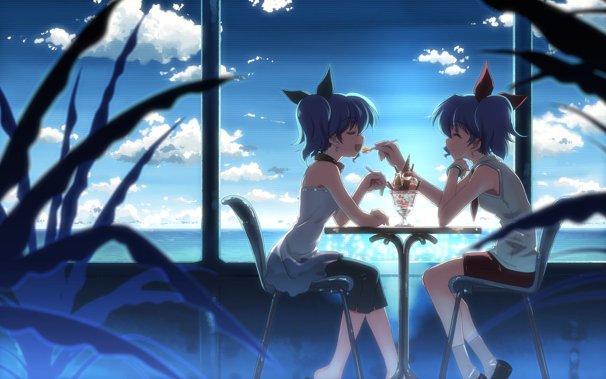

# ＜摇光＞妾心如水，良人不来

**我时常也会烂俗的想，未来的姑娘呦，你到底什么样。你丰满还是消瘦活泼还是文静？你留俏皮的短发还是如瀑的长丝？你是否也喜欢那些瑰丽奇妙的文字，沉溺于光怪陆离的影像故事？你是否也扛过了狼血和庸俗成功学疯狂的侵蚀，依然带着对生活令人发指的热爱，坚持做一个有趣的人？**  

# 妾心如水，良人不来

## 文/ 常远（北斗撰稿人）

 

走在寂静里 走在天上 

而阴茎倒挂下来 

——王小波 

1

我喜欢跟姑娘聊天，聪明、有趣的姑娘，能谈政治且温柔可人的姑娘。不为畅谈国事，而是彻底屏蔽政治。你们谈人生理想八卦娱乐初恋美食美衣阅读电影哪怕谈生理学，都清爽怡人的保持在她“聪明有趣”的维度，偶尔涉及政治，将在心照不宣和默契中带着戏谑讽刺轻轻带过。碰上“温柔可人”却“莫谈国事”的姑娘，那就糟透了，兴许你哪句话就触动了她跟政府一样的敏感带，怒目圆睁浑身怒气满嘴民主自由骂政府娘的她所谓“愤青”形象就呼之欲出了，从此你就带着僵硬、无趣、幼稚、冲动、激进，连风月都不懂浪漫都不会开房流程都不熟悉的“政治男”标签留在她黑名单里傻乐了。

我是个值得信赖的革命同志，单身或热恋期都热爱跟聪明、有趣的姑娘们聊天。现实的无情在于，姑娘们仅在单身并且你是可发展、可接受对象、还算有趣的家伙的情况下有兴趣跟你扯扯风月，一旦投入某个家伙的怀抱便立即消失的无影无踪，你只能对着QQ聊天栏或者手机屏幕发呆，等待她在春节的群发短信里出现。如果你不解风情的像从前那样聊上几句，“呵呵，过得还不错，希望你也是哦”得体礼貌的敬上。

从博爱角度说，男同志们诚然是屈理的；从异性朋友角度看，姑娘们就很不够意思了。

2

晚上休息前，会一个人踢上几盘实况。杯赛模式，让阿根廷巴西意大利法国英格兰荷兰葡萄牙中国韩国日本洪都拉斯智利科特迪瓦通通捧得世界杯；大师联赛，踢到2018赛季，用33岁的梅西上演帽子戏法；可我还是想跟人对踢。没有设计好的程序、不会被轻易的晃过，哪怕踢输了骂娘，丢球了摔手柄。

不知多少同龄人像我一样，经历了一个恐龙快打、三国志伴随的童年。大家总是争抢恐龙快打上那个黄帽子绿上衣的家伙，因为他拳脚快、身形敏捷，被呢称为“特驴”（原因已不可考）。昨天在电脑上重温街机。如今，没人跟我抢“特驴”了，无需担心血耗光后，兜里仅剩的妈妈给的五毛钱够不够买更多的游戏币，不必强撑着想制造一币通关的牛逼。什么都不用顾虑：游戏币无限设置，你可以随心所欲的死，尽情的挥霍，可以变态的站着不动等恐龙把你咬死。

第二关的丛林世界有一头沉睡的霸王龙。儿时玩到这个关卡，小朋友们会紧张的派人看守在恐龙处，防止敌人唤醒攻击力无比强大的霸王龙。大家全神贯注大呼小叫的配合，用力的敲击键盘，街机厅里氤氲着汗水和烟草的味道。昨天我放任敌人唤醒了那条龙。它很高很大，咆哮着，我站着那里，不躲不藏不灵活机动，四套拳打死了它，毫发未损。

它一点都不强大、不令人生畏了，可是我怅然若失。轻轻把手柄放下，心里止不住的难受，仿佛有什么东西悄悄溜走了。

小时候很贪恋冰棍儿，仅有的几毛几分零花钱大多捐给它了。这个夏天，每天经过小区门口的冰柜，看那些花花绿绿包装精美图案设计巧妙的冰淇淋，却疯一样想念小学门口5毛钱一支的“男子汉”，暑假时家里冰箱上层的“雪人”。

初高中时，一直想要双李宁鞋，为此没少跟妈妈撒娇缠闹。有一年有一天，终于把它捧在手里，喜滋滋穿出去显摆，仿佛赢得了全世界。如今，买来一两年却落满灰的Nike鞋躺在角落，只是因为它们，不够“潮”了。

小时候，他们总是告诉我，等到长大了，就什么都好了。仿佛所有的困惑、迷茫、欲望，都可以在骨骼和年龄的疯长中得到解决。选择看上去的确是个好东西。如今选择越来越多，但那些简单的快乐呢？

3

龚晓跃说：“告诫熟悉的女青年，找男朋友要避开三类人：读环球时报的；看春节联欢晚会的；说自己只上百度不用谷歌的。”

其实何止三类呢，你如何说服自己爱上不由分说立志考公务员、除了玩dota别无他好、提到阅读兴致勃勃跟你聊《会有天使替我爱你》、问你最新一集《非诚勿扰》看了没有的男人？

男同胞们也要火速出炉自己的“三不准”，姑娘不仅要看着舒服，起码应该懂得房价是政治而非经济问题吧，起码应该明白手里有几十万首付钱最好趁年轻去做点什么，而不是投入迟早会崩溃的虚无中寻找暂时的安全感。

大龄文艺女青年的呼喊触摸了很多人的隐痛：姐死了给我烧个哥。

遇到一个靠谱的人有那么难吗？有那么难。

跟木姑娘聊到，剩女完全是个伪命题。剩下来的姑娘大多是精品，是有的放矢是高标准高要求宁吃好桃一口不瞅烂杏一筐。不信？你看那些一个人乐哉乐哉活得潇洒文艺性情的姑娘，后面潜伏着多少睁大眼睛流着口水心痒不已的男人。

剩，是一种姿态，是底气，是牛逼。

网恋这个概念真该被踢进故纸堆了。还有谁记得痞子蔡呢，还有谁记得那带着神秘刺激让人小鹿乱撞的QQ聊天式恋爱呢，你看不到她，她也看不到你，慢慢开始以饱满的革命情怀手写信，寄照片……

互联网的高速发展让人目不暇接，曾经新奇兴奋的QQ变成了沉默的潜水世界，但SNS社区的出现完美接过了革命的薪火。生活节奏加快，时间越来越紧迫，圈子偏向无穷窄。在单位的同事、地铁上的陌生眼镜男中找到好胳膊好腿性功能正常的也许不难，但若想遇上如你期待中相谈甚欢无缝融合的，却需要供奉出太多的人品。

SNS完美解决了这个问题。日日抬头不见低头见的同事可能不知道你在夜里11点听着梁静茹的歌又触景伤情了，不知道你下班后吃着薯片写了篇生活琐碎的日志，不知道你凌晨1点喝了杯酸奶看了集《生活大爆炸》，但SNS好友知道。

被冠以“虚幻”恶名许多年的互联网，如今反倒比现实更接近灵魂。

所有无奈剩的、故意剩的、不排斥结束剩的姑娘们，赶紧拆掉你的仁王盾，把好友申请里排成长队的家伙们放进来吧。装载上武器“火眼金睛”“百毒不侵”，开始漫长而有趣的扫描生活吧，他们也许猥琐、也许无趣、也许不那么帅气，也许吃顿饭后就忍不住拉黑，但没关系，互联网的汪洋大海等着你，远隔万里的优质靠谱青年等着你，这次让你挑个够。

4

我时常想起，曾在我生命中出现的姑娘们。

她们无论在当时还是记忆里，都美好得一塌糊涂，优秀得让人目眩神迷。现如今，她们一定更漂亮、更从容、更丰富了，一定遇到了更多好玩的人，演绎了更多精彩的故事。

一个曾短暂出现在我生活里的女孩子，订婚了。我的兄弟，爱一个姑娘两年半，最后收获了她跟他人订婚的“喜讯”。我常跟他说，那个人永远活在时间里了，你把她拉不出来，自己也回不去，就这样吧，让她安静的留在那里吧。她不会发福不会老去不会穿着职业套装高跟鞋不会带着家长里短柴油米醋的气息，她永远年轻永远漂亮穿着鲜艳长裙站在回忆里，对着你笑靥如花。这样难道不好吗？你总有一天要跟所有的记忆相安无事握手言和，那里面有她也有你，有她的青春也有你的年华。

让它们留在那里吧。生活里每天都有相聚别离，号啕或欢欣。

如果最初相识的姑娘注定无法走到最后，你会依然选择相遇在年少？还是在看遍春花夏月秋风冬雪后遇到她携手走进余下的旅途？这似乎是个不值得一提的问题，几乎所有人都喜欢“地老天荒”这样的词汇吧。

但真的有那么简单吗？问题的关键在于，你想开头还是收尾？

你们在成熟稳重、理智从容、笑不露齿、工作稳定、职业套装高跟鞋、西装革履的28岁30岁相遇，气味相投性情相依相见恨晚唯怨月老一度瞎了眼，一段佳话就此开始，郎才女貌珠联璧合天造地设等祝福潮水一般涌来。像是个完美的故事。

她穿泛着光泽的高跟鞋、考究的套裙，妆容一丝不乱，带到你的朋友同事面前措辞得体，无可挑剔。她不会大喊大叫跟你无理取闹，不会要吃某家的小笼包让你穿越三条街道，不会很轻易的跟你赌气怀疑你是否跟其他女孩子有一腿。她包容体贴贤惠孝顺，入得厨房出得厅堂。

可是随着日复一日的平庸到来，某个回望的瞬间，内心是否会有隐隐的遗憾？

你是否想有一台时光机，回到她20岁22岁的年纪，在食堂、在图书馆、在主干道上，走上前去或礼貌或猥琐或忐忑的说一声：你好。那时候的她，穿着鲜艳的长裙素面朝天，穿着匡威白色帆布鞋，顶着刚洗完的湿漉漉头发冲去食堂打饭，一路上甩落无数男生的惊叹。她漂亮、骄傲、聪明，会为了舍友的一句话而耿耿于怀，会为言情剧哭得稀里哗啦，会看到玩具店里的可爱公仔走不动路，会期待某个特别的节日收到男生们的玫瑰花。她没那么得体，还没学会滴水不漏笑不露齿，带到朋友面前会捂着嘴一个劲儿的傻笑。她穿匡威帆布鞋，也喜欢淘宝上淘来的便宜凉拖，她不太喜欢化妆，穿着T恤短裤就往宿舍楼下冲，在路边那家麻辣烫一边流汗一边大呼好吃，她会撒娇会胡搅蛮缠不讲理会为脑子里突然蹦出的疯狂念头兴奋不已……

那时候的你呢。没什么钱，脚上穿着攒了很久生活费买来的新球鞋，骑着拉风的山地车飞速驶过人群，在大排档跟一群狐朋狗友扯着政治足球和姑娘，面对递过来的啤酒瓶毫不犹豫一仰而尽，你那么年轻、那么张扬，脑子里满是自命不凡的想象，大声喊世界是我们的。你的发型土土的没有那么多发胶，还没有自己的第一套西装，你还没学会克制忍耐学会礼貌微笑，不高兴了随口就来一句：去他娘的。她路过操场，看到你打球的样子。汗水顺发梢滑过你红红彤彤的脸，你大声叫喊积极奔跑，仿佛身上有使不完的力气。

你们相遇。没那么理智包容，也很难总是做到相互理解，她没那么精致的漂亮，你也离成熟睿智差得很远，一个愣头小子，一个天真的丫头，就那么说着天长地久生死相依的誓言，你们以为世界会按照自己想象的编排，不懂得生活中永远不变的就是一直在变。你们会吵架、会分手、会伤害、会分头走路、会把彼此留在回忆里不断折磨，但是亲爱的，那是你们最好的年纪。

我唠唠叨叨的，以为自己能说出什么新鲜的东西，却不幸又回到了四个月前那篇文章的主题：再不相爱就老了。

5

《艋舺》里说，“风往哪边吹，草就往哪边倒。年轻的时候我也以为自己是风，等到遍体鳞伤以后，才知道，原来我们都是草。”

我们未必如草随风倒，却也只能这样，模模糊糊往前走。

时间什么都安排好了。

年轻时，总想看遍世间的风景，时不时涌出冒险的冲动，想拉着心爱的姑娘私奔，即刻就流浪到海涯天角。

现在才明白，你什么风景都看不透，很可能也没有细水长流。你只能在一季季的春花夏月秋雨冬雪中，丈量自己生命的边界。

有可能，姑娘都不会来，你就一个人走路，或缓或急，或愉悦或悲伤。

我时常也会烂俗的想，未来的姑娘呦，你到底什么样。你丰满还是消瘦活泼还是文静？你留俏皮的短发还是如瀑的长丝？你是否也喜欢那些瑰丽奇妙的文字，沉溺于光怪陆离的影像故事？你是否也扛过了狼血和庸俗成功学疯狂的侵蚀，依然带着对生活令人发指的热爱，坚持做一个有趣的人？

不管在28还是35岁相遇，拍落满身的风尘后，我们唯一能庆幸的，是彼此一定有很多好玩的故事、路途的见闻讲给对方听，那是一个个动人的传奇。

未相逢于最好的年纪，却给了对方最丰富的自己。

我不知道你会不会来，但仍大声唱着歌，走向你。

 

（采编：尹桑；责编：陈轩）

 
