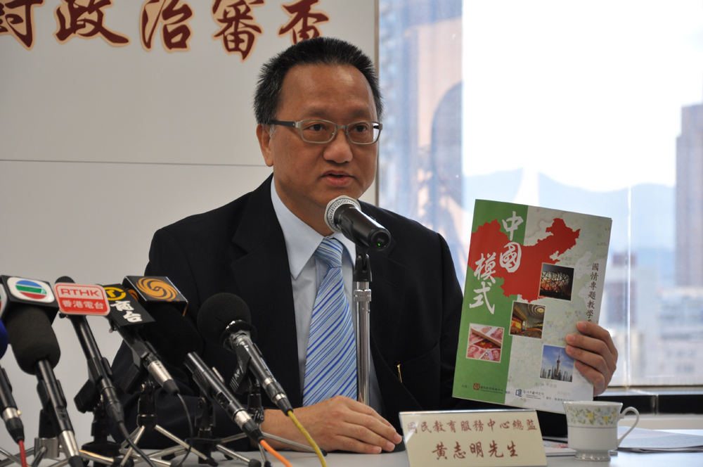
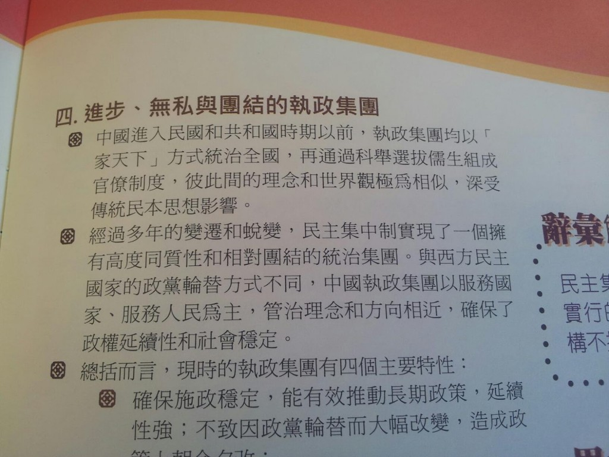
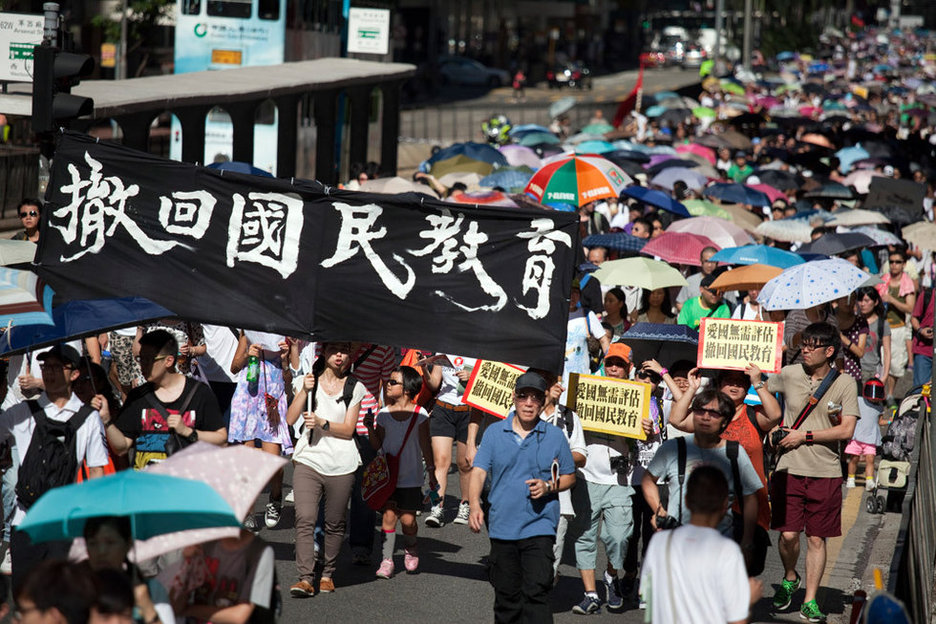
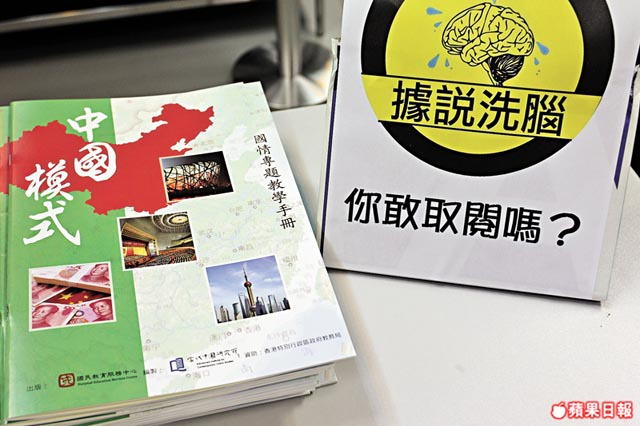
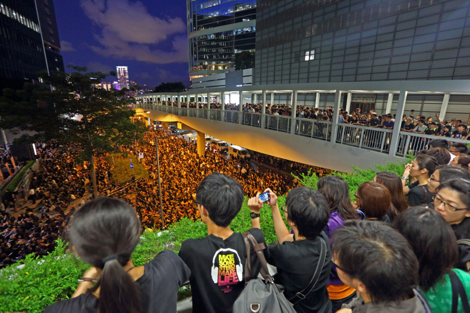

# ＜摇光＞孤独的爱国者

**“你有没有觉得自己对国家情感是矛盾的？”记者问。“可能是矛盾的，不同的阶段有不同的觉察。爱国应该是我们一生的使命。”他与想象中的建制派不同，在谈论这个国家时，他没有那么多的理直气壮、慷慨激昂，他语气温柔，但偶尔流露出伤心与失望。**  

# 孤独的爱国者

## 文/谢梦遥(中国政法大学)

 

“纵有一万道禁令，我想写这故事。”这是2个月前我还在香港，随便在微博上写下的感触。没想到，愿望竟然实现了。不过，实现的效果不够好，一是细节挖掘、内容铺排上，我火候差得还远，二是需找到一个安全但未必是最好的视角，且我也做了自我审查。无论如何，这篇报道发表了。感谢《人物》的老师们。

黄志明没想到，一本小册子，引发了一场席卷香港的龙卷风。

他所在香港国民教育服务中心，因为出版了《中国模式国情专题教学手册》，一度被万夫所指。现在，针对这个中心的舆论风暴过去了，身为中心总监的他，准备收拾残局。

“房屋署在9月30日就要收回我们这座楼了，我们这些人要解散了，没有工资发了。” 他告诉《人物》记者，留给他在这里办公的时光已经无多。这个位于青衣的中心，由港府的教育局资助，现在合同不再延续，失去的不仅是运营费用，连这座楼也要交回。东西已经开始往外搬了，办公室显得空旷了许多。

大概没有什么人会为这座中心的关闭而欢呼了，焦点问题已经不在这里。然而循着时间轨道回到7月初的香港，触发这一切的导火索，正埋在这座中心里。

#### （一）

7月5日，黄志明带了一队香港学生，去广东南沙进行为期3天的乒乓球比赛。类似的交流互动，中心经常举办。当天晚上，他接到了港教育局的官员打来的电话：“大件事了！有人要反‘国民教育了’！”问题出在那本手册上，有人把其内容拍照放到了网上，引起了争议。他试图解释，但对方没有耐心听下去：“我们压力很大，要跟你切割关系。”

他虽然心里有点着急，还是继续参加完活动。但事态比他估计要严重得多，当3天后他回到香港时，他发现传媒已经炸开锅了。

此时的国民教育服务中心，由教育局资助已有4年半。这个中心顾名思义，为了配合香港政府推行国民教育，由民间团体教联会设立。按既定计划，为期一年的新合同将马上签署，但政府告知，需要中止以检讨拨款机制。

国民教育四个字首次被提及，是在2007年特首施政报告中。2010年，香港政府表示会将其独立成科，进入中小学。课程的指引在今年的5月公布，按指引要求，学校可于未来三年以循序渐进方式推行德育及国民教育科，而三年后，每个学校都要有这门课。

反国民教育的呼声，一直零星地存在。但真正形成影响力巨大的合流，却始于今年7月。那时《中国模式》手册印出来不久，刚向香港中小学的老师进行了免费派发，让他们自发决定适用于教学。

传媒的抨击集中于这本手册第10页，对中美两国执政党简介里，标题分别是：“进步、无私与团结的执政集团”、“政党恶斗、人民当灾”。

其实，早在几个月前，当黄志明拿到手册初稿时，他就已感到标题可能有隐患。中心内部进行了讨论，还打电话去询问委托编篡的机构——浸会大学的当代中国研究所。对方说，这些表述是有依据的，来自北京大学教授的论文。黄志明不放心，让周边的朋友也给意见，朋友们看完后，都说没有问题。

“我们没有理由去干涉学术机构的观点。再说，我们设置了思考问题，这是讨论不是结论，香港这个地方不是什么都可以讨论吗？”他翻开另一页，指着其中一句说，“我们不是在歌颂共产党，你看，这也说到它的进步无私是理想型的，不是现在。”

自创立以来，国民教育服务中心每年都会出版几本教材，话题丰富，与大陆有关联，五四运动、少数民族、十二五规划、汶川地震、北京奥运等，都曾有涉及。这些教材均是免费配送，仅限给学校老师们作为参考，此前很少遭遇对内容的投诉。

“出了很多书后，我就有了思考，能否有一个模式将中国概括总结。”黄志明说。

他试图证明从头到尾都严格遵守了正当程序。“我们2011年4月和政府签合同，决定要出这个手册，通过招标确定当代中国研究所。我们完全交给他们，内容不做要求。当然，最后我们会审查。”

想用模式去囊括中国这样一个庞然大物，并不讨巧，事后看来，这个尝试也并不成功。在该手册受到关注后，批评纷至迭来。有内地背景的居港评论家长平，用“惊讶得半天说不出话来”形容读后感，他撰文批判，“把一个画得不怎么好的蓝图，当成已经完美执行的事实告诉学生”。

当然，绝大多数人不会深入辨析全册内容，但仅仅是前述两个标题，就已经引发了强烈的反弹。黄志明也承认政治敏感度不足，“可能我们身在局中，看不到全盘。”

#### （二）

记者纷纷找来了，黄志明选择在第一时间回应。7月9日是星期一，他接受了第一个访问，此后整个星期都被各种访问排满，从早到晚，都有电话打进来。

记者往往只需要几个问题上的回应，但黄志明想拿回主动权。他会花上半小时，尝试解释，他甚至邀请对方来办公室坐一坐，而不仅仅是电话采访。

“第一天跟一批记者讲完，我会看新闻，我的消息没发出来，第二天又来一轮记者，我坚持讲，还是没发出来。”他认为他的辩护被选择性过滤掉了。“他们是有默契的，完全违背了新闻操守。”

他总计接受了超过20个记者的访问。每次他开头必问对方，有没有整本读过手册。“只有2个人说看过，其他都说没看过。他没有看过就可以写那么负面的东西，这就是香港的传媒。”

同样的问题，他也曾当面问过教育局局长吴克俭。吴不置可否，黄志明认为这表示他也没有读过手册。“那他凭什么公开对媒体说，内容偏颇，他不会使用。什么人给他这个结论？”

他发现，舆论的矛头很快越过他，转向了教育局，变成了批评国民教育科是洗脑课程。“香港记者的水平很差，他们已经有了立场才来访问，他们不是了解事情，只是要挑动你和政府对抗。比如他们问我，中心是不是要关门了，你对吴克俭有什么看法，问题大同小异。没有人想问过去经历了什么。”

香港媒体发达，信息自由，在这个意义上，真相更加难以遮蔽。但也不要忘记，这是一个高速运转的城市，无论是公众还是媒体，都没有足够的耐心，去了解一个完整的故事，深度特稿几乎难以见诸报端。

如此经历一个星期后，黄志明在教联会开了记者招待会，那算是他最后一次公开发言。他决定不再回应。

他似乎又不甘心，几个星期后，他在中心的官网发布了一篇文章，是他和妻子共同完成的。文章最后问到：“是反对国民教育抑或反对课程？是反对在初小施行抑或反对在学校施行？是反对课程抑或反对评估……反对的理由又是什么？政府支持的理据又是什么？是否有交集，可以好好解决问题？”

然而，“洗脑”的警报一旦发布出来，选择立场似乎就变得比讨论细节更为重要，越来越多的香港人加入了反对阵营。

反国教甚嚣尘上之时，也正值临香港立法会选举的最后关头，九龙的街头出现“守护香港，拒绝大陆化”的竞选标语。类此这样的语言，以前的选举中从未出现过。但一定程度上，这句话也有其市场，喊出这句口号的公民党候选人毛孟静，在9月成功赢下了九龙西地区直选议席。

#### （三）

1955年出生的黄志明是土生土长的香港人，大学之前的他，对中国的认识很有限。“英国殖民地教育，将香港去中国化。那时我们只学澳洲、印度、英国的地理，就是没有中国的。历史只念到1911年，清朝灭亡就没了。不像现在，改革开放、十二五规划也放在中国历史里面。”

那时对大陆的了解，主要来自香港的报纸，“有武斗，每天都打死人，浮尸从珠江飘到香港，有些还是五花大绑。”他感到那是一个很恐怖的地方。

他第一次回大陆是1975年圣诞节，由他就读的香港中文大学的学生会组织，去东莞参加一个三天学习团。他看到了一个比香港落后的世界，不管是住宿还是道路，都脏乱残破。但这个世界里的审查又很严密。从罗湖过关时，有个官员坐在台上，一问一答，填写好回乡介绍信。带着信才可以买粮票吃饭、找旅店，晚上还要去公安局报备。“但到了东莞，一批抗日英雄给我们做讲座，我感到很难过。从此我想认识中国多一些。”

好奇感逐渐替代了恐惧感，或者说，成为一种更复杂的感情。他开始关心大陆发生的事情。毛泽东离世时，他流泪了，并参加了在中文大学广场进行的纪念活动。全校停课，有2000人参加，占学生总数不到一半。

不管在当年还是现在，像他这样的人，都是少数派。香港学友社最近一项最新调查显示，有83.8%中学生认同自己是中国人，但只有36.2%表示会关心内地新闻及发展。

黄志明第一次到北京，则已是改革开放之后。之前他们去大陆参观考察，必须要通过香港新华社（即现在的中联办），当他和周围同学看到文件上提到民间团体可以自由交流，想亲自去论证。他们故意不经过新华社，用中文大学学生会名义联系北京大学生学生会。

发出信时，是1979年1月，一直没有回复。“什么改革开放啊，骗人的。”大家很失望。

眼看快到5月大学要放假了，回信来了，“可以接受你们来交流”。

于是一行30多人自己坐火车到北京，就住在北大宿舍里。10天的交流活动，包括了开研讨会、办晚会、办讲座、看景点，甚至还有一对一地到北大学生家去拜访。这段经历，显然给黄志明留下了非常愉悦难忘的印象。“接待我的是数学系学生，我们像是失散很多年的兄弟。”

大学期间，他是积极活动分子。他本来是学物理的，每周要花4天要做实验，从下午2点到晚上7、8点。“我吃不消，大学不应该这么念的。做实验验证理论，这理论存在了几百年了，一定是那样的，还做什么呢？”他转到相对轻松的数学系，这样可以参加学生会活动。他动员能力很强，参加学生会选举，做过干事。

把当年的他放在今天，也是一名社运干将。70年代的香港学界，为争取中文能享有官方语言地位，发起了“中文运动”，黄志明参与其中。“那时沟通不方便，没有手机、facebook，只能通过身边的朋友来参加，几十个同学就算不错了，但也会引起很大反响。”现在的香港，游行成了公民表达诉求的常态，每天都发生，每年则有几千起。

但黄志明并不愿把自己和现在抗议者归于一类。批评性思维被普遍确立为高等教育的目标之一，他毫不掩饰对其的反感，“不能只会批评，激烈地批评就是批斗。破坏永远比建设容易。要带动一批人打倒另一批人，这样永远不是出路。”

#### （四）

大学毕业之后，黄志明当了28年的老师，到2009年提前退休时，他已是一所中学的副校长。学校之外，也有他活跃的舞台。

1984年，一本叫做《学生时代》的刊物请他当不受薪的社长，那是本鼓励青年认识社会关心祖国的非营利刊物。2年后，因销路太差，他决定改革，杂志社也更名成了新一代文化协会。杂志逐渐退出，活动则越办越多。

那时《中英联合声明》已经发布，黄志明认为，面对回归祖国，港人有了主动去了解国家的需求。“改革开放改得好不好？香港人是留下还是溜走？这不是讲的问题，自己去看看，没有亲身经历，你在香港怎么讲，他也不相信。”

他组织交流团，带学生去参观长江三峡，去武夷山找昆虫标本，邀请科学家讲座等等，“报名者爆棚”。在他看来，这些活动就是国民教育，也很受欢迎。

但转折点发生在了89年，很多朋友心淡了，离开了他的队伍。“毕竟解放军杀人，很难接受。中国人为什么要打中国人？为什么中央政府会做出这样的举动？不理解不接受。”

二十多年后，当回忆到那段往事，他语速渐渐慢下来。

“但为什么我还会留下来在前线做这些国民教育的工作？开董事会时我说，每个人有自己去向，要离开也没办法。”他声音哽咽，“但我认为，认识自己的国家，不是在它最辉煌的时候，应该是在它最困难的时候。”

“维园集会，头三年我都去了，我还组织自己学校的老师去，但之后我就决定不去了。”他的理由是，这不是出路。但他的妻子，仍然会参加。

1989年暑假，广州要组织航海夏令营，香港新华社问过二十余家青年团体，竟没有一个团体愿意承办。黄志明在新一代开会研究，最后决定由他亲自带队去。

“结果奇怪得很，到了广州8号风球，不能出海，3天2夜都在船上活动。两地学生在一起，分组讨论。没有议题的，讨论六四事件也行，我们不管。”

经历了最艰难的时期，新一代文化协会继续成长。在80年代，它每年组织一两百年轻人去内地交流，而现在，每年达一两千人。活动经费由协会自筹和内地接待单位支援。

“你有没有觉得自己对国家情感是矛盾的？”记者问。

“可能是矛盾的，不同的阶段有不同的觉察。爱国应该是我们一生的使命。”他与想象中的建制派不同，在谈论这个国家时，他没有那么多的理直气壮、慷慨激昂，他语气温柔，但偶尔流露出伤心与失望。

#### （五）

黄志明在新一代文化协会的主席工作，止于2010年底。因为从2011年起，他担任香港国民教育服务中心的总监。两者有业务往来，不可能兼任。

但这个中心的生命即将在他手中结束。

真正的死刑判决书，发来是8月中了，告知他最后搬离期限。此前他一直询问新合约怎么办，教育局只答复还在检讨。

“关门对我们都是很大的打击。因为我长期推动国情教育工作，从大学开始这么多年了。我从来没有追求名利，我只想踏踏实实培训学生，让他们多关心我们的国家，这是我的使命。但为什么搞到这个地步？要关门。”

在最后的运转阶段，中心还在准备一场讲座，时间在搬离前的倒数第二天，题目是“国民教育何去何从”。从内容上看，这未必会是一场向批判浪潮的反攻，更像是一次自省。因为主讲者，是一位长期无法回到大陆的媒体人刘锐绍。23年前，他是文汇报的驻京办主任。

黄志明认为国民教育没有错。“错就错在用政治手段推动教育问题。香港凭什么条件，一年就出个咨询文件，然后要3年后全港施行，不可能的。没有教材、没有教师团队、没有教学法，所有学校都要必修，凭什么？政治任务。”

在他看来，更深层次的矛盾，在于对中央政府的不信任。“香港传媒经常报道大陆发生的不公义。我们希望中央政府有个说法。很多这些事情，市民不一定相信，但为什么中央没有一个平衡、开明的说法？”

不管他倾倒了多少委屈，香港对国民教育科的政策已经转向。2012年9月8日，香港特首梁振英宣布，取消德育及国民教育科的三年开展期，改由办学团体及学校自行决定是否开办国民教育科及开办方式。如此一来，所谓三年后必须推行此科的“死线”已不存在。

但余震在继续。要求政府撤回德育及国民教育科的呼声仍在，9月11日，学联发起罢课行动。“没有人想罢课，我都想上学，但若要走到这一步，是政府逼我们这样做。”学民思潮召集人黄之锋说，他虽然还不到16岁，但一直站在反对阵营最前沿。

“这些天我不看那些新闻了，不想太伤心。”黄志明说。

原文链接：[http://blog.renren.com/blog/327893347/879930686](http://blog.renren.com/blog/327893347/879930686)

 

(采编：彭程；责编：彭程)

 
