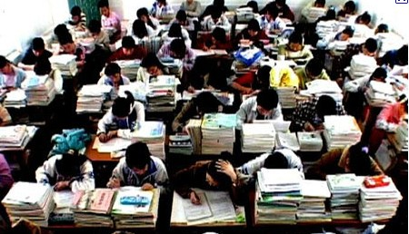

# ＜摇光＞学伤了——中国大学生绕不过的一个症结

大自然是守恒的，今天你将压力前置，明天必然会有后置的释放，今天你透支了“静心力”，可以每天持续地学习，明天就是一批批大学生，在理性萌醒的时候感受不到运用理性探求真知的愉悦。你想获得超额收益，结果错置了时间，获得的效果更差。所谓“少壮太努力，老大更伤悲”，不是劝学子不要努力，而是说努力也要遵循着一个自然规律。

# 学伤了——中国大学生绕不过的一个症结

## 文/ 李博文（厦门大学）

 今天和亚南院的韩乾老师聊天，韩老师说当年他在康奈尔大学读博士的时候，每天夜里一点从读书馆回来，就能看到康奈尔的本科生拿着被子去图书馆，康奈尔17个图书馆，很多都是通宵开放，中国人误认为美国的孩子不努力，其实那是他们的高中，到大学以后，他们非常努力，头两到三年受通识教育，而后发现自己的兴趣爱好，确立专业。 我突然领悟到，人的学习能力也是一种资源，善于开发它，它就用之不尽，竭泽而渔，必然殃及后日。学习能力是个综合指标，包括传统观点认识到的智商、学习方法因素，当然也包括学习的愿望。学习本来是让人进步的，可为什么我们总说“学生苦，苦学生”呢？那是因为学习是一种在单调中创造精彩的过程，知识不是感性的知觉、浮躁的大脑可以把握的，人需要让心沉下去，凝于所格之物，一段时间后才有所领悟。学生时代我们一方面接受事物很快，另一方面又充满青春和躁动。所以这个时期，让心静下来的时光是最宝贵的。 

可是，心静不能靠压抑，正如防洪不能靠堵，一个年轻人，如果不能发现自己内心由衷感兴趣的事物，是很难单靠意志力将心凝住的，即使真的这样做到了，也是违背自然规律的。但凡违背规律的事，大自然一定会找回来，只是时间早晚的问题。一个学生，长时间的被逼迫去学自己不愿意学习的东西，青春能量的累积肯定是要释放的，因为青春本来就充满着对丰富性的诉求，本来就该是激荡的河流，而不是水龙管子里被控制了流速的自来水。 可惜的是，没有潜心研究一件事物，就很可能看不到它的真颜，也无法确定自己是不是喜欢它。中国学生在高中肆无忌惮的透支着自己的“静心力”，重复化、模板化、灌输式让我们搞不清楚喜欢还是不喜欢了，甚至，即使是本来喜欢也变得讨厌了到了大学，好多学生的“静心力”已经透支殆尽，需要去闯荡、去折腾来为生命注入新的丰富性，这样才能补充新的“静心力”。然而大学时代一个青年理性意识萌醒，渐渐具备了对问题的独立思考能力，可以用自己的认知重新理解、构架他所处的时代和世界，正该是好好读书，涉猎各种知识的黄金时期。 大学生不爱学习，静不下心来学习，怀疑学习有没有用，觉得在自习室里坐久了很压抑，考试前预习、学习加复习，考试后不知所云，男生成绩普遍不如女生，保研男丁稀少。这些问题，我以前看来都觉得错在我们学生没有尽自己的本分，错在青春的荷尔蒙分泌太多了，今天对比美国学生的状况，我不禁怀疑：美国的孩子为什么大学里能静心学习，是他们比我们更乖吗？是他们荷尔蒙分泌的比我们少吗？显然不是。有些问题出现了，我们不要急着找出“罪魁祸首”，不要忙于拿“不努力”这样的态度性的词汇来定性，问题没有这么简单，背后是有深刻的根源的。 童年、少年的时代本来就该是用来玩的，理性梦醒之前，自然的意志充盈着少年的心灵，教育要做什么呢？教育就是要让孩子们把自然的意志充分的舒展开。一个16、7岁的少年，生命中就不该有什么big deal，他可以勇敢地承接内心的感受，并把感受翻译成行为。着急懂事吗？为什么要着急呢，该懂事的时候自然就懂了。 大自然是守恒的，今天你将压力前置，明天必然会有后置的释放，今天你透支了“静心力”，可以每天持续地学习，明天就是一批批大学生，在理性萌醒的时候感受不到运用理性探求真知的愉悦。你想获得超额收益，结果错置了时间，获得的效果更差。所谓“少壮太努力，老大更伤悲”，不是劝学子不要努力，而是说努力也要遵循着一个自然规律。 

 中国很多大学生在高中的时候就已经“学伤了”，不是说这群人丧失了学习能力，至少大学时代，这个本应该最适合学习的时代，不适用于这群人。这个群体需要为生命注入丰富性的元素才能恢复“静心力”，从而恢复学习能力。 事已至此，已经丧失“静心力”的我们该怎么做呢？毕业工作是个好选择，读研也可以，不过应该换个学习的方式。前阵子和杨威学长聊天，他说自己是确定了那个研究生项目只有半年时间在学习，其余时间都在做项目、外出交流才决定读研的。“知道这个项目学习时间少，所以选择这个项目”，这乍一听很别扭，实则是适应我们之间的生活经历的。 学制、老师、学生，构成大学的三大元素都没有做好演绎一个“大”大学的准备，三者的结合就形成了“变型的大学”，西方大学的每件事，我们也都做了，但是做的每一招每一式都差了微妙的一点。处在这个时点的中国大学生，当重新思考我们的大学实然的是什么样子。 应试教育的训练让我们善于“和病态共存”，我们渐渐缺少了对病态的不适感，生活应该是我来选择做那道题、不做哪道题，可我们有时习惯了生活出了哪道题，我要快点把它给搞定了，我们忘了：虽然我们不能绕开所有的题，我们是有权利选择不做一些题的。 

（采编自投稿邮箱；责编：陈锴）
