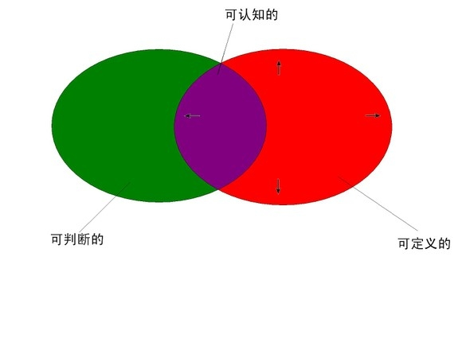
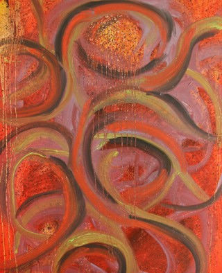

# ＜摇光＞定义的窘境

**既然如此，我们还有必要对那些已可以判断但却难以定义的概念继续追问下去么？** ** 比如“爱情”，我们有必要把它再细分为：月明星稀下的耳鬓厮磨，天涯海角的不期而遇，一米阳光下的暮然回首，断肠崖上的苦苦守候或是柴米油盐不离不弃的相濡以沫么？** ** 在这个基础上，我们还有能力接着把它们再细致地分下去么？** 

# 定义的窘境

## 文/李胜博（北京信息科技大学）

 

苏格拉底：拉凯斯，勇敢是什么？

拉凯斯： 勇敢就是灵魂的某种忍耐

……

苏格拉底：愚蠢的忍耐不是勇敢，聪明的忍耐才是，对吧？

拉凯斯： 是的

……

苏格拉底：一个懂骑术的骑兵骑马时表现出的忍耐和不懂骑术的骑兵表现出的忍耐，哪一种更勇敢？

拉凯斯： 后者

……

苏格拉底：但是与掌握了技能的人相比，无技能的人的冒险和忍耐是愚蠢的，是么？

拉凯斯： 是的.

……

苏格拉底：我们承认勇敢是一种聪明的忍耐，但现在却把无能者的冒险和忍耐说成勇敢，这是自相矛盾的

拉凯斯： 我错了~~~~~

苏格拉底：好吧，那我放过你了，那我们去找尼西亚斯玩吧~

拉凯斯： 好啊~

……

然后他们又PIA、PIA、PIA、地跑到尼西亚斯那儿，把他戏耍了一遍。在《拉凯斯篇》中，苏格拉底先后让两个将军知道了自己在对勇敢的认识上的无知。但是直到最后，他也没有告诉别人“勇敢是什么”。因为他从来都觉得自己是无知的，但同时又比别人聪明那么一点点：因为其他的很多人，他们并不知道自己无知。

在上一篇日志《理性是什么》中，我苦苦思索“理性”是什么，但最终却毫无收获，只能无奈地把答案的解释权交给了省略号。其实，不仅是“理性”如此，很多概念都是不能轻易被解释的。所以当我看到菲尼斯给出基本善的7个组成时：生命，知识，娱乐，友谊，美感，实践理性，宗教。当时我就崩溃了。因为除了“生命”之外，其他的概念，我都不知道他指的是什么。

很多时候，我们可以对事物做出判断，但是却难以给出定义。

我们能够判断什么是美好，正义,自由，丑陋，邪恶……

却不知道美好是什么，正义是什么，丑陋是什么……

为什么？

因为判断是主观的行为，无关对错。但对事物的定义，描述却是客观的，唯一的。

于是世上所有已知的事物似乎都可以被归为以下三类：

可以被判断，但不可以被定义的东西：比如上面说到的“公正”，“美好”，“邪恶”，“浪漫”……

不可以被判断，但可以被定义的东西：比如“不可分割的最小单位”，“绝对静止的空间”，“超过三个维度以外的世界”……

既可以被判断，又可以被定义的东西：这些东西组成了我们已认知的世界。

如下图：

（而“苏格拉底”和各界学者所做的，则是努力扩大右边的集合，一方面去探寻未知的东西，一方面去认知只能被判断的东西。）

认识一种东西大体有两种方式，一种是举例，另一种是描述，前者让人通过感觉去判断，后者让人通过定义去了解。

定义一个概念是麻烦的，因为事物不是独立存在的，他们普遍联系，相互证明，我们需要对每一个联系做出限定。但事实上，世界上的东西无穷多，普遍的联系也无穷多，我们无力一一标明，只能定义最重要的部分，最明显的性质，最显著的特征，而把其他的联系作理想化的假设。

比如当我们说“玉”的时候，我们知道我们说的是：可以做成工艺品的，一种好看的石头（是一个集合的概念）

但是，当我翻《说文解字》翻到“玉字部”的时候几乎无语了，因为里面的“玉”五彩缤纷，千差万别：

可以按归属地不同来定义，比如：璠；

可以按使用者来定义，比如：璵；

可以按颜色来定义，比如：瑕；

可以按作用来定义，比如：瓏；

可以按质地的好坏来定义，比如：璑

对事物定义得越细致，我们对其也就认识得更明确，但是，事实上，如果这么做的话，我们似乎会觉得……有些……奇怪。因为我们之所以要定义，为的是要把一部分东西归类。但是如果如此细致地定义下去的话，似乎我们到头来所描述的就只能是“一个”具体的东西了。

那该怎么办？定义应该追问到什么程度？

我曾经地以这样一种方式翻字典：追寻概念的解释的解释。举个例子：比如我想知道beauty是什么意思，字典里，它解释的核心词是pleasure。而pleasure又是什么意思呢？可以得出如下关系

Beauty： pleasure

Pleasure： happy ；satisfied

Happy： pleasure； contentment； satisfaction

Satisfied： contentment

Contentment： satisfied

我们会发现，当解释到一定的程度的时候，就不能再解释了。他们不能再被追问了，停留在了一个相互融贯的“小圈子“里。

这个“圈子”是什么？我不知道，他们好像就是“美好”，“正义”,“自由”……本身，但又像是他们的交集或者并集。它的边界模糊不清，不能被定义。但是它却是可以被感知。它授予人一种叫感觉的东西，凭次，我们可以对事物做出判断。

这种用感觉判断来认识事物的方式，就是：举例。

每每我们举例一个例子，然后对它做一个判断，有关这个例子的一切就被复刻到我们的感觉里，留在我们的内心深处。以后若遇到相类似的场景，感觉就会被调用出来，然后对它做出判断。

既然如此，我们还有必要对那些已可以判断但却难以定义的概念继续追问下去么？

比如“爱情”，我们有必要把它再细分为：月明星稀下的耳鬓厮磨，天涯海角的不期而遇，一米阳光下的暮然回首，断肠崖上的苦苦守候或是柴米油盐不离不弃的相濡以沫么？

在这个基础上，我们还有能力接着把它们再细致地分下去么？

我不知道，不过，为了那些概念一丝残存的朦胧的美感……

我看还是算了吧。

相关链接：理性是什么。

PS：自己再看这篇日志的时候，突然脑子里冒出这句话：“天生道，道生一，一生二，二生三，三生万物”，冥冥中觉得我们对事物的判断就是由那个“二”决定的……

 

（采编：应鹏华；责编：应鹏华）

 
