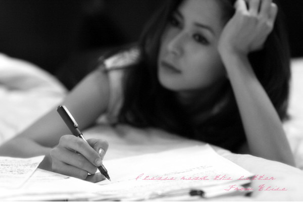
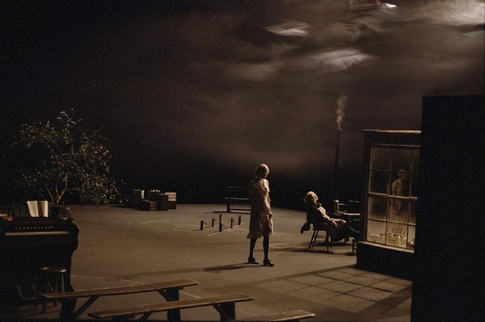

# ＜摇光＞宽容的困惑

**我不再像在学校时候那么激愤，不愿意跟人争论，不愿意逞口舌之快，不想在言辞上击败别人，想起以前在学校跟D的争论，我都觉得特别羞愧，真希望那不是我。我想人在这个世界上借以安身立命的，其实不是聪明，不是可以战胜很多人，不是名誉、地位，更不会是房、车这些东西。**  

# 宽容的困惑

## 文/宋晓慧（山西大学）

 

T：

早就想写信给你，一直没时间安静安静。今天办公室停电，人也没几个在，终于可以静一会儿。工作以后能安静独处的时间变得特别少，不像在学校，去图书馆坐着，好像再多人都觉得只有自己。也许是因为工作以后的心境不能跟在学校的时候相比了。

回来工作的一年半里，也不都是些让我沮丧悲观的事。工作让我赚钱，让我可以自由地买书，除非成套的特别贵的书，其他的书差不多想看就可以买。在所读到书中学到的东西，甚至远比在大学里学到的多，我说的不是知识占有量的多寡，更多的是学到怎么与这个世界更好地相处。我不再像在学校时候那么激愤，不愿意跟人争论，不愿意逞口舌之快，不想在言辞上击败别人，想起以前在学校跟D的争论，我都觉得特别羞愧，真希望那不是我。我想人在这个世界上借以安身立命的，其实不是聪明，不是可以战胜很多人，不是名誉、地位，更不会是房、车这些东西，我只要做一个厚道、善良，有些感兴趣的事而这些兴趣不会伤害任何人，也许还能帮助一些人，这样差不多就可以让自己踏踏实实地站在这个世界上了。安身立命也是一种心理感觉。你别觉得我这想法太理想主义，事实是很多人即使有钱，心里活得也并不安稳。你一定能看到很多这样的人。

T，你说人的一生到底什么最重要？我以前好像很清楚这个问题的答案，可是现在越来越不明白，我隐约觉得自己永远也得不到自己要的幸福生活。我有时候真想出家算了。

你看过电影《狗镇》吗？《狗镇》的结尾中，父女二人争论到底谁才是傲慢。女儿认为父亲用暴力手段惩罚犯错或犯罪的普通人，是傲慢，她觉得应该宽容普通人的错误，应该爱他们，人都有趋利避害的本能，所以要宽容人的本能。但是父亲认为女儿宽容同情这些人才是真正的傲慢。父亲的意思大概是，女儿的宽容是在阻止这些人成为更好的人。父女二人的原话都不是这样，我只是记得大意。我不想讨论电影中女儿最后的选择，只是他们俩关于傲慢或宽容的对话让我重新陷入几年前的一个困惑中。我一直知道自己是个特别不宽容的人，我以前也一直认为是件困难的事，我那时候不懂得也没有足够的耐心去理解一个人、一件事，我总是带着自以为是的优越感指责别人，我觉得自己永远都不会做那些事，我轻易地指责一个人没有良知、没有同情心。后来看柴静的博客，里面有句话说：宽容的基础是理解。但我还是不明白，不知道怎么去理解。后来看到崔卫平老师的书，看到里面对人性的分析，我终于如醍醐灌顶，在心惊胆战中明白：我也可能会是我指责的那个人、我自以为是地批判的那个人。从那个时候开始，我终于愿意试着去理解别人，提醒自己不要轻易对一个人、一件事下结论，我终于懂得自省，更清楚的看到自己的缺点和过去的错误。我正觉得每个人、每件事背后也许都有值得谅解的地方时，电影《狗镇》又让我陷入了自我怀疑中，难道他父亲的观点也许是对的吗？到底谁更傲慢呢？难道我是从一种傲慢中逃出来又陷入了另一种傲慢中吗？我想不明白。我刚买了刀尔登的两本书，《中国好人》和《七日谈》，因为之前看到黄晋章的博客里关于《七日谈》的文章，他说刀尔登的书里有种难得的宽容，没有很多人那种“哀其不幸，怒其不争”的态度，也许他的书能解开我现在的困惑。

S

2011.11.15

 编者注：本文标题为编者所拟，原标题为“致T”。 

附：

《狗镇》台词节选：

女儿：批评别人的不是我，是你。

父亲：你不批评，因为你同情他们，贫穷的童年，不见得是谋杀的谋杀，是吧？要怪只能怪情势。你说强暴犯和杀人犯是受害者，我说他们猪狗不如，要想不让狗吃屎，就得揍他们。

女儿：狗只能遵从天性，为何不该原谅他们？

父亲：狗可以学会很多事。但每次都原谅他们就不行了。

女儿：我原谅别人，所以我傲慢？

父亲：天哪，你的口气真纡尊降贵，你有先入为主的观念，认为没有人能达到你的道德水准，所以你不要求他们，还有什么比这样更傲慢？你，我亲爱的孩子，你绝不会以相同理由原谅自己。

女儿：我为什么不该慈悲为怀？

父亲：不，有时候应该慈悲为怀，但你的标准要一致，这才公平。你有错应该受罚，他们也一样。

女儿：他们是人。

父亲：人要不要为自己的行为负责？当然要，但你不给他们机会。这是极端的傲慢。我爱你，我爱你，但我没见过比你更傲慢的人，而你还说我傲慢。

 

（采编：黄理罡；责编：黄理罡）

 
