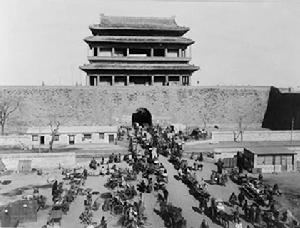

# ＜摇光＞对不起，首都之后再无北京

**燕京八景已成传说中的美丽；身份证110103、110104孩子的家只存在记忆里；四九城中到处是触目惊心大大的“拆”字。若干年后，会不会有个孩子迷茫的站在钢筋水泥的世界中，努力寻找着老人口中城南的故事。那是一张张黑白往事的旧照片，落进茶馆的杯盏里，响在戏园的锣鼓中，晒在四合院的晾衣竿上，钻进胡同的烟雨里。**  

# 对不起，首都之后再无北京

## 文/孙雨晨（北京交通大学）

  **一**

刚在人人上看到别人转发的状态，说的是即便昨天水满京城，但故宫东华门下水道湍急但水不过桥，三大殿基座万龙吐水但落地即消。末了作者感慨到，有用的是即便百年以后出了事也把你从坟里刨出来的坚持，和诛你九族的严肃。

微博上提到身处暴雨中心的北海团城无一例积水报告，明朝在地面铺设的青砖和地下的涵洞所组成的集雨排水工程，在600年前后大雨突至的京城，依然本分而默默地履行自己的职责。

我们宣扬着科学，我们把神九送上了天，我们追求经济发展的速度，我们斥巨资办奥运办世博。然而，我们的城市排水系统却如此脆弱，这究竟是城市的发展还是文明的倒退。

在老祖宗的时代，那是公务员过得很苦逼的朝代，干不好帝都的活，皇帝一怒就掉脑袋，甚至有着株连九族的危险。这不仅仅影响仕途，更不会让你过两天换个衙门重新上班……

技术的进步与否，不是纸上谈兵空吹出来的，有的时候，简单到只需要一场大雨的考验。

雨停了，有多少人暗中松了一口气？

>这不是一顶乌纱帽换谁戴的事儿，只是一场有关良心的问责。

 ****  **二**

昨儿看报道说东城区广渠门水深四米，给友人发微信语音问她家那边怎么样，她特诧异来一句：“广渠门哪儿是我们东城的啊？”

转念一想，崇文宣武前些个年已经作为市政执行力的体现，永远退出了北京的历史舞台。这个只要东西不要文武的城市，曾经是多么熟悉，现在又是多么拗口的疏离。那么大个儿一个台湾不想办法回归，为什么偏要合并崇文宣武？

当年的西直门、东直门拼起来是哪吒，可领导们大手一挥，一句斩钉截铁的“封建迷信”就拆毁了先人的智慧。你们可以不懂，可以不信，但可不可以，听一听北京人的心里话，能不能够尊重北京的文化？

林徽因曾指着主张拆迁的北京市副市长吴晗大骂：“你们拆的是800年真古董……将来你们会后悔，那时你们再盖的就是假古董！”一语成谶，2004年，“假古董”永定门城楼竣工。只是这座城楼，能撑得住几年风雨的洗礼？

燕京八景已成传说中的美丽；身份证110103、110104孩子的家只存在记忆里；四九城中到处是触目惊心大大的“拆”字。

若干年后，会不会有个孩子迷茫的站在钢筋水泥的世界中，努力寻找着老人口中城南的故事。那是一张张黑白往事的旧照片，落进茶馆的杯盏里，响在戏园的锣鼓中，晒在四合院的晾衣竿上，钻进胡同的烟雨里。

尘埃中散落一地的老旧默片。孩子说他叫艾崇文，他妹叫艾宣武，他爸叫艾南城。他说老人讲永远不会忘记那个春天，北京游乐园关了，崇文门菜市场拆了，崇文宣武合并了，而北京，没有了。

 **三**

空降一场大雨，折射人间百态。

冰冷的夜里有好心人用行动传递着温暖，在那一晚，瓢泼的雨水冲刷出最干净的心灵。

能见度近乎为零的公路上有自发去机场接滞留人员的私家车；被掀翻的井盖前有恪尽职守的环卫工人用血肉之躯警戒；平日里安保严格的公司彻夜开放方便附近的人避雨休息；堵塞的下水道前有年迈的大爷费力用手清理；救援队来临时大家不约而同喊出“让妇女和孩子先走”；微博上实时刷新无数人转发求救信息又有无数人加入救人队伍……

放下防备，丢掉警戒，素未蒙面的陌生人伸出援手，不知姓名的老少爷们古道热肠，在这个夜里，我们是真真正正的一家人。

自己的家自己爱护，哪怕对这城市的管理者再失望，哪怕平日里也会对拥挤的交通污染的空气操你妈，哪怕打心眼儿里心疼眼前面目全非的回忆，真正遇到大事儿难事儿困难事儿，总是第一个站出来用肩膀扛起一座城的责任。

谁糟践了北京，谁摧毁了北京，谁靠透支古城的历史升官发财鸡犬升天，谁昧着良心无视皇城根儿底下人们的愤怒，谁削尖脑袋拼命挤进来还骂着北京，谁冠冕堂皇砸出几个臭钱就敢操着口音自己是新北京人……

又是谁，躲在安全又温暖的角落里肆意的嘲笑与不屑，甚至说出“北京一天平均降雨量还没有超过100mm，就这点水放到武汉宜昌之类的简直就不叫个啥，更不用说浙江福建了。网上一帮人不管加V还是不加V，又是感动又是关注又是声援的，居然有人还喊出了‘北京坚强’，我就晕了。是不是你们北京淹坏几辆跑车，我们全国还得默哀3天？”这样的混蛋话？

你可以不喜欢这里，你可以对这里的人有偏见，但当广渠门水深四米有人活生生憋死车里，当房山爆发山洪电路通讯全部隔断，当机场公交到处是饥寒交迫有家难回的老人孩子，当战斗在一线救援的派出所所长被折断的电线杆子砸中殉职……这样的消息接踵而至的时候，你又怎么能坐在北京城里，享受着北京的福利，在被北京庇护的同时如此尖酸刻薄的说出这样的风凉话？

将心比心，一个人的素质可以折射生他养他的环境。

北京，是你们的首都，可它是我们的家。

我们无能无力阻止它被破坏和摧毁，也绝不会眼睁睁看着它走向冷漠和绝望。

谢谢你们，北京爷们北京妞。

谢谢你，北京，我们的家。

对不起，北京。保护不了你。

对不起，北京。我们能做的太少太少。

对不起，北京。首都之后，再无北京。

 原文链接：[http://blog.renren.com/blog/241469191/862336725](http://blog.renren.com/blog/241469191/862336725) 作者微博：[http://weibo.com/sunnyrain0621](http://weibo.com/sunnyrain0621)  

(采编：黄理罡 责编：黄理罡)

 
