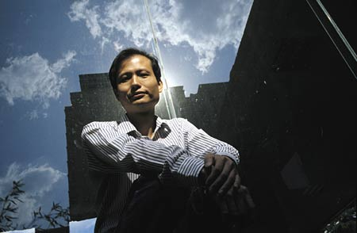
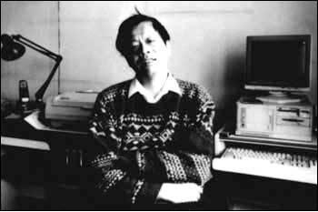

# ＜摇光＞对傻逼的困惑

**“我估计在国外不会有这样的事情，不会有这样的“不同意见”，这样的“各抒己见”，这样的“穷追问底”，分析来分析去，最后分析到动机上去。——但我不确定，所以我必须去国外看一看——傻逼是不是中国独有的”** 

# 对傻逼的困惑

## 文 / 侯川川（清华大学）

 我在校内上参与过一次骂仗，那时候我还比较含蓄，用了SB，没有“傻逼”这种冲击力。 后来我就再也不敢参与这种事情了，因为显然，人家能够回骂回来，而我又经常把别人的评价当真，心里很难过，我觉得自己不傻逼啊，别人怎么会说我傻逼呢。 于是每当遇到让人无语的言论或人，我会先在心底来上一句“傻逼”，然后再摆出一副认真、天真、纯真、耐心、有爱的姿态跟人家仔细讨论这个问题，“你这样想好像不对呀，你这样做好像不对呀。。。” 但这只是一种情绪上的宣泄，不当真的，我还是在努力的让自己明白，“傻逼”这个概念用来形容任何人都是不恰当的。并且给出自己很多理由： 1、自己的认识是有限的，所以别人的想法看上去很搞笑甚至让人愤怒，但说不定是自己“傻逼”了。 2、自己的认识和对方的认识都是有限的，说不定看到的是不同的方面，针对的是不同的问题，说的根本不是一件事情。 3、可能对方的认识是错的，但大家都是年轻人，大家都没有太多的知识，想问题简单，同时又争强好胜、不愿意认错、好为人师，等等。大家都互相宽容一些，谁都有过傻逼的年龄段。 4、如果这个人在某个具体的问题上真的不可救药，可能人家只是因为各种各样的原因造成的，人家的背景是什么样的，人家的立场是什么样子的，只要人家的逻辑上是完备的，虽然不认同但是理解就可以了。 这几条足以让自己面对无语的言论和人的时候能够很快心平气和——谨慎、自知、宽容、相对主义、多元化、平等发言、对傻逼的“同情之理解”。 但方舟子的事情让我彻底愤怒了。 

 我觉得在方舟子被袭问题上，善恶、是非太明显了。哪怕不赞成方的中医观点、方的转基因观点、方的打假方式、方的为人处世、方的恶毒口舌，在单单一个要用迷药和铁锤欲致一个用笔写文章的人于死地的事情上，居然还要讲什么炒作、出名、甚至大声叫好，“恶有恶报”，“做人要有余地，打假不要得理不饶人”？？ 我看过很多对方舟子的可笑评价，有说他是美国政府间谍的，专门用转基因来破坏中国人体质的；有说他是美国制药公司的间谍，专门派来损毁中医的名声，为西医开拓市场的；有的说他是学术的败类，在自己的专业做不出什么成果，于是就靠打假来谋取名利的；有的说方舟子对科学理解层次太浅，不懂得敬畏自然，不懂得辩证法，不知道“科学不是万能的”；有的说他是专门咬名人，靠这个出名的。 ——本国盛产动机论、阴谋论、相对论，这些评论都不奇怪，但在一个基本的正义问题上，在一个公然试图用阴暗角落里的暴力堵上一张嘴，用迷药和铁锤封掉一支笔的问题上，居然还有这么多“不同意见”——我对傻逼的定义彻底困惑了。 

 王小波是一个消极的自由主义者，面对各种各样的傻逼言论，他很少会针锋相对，做鲁迅般的尖酸讽刺。但在90年代伪科学、气功大师风靡的时候，他做出了主动的出击，因为他觉得伪科学大行其道，“假如我没有勇气讲这些话，也就不配做科学的弟子”。他无法忍受“一种远说不上合理的信仰在公然强奸科学——一个弱智、邪恶、半人半兽的家伙，想要奸污智慧女神，它还流着口水、吐着粘液、口齿不清地说道：‘我配得上她！她和我一样的笨！’” ——放到今天，王小波要被扣上多少顶“科学主义”，“无知”的帽子啊。面对这些帽子，怎么反驳？我不知道。 方舟子的问题，可以说出很多反驳的话，“你怎么知道他不是炒作”，“你亲眼看见他被袭击了？”，“你怎么知道不是普通的抢劫？” ——面对这些诘问，我也不知道怎么回答，我只能没有底气的说：傻逼。 我对傻逼的定义彻底困惑了，这件事情让我相信，某些人就是傻逼，但我却没法证明。 我估计在国外不会有这样的事情，不会有这样的“不同意见”，这样的“各抒己见”，这样的“穷追问底”，分析来分析去，最后分析到动机上去。——但我不确定，所以我必须去国外看一看 ——傻逼是不是中国独有的
