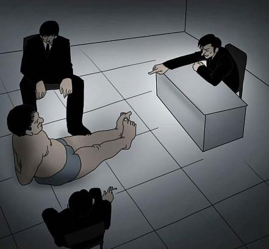

# ＜摇光＞小小检察官什么的

**公诉人的尴尬在于——被法官教育时的狼狈与指控犯罪时的犀利同时展现于人前，何以自处？张熙怀的《公诉精神》，第一个小标题就是“放下你的身段”。公诉人必须“放下身段”，法庭上法官为大，这是事实。老一辈法官的衙门式作风有其形成的时代背景，可以理解。法庭上的放低并不是折腰。法检的微妙制衡更多的是体现在庭外。**  

# 小小检察官什么的

## 文/刘贞妮（香港中文大学）

  是的，这又是一篇很长、写了很久、写得很慎重、发了没多少人会看、不久后又不得不删掉或者关闭的文。 

——题记

2007年的夏天，我到基层检察院实习，于是有了与检察官这个职业的第一次亲密接触。那时的我，跟随一帮老油条往来于看守所与检察院，学做笔录，学打审查报告，学习制作起诉书。面对纷繁复杂的实务案件，感慨无数。因为一切都是暂时的，所以一切都分外新奇美好。因为一切都是对原有生活状态的逃逸，所以每一天都过得热情高涨。那时的我，从没想过，这段没有浓墨重彩铺排过的生活，居然冥冥之中成为一种宿命。

五年后，我居然、居然成了一名小小检察官。这五年，是我生活中很重要的五年。从北京到香港，从北外到港中文，我的思想认识、知识结构都发生了变化。当检察官正式成为我的职业身份，成为我的生活常态，一切都需要重新定位。有了责任，于是有了审慎；有了定义，于是有了犹疑。作为一个新人，我每一天都耳闻目睹各种所谓的司法系统“内幕”。从最初被分到民事行政检察科，到转入公诉科，感悟不少，领会些许。

#### 请问闲闲的蛋疼不疼

经常有人说，公务员“一杯茶一支烟一张报纸看半天”。可这从来不是检察官的生活状态，至少不是义检人的生活状态。报纸确实是要看的，那是掌握信息的必要。以人均年办案量130余件的公诉科为例，看报从来都不悠闲。这是一个简单的算术题：一年有52.14周，约合260.7个工作日，故，每人每两个工作日要办完一个案件。“办完一个案件”包括：受理、审查、讯问犯罪嫌疑人、询问被害人和证人、撰写审查报告、起诉、开庭、判决裁定审查。最简单的一个交通肇事案，如果当事人和解，公安局移送的所有资料、证据都没有问题，犯罪嫌疑人自首、认罪、赔偿、全方位获得了被害人方的谅解，可以报批相对不起诉，并且承办人是一个老检察官，程序清楚、办案熟练、写审查报告迅速且滴水不漏，这个案子可以一天后报到分管公诉的领导手里，基本第二天能够办结。但凡是需要到看守所提审犯嫌的，基本上不可能两天完成。更不要说共同犯罪、串案、犯罪嫌疑人三番五次翻供甚至当庭翻供的案件。很多案件，可能开庭就要开个三五几天。遇到辩护律师比较有水平的大案子，庭前准备的工作量是相当大的。加班是不可避免的。当然，目前还是打字小妹的我，对这组数据没什么体会。每天阅卷、读法条、打报告、打起诉书，真心不算什么。还有行政系统的流弊，案子堆积如山，却要开没有意义的大小会议，为不合理的考核制度费尽心思。我们这个更像行政机关的司法机关，有着各种纠结的难言之隐。故而，每个检察院都特别重视职务犯罪调查是有原因的——那是拳头，决定着检察院在地方行政机关中的地位。

#### 请问法、检有没有搞基

很多人会说，法检是一家，基本上检察院诉出的案子，法院都会八九不离十地照着判，审判只是一个形式。怎么讲呢，我的职业身份让我必须谨慎对待每一个字，说三点吧：

一、法检之间确实有一种很微妙的关系。一个阿姨说我，怎么不去法院呢，再怎么说，法官在法庭上总是高高在上的，公诉人嘛……我笑而不语。确实，现实就是如此。很多法官，特别是老一辈的法官，那种衙门作派令人瞠目——法庭上呼来喝去，责骂被告、呵斥辩护律师、教育公诉人、斥责旁听人群，司空见惯，如今我也是见怪不怪了。公诉人的尴尬在于——被法官教育时的狼狈与指控犯罪时的犀利同时展现于人前，何以自处？张熙怀的《公诉精神》，第一个小标题就是“放下你的身段”。公诉人必须“放下身段”，法庭上法官为大，这是事实。老一辈法官的衙门式作风有其形成的时代背景，可以理解。法庭上的放低并不是折腰。法检的微妙制衡更多的是体现在庭外。检察院的考核与法院的考核，业绩是负相关的。比如说，抗诉是检察院的业绩，而判决被抗诉却是法院的工作失误；诉出案件被判无罪或被撤回，是检察院的工作失误，却是法院的业绩。另外，检察院诉讼监督的职能，有一部分就是针对法官渎职的。不难看出其中的微妙平衡。两家彼此不敢得罪，又彼此为业绩而伺机向对方动手。

二、审判是一个可贵的形式，特别是在严格要求公开审理、媒体力量又如此强大的今天。别的都暂且不说，最肤浅的理解就是，如果一个检察官在法庭辩论阶段被辩护律师说得哑口无言、起诉文书被批得体无完肤，是一件很丢脸的事件。如果这种情况下，法庭还支持检察院的起诉，实在难以服众。要是仪态、气场、分寸再没把握好，讲一些不得体的话，有一些不得体的举动，丢份儿是不用说的了，万一被曝光、被人肉，以后的日常起居都成问题。

三、刑事辩护律师开展工作是很困难的，他们要面对难以想象的歧视和压力。老一辈的法官、检察官就不说了，我已经原谅他们在那个时代背景下形成的扭曲心态了。那天，我们院一89年的小孩儿，居然振振有词地说：“这帮SB律师贱不贱的？这种人还帮他们辩护！”我难过地说：“亲，程序正义啊亲！”他居然鄙视地看着我：“你是个没有良知的检察官。”我就实在不想再跟他多说一个字，只好一脸同情地看着他。在公诉人的位置上，我当然义正词严力证有罪；可如果在辩护人的位置上，被告的利益就是我的天。这样说，可能有点过头。但我每次开庭，确实都对那些认真准备辩护、被法官呵斥完还不卑不亢的律师特别敬佩。不管是主动还是被动，毕竟他们才是真正在改变中国司法环境的力量。不过，我也见识过一些很差劲的辩护律师。铁证如山，真的是如山了，还要做无罪辩护，指使被告人当庭翻供，自首也泡汤了，量刑情节顿时严重了，然后在法庭上激昂演讲，一看就是趁着大案子、牺牲被告来做律所广告的。我就想拿鞋底抽他——尼玛你想过被告给你的那些钱的感受么？！

#### 请问你们是不是SB

有一天跟猫吐槽，基于不嗝应我她就不爽的原则，她各种没逻辑地找碴。老百姓就是牛逼咯，老百姓的事情你们就是管不着咯，公务员就是SB咯，就要最大限度管起来咯。烦得我，我就想说一句：老百姓也有人渣，公务员也有好人！老百姓出了事，我们都不管了，谁尼玛来管。脱下制服走出检察院，我尼玛也就是个老百姓，女屌丝级的老百姓。我还真见识过一些很人渣的老百姓。

在民行科的时候，有个无良男人，离弃妻子多年，也从未对智力残疾的儿子尽过抚养义务。女人同母异父的姐姐多年来一直照顾女人和她的儿子，直到女人变成老妇。老妇去世后，姐姐根据遗赠扶养协议，取得老妇遗产。怎料，当年的无良男人，变成了无赖老头，根据遗赠扶养协议不能与具有继承关系的亲属签订这一点，他分走了老妇的全部财产（智力残疾的儿子继承的财产也由他管理），并且继续不管生活不能自理、并随时可能挂掉的儿子。老妇生前先后两次聘请律师，按照法定程序，与姐姐签订协议。案子搞了大半年了，从各方面证据组合，都可以看出很大程度上，是律师有失专业水准，选择了不合适的法律文书，才导致了如今的局面。如果选择的法律文书是“遗嘱”，这个死老头就没空子可钻了。老姐姐拿着法院生效判决书来申请抗诉，检察院是她维权的最后一根稻草（你是不能指望上访的）。我们的一举一动都关系到这位老姐姐几十年的付出，以及这名残疾儿子今后的生活。老头天天来检察院打滚，每次看到他我都恶心得要死，还得给他端茶倒水，听他没完没了地闹。深深觉得为身份所累，我是多想指着他鼻子骂丫混蛋，叫他给老子滚啊。由于实在太想了，只能在心里意淫自己有一个高大正面的检察官以自我安慰。

#### 请你证明你的牛逼

这工作一点都不牛逼，恕难证明。检察官培训学院的老师讲的很多话都是唬人的。不过偶尔也有一两句实话。有位老师讲：“检察工作的基础就是怀疑。公安的证据不能全信，犯嫌供述不能全信，证人证言不能全信，甚至连书证、物证都不能全信。”挺对的，但也不尽然。的确，拿到一个案件，检察官不能有事先形成的判断，任何预定的假设都可能影响工作效果，甚至导致错案。一个检察官一旦背上错案，就很难在职业生涯中健康发展。（其实，我想说背上错案就别混了，跳槽或者辞职吧。）这种恐惧是每个检察人的宿命，有时候一个不留神就被闹心闹得夜里都睡不着觉。阅卷需要技术，得抽丝剥茧，得推理置疑，搞得来真有那么回事似的。可就是这样，好多时候就是一个小小的细节被忽略就铸成大错。

公安局移送的案卷，言之凿凿“证据确实充分”可以定罪的盗窃案，犯罪嫌疑人却不认罪。从调取的监控录像与其他多个证据的衔接来看，暂时找不到问题所在。承办案件的检察官以专业的态度、高度的责任心反复研究，三次到现场勘查，终于找到疑点。拍摄到的镜头是确实犯罪嫌疑人在案发地点附近走动的图像，但他所行走的方向不能绕到案发店铺。如此一来，一桩可能的错案就被避免了。有人会觉得这事情太小，可是如果这是桩命案呢？

当然，一旦罗织证据链条这件事情完结了，就必须要相信自己的结论，至少在庭上要表现得很坚定，坚信自己证实过的事实。不然，辩护律师激昂陈词的时候，身为一名检察官同志，只能抱头鼠窜，咱丢不起那人。并且，真相很残酷，诉出以后，改变定性，被退回案件，被要求撤案，都是要扣分的！要扣分的！直接关系到奖金、升职的分的！！公诉人同学，没有退路。

#### 请问大刑伺候有没有

这个我可以比较负责任地说，据我所知，检察院是没有的。侦查犯罪是公安部门的事，他们负责从无到有的过程，我们只是核对是不是真的有、有多少，所以大刑伺候是不必要的。再加上，现在浙江省强势落实讯问同步录音录像，大刑的可行性实在太低。

好了，有同学警觉地说，不是有自侦案件么？职务犯罪那种。反贪是检察院的神秘部门，很有地下党的派头。女生一般不会被分到反贪，去反贪的女同学，要不就是去做内勤，要不就是去镀金的，一出来就升官了。反贪男们都很辛苦，经常需要夜间加班，假期常常是奢望。10年，我们院的反贪男们没有一个人休过任何一个公休假期。即使正常工作日，他们的办公室也经常是空着的，人不是在外面跟线索，就是在看守所讯问。难得看到他们出现一下，一般都是满身的疲惫。每一批进来的新人都是帅哥被分到反贪，两三年之后就被摧残得面目全非。我们常常打趣，说反贪是帅哥终结者。据被终结着的帅哥们透露，他们不会用非常规手段的。一般来讲，落马的官员也都是见过大世面的，用这种不能打动心灵的手段没用。他们审讯的时候喜欢用震撼心灵的方法。我听说过前老大审讯，据说都是轻声细语，最后收获总会比预期地还要丰富。帅哥们说，他们常常通宵达旦看着犯嫌，最主要是防止他们自杀，特别那些有节气或者心灵承受能力不好的贪官。万一自杀了，很可能跟了两三年的线，说断就断了，那么多帅哥的青春被白白糟蹋，那才叫惨绝人寰啊。

#### 唉，终了，有点担忧自己的前途。

开庭还好，讯问我简直弱爆了。外形实在太没有威慑力，全方位弱小。一说提审，老油条们就用同情的眼光看着我。分管公诉的领导老是说：“你们新进来这批小姑娘，以后自己负责提审了，肯定天天被翻供。他们应该盼着多见你们几面吧。”想想要从犯罪嫌疑人那里套出真相，要怎么从案卷的字里行间找出蛛丝马迹，我就睡不着觉。我的太阳哟……

屁股决定脑袋，我说的一切都受身份局限。没错，这句话完全体现了我的心机，敞亮的后路啊，我说过我不妥了，你只能靠你的智慧判断要不要信了。哎呀，好牛逼的兜底条款哦。

 

（采编：何凌昊；责编：尹桑）

 
