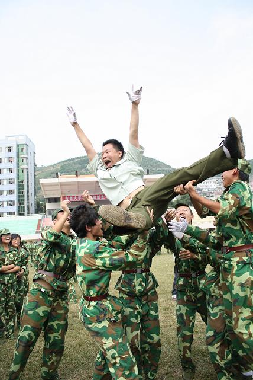
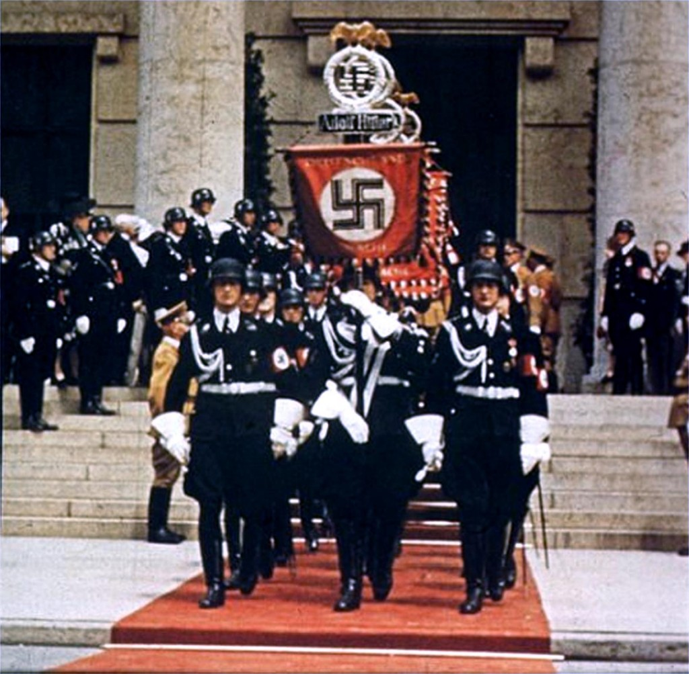
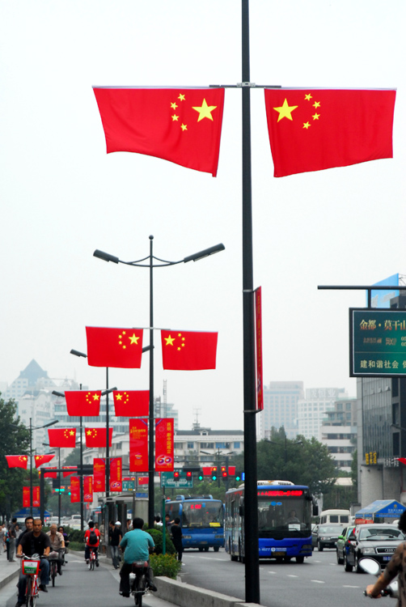

# ＜摇光＞帅教官的政治学：极权主义国家不仅仅是一个恐惧的国度，更是一个美学的国度

**“1984告诉我们，极权主义的运行靠着恐惧。然而事实上，恐惧是极权主义的左手，美学是极权主义的右手。在法西斯兴起的时候，有哪个德国的文艺女青年不会被纳粹军人的崇高所征服的？迄今为止，依然有无数的人为纳粹的美学所倾倒。”**

# 帅教官的政治学：

# 极权主义国家不仅仅是一个恐惧的国度，

# 更是一个美学的国度

## 文 / 章闻韶（北京大学）

 女生对军人抵抗力是很弱的。女生为什么会迷恋军人？大部分人会回答军人气质太帅了！正如目前北大在军训。女生们起早摸黑排练阵型，要排成“领导好”三个大字给首长们乐呵。但很多女生依旧十分喜欢。为什么呢，因为“教官帅！” 

 在男生眼中，军事的崇拜往往是国家主义的信仰，是铁血的象征，来自于战场的荣誉。而在女生眼中，军人却成为一种纯粹美学的迷恋。军人因为美学上是美的，所以是美的。在这里，美学与政治既相互剥离又难解难分。首先说是相互剥离，因为女生把军人一个政治性的体制中抽象出美学层面来。将其背后的政治剔除一干二净。在他们眼中，一个军人开坦克碾死大学生的军人与一个开坦克在战场上冲锋陷阵的军人是没有任何差别的。军人的差别只是哪个更帅一些。这样无疑将本该属于政治的军人美学化。其次再说美学与政治难解难分。政治在这个时候恰恰通过美学来起作用。正因为一个开坦克碾死大学生的军人与一个开坦克在战场上冲锋陷阵的军人的共同点是帅。所以，无论是开坦克碾死大学生的军人与一个开坦克在战场上冲锋陷阵的军人都是极端受欢迎的。 这让我想起，一个极权主义的国家不仅仅是一个恐惧的国度，更是一个美学的国度。 

 1984告诉我们，极权主义的运行靠着恐惧。然而事实上，恐惧是极权主义的左手，美学是极权主义的右手。在法西斯兴起的时候，有哪个德国的文艺女青年不会被纳粹军人的崇高所征服的？迄今为止，依然有无数的人为纳粹的美学所倾倒。正如马利奈蒂的诗篇：“战争是美的，因为它通过防毒面具、吓人的机关枪、火焰喷射器、小型坦克等手段确立了人对被制服的机器的支配权。战争是美的，因为它开创了我们梦寐以求的把人类身体金属化的伟业。战争是美的，因为它为鲜花盛开的牧场 了机关枪这种暴怒的兰花。战争是美的，因为它把机关枪火力、火炮轰鸣、停火、芳香与腐尸的恶臭一同汇成了一部交响曲。战争是美的，因为它创造出一种新的建筑风格，比如巨大的坦克、飞行编队的几何构图，燃烧的村庄冒出的盘旋上升的浓烟。” 法西斯用美学构建自己。 今日政治，中国人迷恋的不仅仅是军人，而且是政治家。如同我们的温总理。无数的女生一谈到温总理时，总是会感动地热泪盈眶，说“一个60多岁的老人，做到这样多么不容易，为什么还有这么多人不理解他呢？我们真没有必要难为他了。”殊不知，总理的身份始终是总理，而不是一个普普通通的60多岁的老人。当我们的温总理把政治演出为一场含情脉脉的家庭伦理戏剧之后，政治被扔到一旁。因此，人们只看见总理被扔鞋时候他母亲的惊吓，而忘记了有多少家庭在他手下破碎。 

 在这里，再次提醒的只是这句话：一个极权主义的国家不仅仅是一个恐惧的国度，更是一个美学的国度。 “那是恶劣诗歌的年代？不完全！如今的小说家写到那个年代，总是带着一种享乐主义的盲目性，他们写的这些书注定是要失败的。但是抒情诗人，尽管他们对这个时代也有一种盲目的激情在里面，却留下了美丽的诗篇。因为我们曾经说过，在诗歌这片神奇的土地上，所有的判断都会成为真理，只要它能让后人以为这的确是经历过的感情。诗人总是如此疯狂地热衷于他们所经历的感情，以至于脑子都冒烟了，呈现出一片彩虹的灿烂景象，监牢之上的奇妙的彩虹……” 《生活在别处》原题为《抒情年代》。当我们都在抒情的时候，极权主义也许已经来临了。 

