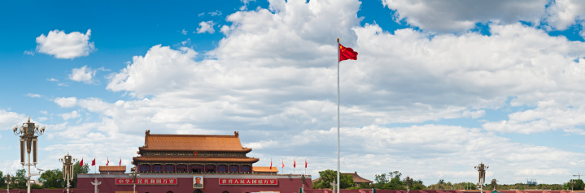
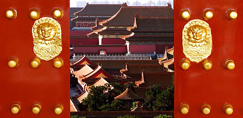
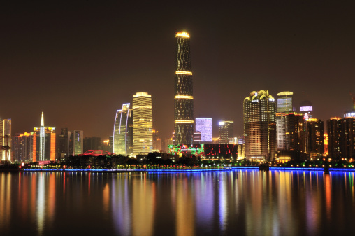
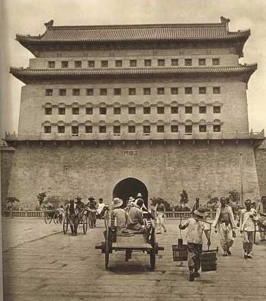

# ＜摇光＞帝都不是北平，广州不是南方

**我惊讶的发现车上只有几个提着鸟笼的大爷和提着菜篮的大妈，我在窗边的位子坐下，跟着车子慢悠悠地穿过后海、北海、恭王府、人艺剧院，在老北京的街巷里不紧不慢地穿行，路上竟然没什么车，街上也大多是老年人，步伐都慢悠悠的，还有初秋的微风拂过，我突然之间觉得，几十年前的人是不是看到的都是这样的北京？那怎么可能不喜欢呢？**  

# 帝都不是北平，广州不是南方

## 文/Surbina (清华大学)

 

今天晚上和朋友吃饭，意外说起一个问题：为什么那么多人对“帝都”心怀畏惧和警惕，却依然要来？

的确，看看身边的朋友，不论是在考学的，在读书，已经工作的，在国外的，不论经济境况如何，价值观怎样，似乎总在人生的某一个阶段要来这座目前在世界范围内也是“前无古人”的超级抽水机转上一圈。再讨厌他的，你也难以抗拒他的“诱惑”。

北京“诱惑”人的东西的确很多：“话事”的大佬们在这里谋划，全国最好的大学在这里扎堆；最多的大公司、银行、媒体、出版社、文化人在最近的十年里渐渐汇聚于此——你几乎找不到任何一个领域或是行业，不是以北京为中心或次中心的。那天听到一个经典的笑话：小时候喜欢的歌星都在红磡开演唱会，终于等到大学去香港读书，却发现歌星们都改来北京开个唱了。

身边就有很多这样的例子：A君，今年毕业求职，家乡四川某小城，成都长大，厦门读书，最喜欢四川人的悠闲生活姿态和厦门的活力，可一旦到了找工作的时节，就发现好公司都在北京；B和C是一对夫妻，资深媒体人，双双来到帝都，换工作上台阶，深感资源层面大不同：在这里，每周末都被各种沙龙、活动占满，出席活动的，几乎都是以前轻易访不到的大佬们；D君，出身南方某二线城市，家境殷实，京城大学堂读了本科和研究生，毕业去了南方某媒体，呆了不到一年，却不习惯，最终调到该媒体的北京站，因为“资源、人脉、积淀”都在北京......

他们的前来都有些不情不愿，他们也都有一个共同的想法：总有一天，我是要走的。

走，去哪里呢？

先不说这个问题，我们其实可以先看看：他们为什么要走？或者说为什么那么多人对“帝都”心怀畏惧和警惕？回答了这个问题，也许前一个问题也就不言自明。

房价、交通、空气……这些最为现实，最为切身的问题当然是阻碍许多人在北京留下来的直接因素。但是对许多人来说，如果给他们足够买到基本生存条件的钱和资本，并且有更多其他选择的话，恐怕他们也不会把北京当做最后的栖身之所。

当然这和你追求的东西有关，在这个时代，年轻的时候我们追求物质的富裕，世俗的成功，外界的承认，实现这些需要足够的资源，快速成功的系统和发展的空间。北京无疑可以提供大部分你需要的这些，只要你足够强，就可以得到。

但是我并不认为这些是世俗成功会是大多数人最后的栖身之所。一个时代，如果人人都想要成功，是不是有点太可怕？今天吃饭的时候，朋友说起他的追求是什么，给我勾画了一个图景：在冬日的午后，在自家的院子里看书，院子里自己种满了花，阳光很温暖，空气里有花香。我更喜欢这样的梦想，为什么它在我们现在的时代就显得那么虚无缥缈呢。

如果把这种价值叫做“诗意的栖居”，还有很多善的价值，比如自由，爱心，活力，宽容……这些都是现在的北京没办法给你的，我并不是说这里的人都不自由，没爱心，不宽容，死气沉沉，而是说作为系统它并不鼓励这些。

系统的差异往往从细节中才能看出来，不说别的，就说地铁：北京的地铁是全国最便宜的，2块钱随便坐，这个代价是北京市政每年投入几百亿的补贴，这个补贴不是纳税人的钱吗？为什么要补贴呢？因为帝都的物价要稳定，不能乱。

刚到广州的时候，我最为惊讶的是，这里竟然不用过安检？其实仔细想想，北京地铁的安检就和北京公交车上的售票员是同样的作用：实际作用很小，只是为了显示一种“权威感”。北京公交车上的售票员往往给人大妈妈的感觉：她会唠叨你让你让座，也会关心你是不是坐过了站。有一次和外国朋友一起坐车，他很不习惯，觉得售票员的关心“越位了”，让他很不舒服，而我此前却从未这么觉得过。反思一下，在人人平等的公共空间里这样的关心难道不是一种变相的管制吗？

类似的细节还有很多很多。在这样的比较中，一个城市或者说一个地域概念常常被作为帝都和北方的对立面提出来，那就是广州和南方。南方不只有广州，南方还有上海、杭州、南京、厦门、武汉、成都、长沙......只是广州在最近常常被作为北京的对立面提出，似乎有着与之最为截然不同的气质。我无意参与最近的北方系、南方系之争，这篇文章也无意搀和任何政治话语。我想探讨的只是一个很简单的问题：为什么作为巨型抽水机的北京能够吸引那么多与它价值观不同的人？他们来了又走，他们的精神居所到底又在何方？

  

一起吃饭的朋友这样说广州与北京的不同：尽管北京有许许多多广州所没有的资源，但是广州所有的来自草根的活力却是北京所不具备的。这种活力是自下而上生长起来，奇型百态，像野草一样生生不息，以前的广州人做生意，现在呢，不论是做公益、做媒体、做社运，一撒一大把，这种放松的环境和蓬勃生长的氛围真是大不相同。而这正是她所最为珍视的——尽管她现在也是在北京读书，但说未来总要“回去”。

那么多的人被“抽水机”抽走去了“帝都”，南方会不会崩溃？在我看来，并不会。因为北京不是家园。别人的感受我难以获知，就我切身的体会来看，只能做出如下两种比较：一个我几乎买不起房子，做记者基本等于新闻民工的城市；和房价合理、你可以在看得见的时间里建立自己居所的“报业之城”，哪一个更符合我心中的家园？

说到现在，都没有说过我自己对两座城市的感受。我常常说北京不好，也常常夸赞广州，但其实我对北京的感情比广州深得多，在这个城市呆了3年：我喜欢北京的秋天，只有在这里能看到那么多种颜色的叶子，主干道两旁的银杏树，在下过雨的午后，芳草凄美，落叶缤纷；我喜欢北京的煎饼、烤红薯和炒栗子，只有在北京这么凛冽的冬天里才会特别感受到这三样东西的温暖；我还喜欢人艺的话剧，义利面包，胡同里的糖葫芦串……

还记得有一次我到王府井东边的一个地方采访，早晨9点多，在二环和三环之间的某个地方从拥挤不堪的四号线上下来，坐上一辆公交车。我惊讶的发现车上只有几个提着鸟笼的大爷和提着菜篮的大妈，我在窗边的位子坐下，跟着车子慢悠悠地穿过后海、北海、恭王府、人艺剧院，在老北京的街巷里不紧不慢地穿行，路上竟然没什么车，街上也大多是老年人，步伐都慢悠悠的，还有初秋的微风拂过，我突然之间觉得，几十年前的人是不是看到的都是这样的北京？那怎么可能不喜欢呢？

如果你到新华社记者王军的《城记》《采访本上的城市》里去看老北京，你真的会爱上这座城市：他的大气，他的细致，他的悠然，他的沉着，有自己的灵魂和自己的节奏。那个城市不是帝都，是北平，那是给很多人家园的寄托的地方。

最后想用今天吃饭时朋友说她听建筑系一位“老北京”教授讲他记忆中的北平来结束这篇文章：那时候家家户户都住在四合院里，院子里很安静；走出胡同，没有几步就到了街上，车水马龙，又很热闹；胡同的宽窄正合适，那是为人设计的。小时候常常爬到城墙上去看俯瞰北京，一眼望过去都是绿的，因为家家院子里都种了树；只有故宫稍稍高出来，在中央那里，发出金色的光。

 

（采编：应鹏华；责编：麦静）

 
