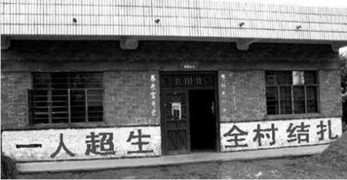
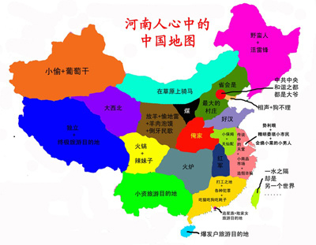
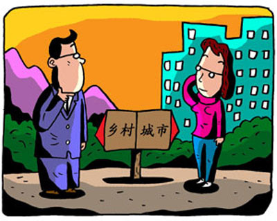

# ＜摇光＞当傻逼的优越感丛生并成功将自己感动

**小子跑回家说背疼，血迹一片，母惊，吩咐大女儿找车，找来白色面包车，母说白色不吉利大女儿再找车，耽搁了，拉到市医院儿子断气，全家疯掉，号召四个女婿五个女儿找我大伯理论。大伯无奈把孙子送到派出所，派出所打电话给市警局，正喝过年酒的局长讯问后大怒：“搞个毛啊，原来是未满十四周岁的小屁孩子打架，不上法律的，你要我怎么管，你们那边调解一下私了好了。”**

# 当傻逼的优越感丛生并成功将自己感动

## 文/[大蛋蛋](http://www.douban.com/people/DADANDAN/)（河北师范大学03级老生）

#### 1，养儿防老

康问：“超，你老家那边结婚了能生几个”，我道：“一个或两个，如果第一胎是女儿，27岁后可生第二胎，如果第一胎是儿子，不许再生第二胎”，康问：“如何管得住，单靠罚款吗”，我道：“罚很重的款，不给非法二胎上户口，严重者抓进监狱驱逐出村，很多人得一个儿子已经心满意足，生两个养不起，现在我们那边给儿子盖房娶媳妇得二十万大洋”，康叹：“唉，我老家那边现在还是乱生，罚款也管不住，很多人家生了五个女儿还是东躲西藏地生”，我奇：“为什么非要儿子，就为个传宗接代吗”，康道：“你不懂啊，养儿防老，农村不像城市有养老保险有养老院有津贴啥的，农村的女儿外嫁了，全靠儿子养活送终”。

康没问“怎么保证第二胎一定是儿子”，所以我没必要告诉他罪恶的现实：怀胎后，野医院做B超，是女儿，流几滴眼泪买一堆打胎药，直到B超里有个小鸡鸡。B超才是中国最大的杀人犯。

我堂侄子臭蛋上六年级那年新年，五年级的表弟被邻村上初一的几个小伙子拿鞭炮扔，表弟哭着找表哥，哥俩一怒之下把小水果刀插进对方一个小子的背上。小子跑回家说背疼，血迹一片，母惊，吩咐大女儿找车，找来白色面包车，母说白色不吉利大女儿再找车，耽搁了，拉到市医院儿子断气，全家疯掉，号召四个女婿五个女儿找我大伯理论。大伯无奈把孙子送到派出所，派出所打电话给市警局，正喝过年酒的局长讯问后大怒：“搞个毛啊，原来是未满十四周岁的小屁孩子打架，不上法律的，你要我怎么管，你们那边调解一下私了好了。”调解，赔款数万元，那个母亲认了。后来，那个母亲真疯了，每年儿子忌日便去二堂哥家大门前烧纸，麦收时在田野里拿着菜刀追我们家臭蛋，臭蛋跑回家气喘吁吁地说：“我操差点没劈到我”，二堂哥无奈全家迁进开发区落户。很多人同情那个母亲，包括我小姨，小姨嗑着瓜子说：“你不知道人家当年要这个儿子多不容易，生了五个女儿才有了个儿子，东躲西藏，有一次乡干部进门，没处去，就在隔壁粮仓里惊险躲过”。

2004年，妞妞诞生，我去人民医院看她，妇产科走廊刚刚结束一场风波，一个媳妇儿生了女儿，婆婆当场翻脸，女方家人来后发现女儿受委屈一怒之下和男方家属打起来。

娘亲劝过姐姐要不要领养一个儿子，姐姐说：“不领养，将来政策宽了我们能再生一个，再说了女儿长大出息了比儿子强。”我恨计划生育，这个无耻的政策源自四十年前一个人的错误，今天却要十几亿人承担，身为国人，没有生养的自由，生养后被阉割被上环，像一个无能为力的家畜。 新闻上说当今中国男女生育已经严重失衡，十年后会有上千万男人娶不到媳妇儿，想必这千万男人都是被挑剩下的穷矬丑，媳妇儿都娶不到了活着还有什么意义，革命吧。

#### 2，招谁惹谁了

我一直讨厌把某个地域的人脸谱化，但我认识过的河南朋友也确实不争气，先后五个人，四个不靠谱。

于是静下心来研究我大河南。刘震云说全国都误解了河南人，解放前闹灾，河南民不聊生饿殍遍地 ，忙于征战的国民政府无影踪，大家逃荒，日本人给饭吃数万人跟了日本人，他们很无辜，他们几乎都不识字，不知道汉奸是什么概念，后来有识字的专家跳出来说河南曾是汉奸最多的省，这个专家自然是书香门第的外地人。

河南是个农业大省，一直以来都是，一个字，穷。人穷则背义，为活命穷人得想方设法争口嚼谷儿不惜背上“坑蒙拐骗”的恶名；人穷则无大志，谋取眼前不思未来。穷得时间太长了，穷到骨子里，这就是著名的“小农意识”，细心的人发现，河南人不懒，甚至是全中国最勤快的人群之一，只是他们往往勤快错了方向。小农意识远不止河南人，神州大地到处可见为芝麻小利耍无知小聪明的人，很多地方的人小聪明都懒得耍或不会耍，直接拿刀割包去了。

河南人有多恐怖，远比我想象中严重，半年前河南有人想做五粮液经销商，谈了多次最后只差打款签约了董事长还不忘从遥远的四川宜宾来电对总裁说：“一定小心点，他们是河南人。”总裁接电话时我就坐在旁边，那一刻我顿时觉得悲哀的不是河南人，是中国人，如果河南是一个沿海省份，开放的早，经济发达，城镇化建设一流，种田的都是农学院毕业的，河南人会不会提防其他省份的人。

我仍旧讨厌那些把地域脸谱化的人，遇到的河南人不靠谱，但他们不应该被加上“河南人”的标签，邯郸人也说河南话，他们大多数人风俗习惯行为举止与河南一脉相承，邢台东边县市（就是王宝强家乡那边）的农民因经济落后思想落伍遭邢台西边较发达县市的蔑视，不是河南人的问题。

#### 3，城里人的烦恼

城里人看不起乡下人，不单是中国，美国也是，他们在脱口秀里嘲笑德州乡巴佬口音。鉴于目前中国的特殊环境，城乡矛盾空前绝后，加上拙劣的调和法规，我朝城乡大战冠绝全球。

我讲过小学同学的故事，工头儿子，有钱，农村高帅富，大学毕业和市里姑娘谈恋爱，女方家庭反对，工头出很多钱，没用，结婚那天女方家人一个没去，工头家丢了大人。我娘亲经常拿这个故事教导我不要追求城里的姑娘。我讲完，朋友说：“你们那边的人都神经病”，我说三线城市很多人这样啊，二线城市很多人也这样，甚至北京城还存在无数不要外地姑爷的父母，外地媳妇儿家里再有钱嫁到京城也得做全能小媳妇儿，全能还不一定落好儿，真的，我没必要骗你，我不想再扯几个眼见为实的故事。

但我至今不明白北京人上海人骄傲什么自大什么。北京人先后被鞑子、英法联军、八国联军、日本鬼子、苏联科学家蹂躏过，他们依然叫嚣自己生下来就是爷；中华第一块耻辱租界出现在上海，七十年后日军攻陷上海，中华迎来空前绝后的劫难，大上海一如既往繁荣，周旋巅峰期的嗓子，张爱玲巅峰期的文笔，都他妈是巅峰，亡国的上海人依然可以生活得很好，因为它是“国际都市”，事实上至今还有很多上海人觉得自己是最高贵的中国人，他们崇拜的不是孔子，是瓦格纳。

#### 4，少林寺十八铜人

一个高中同学大学毕业后回家接了父亲的公司，很有钱，同学聚会上他直言看不起大半个桌子的穷同窗，我问他：“亲你为什么不移民”，他说：“干嘛要移民啊你会说外国话啊”，我说：“我们被操且没钱，您有钱还被操，您比我们优雅多了”，当然他表示听不懂。

单纯的歧视，是一种道德缺陷，整个国家都在歧视，只能说明这个国家缺德了。

 

（采编：宋晓慧；责编：黄理罡）

 
