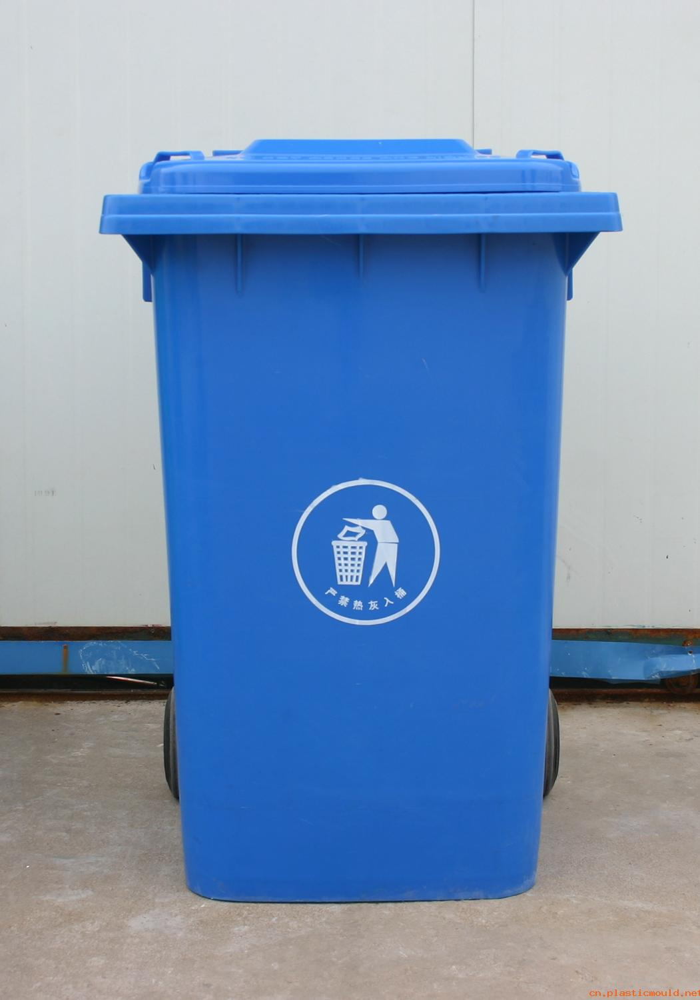
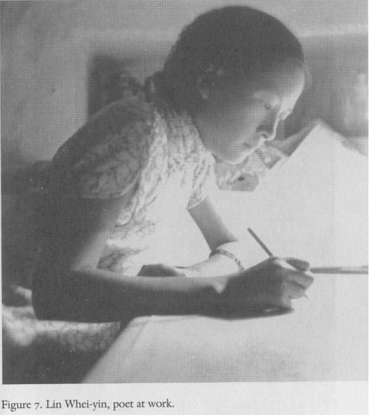

# ＜摇光＞当文人不再雅士

**人一生当中很多事情就是那样发生，就算你是真心恨或怜悯还是祝福日本或是其他哪个国家哪个人、是好恶哪个星座哪个伤不起、还是喜悲哪絮红尘哪个世界末日，其实都没太多必要去公之于众——无需毁了那份美好。 **

### 

### 

# 当文人不再雅士

### 

## 文/一笑（University of St Andrews）

### 

### 

话说，10岁的时候曾报过暑期班，到首都北京学习普通话。记得似乎逛过故宫颐和园八达岭诸如此等。如今10年已过，也都印象模糊，只记得对大陆最深的印象是——各大景点的垃圾桶上面都写着“果皮箱”。

为此我迷惑了很久很久。家中水果一类从来是饭后小吃，大概因为费事，很少会想着带到外面去吃。莫非大陆的同胞就那么喜欢吃水果？

谁也没想到后来举家到了北京求学，住了几年，竟也没发现同学们对水果有什么特殊的爱好，事情也就不了了之。还是在近年，捏造出了个自己喜欢的故事，才算断了这丝纠结。

事情是这样的，在从前，故宫颐和园这些地方，比起百姓们的田地，肯定都算得上是仙境。仙境自然不是百姓可以到的。那里面的人要是扔垃圾，便有下人拿盆子盛住，便不会有什么垃圾桶。新世纪讲究平等，过去神仙才能去的地方，现在人人都应可以去得。可是百姓们去了，不知道规矩，垃圾扔了一地，叫人看了心疼。老神仙们想着，不如修些收集垃圾的物件吧！可若是光放个桶在那里，不单毁了这风景，百姓们见了怕也还是不明白；唯有将其稍加雕琢，摆在草木之间，“垃圾”二字不堪入目，以“果皮”暗喻，希望百姓懂得自重。

那每个垃圾桶上的“果皮箱”三大字，定是哪个好心的文人一笔一划写的，写的楷书，工工整整，这下人人见了应该都能明白。这些精致的地方就算沦为风尘，也留得几分尊严。

### 

### 

太露骨不好。不雅。不雅的话自当是不说出口的。

想象侠士年少风流时诗才绝等，武功盖世；劫富济贫，救人于水火。到了晚年，三更外出遭人打劫，他必然不会喊出那句“救命！”，更不会出口辱骂那流氓。 不是不能，是不屑。

太露骨不好。文雅的人讲道理不举例子。

当父亲跟你说“凡事注意安全”时，你只希望大家相视，点头。你不希望他给你讲哪里的安全套多少钱，什么牌子的避孕药怎么用。

会下盲棋的，将军时只会看着你笑笑，不会听见他说“哈哈哈！我车二平五吃了你丫的帅，又输b了吧！”

因此，私以为林徽因是没有说过什么“我用一生来回答你”这样的话的。这答案的问题一旦被问了出来，将会摧毁那男人被仰望的理由。

### 

### 

本来有些事是不需要说的。可是世界大了——那些事情说来本太过露骨，眼看愚蠢的人类，不说可又不行，唯有以“果皮”折中。

可惜新世纪人心涣散，世风日下。人人都上过学，个个都是文人。可是很多东西，就算砸到了面前，喊到了耳边，百姓们还是爱懂不懂……多少曾经美轮美奂、乃至倾国倾城的东西，便都在劫难逃。

再没有人会觉得，事情叫嚣得太直白，会如“垃圾”般没有美感。如今什么我爱你你爱我，我爱你你爱我吗？当众表白当众求婚，都已经俯拾皆是。

于是挤在文人中的雅士受此逼迫，忍无可忍。只好扒光了衣服，用最好看的小篆写下“娓娓道来”四个大字，猛地撕碎然后细细嚼烂，去喷人们一脸。

### 

当然上面都是引子。

这些话是看了最近日本地震后人们的情绪才最后要写的。近年自然灾害是多，总觉得从汶川开始，媒体一次比一次亢奋，人们一次比一次激动。什么“集体默哀”、“组织募捐”、“赈灾晚会”……呵呵，真称得上是可歌可泣。

英国王妃车祸死时没有下半旗，因为女王认为这是家事：我悲，或者我喜，与举国百姓无关。

如“年少一段风流事，只许佳人独自知” 的笑而不语——

人一生当中很多事情就是那样发生，就算你是真心恨或怜悯还是祝福日本或是其他哪个国家哪个人、是好恶哪个星座哪个伤不起、还是喜悲哪絮红尘哪个世界末日，其实都没太多必要去公之于众——无需毁了那份美好。

或者在北方才学到的，叫“嘘，别嚷嚷”。嘘，别要连果皮都不如。

### 

### 

（采稿：黄理罡 责编：黄理罡 ）

### 

### 
