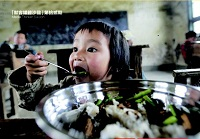
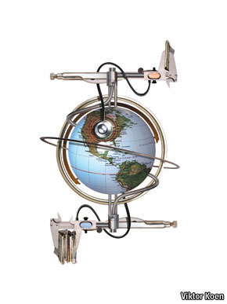

# ＜摇光＞当新闻业不再是造梦的地方

**抛却“理想主义”、“社会担当”等话题不谈，实际上新闻学院“变身”房地产学院的现象，折射着这个时代的逻辑：功利主义盛行的氛围下，“物质利益”成为择业的核心词汇，而在当前中国的经济结构中，房地产行业拥有比新闻行业高得多的利润率、回报率、发展速度，自然也便有了强大得多的人才吸引力。**  

# 当新闻业不再是造梦的地方

## 文/方可成（媒体记者）

 

“那几个进了发改委、《人民日报》和中粮的同学，最让人羡慕妒忌恨。而像南方报业集团的offer，坦白说，性价比实在不高，招人条件高，但工作地点不在北京，即使在北京，也不能解决北京市户口。”

这是2011年2月24日的《南方周末》A2版上，一位人大新闻系毕业生的自述，标题叫“不再做‘特立独行的一小撮’”。

读到这句话，除了赞叹报社的自嘲精神外，也不由得开始思考自己“特立独行”的选择——2010年从北大新闻学院硕士毕业，进入《南方周末》工作，虽然驻京，却拿着广州户口，而大多数同班同学都已拿到北京户口，也就拥有了我所不具备的买房、买车、子女在京高考等权利。我选择的这个offer，是否真的“性价比不高”？

**时代的逻辑**

尽管迫于就业压力的大学生每年都会将雪花般的简历投向各家新闻单位，但仅就我的观察而言，一个可以肯定的事实是：新闻媒体，尤其是传统媒体对优秀青年人的吸引力正在下降。

包括薪酬、福利、户口等在内的待遇差异当然是左右毕业生选择的一个重要因素。人往高处走，水往低处流，那些近年来繁荣发展的行业自然成为了青年人就业首选的“高地”：投资银行、房地产企业、互联网公司、垄断国企……

2009年，有感于身边许多同学毕业后进入房地产企业工作、某家房地产国企甚至到我所在的学院开专场招聘会等现象，我写了一篇博客“新闻学院为什么变成了房地产学院”，引发许多讨论。

抛却“理想主义”、“社会担当”等话题不谈，实际上新闻学院“变身”房地产学院的现象，折射着这个时代的逻辑：功利主义盛行的氛围下，“物质利益”成为择业的核心词汇，而在当前中国的经济结构中，房地产行业拥有比新闻行业高得多的利润率、回报率、发展速度，自然也便有了强大得多的人才吸引力。

从这个角度上讲，新闻业遇到的人才困境实际上是一个结构性的问题，是当下中国新闻业发展困境的一个缩影。

但是，倘若我们放弃这种宏大叙事，回归到细节当中，或许可以对这个问题有更丰富、更深入的体察。

**自我实现的可能性**

户口真的那么重要么？

回想自己的求职选择，其实户口、薪酬都不是首要因素——想要户口的话，《人民日报》、中央电视台都可以给你，甚至任何一家行业报都可以，可我压根就没有向它们投过简历；想要高收入高福利的话，去找垄断国企吧，可我也没有考虑过。

其实，对于优秀的青年人来说，择业时一定有超越物质利益、超越计算所谓“性价比”的追求，那就是自我实现——能否通过一份工作，实现自己的理想抱负，实现自己的人生价值、社会价值。

十年、二十年前，中国新闻业对于青年人而言是一个巨大的自我实现平台。当一群群指点江山的少年走出校园，踏入媒体，无数激动人心的可能性就此展开。

那些传奇般的故事至今仍在心怀新闻梦的青年人当中流传——1992年从北大中文系毕业的沈灏，短短数年内就成长为《南方周末》编委，并在1999年初写出了经典的篇章《总有一种力量让我们泪流满面》。在塑造了一个“文人办报”式的梦想之后，2000年，他又成为《21世纪经济报道》创始人，实现了令人艳羡的财富梦想。

2000年从北大微电子系毕业的许知远，在读书时就已经初露锋芒，毕业后很快成为《经济观察报》主笔，塑造了一张报纸的风格，之后又成为知名的作家，行走中外，自由写作，拥有无数忠实拥趸。

类似的故事还有太多太多，在中国新闻业的黄金年代，造梦的传奇屡见不鲜。

今天，中国的新闻业比十年前当然要发达得多、专业得多，但是我们还能见到沈灏、许知远这样的故事吗？就我的观察，很难，很难。倘若沈、许等人都晚生十年，他们或许就不会取得如今天般的巨大成功。

我想，这其实是优秀青年人不再青睐媒体，尤其是传统媒体的一个重要原因。如果一份工作仅仅能给你养家糊口的能力，却无法支撑起你更大的野心，更高远的梦想，无法为你的自我实现提供充足的空间和支持，有多少人还愿意倾心投身其中呢？

**如何重塑“造梦”平台**

没有了激情与梦想的中国新闻业，该如何重塑一个“造梦”的平台，为青年人提供更多自我实现的机会？

一个途径是新媒体。今天，新媒体是创业的热土，也是少年英雄频出之处，Facebook创始人扎克伯格式的故事，最为激动人心。

传统媒体向新媒体的业务扩展，本应有自己的优势，然而我们遗憾地看到，在今日中国的传统媒体管理层中，鲜有能够真正理解新媒体的。他们要么自以为是，在新媒体战略上固步自封，错失良机；要么判断有误，盲目出击——这些都成为传统媒体拓展新媒体的道路上，除政策限制之外的另一道难题。

另一个途径是打造专业化、明星式的记者，为记者的学习充电提供最有力的支持，允许记者的个人风格得到最大化的宽容和最完整的呈现。在新闻生产流程已经日益流水线化，对记者施以计件工人式考核的情况下，个人的梦想自然无法茁壮生长。

当然，“造梦”的途径还有很多。问题的核心或许在于：当管制的手段日益灵活游刃，而各家媒体都日益形成既得利益群体的时候，给年轻人挥舞拳脚的空间自然就小了，只有努力支撑出、打破出一片新空间的媒体，才能重新孕育传奇式的故事。

现在，我所在的报社每年都会举办一场品牌活动，名曰“中国梦”。活动的宣传语写得很好：“这是能够梦想的中国。这是敢于梦想的你。这是兑现梦想的中国季。”

或许，在思考庞大的“中国梦”之余，我们的媒体也应该套用这个句式，问一问自己：这是能够梦想的平台吗？这里能容纳敢于梦想的青年才俊吗？这是能够兑现梦想的新闻业吗？

如果回答都是肯定的，那么所谓的人才困境应该不复存在了吧。

 

（采编：佛冉 责编：陈锴）

 
