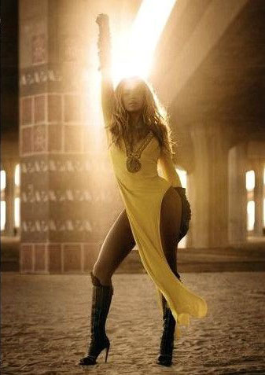
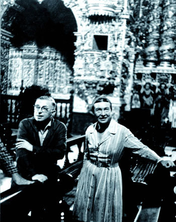

# ＜摇光＞彪悍的人生不需要结婚

**男人的动物性决定了他们会喜欢形形色色的美貌如花，谁又能说得清楚究竟对哪一个才是真爱，其他都是欲望呢？人大抵都是差不多的，爱也并无特殊，当一个女人已经徐娘半老，毫无情趣可言的时候，男人遇到了另一个年轻女人，他们在一起充满活力和激情，谁又能说这之间不是爱情呢？**

 

# 彪悍的人生不需要结婚

## 文/蓝小灰（香港大学）

### 

 

在遇到某人之前，我觉得结婚离我是一件非常遥远的事情。我很认真地觉得如果我能在30岁的时候结婚，那么就可以谢谢上帝佛祖安拉玉皇大帝了。这种想法并不奇怪，几乎所有女生都有过，特别是在漫长沉闷的空窗期。单身是一种习惯，很可能一习惯，时间便哗哗流走，等到反应过来早已青春不再。

后来我遇到了一个我很爱的人，并且我觉得他也很爱我。又毕了业，周围也零零散散地会有婚讯传来，那么自然便会考虑到结婚的事情。我一直很想结婚，这个周围的朋友都知道；但因为什么，连我自己也说不上来。

今天看了几篇文章。一个女生表达了她的观点，她认为结婚并无多少意义。这对我来说多少有些震惊，不仅在于这个观点，而更重要的是她的个人状况：她有一个交往五年的男友，几个月前刚刚被声势浩大地求了婚。一般这种状态的人很少会对结婚产生质疑，但是她却觉得如果说婚姻只是一种承诺，那么它是无意义的。因为如果，你连跟这个人在一起不分开都需要承诺来约束，那么这也不是真正的爱情了；如果两个人因为爱情所以不分开，那么结不结婚又有什么区别呢？

其实关于这种观点，一个世纪以前，波伏娃便用亲身经历证明了其可行性。她与萨特终生相伴却始终未婚，之前我一直并不理解，甚至在最初我看到上述女生所认同的观点时，我都以为她，和他们一样，因为不相信爱情存在，所以不愿意结婚。然而当我试图把她们的想法提炼出来，我发现她们不仅相信爱情，而且格外信任爱情。

婚姻究竟是什么，我很难回答这个问题。但是当我换一种问法问自己为什么想结婚时，我却发现了答案。“我爱他”——这个当然；“我想和他永远在一起” ——这个只要相爱即使不结婚也可以；“我想有保障，当时间过去，他不那么爱我的时候，离开我的成本会稍稍高一点，于是他便不会那么轻易地离开我；当我们遇到问题的时候，会考虑如何解决，而不是采取分开这样一种最简便的方式”——这才是真心话。

所以婚姻说到底，还是出于不信任。不信他会永远爱你，不信当你年老色衰时他不会被年轻貌美的下一个吸引，不信你们在没有外力约束的条件下会永远不分开；说到底你不信爱情这个玩意儿，是唯一的、排他的、永远的。不信任爱情。所以要结婚。

而具体到现实中来，最残酷的不是女人不信任爱情，而是对于大部分男人来说，爱情是唯一排他的就是一个永远说不通的道理。男人的动物性决定了他们会喜欢形形色色的美貌如花，谁又能说得清楚究竟对哪一个才是真爱，其他都是欲望呢？人大抵都是差不多的，爱也并无特殊，当一个女人已经徐娘半老，毫无情趣可言的时候，男人遇到了另一个年轻女人，他们在一起充满活力和激情，谁又能说这之间不是爱情呢？

所以，真的只有彪悍的人生不需要结婚。对于广大俗人来说，结婚不仅是社会风俗，更是风险规避的最优选择。信任爱情从来不是单方面的事情，两个人必须有同样的理念，比如都得相信爱情可以抵得过时间；都得有强大的内心，比如对出自动物性的ONS之类都可以理解和接受——这里必须要说明的是，不仅是女人接受男人的ONS，男人也要接受女人的ONS；最重要的是，还都得清楚地明白自己的真爱究竟是谁。

这一切太难了，所以世间只有一个波伏娃和一个萨特。并且我想，今后出现的每一对，也都将成为传奇。

 

（采编：周佩玲；责编：黄理罡）

