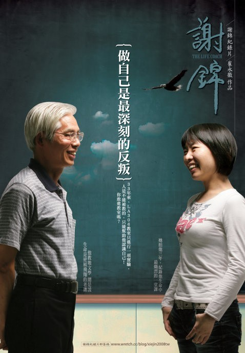

# ＜摇光＞得体

**总是试图冷静地分析自己为什么硬是扭捏着要反抗来自父辈人的管教。有一天，一句话脱口而出：“其实好多大人不是想让我们幸福，而是想让我们活得得体。” 啊，得体，就是这个词。**  

# 得体

## 文 / 周雨霏（中国人民大学）

都说台妹清纯可爱，配上嗲嗲的台湾腔，一个回眸一个倩笑也搞得宅男们欲罢不能地腿发毛、心窝痛。迎面走来的她们确实个个眼大招风、肤白勾魂，活脱脱似《米娜》《昕薇》里走出来的人。可多看几个，就不行了——我已经忘了前面几个的样子，因为这一个和前面几个长得几乎一模一样—— 一样的眼大招风、肤白勾魂、巧笑倩兮、婷婷款款。于是看得多了，觉得比起《米娜》《昕薇》，她们更像章鱼小丸子店铺里走出来的人——一个个都在统一大小、统一形状的模具里用同样的材料、经过同样的时间被精心烘焙而成。你吃过味道不太一样的章鱼小丸子吗？不多。火锅底料各家自有各家的味，这家辣，那家香。可章鱼小丸子却都是一样的。好看的台妹，或者说妆化得好看的台妹，就像是章鱼小丸子。

看着一模一样可爱清纯的脸从我眼前飘过，我感到在那表面的默契之后有一股强大的统治力量。如果她们是一把把钥匙，妆容就是一个钥匙孔——这力量推着她们向同一个方向猛冲，即使撞得头破血流、脱胎换骨也要钻进去。在这力量的驱使下，她们个个都变得很美，而这导致的结果则是：“美”的标准就像泳池里的浮标一样“水涨船高”——人人都美了，美不再成其为美。渐渐地，化妆对她们来讲已不再是追求“更美”。每日化妆、时时补妆成了习惯、成了规则，甚至丑兮兮地出门都已经成了对每个迎面走来的人的不敬或侮辱。每日化妆，其目的自降一级，变成了“得体”。

“你不要那样看着我啦，今天没化妆，眼睛好小，都觉得整个人没精神，哎呀真的没有精神。烦死了啦。” 在青岛读书的台妹A有天早上来到教室对小兰讲。A同学也不看看小兰那小到聊胜于无的眼睛每天又是怎么自得其所地幸存下来的。而化不化妆对于A来讲，却可能真的是关乎幸存与否的事。

得体。这就是那股统治的力量。它像一根无形的标高，横在她们头顶。

总是试图冷静地分析自己为什么硬是扭捏着要反抗来自父辈人的管教。有一天，一句话脱口而出：“其实好多大人不是想让我们幸福，而是想让我们活得得体。” 啊，得体，就是这个词。

如果说化妆很得体的话，朝九晚五、收入稳定也很得体。学金融很得体。入党很得体。先买房子后结婚很得体。穿名牌很得体。吃完饭假装争着给钱很得体。情绪稳健、思维缜密很得体。

相较之下，“素面朝天”什么的、“裸婚”什么的、“信教”什么的、“叉着腿下苍蝇儿馆子”什么的、“考古学家”什么的、“直来直往随性烂漫”什么的、“自由自在居无定所地生活”什么的，就显得那么不思进取，那么进不得眼，那么土鳖，那么离经叛道、那么，不得体。

几天前看到一个书名叫《做自己是最深刻的反叛》。而现在的我觉得，最深刻的“做自己”就是不得体地活着，而也只有不顾及“得体”地活着，才是最深刻的“做自己”。

然而现实中的大多数时候，我们却还是向这个得体的世界投降了。为“荣耀”而奋斗、为批评而羞愧、为传统而过滤，为“不一样”而不适。辜鸿铭说：“我的辫子是有形的，你们的辫子是无形的。” 台妹的得体是脸上功夫，而我们的得体呢，深深扎在心脏上、灵魂里，直疼到人发自内心地笑出声来。

 

（采编：林静；责编：陈锴）

 
