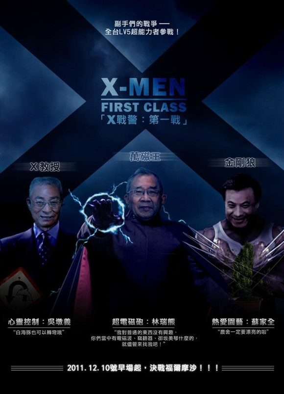
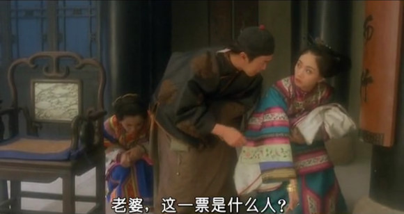
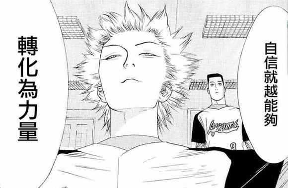
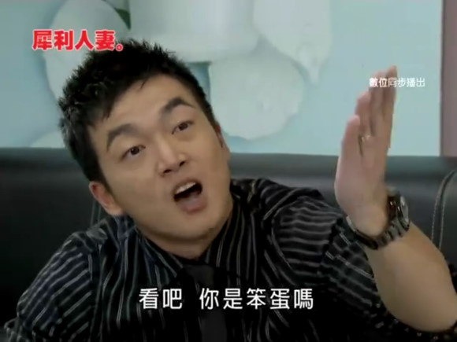
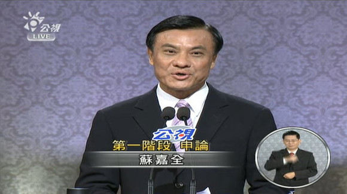
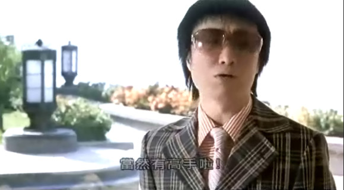
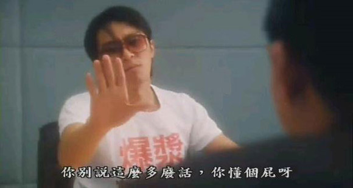
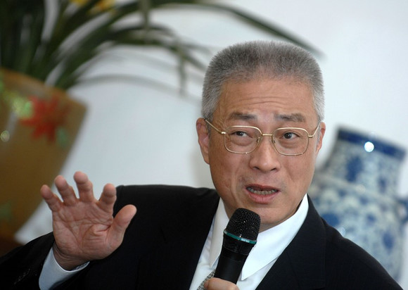
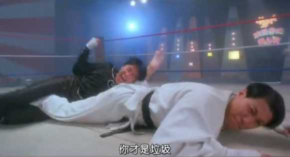
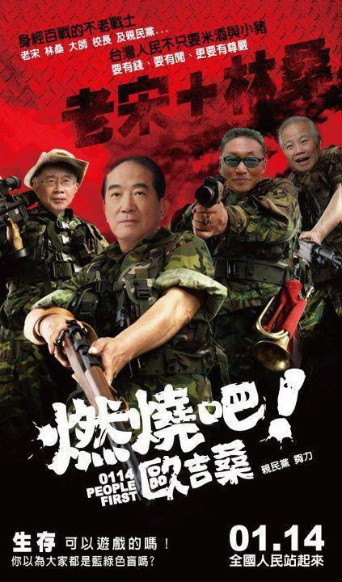

# ＜摇光＞從台客辯論人的角度看看副總統候選人辯論

**台灣終於開始了第一次的副總統的辯論，雖然在副總統辯論的意義始終是助攻、保險不失分，但說真的，以這次副總統辯論裡出現的蘇嘉全之扎實、吳敦義之穩健、林瑞雄之可愛都是首次副總統辯論之福。****** 

# 從台客辯論人的角度看看副總統候選人辯論

## 文/韋阿祐（華中科技大學）

 

這次副總統辯論是中華民國史上第一次的副總統候選人的辯論。

這個辯論會本裡所應當的最大的特點就是，不需要什麼特點。因為按照我國的憲法，副總統根本是替補隊員，完全沒有所謂的實際職權，更不需要作為。

必須說台灣的總統候選人辯論的場上制度設置存在相當大的缺陷，這個缺陷直接導致的是可供候選人話題游移的空間性太大。這點在總統候選人辯論時倒還會顧及面子盡可能符合辯論的意義，但是當三位副總統上來的話，這些缺點就明顯得多了，因為候選人求穩就好了。

特別說一下，這個賽制的最大缺點，就是——媒體提問環節。這個環節順帶也顯現出台灣民主政治裡的一大毛病，就是媒體被政治的置入性行銷導致的偏向性過濃、以及專業性的不足，聽起來很抽象?，舉個例子吧。以氣球為主題，如果當天副總統參選人所面臨的媒體提問是「氣球」 的話呢，那就會出現以下的情況:

**自由時報模式****:****「看著美麗的氣球飄上天，就讓人不禁想起邪惡的外省權貴集團對台灣人民的壓榨與迫害****.....****，所以國民黨要不要出來解釋為什麼這麼多大陸製的氣球會飛上天****?****」**

**中國時報模式****:****「這名男性被內地網友封為史上最牛氣球哥**** ……****，難道不是透過國民黨的****ECFA****才能把氣球進軍大陸市場****?****」**

**聯合報模式****:****「想請問候選人是不是只有接受國民黨的九二共識，才能將氣球吹得又大又圓****?****，這個問題順便提問宋楚瑜」**

**TVBS****模式****:****「扁集團八年的貪腐，究竟可以買多少氣球讓全國的中小學生吹到飽****?**

**三立新聞模式****:****「小朋友沒有氣球可吹，馬英九難道不用負責嗎？」**

**民視新聞模式****:****「今天下午，民進黨的蔡同榮先生在三分鐘之內吹了五十個氣球，慶祝民視最新八點檔大戲，三組參選人有什麼看法****?****」**

**中天新聞模式****:****「最近在網路上有一段關於氣球的影片爆紅，引發網友熱列討論**** ……****，所以對於網路的這則新聞大家有什麼看法****?****」**

**年代新聞模式****:****「大家好，我就是宋楚瑜。」**

**我的模式****:****「**** ****為什麼鹹酥雞裡面薯條一定要放乾梅粉，你們這些政客誰要負責****!****」（主席****:****離題了喔，警衛****!****）**

所以，很清楚了吧，可見這個環節根本純在很多既定立場的提問、以及沒有質量的提問，關於沒質量的提問在這次最明顯的莫過於本次辯論會裡面蘋果日報的三個提問:「 一、吳敦義的太太是不是很愛算命?，二、蘇嘉全的太太是不是看過猛男秀?、三、林瑞雄如何被電磁波攻擊?。」 基本上，這三個問題都沒什麼質量。

不過問題這麼多的媒體提問卻是佔用最多的場上時間。

簡直就是.............糟、透、了。 

回歸辯論，這次辯論裡面的三方攻防表現來看:

首先是蘇嘉全。蘇嘉全在台灣算是中央官員到地方首長、民意代表都做過的人，選戰經驗豐富。

總體來講，蘇嘉全在這次辯論是個稱職的二辯，全程拖稿所顯露的高度自信除了語調太過一致外沒什麼問題，並且很多論述的完整性更強，這是有助於蔡英文的，值得嘉獎的是相當擅於聽問題、然後打出反擊，尤其是幾次在聽到吳敦義攻擊扁政府國際談判草率時馬上就回應道:「馬英九之前才說我們鎖國，現在吳院長又說我們開放，一下開放、一下不開放，我們到底開不開放」。基本動作十分扎實的選手! 

蘇嘉全的申論論點上，基本上架構就是全面的進攻，首先開頭一句:「民主的可貴就在於政黨輪替...但是馬英九卻糾纏在這些過去的問題卻不思考自己的問題」，這個技巧就是透過民主是用選票決定成敗這個大概念去說明民進黨既然已經下台就算負責任了，言下就是以前陳水扁所作所為都**關、我、們、屁、事**

**!**，這個技巧好就好在可以先做到幫上一場辯論被糾纏的陳水扁政府時期的施政問題消毒、並且為自己的防守做鋪墊。 

接下來呢蘇嘉全大致上就是先論述過去民進黨執政的政績，內容包括高鐵的通行，去澄清就算民進黨過去有這麼糟糕嗎?，然後，開始進攻馬政府的施政無能，值得一提的是，在攻擊上蘇嘉全幾個"跳票"為開頭的提問，包括失業、633等問題，都讓觀眾形象地記住馬英九的政見無法兌現。最後鋪陳一下自己在屏東市的政績，彌補蔡英文團隊缺乏行政經驗的印象。

蘇嘉全最大的問題，就在於逃九二共識問題逃的太硬，這是論述缺乏使然，如我上篇討論總統辯論時提到，蔡英文團隊所欲求構建的台灣共識的論述，好處是以程序代替過去的意識形態論述能達到降低民眾的質疑，壞處是整體論述過於簡單化，若台灣共識只是程序，那相比之前08的入聯公投、甚至與政黨輪替的差異又在哪裡呢?，所以直接導致的是，詰問環結碰上吳敦義簡單一句你們敢不獨嗎，直攻單純的意識形態時，只靠詰問時間的回答就給人空虛的感覺。 

說到吳敦義，他跟馬英九可說的上是真的辯手，兩人學生時代都參與過辯論活動。所以我之前聽聞有些大陸朋友說國際大專辯論賽兩屆全程最佳的黃執中學長教授馬英九辯論時就不禁莞爾，這不是黃執中學長的實力問題，而是對辯論自信如馬、吳有這個需要嗎?

那吳敦義在學生時代又有什麼過人之處呢，吳敦義過去本來是政治大學東語系後轉入台大，曾經在政治大學新生盃辯論賽決賽的賽場上作結辯硬生生逆轉了一貫的大熱門外交系，當時外交系結辯的選手，就是在台灣以口才出眾著稱——台中市長胡志強。

而他在過去選戰上更是創下南投市市長選舉高達96%得票率的瘋狂紀錄。 

可是回歸到這場辯論上的話，吳敦義這次的表現，在戰略上卻恰恰要做到藏露鋒芒，畢竟他最引人詬病的反而就是他口才太好，口才好固然是辯論很重要的事，但總統辯論最重要的還是觀眾印象，若要做到說服反感自己、觀眾緣更佳，那吳敦義反而最大的敵人就在自己身上 

而整體的形象都做得滿好，蘇嘉全雖然是拖稿演出，但比起吳院長從容的肢體語言、語調時快時緩的轉換、恰到好處的國台語夾雜，都可以說尚欠些火候。在六位發過言的總統、副總統候選人，他也算是整體協調感覺最好的一位。唯一算是一點形象上的詬病大概就是申論時大概駁的太high了，整個頭都轉過去看蘇嘉全，在電視辯論中未免使自己與民眾的距離拉遠了。

申論的論點部分，核心還是延續馬英九的攻擊策略，拿這四年與阿扁時期比，先是提醒大家，全世界的金融海嘯影響、國內的八八水災台灣還是能夠迅速地恢復。然後就以攻代守的打擊過去民進黨的施政問題(順便拿來回應蘇嘉全的跳票說)，這些點的攻擊基本是直面拿蘇嘉全申論的點來用，值得一提的是只要到開始拿馬跟扁做比較時，吳敦義都會刻意轉換台語來營造鄉土的形象，好處是對於本土的中間選民比較有親近的感覺。而內容大概是

諸如過去與現在的清廉指數在全世界排名的進步、又或是愛河整治、高鐵建設的功勞應該算是國民黨而非民進黨。然後再回應蘇嘉全、林瑞雄指責的花錢買政績的說法，回應是用在金融危機時期的基礎建設，進一步把"花錢在建設"跟"政府賤賣國有資產"作比較。整個論點上現場感十足，說穿了其實就是想告訴大家，你說我們馬英九無能?，**你們比我們更、無、能****!**

質詢答辯吳敦義在技術動作有一點點問題，其一是無薪假可以拿諾貝爾這句備受質疑的問題上，吳敦義可以說是被活生生把話吞回去了，拐彎抹角地把話收回並不是什麼好招，還不如多一點坦白而誠懇。而這件事情其實說穿了無薪假本身是全球經濟衰退拿來因應失業率的一種選項，從社會的某種角度上來說是可以說是一種處理勞工來說不錯的方案，只是從選民的角度來，誰肯認為自己突然沒薪水是件好事?。所以於辯論、於對話，有時候一句話即使他再怎麼符合現實要求、再怎麼符合邏輯，真的要懂得顧及受眾的感受。

其次蘋果問的關於維基解密的問題（維基解密爆料了很多台灣政壇八卦來源於美國駐台代表，發現很多台灣政壇要角常常跟美國駐台代表"訴苦"），吳敦義的解釋是這是誤會並"奉勸以後很多政壇人物即使英文再好也應該要有帶翻譯的習慣"，此話一出，固然表面上是回答的沒什麼問題。本來吳敦義大概是想說說朱立倫，但實質上是不小心倒誤傷了馬英九，眾所周知馬英九對於自己能力的自信有時候造成不少問題，特別費案開庭不帶律師自己上陣、外國使節參訪不帶翻譯等等。

吳敦義的問題就在於整場辯論給人感覺疲於奔命在攻擊蘇嘉全而少了自己的論述，這點從申論就開始了，而為了配合馬英九既定的攻勢，他的套路基本上都是把馬政府這四年並不差是建立在拿來比較扁政府時期的施政，這個標準固然有利於攻防，但是……缺點就是聽了整場下來還是會覺得那馬吳團隊憑什麼告訴我們接下來四年會比現在更好。 

最後就要提到整場辯論的一大亮點，莫過於我們宋楚瑜的林瑞雄了，這個缺乏政壇經驗的老學者，在辯論前幾乎所有人都不看好，我甚至一度認為他的辯論水準大概就會使它變成黃大洲一類的腳色(黃大洲為1994年台北市場參選人，當時與之辯論的是名嘴趙少康以及陳水扁)。

誰知道這場比賽下來，大家對他的印象就停留在"可愛"二字上了，因為即便林瑞雄先天上的咬字不清、沒活力的肢體語言，這點使他在申論跟結辯吃很大的虧。但是但林瑞雄在媒體及交互提問的部份，表現的真是太真誠、太率真了!雖然不說足夠做到亂拳打死老師父、但最起碼也打亂了另外兩位老道的政壇老手對他邊緣化的布局。 

林瑞雄的亮點不在論點、更不在結論，其主要論點就主要是批馬、蔡的無能與意識形態，並稍微提到一下經濟以東方瑞士為藍本、醫療、環境產業 ，概括宋林二人的論述大致上都是朝「人棄我取」的態度拾起一些冷門話題，塑造第三路線的方向。但他厲害的就是答辯時候的真誠，尤其是被問到「人格特質是否會讓宋楚瑜減分」時，說出**「自己只是有赤子之心，有一點老頑童的個性」**時，真的只能用漂亮兩個字來形容!!，而被問到最受爭議的「電磁波」問題時(指被政府的特務機構以電磁波攻擊)，那種率真的用自己所學專業認真回答的態度時，大概會少了很多人以「看笑話」心態看待他了。

對林瑞雄實在不用去苛責他的口齒不清，因為你不會拿梁朝偉的演技去比素人演出，從某種角度上，看他答辯的開懷大笑是實實在在的塑造一個鄰家大伯的形象，這種率真又何嘗不是政壇的一道風景線呢 

我個人認為這次的賽制裡所有的環節，具看頭的就是交互質詢、媒體提問，而這次辯論裡，我認為中央社關於台灣加入「泛太平洋自由貿易區」（TPP）提問是最有質量的。同時這類的問題也是我認為總統大選辯論裡最值得拿來討論的議題、也是下場總統辯論我認為最該看的問題。

原因無他無論是「台美貿易暨投資架構協定」（TIFA）升級到「台美自由貿易協定」的想望、亦或是「泛太平洋自由貿易區」甚至是之前與大陸簽屬的ECFA。都同時牽涉了，台灣的總統要怎麼看待國際關係(要不要聯美制中?還是反過來加深兩岸關係尋求東協?) 要怎麼看待國內的社會問題(簽署後的農業、醫療...等等問題要如何看待) 、台灣要不要放棄一部分政策主導權開放市場還是繼續現在的道路?。

這一類的問題切面極多，又具有現實內涵，認真討論起來，**才能真真正正讓選民感受到痛快二字****!**

台灣終於開始了第一次的副總統的辯論，雖然在副總統辯論的意義始終是助攻、保險不失分，但說真的，以這次副總統辯論裡出現的蘇嘉全之扎實、吳敦義之穩健、林瑞雄之可愛都是首次副總統辯論之福。

 

（采编：麦静；责编：麦静）

 
