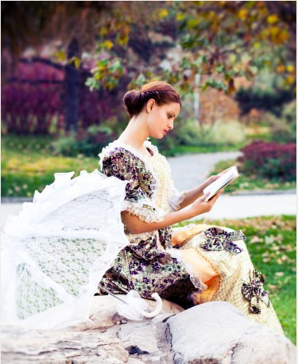

# ＜摇光＞循规蹈矩是这个世界上最没劲的事情——写给一个高一女孩（三）

**我会很欣喜地支持你，生命就是充满了那么多的可能，需要你全力以赴地去体验，不要小小年纪就把自己封闭起来，趁自己青春年少，多多体验生命的无限可能。真的，做一个循规蹈矩的女孩子是这个世界上最没劲的事情，那些整天中规中矩只会考试的年级第一名女生真是有够枯燥的。女孩子最忌讳的就是枯燥。**  

# 循规蹈矩是这个世界上最没劲的事情

# ——写给一个高一女孩

## 文 / 刘桂新（武汉大学）

 

（承接[前文](/?p=16192)）

#### 九

所以，我们只是需要有意识地朝那个方向努力。现实生活中不是枷锁重重吗，但我们也不是毫无施展的余地，只要你想成为一个自由的、有独立思考能力的人，你就可以成为这样一个人，即使是在当下中国这样的专制环境下面。何况，当下中国的专制已经是漏洞百出，我们根本不需要多费力气也不需要承担任何风险就可以逃出来了，只要你想，你就可以。

不过要注意，我们这项工作不是从逃离课堂开始，而是从阅读开始。真的，我现在觉得，生活在我们这个国度的年轻人，阅读几乎成为我们实现自我救赎的唯一方式。

我们不是要寻找课本之外的答案吗？这个只有在课本之外的阅读中才能找到。前面我也说过了，我们的新闻媒体、报刊杂志、书籍出版都是受到严格控制的，但我们也不要因此太悲观，这种控制体系在市场化和信息化潮流的冲击下已经受到严重削弱，只要我们努力寻找，总能见缝插针地找到那些与官方教科书不一样的答案，如广州纸媒出的一些报纸杂志《南方周末》、《南方人物周刊》、《南风窗》等，一些独立知识分子写的与官方观点不太一致的书籍等，以及特别是随着外国翻译著作的增多，更多地阅读外国作家的作品，能够让我们获得更多不同的视角和观点。这个我们可以慢慢来，从最简单的材料开始读起。另外就是要善于运用网络，网络虽然也受到官方的严格管控，但由于互联网自身的特点，网络成为中国最自由的传播媒体，你可以多从网上获得一些不同的信息。

不知道你平时都喜欢读一些什么书。如果一些纯理论的书籍会让你暂时觉得看不懂的话可以先从阅读一些文学作品开始。文学是一种伟大的启蒙形式。它是真正以一种春风化雨、摄人心魄的形式来启迪一个人的灵魂的。这个可以在你具体的阅读过程中再交流。

其实不管你阅读什么，只要是阅读一种能提供不同于课本的答案的书籍，你总能从中收获很多，并且从中逐渐培养出一种独立思考的能力。

但在当下中国，市场化潮流下的书籍出版业十分繁荣，因此选择阅读什么样的书对我们最有教益也成了一个很大的问题。在这种商业潮流下，很多的作品都是为了商业目的而出版的，表现为媚俗、投大众所好的低级趣味或者哗众取宠。它们本身没有什么价值，而只是纯粹满足了读者的消费欲望，为读者提供了一种低级的娱乐。

阅读是一件快乐的事情，但如果阅读只是单纯地给你带来一种娱乐，而没有给你带来更多，那这样的阅读是很没有含金量的。

有人或许会抱一种享乐主义的态度，阅读能够让我觉得开心就够了，那些所谓的含金量高的书籍该会是多么的无聊啊。这当然也在你的选择自由范围内。

但如果我们能够阅读的时候，在获得同样多的阅读乐趣的同时又能够从中学到一些知识，受到一些启发，这种稳赚不赔的事情我们何乐而不为呢？我向来主张的是，最有效率地提高自己，那在阅读方面，最有效率地提高自己的方法就是读最经典的书，读最权威的学者的著作。

读者、青年文摘、刘墉这样的温情脉脉的文字，读来确实很温暖人心啦，让人觉得人生如此美好，我心如此纯净。这些文字当然也是富有教益的，我对他们没有批评的意思。但这样的文字多读无益。生活的道理一大堆，其实很多都已在我们心里，并不需要再回到读者和青年文摘上找印证。问题在于生活本身，只有用心地去过真实的生活我们才能够学会什么是生活，才能够真正领悟生活的真谛。

我刚上大学的时候还在看萌芽和安妮宝贝，那种颓废感伤的文字真是很投合那些忧伤的年轻人呢。或许可以这么说，每一个年纪都有每一个年纪的阅读书籍，不能直接跳过去，因此我在这里说这些书读来是多么的无益，也没用，你还是得自己去读了才能体会到。我这里只是做一个善意的提醒，其实我们本来可以更深刻一点的。

张爱玲是备受女性读者推崇的一位现代作家，她是通过写言情小说而进了文学史的，并且在文学史上也是这一类作家中获得评价最高的一位。喜欢言情小说也无可厚非，但如果我们有时间去读这个，我们倒是可以选择直接去体验言情小说的最高境界，而不只是停留在琼瑶、张小娴的水平。

法国的杜拉斯也是很多文艺青年很推崇的一位女性作家。像这样的有国际影响的作家，在很多鄙视国内文学的人眼里则又高了一重境界了，他们总觉得手里捧一本杜拉斯就足以鄙视那些看毕淑敏、看安妮宝贝、甚至看张爱玲的人了。

在西方现代派女性作家里，我们还可以阅读伍尔夫和波伏娃。但我个人向来是有些拒绝现代派的文学作品的，原因在于他们给我内心带来的某种时空错乱感和慌乱感。我个人倒是更推崇西方19世纪的浪漫主义和现实主义文学。

以上仅仅是就文学作品的阅读举一点例子。

文学也不应成为我们阅读的全部，尽管它必然会占据很大一部分。我们头脑中的很多观念都需要清理，简单地怀疑一切，把自己的大脑清空是不够的，我们还需要装进去一些我们自己的东西，而且是需要全方位地重新评价我们头脑中已经获得的观念，那我们就只有更多地阅读课本之外的相关书籍了。

#### 十

我虽然说，并没有想要你成为某种特定的人，但其实我在内心里对你是有期待的。你不一定要成绩很好，也不一定能考上称心如意的大学。但我在想象你手捧一本你身边的人都不问津的书在晨风中读得入神的美丽画面。在别人眼里，你越来越成了一个想法不可捉摸的人、一个特立独行的人、被人称为freak，但你沉浸在你自己的世界里，不亦乐乎，内心宁静。我还在想象，你在课堂上大胆地站起来，给老师指出课本上某个地方的说法是错误的，并且引经据典从你课外看到的书本上搬来有力的证据进行反驳，引起全班同学的啧啧称叹。

你或许会喜欢摇滚，喜欢玩吉他，喜欢别人都不喜欢的音乐，你开始有了你自己的独特的音乐品味；你或许会跟着一帮男孩子去玩街舞或者玩滑板玩轮滑，我一点都不会觉得你不淑女，相反我会觉得你很酷；你或许会喜欢上一个人背着包去陌生的地方旅行、喜欢上自行车带你去很远的地方；你或许还会喜欢上摄影。这些，我都不会感到惊讶。并且我会很欣喜地支持你，生命就是充满了那么多的可能，需要你全力以赴地去体验，不要小小年纪就把自己封闭起来，趁自己青春年少，多多体验生命的无限可能。真的，做一个循规蹈矩的女孩子是这个世界上最没劲的事情，那些整天中规中矩只会考试的年级第一名女生真是有够枯燥的。女孩子最忌讳的就是枯燥。

当一个人开始学会独立思考的时候，他能够表现出某种个性，这种个性不是气质上的，而是思想上的。他会逐渐显得与众不同。你可能会慢慢变得愤世嫉俗，或许还有些自命清高、孤芳自赏，看不起身边这个庸俗不堪的世界；你可能会越来越看不惯老师在课堂上的那一套说教，跟身边的同学越来越话不投机，阅读趣味跟身边的人也逐渐地大为不同。当别人开始觉得你有点怪怪的的时候，你会有某种程度上的异类感。人是不喜欢异类感的，人总体上说是希望自己中规中矩的，希望自己跟身边的人不是特别不一样的。人总是不喜欢自己在所处的环境中显得太突兀。当一个人跟身边大多数人都不同的时候他会感到孤独和恐慌。

我倒是觉得这是很值得向往的一种境界。一个人正是因为有他的独特之处，才吸引另一个人。想想吧，在这个教育体制下培养出来的大多数人都是千篇一律的，那么作为一个独立的、有个性的、有思想的女性矗立在他们中间该会是多么的风姿绰约、妩媚动人啊。

你可以自由地选择你自己的生活，包括爱情。高中不准谈恋爱之类的校规简直就是扯淡。当然，这个只是我的见解，你父亲不一定会同意。我想说的是，爱情是很美好的一个东西，喜欢一个人是很美好的一种情感，特别是在你们这个年纪，真诚地喜欢一个人会是一个人一辈子最难忘最珍贵的一种经历。如果爱情来了，不要拒绝不要回避，要知道这也是人生成长的一种方式。但既然爱情如此美好，那么不要用它来伤害别人，更不要用它来伤害自己。爱情应该成为你进步的一个动力，而不是影响学业的一个因素。如果爱情竟能够影响你的学业，那我可以断定，它一定不是我所说的很纯真美好的爱情。爱情是一种发自内心的真诚的情感，早恋可不是表达个性的一种方式，同样也不要用这种方式来表达对现实的不满。说到这个，推荐你去看一部电影《初恋这件小事》，泰国的。

你不是一定要考第一名才能有成就感的，而且，你根本不需要因为你的成绩感到自卑。因为生活中不是只有分数。不过，如果你觉得成绩不能成为你成就感的一个来源，那么你或许可以努力去寻找其它方式来让你获得某种成就感，来为你赢得自信。

如果我们一定要从与身边的人比较的角度来确认自己的成就感，那么，成为一个有独立思考能力的人、成为一个有个性、有自己想法的人就足以让你的人生自信起来。因为有个性的人是独一无二的，无与伦比的。你可能考试很糟糕，但你的阅读面比你身边的同学广，对于很多问题你都开始有很多不同于课本的见解，而不像你身边的同学只会照本宣科。这些，才是真正值得一个人感到自信的地方。

我不是说成绩不重要。说到成绩，你爸爸说你成绩不好那只是对你过去的评价，高中是一个全新的开始，只要你找到努力的目标，并且诚心地为之努力，你就能取得你想要的结果。

而且，高中课本的学习也并不是一件那么糟糕的事情。比如语文课，你完全可以从中培养自己的文学兴趣。入选语文课本的那些文学作品基本上都是相关类别文学作品中最经典的，要学会欣赏这些经典文学作品。多读一些课外的文学作品，要显得比你身边的同学更博学一些，你会爱上写作。至于阅读，古文方面你可以去读一本上海古籍出版社出版的《古文观止新编》，而现代散文的欣赏可以去看一本上海辞书出版社的《现代散文鉴赏词》，古诗词鉴赏你可以去阅读上海辞书出版社的《唐诗鉴赏辞典》和《唐宋词鉴赏辞典》，他们都会渐渐让你爱上文学，并且帮助你把语文这门课程学好的。学习，最重要的是找到动力。

数学的学习，你可以把它当做一个对自己智商的测验，但愿你不要测出一个很让自己丢脸的分数。

英语几乎是最有用的一门学科了，这个我们可以改时间再交流。

政治、历史无疑就是最恶心的两门学科，因为这两门课程里面谎言最多。你可以跟自己玩一个游戏，如何通过课外阅读揭穿这两门课程里的谎言。

地理其实蛮有意思的，看见那一幅一幅的地图，我就想到这些图片里的所有地方去看一看。

至于理科科目的学习就看你的造化了。学习的问题我们还可以另外找时间多交流。

祝好！

 （全文完）  编者注：本文主标题为编者所拟。  

（荐稿：廖汉斯；责编：黄理罡）

 
