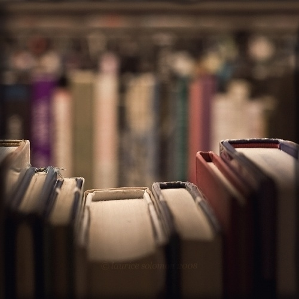
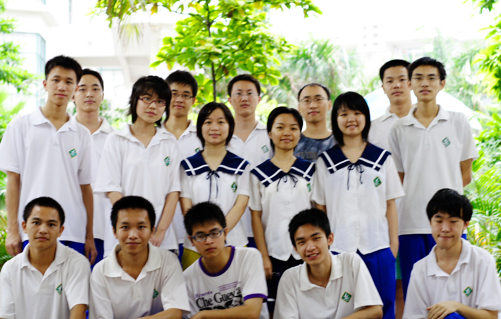
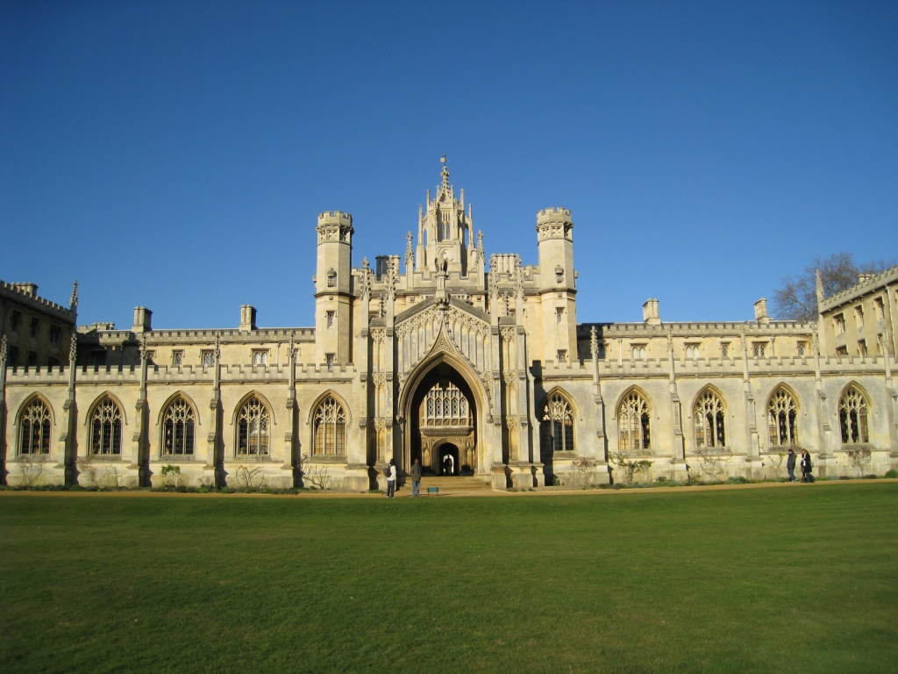

# ＜摇光＞怀旧是本不可读的书

**怀旧是本不可读的书。越读就越恨自己生错年代，艰难竭蹶。好不容易从高考考场的万人堆中爬出来，接受四年的大学教育，被层层机构雁过拔毛式剥削个够，最后被一脚踢入社会，买房还贷做各种奴，垂垂老去。我们儿时想象的阳光下读书，草地上漫步，爱琴海边的欢笑呢？说好的幸福呢？**

### 

# 

### 

# 怀旧是本不可读的书

### 

## 文/邵英杰 （中山大学）

 这是一个不争的事实，几乎所有历经高考的学生，心底都有一份北大清华的情结。然而很多人也仅仅止步于仰慕，随后便化作一声叹息。 起初我也只是这般无谓的艳羡而已，坐着火车南下也没觉得多落寞。可后来，一个两个三个朋友都来告诉我，百年燕园是何等的令人神往。更有一个朋友叫我吃惊，她积攒了半年的积蓄，吃了无数次青菜，终于换得了足额的去北京的花销。她从康乐园消失了半个月，在北大的教室里听了两星期的课，兴致满满而又意犹未尽地回来了。她苦笑着对我说，“如果有任何可能，我都不想回来的。”我知道这笑容是可有可无的陪衬，只有苦涩才是最穿入我们心肺的。 

### 

### 

后来，我换了导师，也选了新课，无意中竟然发现这两位老师是北大中文系的师兄妹。于是一条不知拐了多少道弯的线路在我脑中清晰起来，从蔡元培、胡适歪歪扭扭地连到燕园教师，再连到我的老师，最后再画到我这里。从伟大的人身上奋力汲取能量，哪怕这能量早已损耗了万分之几千。这种对于偶像的顶礼膜拜，是种无比强大的信念，就像吴晓波评论李普曼时说的，“任何一个行业中，必定会有这么一到两个让你想想就很兴奋的大师人物，他们远远地走在前面，背影飘渺而伟岸，让懵懵懂懂的后来者不乏追随的勇气和梦想。”关于北大的想象，来自燕园的传说，散发着无法抵抗的诱惑，激起我内心潜藏着的不安分的欲望。 现实是残酷的。在这个发展的时代，舟到江心，从改革开放步入开放改革的时候，面对着大陆高校教育的现状，除了哀鸿遍野，实在想不出其他的形容词。连北大都衰落了。许知远早在十年前就说，“北大越来越像一个世俗平庸的好大学”。他把96级视作最后的断代，被考试制度驯化得服服帖帖的孩子步入红楼，把仅存的八十年代的梦想也摔得粉碎。于是北大变得愈发闭塞臃肿，时至今日，连学校食堂涨价也容不得学生批评了。 

### 

### 

剑桥大学三一学院的门楼上伫立着创建者亨利八世的雕像，右手握着节杖。上世纪五十年代一次聚会之后，闹疯了的学生大概为了报复亨利八世砍掉剑桥校长费雪脑袋一事，竟然把皇帝老儿的节杖摔到一边，换上一截破椅子的木腿。就这样，满脸肃穆的皇帝手握木腿，一站就是几十年。无怪乎哈佛教授威廉詹姆斯会说，“这些不服管教的学生是最值得我们骄傲的。”造反是哈佛、剑桥传统的一部分，大胆新奇的思想何尝不曾是北大清华的精髓。“兼容并包，思想自由”沦落到今天竟然是连学校的后勤集团的小小涨价举动也骂不得，这样的北大，不念也罢。 “北大要争创世界一流学府，怎么可能呢？现在她连学府都算不上，顶多是个学术机构。”以这样的高水准来看，连大陆最顶尖的学校都是不合格的，那剩下千千万万的雨后春笋般飞速发展的高校又能算得上什么呢？还要上早读，还要晚自习，还要做早操。一群早已年满十八、犯法要负全责的青年人被管教到这样的程度，是教育的不幸，还是时代的不幸？ ** ** 怀旧是本不可读的书。越读就越恨自己生错年代，艰难竭蹶。好不容易从高考考场的万人堆中爬出来，接受四年的大学教育，被层层机构雁过拔毛式剥削个够，最后被一脚踢入社会，买房还贷做各种奴，垂垂老去。我们儿时想象的阳光下读书，草地上漫步，爱琴海边的欢笑呢？说好的幸福呢？ 

### 

### 

（采编：麦静 责编：黄理罡）

### 

### 
