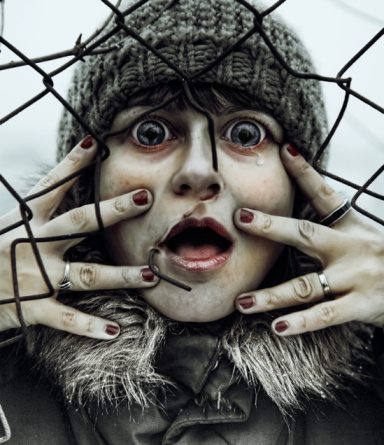

# ＜摇光＞恐惧是掩饰不了的，只能克服

**如何对待这种恐惧和羞耻？《朗读者》的最后给出了答案。男主角年少时和当过纳粹的中年女人有过一段感情，后来这段感情也成了他的恐惧和羞耻。当然，还有德国那段黑暗的历史。文盲的女人最终战胜了自己的壁垒，在监狱里一点一滴地学会了写字，男主角也告诉了自己的女儿当年发生的事情。秘密不再是秘密了，反思和教训才有可能承传下去。** ** 这就是答案：说出来，面对它，永远不要想以一己之力去隐瞒，寻求他人的帮助。用合理又适合自己的办法，一点一点地改变和克服它。**  

# 恐惧是掩饰不了的，只能克服

## 文/囧之女神daisy（情感专栏作者）

 

（一）

我刚上高中时，出了一件事情。在打破了几副玻璃眼镜之后，我妈下决心给我买了一副当时很昂贵的树脂眼镜。而我们家一直比较穷。所以配那副眼镜时，我妈不停地说：这副可不能再弄坏了。我也诚惶诚恐。

结果后来我在学校附近的公共厕所把它弄丢了。我和一个女生放学骑车到那里，中途停下上厕所。那个厕所的灯坏了，我摸黑进去的。当时穿着一条背带裤，眼镜放在背带裤前胸的口袋里（我觉得戴眼睛不好看，所以不上课时总是不戴），我听到它啪地掉下去，被水冲走。

神奇的是，我非常害怕把这件事告诉我妈。根本不敢跟她讲。我父母都很严厉，而且我家家庭暴力非常严重，那副几百块的眼镜在我看来就跟天塌了一样事大。会招致几十分钟的打骂，和几个月的唠叨。可是我妈从来不给我零用钱，我根本没法再去买一副。最后我只有一个办法，找同桌借，上课时他用几分钟，我用几分钟。可是这毕竟很麻烦，他也很为难，所以一节课我最多就用15分钟。我们坐第二排，我还是看不清黑板，再往前面调位置的可能和意义都不大。这样白天迷迷糊糊地上课，晚上回家还要担心我妈突然问我：你的眼镜呢？我过了苦不堪言的很长一段时间。

我刚上高中时成绩是前五，这段日子之后大概掉出前20了。我已经忘了眼镜事件最后是怎么解决的了，大概是熬到过年用压岁钱偷偷买了新眼镜吧。又过了一段时间，我上课突然开始很容易打瞌睡，不知道怎么就那么困。更神奇的是班主任的数学课我必睡，被他丢了不少粉笔头。到后来越来越严重，做着作业都可以睡着，甚至考试都睡着了。这件事情我也不敢告诉我妈，因为彼时她已经在为我的成绩下降不高兴了，再说这个不是自己找打？所以又是苦不堪言的一年多。

顺便说一句我复读的时候去看了医生，发现我得甲亢已经有一段时间了。甲亢的特征之一就是很容易疲乏。拿到化验单时，又是恍然大悟，更多是委屈出尽的感觉。

（二）

我昨晚在想一件事。

有一个网代，一个月只拿一两件货还要最底价，付款不及时，还老想骗我的图去自己生产。总之就是我完全不想理他们了，又没签合约。那天他们又QQ留言叫我发货，还要我发早就下市的东西。我看了来气就不回。这几天他天天在QQ上问我发货没，我居然不敢回话，因为我怕他说：就算你不想做了，也给我回话啊！也把最后一批发了啊！！我这边很急诶！

两个星期前有人定了我的东西去草莓音乐节，叫我除了订货之外，最好多给他寄一些备份纸。结果打包时我忘了放寄备份纸进去。他收到货时发现没有，就短信问我是不是忘发了，我根本不敢回，怕对方咆哮我，叫我补寄邮费还要我自己出。其实这个备份纸也不是必须的，何况对方还没有付我定金。

此类的事情太多了，只要发现事情又不好的苗头，或是自己先做错了一步，就傻眼了，就觉得全世界都有攻击我的口实和机会了。完全不知道怎么去弥补和挽回。

这种行为大部分时候就是所谓的耸逼。这个问题除了我，还有不少耸逼也在苦苦思索：为什么我就成了这么一个耸逼？为什么就这么怕别人的责备？就这么心虚承担责任？

昨晚想到，其实这些就是一个“害怕惩罚”的心理。从小时候开始的。

（三）

不少像我家一样的家庭，从小给孩子的教育只有：要求，刺激，惩罚。孩子如果能完成要求，那就给予一定的刺激，这些刺激有时是奖励，有时连奖励都没有，而是告诉你“不要骄傲，一山还有一山高”，或者给你树个榜样，挑起你的嫉妒心继续努力。如果不能完成要求，那就是惩罚一条路。

惩罚本身是没什么太大问题的，但这个过程中，没有鼓励和宽容，只有刺激和惩罚，就很要命。因为会造成对惩罚的恐惧。在失败中没有安慰和宽容，也没有人手把手教他怎么弥补过失，他肯定只想着怎么把惩罚扛过，事情就完了。等他慢慢长大，有了一些小能力和小聪明了，立刻就会学着怎么逃避惩罚。因为逃避总比扛过好受啊。

我注意到很多人，做事情不如人意后，最喜欢的解决办法是：换个地方。换个部门，换个房子，换个公司，换个学校，换个行业，换个国家。我不是说换有什么不好，重点是我说的这类人，从他们的这种换上面，你看不到“打得赢就打，打不赢就跑”的豁达。他们的换是逃跑型的换。我总觉得这也是从小的刺激惩罚机制造成的。这些人无法面对自己的失败，因为失败意味着惩罚。这种对惩罚的恐惧已经到了自己找惩罚的地步，常常觉得连路边的人都在嘲笑他。（偏偏怕惩罚的人，还就特别在意别人的眼光，因为他们从小受的教育就是：自己的一切行为以父母的肯定或惩罚为标准，已成思维定势。）他们不知道怎么收拾残局，怎么在颓势下反攻倒帅，只知道惩罚逼近了自己就要跑路。这样的性格很难主动承认责任和风险，自然也会放过不少好机会。成长也很缓慢。

（四）

药家鑫案里，那个半吊子叫兽分析的“弹钢琴习惯动作杀人”已成笑谈。但叶子风的评论值得一看。

叶子风认为，药家鑫被培育的不是弹钢琴的动作，而是生长在一个惩罚机制非常严重的家庭，培养出了麻木又残暴的内心。证据之一就是其母知道他杀人后，对媒体说的第一句话是“他这么做，把我的心都撕碎了”，她的第一反应不是儿子杀了一个无辜的人，也不是儿子很快也会跟着没了，她想到的主题是“我受伤害了”。这个和儿子之间充满了要求和被要求的母亲，平时对儿子的最大要求很可能只是：不要给我惹事，不要给我添乱，不要给我带来麻烦。否则你就会很麻烦。

当然还要加上一个关他地下室，用皮带抽他的父亲。这个父亲除了不断惩罚他外，还热衷于打击他的信心，让他感觉自己是一个一无是处，随时可能犯错的人，所以自然更提防着犯错。这对父母的目的算是达到了，他们的儿子怕犯错怕到了变态的高度：“童年暴力阴影对他来说已变成某种条件反射——当他发觉撞了人，立即想到：又惹麻烦了！又要让父母暴怒了！又要被辱骂体罚禁锢了！药解释过：“我害怕她没完没了地缠着我的父母”。他从小做错事从未被宽恕，只能为避过惩罚而去抹掉犯错的痕迹，不让发觉。但他这次抹掉的是一条生命。”

药家鑫成为杀人犯，涉及的社会因素很多，但惩罚机制的滥用，很可能是深入他骨髓的一条。

（五）

试图掩饰过犯以逃避惩罚，是童稚心理最常见的一种。而掩饰除了带来更大的恐惧外，还带来羞耻感。 首先要说的是，恐惧和羞耻感没有想的那么糟，事实上没有恐惧，就不会去判断风险，从而铤而走险，很容易就保不住小命。所有动物都有恐惧，这是进化必要的。羞耻感也没那么糟糕，没有羞耻感，文明很大一部分无法立足。这是道德的基石之一。

但不必要的恐惧和羞耻是最侵蚀人心的。事实上大部分人整天害怕担心的事情从来没有发生过也永远不会发生，即使发生结果也没有想象的那么糟。而大部分人努力掩盖的羞赧的秘密，真说出了一文不值，最多博人一笑，就算被笑了一下，又怎么样呢。这些道理说起来人人都懂，但做起来非常难。因为坏的影响已经在潜意识层面了。

《朗读者》里凯特温丝莱特演的女主角就是一个背负着恐惧和羞耻的典型。严厉铁血的纳粹制度教给她：一切不合格者都要被惩罚。而她自己就是一个不合格者：她是一个文盲。文盲是很难克服的困难么？明显不是，否则她也不会在狱里最终学会了读书看报。但是为了藏住这个秘密，以及后来也成为羞耻的纳粹身份，她惶惶不可终日，彻底地沦陷在了恐惧里，她放弃了再当一个普通人，放弃再去爱或被爱，甚至不惜搭上自己性命。

掩饰总是得不偿失的。类比的例子太多，严重点的就是药家鑫试图灭口掩饰一个不算严重的车祸。轻点就是我自己为了一副眼镜一个学期无法听课，我知道的一个男生为了掩饰自己的体毛，而在漫长的青春期再热也只穿长衣长裤，被痱子和皮疹困扰了多年。在我的经验看来，只要是普通人，那他刻意掩饰的一切事情，没有一件是真正可耻的，是掩饰本身让此事成了羞耻。同样，普通人惶惶不可终日的大部分事情，没有一件就是彻底无法撤销和补救的，可怕的不是恐惧的事情，而是恐惧本身。

（六）

如何对待这种恐惧和羞耻？《朗读者》的最后给出了答案。男主角年少时和当过纳粹的中年女人有过一段感情，后来这段感情也成了他的恐惧和羞耻。当然，还有德国那段黑暗的历史。文盲的女人最终战胜了自己的壁垒，在监狱里一点一滴地学会了写字，男主角也告诉了自己的女儿当年发生的事情。秘密不再是秘密了，反思和教训才有可能承传下去。

这就是答案：说出来，面对它，永远不要想以一己之力去隐瞒，寻求他人的帮助。用合理又适合自己的办法，一点一点地改变和克服它。

顺便说一句，克服恐惧是个漫长的过程。还是那句话，大道理大家都明白。写了这么多大道理的的我依然是耸逼一枚。每次做不好什么事情，第一件事总是担心会被爸妈抓回小县城，然后罚我在深山的水电站里当抄表工。这说明我还是童稚得可以的，还停留在怕被打手心的阶段。所以我打算做一件很有必要的事情，就是把这篇发给我妈看。我们虽然说是母女，但其实很难说真的了解对方。把眼镜事件等几乎都快被忘了的秘密都告诉她，这对母女交流是很重要的一步。

原文链接：[http://www.douban.com/note/149001988/](http://www.douban.com/note/149001988/)

 

（采编：佛冉 责编：陈锴）

 
