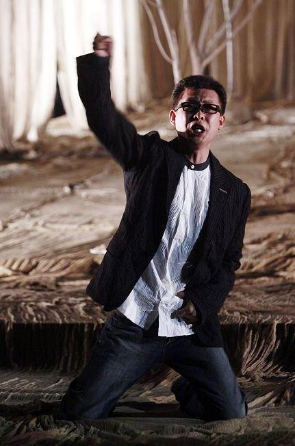

# ＜摇光＞愤青，与幸福无关

**政治，本来是通过权力为所有人谋求生存，发展和幸福的工具，在当下，却成为一些政治控男人们和少数女人们的春药，成为扯淡的话题，成为意淫的通道，成为扭曲人性的恶魔，尤为可悲。很多人每天的时光就消磨在这个上面。实乃个人之不幸，国家之不幸。**

 

# 愤青，与幸福无关

## 文/李根（中山大学）

 

前几天的一个上午和一个台湾政大来的博士生师兄侃了很多自己以前的想法认识什么的，那位师兄安静地听了一会，然后有所思地点点头说：“你是愤青。”我相信愤青这个词是中国大陆特有的，被大陆的同胞们戴上这顶帽子就很无语了，被自由世界来的人冠上这个头衔，有点瞬间崩溃的感觉。

和师兄聊得还是很愉快，但是其实我很讨厌所谓的愤青意见领袖之类的称谓，虽然自己就是专业学政治的，但是越来越讨厌听人们谈政治辩论政治还互相攻击起来。

铁血派五毛总是一副无视人权灭绝人性的样子，对内消灭权贵杀光自由主义分子淘汰弱势重回红色恐怖，对外今天统一台湾明天征服日本后天扫平美帝，恨不得把我党的名字也改成国家社会主义工人党，把国防部和中央军委变成党和政府。一副全天下自己是真英雄真男子汉的嘴脸。

丐帮五毛则是生活在底层愚昧无知的可怜民众，幻想着把这个国家拉回到毛泽东时代自己就能又当家做主成为高贵的劳动者，一边被全社会欺压凌辱过着猪狗不如的生活，一边却以可怜的文化素质和智商替党忠心耿耿地痛骂着反党反社会主义的坏分子们，殊不知他们的伟大光荣正确的主子们都在悄悄把自己的老婆孩子移民到美帝及其仆从过，仅1995年到2005年，就有118万党员领导干部同志们把自己的配偶子女送出国外加入它国国籍。

而贵族五毛们品位层次水平智商都是铁血和丐帮们遥不可及的，他们的观点也自然是多种多样通常能以理服人的，比较集中的火力点通常是民主的素质需要、民主的缺陷和危害，一个非工业国家必然经过一个痛苦的转型过程，集权国家的效率优势，以及民族自强大国崛起等爱国大义。这些观点都是很有道理并且被认可的，但是不要忽视他们的冷漠和选择性逃避。他们的前提，是认可了过去，现在和将来还 会有的对部分群体的牺牲。因为牺牲者不是他们，他们恰恰是最大的既得利益集团之一，因此他们的伟大理论本来是建立在残忍和自私的基础之上的，却自己为自己扛起了爱国理性的大旗。并且不要忽视，他们是最接近和最可能继承中国最高权力的人，也就是说，他们的想法很可能就是以后中国发展的道路。

还有一些儒左五毛们还念念不忘着自己三纲五常三妻四妾君臣父子的所谓中华文明美好时代，指望着生活在成群的小脚妻妾儿女跪在他一人的威权之中，也叫所谓的中华道统之中，最重视中华文化的韩国和台湾现在的西化程度无疑是对他们一记响亮的耳光。

还有些极为少见的马克思原教旨主义的浪漫派，坚信着马克思主义的异化理论和剩余价值说。认为全世界都在被机器和商品异化，全世界的劳工仍然遭受着剥削和压迫，这些人比较可敬地流淌着英雄的血液，他们通常会发展成国际大活动家大学者，或者成为切格瓦拉式的世界级大英雄兼国际红色恐怖分子。

而自称自由主义者的右棍们也实在都不怎么样。犬儒派右棍们显然已经在这个国家这个社会这个伪市场经济下受到了太多的痛苦，打击，压抑和伤害，已经对一切称之为主流正统的东西深恶痛绝，因此疯狂而幽默地开始解构身边的一切。“美帝来了我带路”的带路党有之，“王师北定中原日，家祭无忘告乃翁”的国粉者有之， 又有把汉族叫做支那猪，极端鄙视中华文化，认为劣等中国人应该去死，甚至提出满洲独立的人亦有之。

而愤青派的右棍们则是把自由主义当成一个针对现有体制的政治派别加以利用而已，对民主，自由，人权，宪政，法治完全是选择性接受，对平等，理性，宽容的自由主义精神完全漠视。暴力革命者披着民主的外衣，实则与铁血五毛们无异。事实上，如果中国真有实现民主政治的机会，对民主最大的威胁不是任何的五毛，就是这些打着民主旗号反民主的愤青右棍。历史上这些人也不是没有破坏过民主，如果注意过二十二年前的运动，就是这些暴徒激进派把持着，没有任何理性和妥协精神，不断地抬高谈判价格，甚至发生了抢劫部队武器，火烧坦克和装甲车，虐杀解放军官兵的事情，破坏了运动本初的非暴力不合作抗争，让许多同学与市民因此丧命，断送了中国民主化的机会，并且彻底地断送了中国当局在国内国际的形象，扭曲了中国改革的方向和道路，并且让中国的道德人心日益败坏，全民丧失了政治理想。

还有贵族派的自由主义右棍们，其冷漠和自私上升到了令人恐惧的理性和系统阶段，他们的自由主义更像是自我主义。他们嘲笑人类共同的政治理想和自我牺牲，不相信爱和仁义。认为最好的世界就是建立在人人自私的基础上。任何人之间相互隔离并且冷漠地活着，各行其是。甚至对慈善，社会保障，福利国家这些对弱势群体来说至关重要的东西都十分漠然，认为是在拖累整个社会的进化和发展。这些所谓的自由主义者十分聪明，但聪明之中，则是对不如他们一样优秀聪明的人深入骨髓的傲慢和鄙视、他们的理想国显然是一个原始人类式的社会。

政治，本来是通过权力为所有人谋求生存，发展和幸福的工具，在当下，却成为一些政治控男人们和少数女人们的春药，成为扯淡的话题，成为意淫的通道，成为扭曲人性的恶魔，尤为可悲。很多人每天的时光就消磨在这个上面。实乃个人之不幸，国家之不幸。有这个闲暇时间，学点东西，锻炼下身体，完善下自己，岂不更好。或实有政治理想道德热情个人志向者，与其拿着自己变态的观点和别人耗时间扯淡，不如向专业的前辈请教，不如自己读点书写点东西，不如和亲朋好友推心置腹地聊一聊，不如按自己的理想付诸行动看有没有问题。做愤青只是磕春药，自己觉得很兴奋，其实与幸福一点关系都没有。

希望政治控门少磕春药，或者远离政治这潭污水寻找个人幸福生活，或正确处理SNS，以关心联络为主，以了解学习为主，以朋友同学为主，需要哪个用哪个，不必要时除非无聊坚决不用。坚决避免无意义的政治辩论和无价值得感性宣泄。

 

（采编/责编：黄理罡）

 
