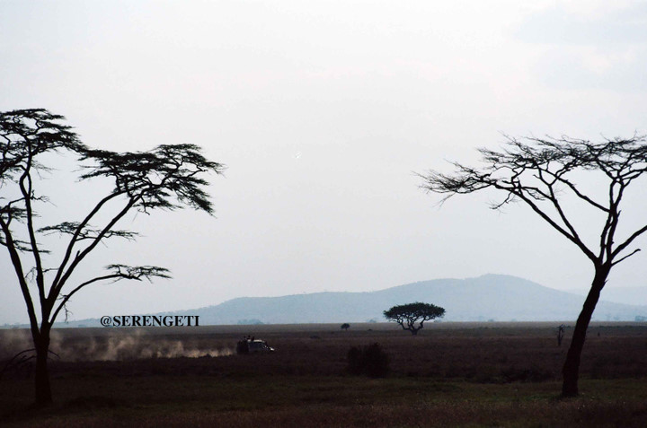

# ＜摇光＞慢一点

**人生苦短——这本是一句无论如何都不会错的话。错就错在不少人给真理续上了一个大大的狗尾，于是大言不惭摇头晃脑地宣称，“人生苦短，需及时享受”。 而这样的举动，就像那句被恶搞的“百搭”七言绝句“一枝红杏出墙来”一样，无论用在什么地方里、什么语境下，都被一概而论地套用上去，乍一看去，都顺畅无比。而此恰恰击中并利用了人本身的劣根性，所以这样的谬论才以讹传讹至此种地步。而真正应该被记住的是——人生苦短，何不慢慢享受过程。**  

# 慢一点

##  文/李东哲（吉林大学）

 

一想起沙漠中那个停下脚步等待灵魂的民族，总有说不出的感动。 

有科学家说，人类科技的发展速度，已经远远超过了人大脑的进化速度。这是科学的说法，同时也是一种没有情调的说法。换一种说法就是，我们已经走得太快了，以至于忘记了出发的理由。 

人生苦短——这本是一句无论如何都不会错的话。错就错在不少人给真理续上了一个大大的狗尾，于是大言不惭摇头晃脑地宣称，“人生苦短，需及时享受”。而这样的举动，就像那句被恶搞的“百搭”七言绝句“一枝红杏出墙来”一样，无论用在什么地方里、什么语境下，都被一概而论地套用上去，乍一看去，都顺畅无比。而此恰恰击中并利用了人本身的劣根性，所以这样的谬论才以讹传讹至此种地步。 

而真正应该被记住的是——人生苦短，何不慢慢享受过程。 

这似乎又回到了那个过程重要还是结果重要的烂俗的问题上来了。类似于这种先有鸡还是先有蛋的问题，我承认不能一概而论，需要见招拆招。但对于生命这样的话题来说，注重结果的答案无疑是愚蠢的，因为结果都是一样的，死亡。而过程，恰恰就是那个让你之所以为你的重要的区分。 

生活需要慢一点。一天的忙碌下来，晚上躺在自己的床上，盯着黑漆漆的天花板，你有没有想过，今天这一天，我有多少时间是属于我自己的？我有多少时间是为自己而活的？不要说你拼命地工作、认真地学习是为了自己，那充其量只是为了你的前途而已，功利的气息扑鼻而来；也不要说我一天看了多长时间的书，和多少人聊天讨论，那只是你把自己交给了作者和朋友的方式罢了，你依旧离你自己很远。现代社会的我们，都无比惧怕“无聊”，好像无聊二字一旦降临于自己头上，则是一种莫大的耻辱，除了带给自己的空虚寂寞之外，还会顺带带来旁人的冷言冷语。于是，你花尽所有气力去避免空虚，填补无聊，把自己安排得满满的，不给无聊任何一个机会，让自己有一种虚幻的充实感。但其实，只有在生活中片刻的无聊当中，在偶尔的发呆当中，你才和你自己贴得最近。好像世界都慢下来、时间都停下来一样，你可以听得见自己的呼吸，看得到自己的想法，听得到自己的内心。 

读书要慢一点。当我看着豆瓣标记的“读过”的书的数目是如此至少的时候，一种挫败感促使着我去疯狂地读书。这原本是好事，但是如果不慢一点，那么读书的目的也就仅仅为了读过而已，仅仅是为了一个“读过”的标签而已，仅仅是一个自己的标榜而已。但是当你慢下来，所谓的意义才慢慢显现。有句话说的好，生活，就是计划之外的全部。而意义同样也是如此——当你不去时时刻刻计较着意义之类的问题，而仅仅是慢慢地品读一本书、一页文、一行字的时候，意义则悄悄地浮出水面。 

旅行需要慢一点。当上车睡觉下车拍照的旅行团式旅游方式被我彻底排除掉之后，我又陷入了另外一个旅行的漩涡——每去一个地方，总是提前做好了完全的准备，功课翔实，笔记丰富。每天的行程都安排得满满的，一个接着一个，目不暇接，上气不接下气。当然，我这种由提前功课和超强的统筹策划出来的旅行，填满了我另类出游的虚荣感，满足了我一些特殊的爱好（比如收集书店），但是每当旅行告一段落，回头再想起这些日子，剩下的只有依稀几景，和大堆匆匆奔走的身影，以及那时的疲惫感。总觉得少了点什么。直到现在才知道，少的正是慢下来的能力与心态。旅游，其实游的不是那个地方，否则看照片足矣；游的应该是一种心情，一种心境上的变化。你可能遇到了让你震撼的景，这时你要做的不是匆匆拿起相机按下快门，而应是扪心仔细问一下自己，这些隐约的感动和动容都是从哪里来的。相机的快门只能留下一张照片，而心灵上的多重曝光，则可以供日后慢慢长路中细细咀嚼、品尝。而这需要的是慢下来，仅仅是慢一点。 

我妈在家开的那个小地方，名字就叫做“慢生活”，没多少盈利，仅供朋友们聚会、聊天、喝茶，没那么多功利的色彩，活的轻松自在。但为什么人总要等到了一定的年龄才能意识到一些东西呢？一些再简单不过的道理，非到我们就快要没有办法去实践的时候，才匆忙醒悟，捶胸顿足，后悔莫及。 

就活得慢一点，好让自己看清楚这个世界，也通过清晰的世界，看清楚自己。 

 

（采编自投稿邮箱；责编：麦静）

 
