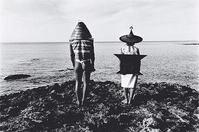

# ＜摇光＞我们对时代应负的责任——给未来的一封信

**面对这个时代，我们没有办法期望有人会听到我们的声音，即使变成文字，也没办法确定这些文字是否能够留存，更不奢望能够传播。然而，尤其是在这样的时代，我们更必须保证自己良心的纯洁。为此，我们必须不相信谎言，必须不撒谎，必须不保持沉默，这是一种最基本的义务。**  

# 我们对时代应负的责任

# ——给未来的一封信

## 文/张舸（清华大学）

 

今天在席间，陆遥遥师兄提到一个问题：倘若我们真的能够见到未来，到那时，我们应该如何面对作为这个时代的国民而犯下的罪行？我想，此中罪行可做两解，其一，作为个体，对自己的所作所为是有责任的；其二，作为集体的一员，由于对这个集体的行为保持了沉默和纵容，因而也是有责任的。对于前者，也许很多人都可以坚持自己是纯洁无暇的，然而对于后者，任何人都没有理由置身事外。不管这种罪行是否可以自外部追究，至少我们需要面对的是来自内心的责问。

我写下这段文字，是为了未来的人们，能够了解我们所处的这个时代，了解我们的处境以及我们在这种环境下做的事情。我无从知晓你们是否能够知道我们这个时代的真实情况，即使身在这个时代里的我们，都很难完全地理解时代的本质。从某种意义上说，这是一个控制与被控制的时代。当然，这种控制并不总是从肉体上表现出来的。当今的寡头政治，与20世纪中叶不同，并不倾向于直接从肉体上消灭它的敌人。相反地，他们利用所掌握的技术，限制敌人言论的传播。不单如此，他们还利用隐蔽的、往往是不引人注意的传播方式影响人们的观点。这包括在论坛或一些个公开的场所中有选择性的删除文字，雇用一些人员发表代表其自身组织利益的文字，在学校中对学生强制灌输意识形态，以及断章取义的散布信息甚至是编造虚假新闻。

必须承认的是，这种方式在很长一段时间里是成功的。比如，在一个又一个挑战自由的最底线的政策出现的时候，依然有人站出来为这些政策支持辩护。尤其是，即使是支持自由的人，都往往会被“稳定”的骗局羁绊。作为参照，也许你们还会记得，20世纪的上半叶，在德国流传的那个“背后一刀”神话。同时，他们还极力向我们证明，现在一切都在变得更好。与奥威尔的时代不同，现在的确有些东西正在变得更好。然而，有一些似乎变得更好的东西，实际上正是我们应得的。所谓的民主进程，在寡头们看来，只不过是一种恩赐——一种随时都可以收回的恩赐。而且，一些权利正在被悄无声息地收回，一些为了维护这些权利而说话的人，一些为了他人的权利，为了社会的正义说话的人，正在受到监禁和指控。和其他集权政体一样，这个政权也在为自己创造敌人并消灭他。这种手段和从前发生过的事情一模一样。都是用同样的方式，利用共同的敌人，集中群众的思维，从而把这种敌对性的情绪引向对自己的支持。尤其不得不说明的是，就在我在写下这段文字的互联网，每时每刻都在有信息在消失。而这些信息消失的唯一原因，仅仅是它们让当权者不喜欢。

正是因为这些，我们极不情愿地发现，从某个时间关节开始，继续保持沉默，就等同于犯罪。对这种情形的纵容，将使得我们在面对你们的时候，找不到任何理由来为自己辩护。面对这个时代，我们没有办法期望有人会听到我们的声音，即使变成文字，也没办法确定这些文字是否能够留存，更不奢望能够传播。然而，尤其是在这样的时代，我们更必须保证自己良心的纯洁。为此，我们必须不相信谎言，必须不撒谎，必须不保持沉默，这是一种最基本的义务。

而这种不保持沉默，几乎就是我们能够做到的一切。我们不能不承认，我们缺乏采取进一步行动的能力、勇气和决心。面对危险的时候，我们是不可能不动摇的，因此，即使我们希望保持良心的纯洁，实际上我们也没有办法做到。所以，即使我们不再保持沉默了，仍然无法推卸对这个时代的责任。在我们目击这一切的时候，我们没有采取任何措施去阻止，所以，正在发生的事情，是应当由我们每个人共同负责的。然而即使如此，我们仍然在尽最大的努力， 以尽量保全对自己良心的忠诚。至少，我们能够看穿一些谎言，能够不相信一些事情。惟有如此，我们才能在未来，面对你们的目光。

于是，我们愿意许下这样的誓言：

在任何时候，以自己的良心和人类的基本价值作为最高的准则；

即使面对威胁，也不改变自己的信仰；

为这个时代所发生的事情在良心上负责。

值得注意的是，这并不表明，我们能够在你们面前以此为自己辩护。毕竟，我们是这个时代的参与者和见证者。对此，我们从没有认为我们可以推卸责任。我们唯一的希望是，在你们回顾这段历史时，能够注意到我们，注意到我们的良知，并且对我们的行为给予公正的评价。同时，我们也希望，如果你们的时代仍然是如我们的时代一样，那么请你们也能同样保持良心的纯洁。

 

（采编：周冰 责编：黄理罡）

 
