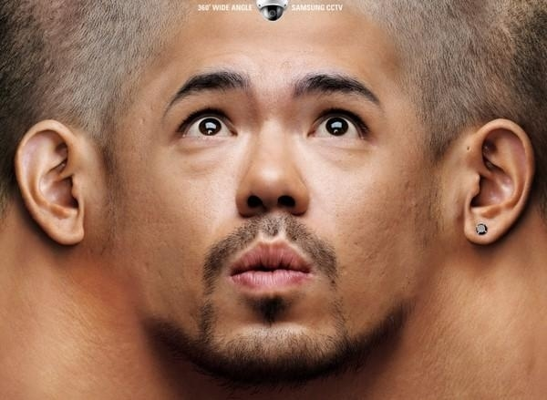
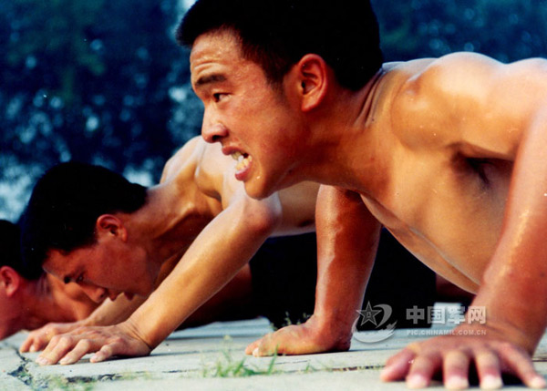

# ＜摇光＞我们时代的孤独

**在这个原子化的体制下，每个人都将为自己而战。把自己牢牢放入一张网，狠狠收紧，环环相扣，只有这样才是安全的。一切交易在私人间发生，一切公共理念只是筹码和攻伐的武器，既然公开的那些标准，那些守则只是空中楼阁，那为何不用更牢固的关系来网织自己呢？一切惩罚只来源于另外一张网上的另外一个族群，睁开眼睛寻求的帮助也只是那些熟悉的面孔。没有一个超乎所有网络的大道公理，有的只是另外的私，如缠丝般千丝万缕不绝捆扎着茫茫人群。**  

# 我们时代的孤独

## 文/陈博 （Chicago University）

 **领袖的孤独**

看建国大业的时候有一个镜头让我特别感慨，那是抗争胜利后毛泽东，邓小平，朱德，林彪等一众开国元勋一个个进入小房间开会时的场景，背景是特别轻快的音乐。那是导演执意要刻画的浪漫岁月么？在他们还团结如兄弟的时候，这群人一起出生入死，从东北打到长江。那个时代的群星荟萃不输于历史上任何一个纷争的时期，更可贵的是，中华历史上还有多少时代能成为这样的社会理念实验场？还能见证如此多任意挑出一个都足以改变民族历史的人汇聚在一个政治理念下团结拼搏？当世事沉静，万事步入轨道的一天到来时，韦伯论述中那群魅力型领袖只能成为追忆，也无怪乎今天多少人还会重新仰望回那个时代的璀璨星空。

但在建立新政的多年后，那位核心人物却一个个消灭了身边旧时的战友 ，只剩下最忠诚的一个人在身旁如履薄冰。造反派雄起，红卫兵解散，枪杆子起，笔杆子下，只在他一言之间，这种个人权力的极端性早以将他自己在生年之时符号化成一个政体的化身，以至于他的个人本身和维持整个社会运作的权威体系早已密不可分。

翻云覆手间，他应该最有安全感，但他缺乏的恐怕也最是安全感。一方面，他对自己绝对正确性的超然自信，早已经在多年来一次次被排挤后以绝对正确的姿态重回巅峰的经历中得到了强化。另一方面，六十年代起始当他环顾四周时却猛然发现身边人似乎不再按照自己设计的版图走了。从戎马之上走进中南海，他难免对陌生的世界有些惶恐。两者碰撞之下，只有再次用事实证明自己的正确。然而，不断传来的消息却是自己的政策在各地蔓延的饥荒中备受挑战。对自己的自信使他认定那一定是别人没有尽力落实自己的理念。如果把他铲除彭大将军的举动仅仅当成对权力的迷恋，那就恰恰忽略了他对自己信念本身的执着。在他看来，部下的异议是对自己的不理解，更是对真理的逆流。

很多人觉得他应该是一个高高在上的人，居高临下地拔除反对者。但我始终相信在这过程中，他感到的是最深切的无助和孤独，那一刻，他是霍布斯笔下孤立的人，他不能相信旁人会真正了解自己的想法，他也不能指望旧友。他人即地狱，他对战友情感可以万分漠然，因为他深信情感是最脆弱的东西，是易碎的，不可靠的。只有自己，只有自己的手段，利用一派反击另一派才能让自己稳坐超然，在周旋中主宰。甚至当他已经不指望体系内的精英时，会发出“再上井冈山”的号召，走向群众。群众是一个模糊的概念，却又有着更加容易支配的特性，比起一个个难以控制还会抗争的旧友更加符合心意。他只有在群众身上才能找到安全感，摆脱那种无助。

这并不和绝对的自信矛盾——在对自己正确性极端自信的同时，他失去了对任何人的信任。那一刻，当他谨慎地打量四周时，会骤然发现昏黄的灯光下似乎只有自己一个人在践行着真理。那一刻他是一个彻底孤独的人。 

那是领袖的孤独。他始终无法迈出那一步去承认别人的正确，去聆听别人的想法，去实事求是用实践验证猜想。我们无法改变他的性格，也无法防止未来再次出现一个这样孤傲自信的领导。甚至，这本身并不是缺点。真正所遗憾的是，从头至尾这个体制内都缺乏一个开国元勋间互相接受的规则，一个做决定的规则。无论是多数原则，还是完善的议事表决程序，从来都没有被真正施行。失去了这个公共规则，那一切政策的用废都取决于个人的权威。一切反对和赞成都将成为区分敌人和朋友的标准。

梁漱溟曾经概括国人的特点，“中国人做事情要不然就非常积极，事无巨细皆一手操办，要不然，一旦被别人批评否定了，就热情全无，两手一摊不再管。”究其原因，这是因为没有把“私”和“公”分开。 私和公的区别绝不仅仅只是共有和私有那么简单。公共领域区别于私人空间的价值更在于人们承认一套各方认同的公共准则，不把任何的批评意见当作是对自己价值的否定，在意见和为人之间建立起防火墙。简言之，就是对理不对人。

但明显，在一个人治的体制下，对错必然关乎个人本身。一个权威型领袖的权力就是牢牢系在他的对错之上，以至于任何指出他错误的意见都将被视作对他个人的攻击。在此前提下，领袖间的每一次对话都锋芒暗藏，每一招都可以事关生死。即使李，邓，叶，朱，彭没有意识到，主席也必心如明镜。他并没有准备把身上的权威过继给一个制度，像美国开国国父们所制定的宪法一般；相反，他走向了另外一条路，一条把一切权力斗争，意见冲突私化的道路。那一刻起，一切都化为了人与人之间的战斗。

**人的孤独**

我们的生命中或多或少都经历过那种孤独。那种不被理解，也不能理解他人的孤独。一个人可以很沉默，可以不主动，但当他坐在人群中时即使不说话，也可以理解周围人的言谈，周围人的喜怒哀乐，从而舒适自如。但到了一个绝望而孤立的境界时，他会为这个世界的不可理解而感到惊异进而痛苦。他和周围人的纽带彻底失去了。是什么能让人面临这种排山倒海的孤寂？

恶意和压迫是其中之一，而且是那种无法明白，没有根源的恶意。刀客杨家所经历的大概就是这种压迫，他肯定无法理解，为什么人与人之间可以有这样的隔阂，这样的鸿沟，即使自己用所有的善意和逻辑都无法跨越。他面对的是被异化的人，在制服下的变异体，操着公权力的声威凌驾于他手下管辖的对象之上。公权力本应该是维护公共空间和公共规则的力量，但公权力可以被私人化，从而赋予一个人自我膨胀的意识。今天，无论是欺凌人的牢头，还是给杨家脸色看的警察，谁会相信他们在日常生活中不会对自己的家人温情脉脉，客客气气呢？但一旦被异化的公权所俘获时，即使那警察本身对杨家没有个人恩怨，也早已不再是平时的自己。

究其根本，因为他自己也是孤独的人，他没有认识到他所处理的对像本身也是一个活生生的人，他除了自己的权力没法获得安全感，获得自我肯定的价值。打量人的时候，他会暗自分类，哪些是自己之下可以控制的，哪些是需要迎合的。当一个社会中人不能以作为人本身立足，不能因所思所想而获得承认，而必须仰借种种外物方能获得别人乃至自己的肯定时，每个人本质上都是孤立的。

一个备受承认的公义准则是公共社会的基础，而在这个准则规范下的空间里人们相互活动，平等交往，建立起合法的公共空间。小至社团，大至国家，人可以因远方地震的伤亡而自发地悲切，可以因不平不公而愤慨，更可以有行动的自由。如果存在这样的公共空间，人们听到另一起牢狱不正常死亡时将不会仅仅带着嘲讽的眼光讪笑着，只在电脑前以恶搞的形式来默默奠基莫名死去的国人。恶搞本身是一种关注，而今天人们相信围观就是力量，固然没错。但这本身就已经是一种退而求其次，是一种弗洛伊德式的目标受阻后的压抑。一个完善的公共空间中，人们会发出质询的呼声，人们会追问，而不是深切的认为追问只是徒劳。公检法将成为公共空间中的执行者，因为他们有公信力，而不只是某人某组织的私器。人心的随意性往往最让人恐惧，当你发现手上握有伤害你，定你罪权力的人却不遵循公共规则而只听命于私人权力，一时人心，谁又能感到安全呢？谁又能真正和谐地生活呢？所以天下治世皆以公共规则为基本——古人以圣贤之言束缚人心，西人以约法牵制人心，纳粹以恐惧压制人心，都能为社会带来稳定，但长久与否，高下立判。

在智利的时候，我曾经无所事事地在一个阳光和煦的下午坐在人来人往的广场上。一个老头，西装笔挺，面目慈祥，就这样无缘无故地来我旁边坐下，好奇地问我来自哪里。和他对话足足有一个小时之久，这期间，他谈自己的身世，谈智利的产业发展，谈对中国的了解。这才知道他曾经是皮诺切特时期驻德国大使的工作人员，见多识广，眼光独特。我这里所注重的不是他所谈的种种话题，而是在我离开后突然想到的，为什么他会坦然地来到我身边对话，而我第一个反应是无缘无故的惊恐。我才领悟到对他来说广场本身就是一个公共空间的实体表现，一个公民自由交谈，议论的地方，从古希腊起就是如此。坐下就聊天，听听你的意见，没什么奇怪的。以后人生也许会有交集，也许会从此不再相见，但又有什么关系呢？反观中国历史，似乎我们的酒馆茶楼也有类似的特性，不过却常有“莫谈国事”四字高悬顶上。这四字一出，顿时噤若寒蝉。

**公民的孤独**

前面谈到了公共准则作为世道人心的标准。而公共准则的建立又正是为了维护一个公共空间，让公民有共同的经验体验，让公民在相互交流间观点碰撞。而扯淡的“莫谈国事”则意在扑灭这种空间，将人与人之间最直接的纽带割裂。或者，把这种经验交换称呼为政治，赋予人人胆寒的色彩，让青年不敢碰，不想碰，没有动力去碰。政治不是非得污黑墨染的，只有在公共守则丧失的情况下政治才演变为人与人之间的相互倾轧。那已经不是公共政治了，而是私人关系的放大，私人仇恨的加剧。真正的政治应该是对公共空间的塑造，利用公共规则调节人性中恶的一面，压制仇人间意图治对方于万劫不复的倾向，并把意见的纷争去私人化。

但今天我们看到的却是严重的异政治化。人和人之间的纽带被弱化，人被原子化，每个公民被塑造成一个孤立的人。以青年来说，只需要学好功课，找好工作就足够了，何必要批判性思维呢？毕竟思想交换都显得那么苍白。何必要关心远方的大事？发发牢骚就可以了，毕竟，那是很远的风景。你只是你自己，做好你自己。你可以打打游戏，连连DOTA，WOW，尽情娱乐，但用WOW为背景谈国事就莫怪不客气了。天下兴亡，匹夫有责早已明讲实弃。课本上的社会学，哲学理论看看就好，反正也从来不会用到，从来不需要真的去思考。在这孤立的生活中，失去的是对社会的关怀和参与的责任，失去的是超乎于生存本身的对更高精神层面追求的热爱。今天热门的模拟联合国创立本意正是为了提升公民的参与意识，但也完全可以异化为一道镀金的程序，从一个公民公共空间活动的基本培训变为私人领域交换的筹码。

又或者，最简单明了的方式是把你放进流水线中，成为机器的一部分。让你在所有的时间内受着监控，精确操作，却又不让你团结组成自发的工会。也无怪乎在这种状态下生存的人会和社会有深深的割裂感。万念俱灰之下，一跳了之。

在这个原子化的体制下，每个人都将为自己而战。把自己牢牢放入一张网，狠狠收紧，环环相扣，只有这样才是安全的。一切交易在私人间发生，一切公共理念只是筹码和攻伐的武器，既然公开的那些标准，那些守则只是空中楼阁，那为何不用更牢固的关系来网织自己呢？一切惩罚只来源于另外一张网上的另外一个族群，睁开眼睛寻求的帮助也只是那些熟悉的面孔。没有一个超乎所有网络的大道公理，有的只是另外的私，如缠丝般千丝万缕不绝捆扎着茫茫人群。

先哲的正确在于此处，千辛万苦建立起了天下公义，在束缚人心的同时也创造了一个公共理念和标准，让人摆脱那彻底的孤独，而有所适从。这大概也是曹操不受正统夫子欢迎的原因吧，他以马基维埃里的理念在争霸天下，而贬低纲常伦理。

一个成熟的社会，在期待英雄和明星的同时，也会毫不犹豫根据法律和规则束缚他们。就像从我身边黑人社区走出的奥巴马可以被热情的大众称为美国的希望，也可以在国会踉踉跄跄，不得不对反对的声音毕恭毕敬。

网络正在努力成为着这个公共空间。每一次分享，每一次发帖都是个人经验的相互分享，个人意见的相互碰撞。网络从一开始匿名论坛的流行到今天实名网站如校内等的流行都印证了人们对公共空间的渴求。人们渴望以一个人本身的姿态去认识其他人，去交流（或者去交往~）。在美国的facebook上几乎没有文章分享这种现象，但在校内却有大量给人以启迪的帖子在疯传，下面是一长串的辩论。在这可喜的现象背后是否也反映了在现实中这种公共空间的缺乏呢？但无论网络力量如何，终究只是网络。权威可以高高在上，不理不睬，可以异地升迁，明降暗升，还可以主动反击，五毛漫天，破坏这个公共空间的平等对话性，让人还要猜度对方究竟是拿钱说话还是用脑说话。

在这样人人孤独的体制下，每个人的都似乎都很安全，但又人人自危，权力转化为了人与人间网格强度和你所在网格高度的衡量。诚如那首最简洁的现代诗所言，通篇只有一个网字。公共理念和准则的缺乏，就是人只相信有过直接相关经验的人，造就了人与人之间的相互不信任，社会的凝聚力丧失，乃至参与热情的消失。扪心自问，当美国还有宪法作为人人笃信的社会公义基础时，我们有什么呢？共产主义？金权？利益？民族主义？共同的敌人？长期缺乏一个公共守则毕竟不是长远之计，也使改革者万分担忧权威抽离后的奔溃。如果说改革为何迟迟不能动身，那是因为威权政治转向公共政治的困境必须要先有解，而多年的经营已经把公民社会这个第三种力量压制殆尽。放眼身后，谁来填补威权退却后留出的空间？

**残稿**

他站在跷跷板上，寻思着向前走去。但他刚一向前迈出一步，整个板的平衡就已经失去了。他哆哆嗦嗦地退了回来，不再言语，寻思如果这回身后有另一个人站着帮助保持平衡，将是多么美好的事情——他不就可以在板上来去自如，游刃有余了么。但谨慎地想了下，他心下已自明白，“这如果又多出一个人，我最后要去哪里呆着呢？”于是，他就孤独地站在那里，很久很久，一动不敢动。

 

（采编：尹桑 责编：陈轩）

 
