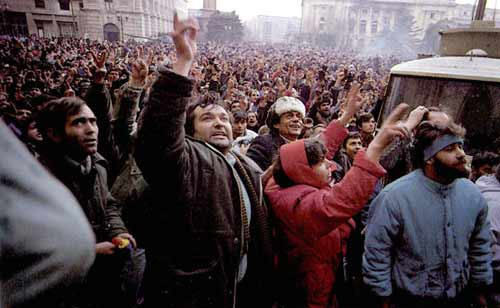

# ＜摇光＞我们生于此地，又能逃亡何方

**但即使作为一个普世价值理念者，我也不愿意看到罗马尼亚那样的革命。用不公正来对待不公正的人我们得到的依旧是不公正。同样，以太苛刻的眼光去要求这个体制下的国民也是不公平的。我想在这个体制下，我们不应看到他们没做什么，而应看到他们做了什么。**  

# 我们生于此地，又能逃亡何方

## 文/孙晓辉 （北京电影学院）

 

哪里有齐奥塞斯库，哪里就是异乡。

——赫塔•米勒

 1989年12月22日布加勒斯特12点8分，罗马尼亚独裁者，中国人民的老朋友齐奥塞斯库从党中央大厦出逃的时刻，三天之后便被枪决。罗马尼亚的民主时代以最不民主的方式开始了。 

 而当时的我纵使偶然看到了这个新闻也不会理解它的含义，这个时刻的世界对于刚出生不久的我而言不过只是一片的混沌。不过多年以后的今天，我同样无法理解这个世界。而在今天，我所处的国度就像1989年的罗马尼亚，只有愤怒与仇恨。 爸爸曾经问我，你想出国吗，我毫不犹豫的回答，我不想，我想一直生活在中国。而我这样的回答的原因并非是因为我爱这个国家，而是因为我被这个国家绑架了。我没有选择的生在了这个国家，我的生活经历与行为方式是带有这个国家特性，在这里，我能作为这种生活方式的主体存在。而出国，民主也好，富有也罢，我总归属于别国的他者，一切充满着陌生感。每个人和自己的国家就像是老夫老妻的关系，也许你不再爱他（她），但当你离开他（她）的时候依然会失去很多。所以，我不爱国，但我依赖他。民族主义往往是体制对付它的反抗者的最好武器，而极端民族主义正好可以满足一无所成者的道德神圣感，通过所谓的爱国主义圣战他们能够完成自己不堪生活中的英雄梦想。在民族主义者眼中，事情没有对错之分，只有你我之分。所以我恐惧民族主义，恐惧这个世界任何一个国家的民族主义。所以我会和左派辩论，甚至可以和极左派辩论，但我不愿与民族主义者辩论。 但即使作为一个普世价值理念者，我也不愿意看到罗马尼亚那样的革命。用不公正来对待不公正的人我们得到的依旧是不公正。同样，以太苛刻的眼光去要求这个体制下的国民也是不公平的。我想在这个体制下，我们不应看到他们没做什么，而应看到他们做了什么。即使他们不曾救人，而是去所谓的救狗，这一行为起码也是人道主义的，会去救狗的人至少不会去残害自己的同胞。相比体制外的变革者，我更尊敬那些体制内与虎谋皮的人，匈牙利革命时的伊姆雷，捷克斯洛伐克布拉格之春时的杜布切克，他们冒着失去权力的风险去做他们认为对得起良知的事，尽管他们正是这个体制的顶端。体制人能够原意发出这个体制内不同的声音，我觉得这就足够了。 每一个在这个世界上恪尽职责的扮演自己的人都是值得敬畏的。敢于反抗体制的人值得尊敬的，而沉默不语的人也是值得理解的。就如同当年昆德拉与哈维尔之间的差异，哈维尔的行动主义固然值得去称颂，但昆德拉的消极的自由主义也是对个人而言无可奈何的选择。我并不相信体制能够改变很多，人面临的最基本问题，比如生死，在任何体制下都同样存在。每个体制都是卡夫卡笔下的城堡，所做的就是将人异化。但虽然如此，我仍相信存在某种走向合理性的趋势，而这，正需要我们的努力。 

 在这个势力严重不对等的国度，民主派必须借力于充满仇恨的不满者才能与体制的拥趸对抗，但这更像是饮鸩止渴，愤怒本身的力量超过了普世的价值的理念，仇恨本身掩盖了理智。而即使这样，成功了也许得到的依旧是仇恨的延续。在齐奥塞斯库时代受到折磨的女诗人在齐奥塞斯库倒台后的大街下偶遇了当时折磨自己的政府人员这样回忆道：他看见我吓了一跳，想在排队的人群中藏起来，这时我才认出他来。我走过去对他说：你瞧，现在轮到你怕我了，就像当年我怕你一样，这又有什么意义呢？ 南方周末在某年新年献词中的标题这样写到：我们从未放弃，因为我们爱的深沉。我不确定所有人都对这个国家爱得深沉，但我确定的是在这个国家体制内外无数有良知的人从未放弃。  

（采自投稿邮箱 责编：项栋梁）

 
