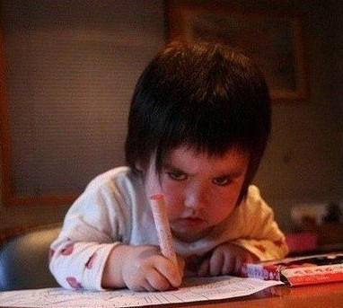
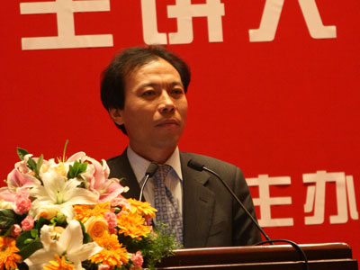

# ＜摇光＞我们究竟在害怕什么

**学校更像是一个技校，每个学生只是为了学习一项生存的技能，没有任何人文气息可言，纵然有再多花草也是死气沉沉。这里盛产技术工人，只关心自己的技术工人。没有完全意义上的大学生，我们可能对社会的经济建设有所推动，但对于整个社会进步的核心内容，精神文明和纯粹的精神价值的尊敬不会有任何改善，甚至会有负面影响。极易被煽动的缺乏思考习惯的人才是社会最大的不稳定因素。**  

# 我们究竟在害怕什么

## 文/王亚光（厦门理工学院）

 

每当我在图书馆心无旁骛地打算认真看一会线代或者货币银行什么的时候，总会有小小的迫切的希望看看其他什么书和写些东西。因此我的学习是极其低效的。对于专业和一切公式化的东西打不起精神，母亲千叮咛万嘱咐让我学好专业课是支持我上课机械化睁眼听课的核心动力。

显然，我并不喜欢这个专业，对于金融和投资没有原始的欲望。而我也很想知道有多少人是因为喜欢某件事而去选择自己未来四年或者四十年的去向。换个问法，我们当中有多少人在进入大学专业学习之前就知道他是干什么的，就我接触到的人们九成以上选择专业带有极高的功利色彩，即在分数允许的情况下首先考虑日后的收入和就业情况，如果一切尽如人意，代价则是牺牲自己的意愿取向。来到一个陌生的城市、学校和一个并不感兴趣的专业，有可能在唏嘘和蹉跎里度过大半生。

在我跟同学质疑这些的时候，他们一副深谙世事的表情，冷冷地吐出几个字：这很正常啊。我不知这样的正常到底正常不正常。我必须可悲地承认我也是怀着功利的心态选择了现在的专业，本来打算抱着不到长城非好汉的心态，跪着也要走完自己选择的路，后来慢慢发现这与性格和处事原则有着本质的冲突，其中究竟不作赘述，内因如此。加之高数，线代，概率，会计这些将来未来的课程都在我看不见的地方鄙视的嘲笑着我……生活一日日愈发艰难。至使我不得不思考一年前的草率决定其中的利弊。

我相信一定还有和我一样无奈的同学并且绝不在少数。

那么，我们究竟在害怕什么？

悲观地设想一下，假如我一声不响地读完了专业，顺利进入一家证券公司，没有家庭背景的我从一个业务员做起，而我不愿意为了自己的绩效工资去欺骗意外认识的大学生开通股市账户，也不愿意笑脸逢迎那些土鳖一样的暴发户。我的境况一天不如一天，最后生活所迫，我也变成了我曾经嗤之以鼻的人们一样，狗一样的活着。

或许没有这么糟，或者比这更糟。

无疑我怕的是自己没有勇气面对物质也许并没有那么丰富的未来，纯粹的精神依赖要有但不足以维持生命，况且人的社会属性会有意无意的让你对更多人更好的生活产生欣羡。这种对假想和未知的恐惧可以称作懦弱，所以大多数人选择了妥协顺从。

就我所在的这个本科二批的学校来看，对专业的功利性选择还有另一个更深远的不利影响。被扼杀了自己的兴趣和意愿之后，专业开始被人们自己喜欢，会有强大的心理暗示，自己是喜欢这一切的——自己的现在与未来，毕竟前面看起来那么光明。于是，我们开始只关心自己，关心自己毕业可以拿多少钱，多久可以买得起房子，拜金成风。我曾经听到一个女生理想的择偶标准是月薪百万，你没听错，是月薪百万！且不说这个女生本身是不是温柔善良，美丽大方，这种思想本身就是极其可怕的金钱至上的价值观。学校更像是一个技校，每个学生只是为了学习一项生存的技能，没有任何人文气息可言，纵然有再多花草也是死气沉沉。这里盛产技术工人，只关心自己的技术工人。没有完全意义上的大学生，我们可能对社会的经济建设有所推动，但对于整个社会进步的核心内容，精神文明和纯粹的精神价值的尊敬不会有任何改善，甚至会有负面影响。极易被煽动的缺乏思考习惯的人才是社会最大的不稳定因素。

这样的学校，也绝不在少数。

“在欧洲国家，任何一个城镇的居民最引以为豪的是曾经有某某著名的哲学家，艺术家，学者在那里生活过，或者居住过一段时间，他们必会精心保存其故居，挂上牌子注明某某何时在此居住。这类人在社会中是有极高的人文价值和影响的，他们在精神世界中起到的作用深入人心，这使得整个西方世界更注重社会价值。”（《安静》周国平）

前一阵红遍全国的相亲节目《非诚勿扰》中来自美国的优质男安然，他的癫狂和对于一个人价值的认同着实让国人一怔，可以说这是当着一个华装丽服的妇人的面一记响亮的耳光。一个人的价值观在他的眼里远比你的身材脸蛋重要。

退一万步说，你可以选择不去对社会负责，至少可以选择对自己负责，尊重自己的意愿取向，尊重自己的兴趣、爱好，大学里有很多各式各样的讲座，其中不乏一些表面励志实则误人子弟害人不浅的垃圾言论，诸如告诉你如何克服职场的不适应溜须拍马做到上通下达如鱼得水。如何克服自己羞赧的性格变成一个见风使舵的活死人。大多数人都选择对这些话听之信之，以至于他们在明晃晃的礼堂里大放厥词流毒于世。

举例来说前一阵参加了新生的交流会，我很庆幸我在入学的时候没有被这么一个SB的辅导员震天响的臭屁炸到。一个新生在问到自己性格内向会不会对以后有什么不利影响的时候我们的辅导员当即说道，你应该改变自己的性格，多与人交流，参加学生会，参加社团去锻炼自己让自己变得开朗在以后的就业中占得先机。是不是也有人觉得这话本身没有问题，发现自己的不足要及时改正这样才能让自己变得优秀。

那么这样真的对吗？中国人的补短到底怎样权衡利弊。你努力补短的同时有没有想过你的短处就是一些人的长处？拿性格来说你天生内敛腼腆，而有些人则开朗大方，你努力克服的正是他们所拥有的，而你就算再怎么努力补“短”，还是相对的短，别人的长却岿然不动。你在改变性格的同时也会蝴蝶效应般地改变很多你内在的东西，这样，你还是你吗？为什么要用自己不擅长的去跟别人拿手的比呢？有效发挥自己的长处比你费尽心思去改变自己性价比高得多。

在面对抉择的时候，同样的问题便转化为是否尊重自己的意愿取向。你明明敏感保守，对文字天生的欲罢不能，就因为汉语言文学出路渺茫就转头去学打不起一点精神的金融？你明明喜欢财经，投资，商业头脑好到不行就因为父亲在气象局有关系就转学了什么都不知道的气象？

那些因热爱而选择的人们是令人尊敬的，很多人不屑地叫他们艺术生。在这个层面上，艺术生才是人，屈从于其他因素的我们不知道是个什么东西……

我们究竟在怕什么？

怕什么，也只有我们知道吧。

是我们怕还是别人怕？辅导员让你考研可能只是为了自己的职称和晋升，学校开某个专业可能只是为了扩招和收钱，昨天说爱你的家伙可能只是要你的身体。

去追求你认为有价值的，用你的方式活下去，哪怕这样的物质前景不如别人的丰满，一个人真正的富有是强大的精神世界，流传于世的从来都是精神和人文的财富。尊重自己，成为自己，然后活下去！

 

（采编自投稿邮箱 责编：麦静）

 
