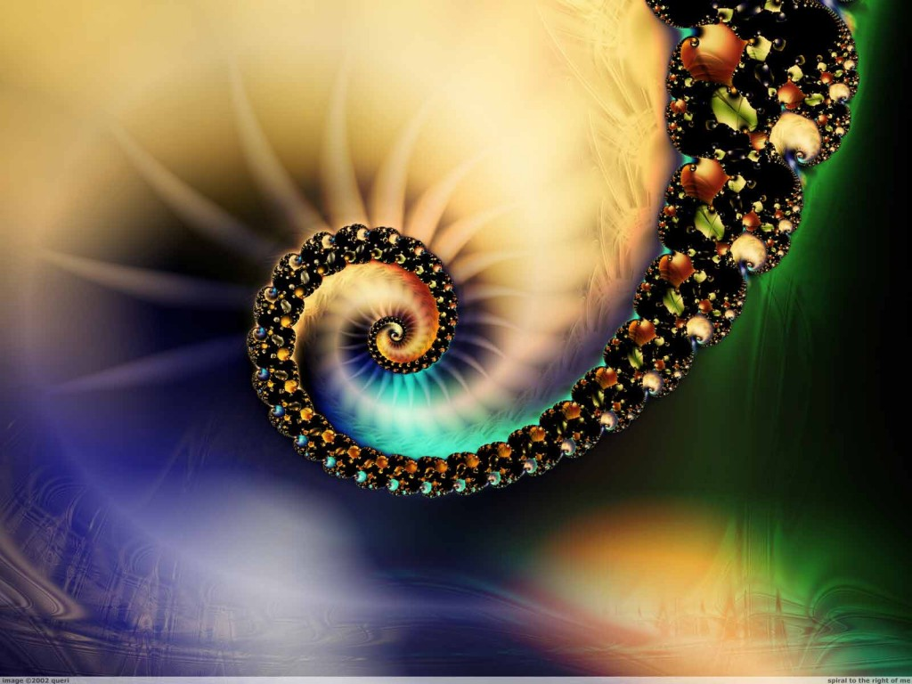

# ＜摇光＞我们都是三角函数

**他是一位特别的sin君，如果他是一位先知，如果他能在身处制高点的畅快中突然莫名地感到一股死亡般的静寂，如果他能感到那静寂中有一股力量正在默默地等待时机，等着把他拽向万劫不复的深渊，那如死神镰刀般闪着诡秘银光的深渊……**  

# 我们都是三角函数

## 文 / 周雨霏（中国人民大学）

 “其实任何人，在经历时，都不会知道自己正在经历一生中最幸福的时刻。也许一些人在某些欣喜若狂的时刻能够真诚地想到说，‘此刻’他们正在经历一生中那个金色的时刻，但他们依然会相信，他们将在以后经历比这还要美好和幸福的时刻。因为特别是在青年时期，就像没人一边想着今后会更糟糕，一边来继续他们的生活那样，如果一个人幸福到能够幻想自己正在经历一生中最幸福的时刻，那么他也会乐观到认为将来也会很美好。” 

——奥尔罕·帕慕克《纯真博物馆》

然而最后一句是我所不认同的。“如果一个人幸福到能够幻想自己正在经历一生中最幸福的时刻”，他不会“乐观到认为将来也会很美好”。如果他是真的斩钉截铁地意识到自己此时此刻就是最幸福的（并且如果他的第六感通常准到爆的话），那么这幸福所带来的，就不会是“乐观”，而是彻底的绝望。

假如有一位sin君，假如他的预期寿命只有2π岁（三角函数也是要死的啊）。他来到他人生的π/2岁时，即来到了他人生的巅峰。他像处在一趟过山车的最高点，整个游乐园的景色尽收眼底。天朗气清，风吹过他的衣领和发梢；阳光灿烂，甚至看得到上帝就坐在邻座。抬头伸手可以摸到天，低头可以看到cos君还过着他那每况愈下默默挣扎的苦逼日子——他怎能不感叹：“啊，我真是太幸福了。”

然而作为一只三角函数，而不是画三角函数的人，sin君不会意识到，这个时刻就是他的“最”。他能意识到的只是“真”和“太”。他甚至可能一瞬间以为自己其实是tan君，以为今后的路也是一路飙升的。所谓“前途无量”。

可是如果，他是一位特别的sin君，如果他是一位先知，如果他能在身处制高点的畅快中突然莫名地感到一股死亡般的静寂，如果他能感到那静寂中有一股力量正在默默地等待时机，等着把他拽向万劫不复的深渊，那如死神镰刀般闪着诡秘银光的深渊——那么他才有可能会意识到，这一刻正是他一生中，最幸福的时刻。所谓最幸福的时刻，就是从今往后都没有了。

然而正是这对“最幸福的时刻”的觉悟，毁了这“最幸福的时刻”。又有谁能同时体会着最深的幸福与最深的绝望呢？所以啊，人生中“最幸福的时刻”，其实是不存在的。若是发生过了，也只能是在回忆里想起——“那年我……唉那会儿真是……现在真是……”；若是正在发生，你也体会不到——“让我们期待明天会更好！”；若是体会到了——好吧，这你才意识到你其实是在打乒乓球，击球越漂亮，球飞得越远——而对方选手却悄悄逃走了，他不会再帮你把球击回来了。你一个人站在原地发呆。

有一天有人跟我说，“你正处在你最美的年纪”。后来我才意识到，这其实是一句无心的诅咒。

“那一天我21岁，在我一生的黄金时代，我有好多奢望。我想爱，想吃，还想在一瞬间变成天上半明半暗的云。后来我才知道，生活就是个缓慢受锤的过程，人一天天老下去，奢望也一天天消失，最后变得像挨了锤的老牛一样。”

那一年刘和珍君22岁，出门前她把看了一半的小说折了一个角，放在床上，想：回来再看。床上还放着隔壁班男生写给她的一封信，她瞄了一眼信封，想：回来再看。然后她就出门去了，迈向她的黄金时代。

那一年我19岁。还有两科就考完期末考试了。还有5天就可以和男友相见。还有5斤就可以减到标准体重。暑假里，会有云南，会有德国和奥地利；暑假之后，会有台湾和国立清华。我是多么幸福。我还有好多奢望，想爱，想吃，想学知识，想云游四方。我们真是太幸福了，幸福到我愿意相信属于我们自己的黄金时代正在降临，相信一个更加美好、更加幸福的未来在前方等待着我们。

幸福到相信我们都是tan君。

（采编：徐超；责编：黄理罡）

 
