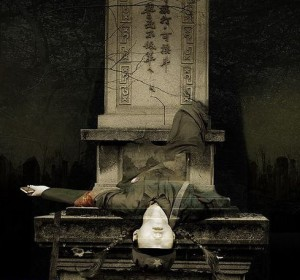

# ＜摇光＞我想躺在桌子上

**摘要：现在意义也有了，这么一个技巧高超，意义深远的镜头，也许真能成为点睛之笔，可在拍的时候，我有想过这么做会有什么意义吗？没有。我有想过会用怎样的剪辑手法去处理吗？也没有。当时当地，当这个躺上桌子的动作发生的时候，我只是有一个单纯的躺上去的冲动。**

 

# ****我想躺在桌子上

## 文/ 刘项（香港城市大学）

 

今天在拍摄像的作业，我和组员打算拍一下本宿舍的设施，拍到交谊室的大桌子的时候，我突然来了一种想躺上去的冲动。于是我就躺上去了，两位组员都是女生，于是笑声、惊叹声四起：

“哈哈”、“哎呦，你这是干吗？”、“躺在这有什么意义？”

不过幸亏两位都是学妹，既挪不动我，也得给学长些许面子，于是伊s勉为其难的拍了我粗体横陈的镜头，若这两位组员是学姐，她们多半得严词厉色的嚷嚷开了。

好了，现在有了我横躺在桌子上的镜头了，接着该怎么着？我觉得可以再用同样的角度拍一遍，但这次只有桌子没有我。然后剪辑的时候让有我和没有我的镜头交替出现，这个效果就出来了。

好了，有效果了，那意义在哪里？那就赋予些意义吧，一个人，躺在桌子上，这可以成为动物保护主义者的宣言，这个镜头能告诉人们躺在桌上待人宰割并不是一件舒服的事情；这可以是给事物赋予历史的手段，通过无人和有人的镜头交错，展现一个桌子被人使用的痕迹。

现在意义也有了，这么一个技巧高超，意义深远的镜头，也许真能成为点睛之笔，可在拍的时候，我有想过这么做会有什么意义吗？没有。我有想过会用怎样的剪辑手法去处理吗？也没有。当时当地，当这个躺上桌子的动作发生的时候，我只是有一个单纯的躺上去的冲动。

一个单纯的冲动，能成就很多杰作。作家阎连科的新作《四书》，讲的是饥荒时候的故事，因为内容敏感，在大陆被禁，却能在香港发售。这书关于饥荒时代的描写，既是它在大陆被禁的原因，也是它在香港的卖点。可阎连科本人，却对香港只关注这本书的敏感部分表现出了不屑，他大概说“饥荒和政治性的内容，根本不是我想写的。”我是在单向街书店的一次沙龙中听到了他的这番评价，他又介绍了《四书》这本小说的创作过程，这个过程其实也是一次“躺到桌子上的过程。”

《四书》这本小说里面的知识分子角色都被关在了类似干校之类的营地里，管着他们的则是孩子，这些知识分子为了赢得足够的“红花”而离开这个营地，最后都变得对这个孩子言听计从。而这个孩子为了得到“上面”的嘉奖，又跟着“上面”的指示做事。这样的情节，充满了明显的影射，方方面面都可以政治性的解，可是阎连科的创作动机，却与那些“反思”、“历史”之类的宏大命题无关。

阎连科说他当年只是突发奇想，他突然想，如果一群成年人都听一个小孩的话会如何。这也是个奇怪、无聊、没意义的想法，但这个想法却一直存在阎连科脑海里，让他一直不能释怀。直到近年，阎连科回顾起了那段历史，这才正好把他的古怪奇想和具体内容结合起来。文革时期的知识分子为了生存对愚蠢幼稚的小孩低三下四，这正好就给阎连科的奇怪想象赋予了些许合理性。

以上的创造过程，其实是先有原始冲动再去赋予意义的，其实这与惯常的思维是正好相反的。我们上大学的专业是为了去行使一样职能，我们学习的技巧是针对某个问题而设计的解决技巧，我们设计的产品，是为了达到某个目的或者填补某个市场空白而设计的产品，这样先有目的再去行动的思维，是不是错的？

至少，很多伟大的产品，都不是这样产生的。在看《社交网络》这部电影的时候，其中Mark Zuckerberg和他的导师朋友Napster创始人Sean Parker两个人对发展中的Facebook的态度给我留下了很深的印象。两个人都觉得发展中的Facebook奖成为一项伟大的革命，没有人会知道Facebook会发展程什么样，所以开始先不要去做发广告这样的事情。与两人相比，Zuckerberg平庸的合伙人朋友则只知道像无头苍蝇一样的去找赞助，推销广告。Zuckerberg和Parker之所以是天才，就是因为他们知道自己在做something cool something revilutionary,他们的创业过程是在不断的创造、发展、扩张、探索未知而不是一味急于兑现。

怪不得我们的艺术家，企业家那么的少。在拷问意义、追逐意义的思维之下，又有谁能为单纯的原始冲动去创新？在追求利润、追求兑现的环境里，谁有那个耐心去给something revolutionary足够的发展时间？目的在先，行动在后，这反了吧!

 

（采编：陈锴；责编：陈锴）

 
