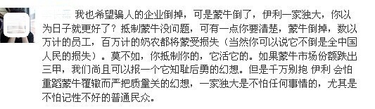
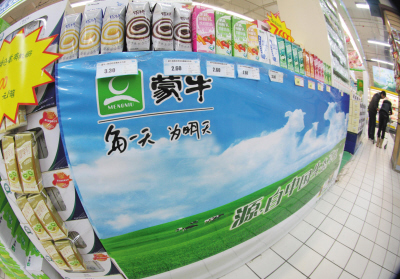

# ＜摇光＞我的担忧：因为有恃，所以无恐

**如果蒙牛真的因为有恃（too big to fall），所以无恐（获得预算软约束，事实上这是一种特权）。而一旦这个因果关系成立，那么我敢打赌，这将绝不是我们所见证的最后一次食品安全事故。试想，如果这次蒙牛自己因为质量问题导致的危机可以以“我倒了伊利就垄断了”的借口免于承担应有的责任，那么下次伊利也可以以同样的理由合法地“制造危机”。毕竟提高产品质量比之于放纵产品质量要困难得多，而当不用保证产品质量依旧可以获利、而且可获利比提供合格产品更多的情况下，又为什么要去在意所谓“食品安全”？**  

# 我的担忧：因为有恃，所以无恐

## 文/武尚霖（同志社大学）

 

今天看到了一条状态：

我想，这代表了一种声音。就这种声音和这次的突发事件谈谈自己的看法。

 **【具体的事件由这段视频来介绍】** http://www.tudou.com/programs/view/kIoifcP1bRg/?resourceId=0_06_02_99?fr=1 

事件再次麻木地发生后，蒙牛的产品也再次成为了千夫所指。作为大概率事件，至少在短期内，蒙牛产品的市场份额缩减是可预期的结果之一。

而一旦份额的减少前面同时加上“大幅”和“长期”的修饰之后，就容易产生以下4个问题：A蒙牛是否会倒；B蒙牛倒了，是否会造成伊利的垄断；C伊利的垄断是否比现在更好；D蒙牛倒了，为蒙牛工作和供奶的人怎么办？

如果说第一个问题是可能性问题，那么后三个问题更像是“蒙牛不能倒”的强硬理由。

似乎最坏的结果就是“蒙牛倒了，伊利独家垄断了，消费者的境况变得更差了，同时还有不少人生计因此陷入了困难”。恩，一切的根源就在于“蒙牛倒了”，所以蒙牛不能倒。换言之，蒙牛又too big to fall了。

这个逻辑的最大问题在于过于想当然，我想提出4个问题：A发生了质量事故，蒙牛是否一定会倒？B如果不倒，靠的是什么？C如果倒，又是因为什么？D蒙牛倒了，是否就是世界末日？

没有任何一个企业希望在竞争中被淘汰（即倒下），即便是在自己的产品出现了严重的质量问题之时。但是我们看到的是每天依然都有无数“不希望被淘汰”的企业淡出我们的视野。换言之，即便主观上有着不希望被淘汰的强烈愿望，但客观上真的不被淘汰确实需要条件的。

是什么条件呢？是投机取巧、弄虚作假、以次充好？还是热情服务、优质产品、物美价廉？而在发生产品质量问题的时候，是屡错屡犯、闪烁其辞还是杜绝重犯、诚恳透明？

不要急于给出答案，因为以上的这几种“避免被淘汰”的方式都有成功的案例。

这也正是我所担心的所在：因为有恃，所以无恐。

如果蒙牛真的因为有恃（too big to fall），所以无恐（获得预算软约束，事实上这是一种特权）。而一旦这个因果关系成立，那么我敢打赌，这将绝不是我们所见证的最后一次食品安全事故。试想，如果这次蒙牛自己因为质量问题导致的危机可以以“我倒了伊利就垄断了”的借口免于承担应有的责任，那么下次伊利也可以以同样的理由合法地“制造危机”。毕竟提高产品质量比之于放纵产品质量要困难得多，而当不用保证产品质量依旧可以获利、而且可获利比提供合格产品更多的情况下，又为什么要去在意所谓“食品安全”？对熊彼特所言“僵尸企业”的纵容一旦成为了路径依赖， 那么这种侵害消费者权益的“危机”不仅会继续层出不穷，甚至完全可能愈演愈烈。因为在事实上，这种行为正在受到着鼓励。

市场的确不是万能的，理论上来说，市场经济下的竞争应该是优胜劣汰、效用最大的竞争，而一旦外力介入便扭曲了这种竞争。所谓竞争，便有沦为“竞次”的危险。竞次下的市场经济，效率、道德与互惠性即使不是荡然无存，至少也是所剩无几。

如果真的希望保护竞争，那就请提供法治、平等的准入权、打击违规，而不是保护潜在垄断者有问题的竞争对手或因为竞争中一方一旦破产便有可能造成竞争对手垄断而去保护违规者，这至关重要。

我宁愿要一个公平自由竞争下形成自然垄断的伊利（如果蒙牛倒，短期内这的确是大概率事件），也不愿意要一个在“竞次”格局下产生的伊利蒙牛所谓“竞争”。

当然，我更乐见蒙牛不倒，始终存在着蒙牛伊利与其他品牌间的公平自由竞争。但是，条件至少需要蒙牛能真正以这次再次出现的质量问题为教训，通过质量重建信誉、重新赢得消费者的信心，而不是指望too big to fall与外部的预算软约束。在一个法治的环境下，要求企业提供安全合格的产品并不是什么吹毛求疵的过分要求。

如果蒙牛真的能够痛定思痛，从哪里跌倒便从哪里站起来。那么眼下的困境只是暂时的，蒙牛现在的市场份额缩减，何尝不是件好事？市场份额不是固定的，如果说今天的份额缩减是因为消费者对于质量问题的担忧，那明天完全可以通过严格的质量管理而重新赢回，甚至赢回比以前更多。自由平等竞争的结果与鞭策也是蒙牛进步、重生乃至涅槃的巨大动力。

即使蒙牛倒了，对与奶农与员工的担忧也像杞人忧天。蒙牛的市场份额虽然减少，但是市场对于牛奶的需求却仍然没有改变，改变的只是对于蒙牛牛奶的需求。这些人不过是从一家有问题企业转移到另一家暂时没有问题的企业而已（当然，部分人可能会转移到其他行业就业，一部分人也可能会失业）。但即使蒙牛继续“被保护”，这样的问题仍然会存在。换言之，这与蒙牛被不被保护或存不存在并无直接、排他性的因果关系。

即使暂时的份额下降会对企业至关重要的现金流产生不利影响，蒙牛也很难顷刻间跌倒。另外，能对蒙牛实施软约束救助的只有政府。

最后，不论是否抵制蒙牛产品，都是别人的自由，我都无权干涉。我只能代表我自己：在蒙牛做出实质性改善之前，我更倾向于不使用、不购买蒙牛的产品。

（采编：麦静；责编：麦静）

 
