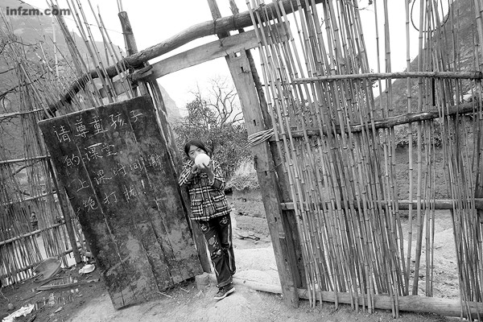
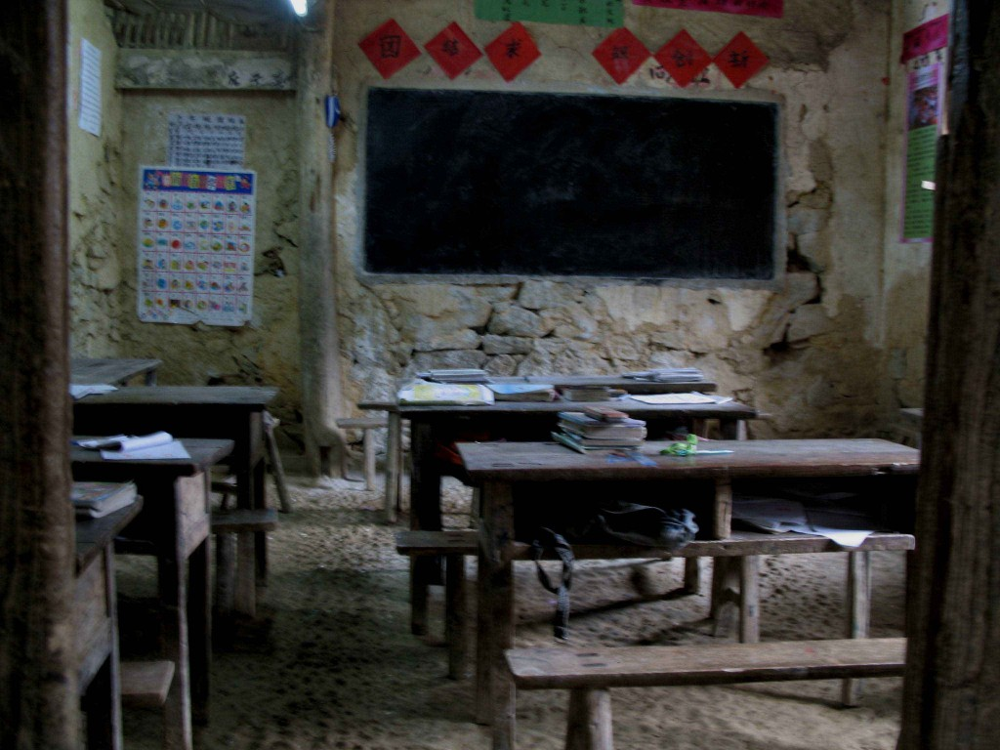
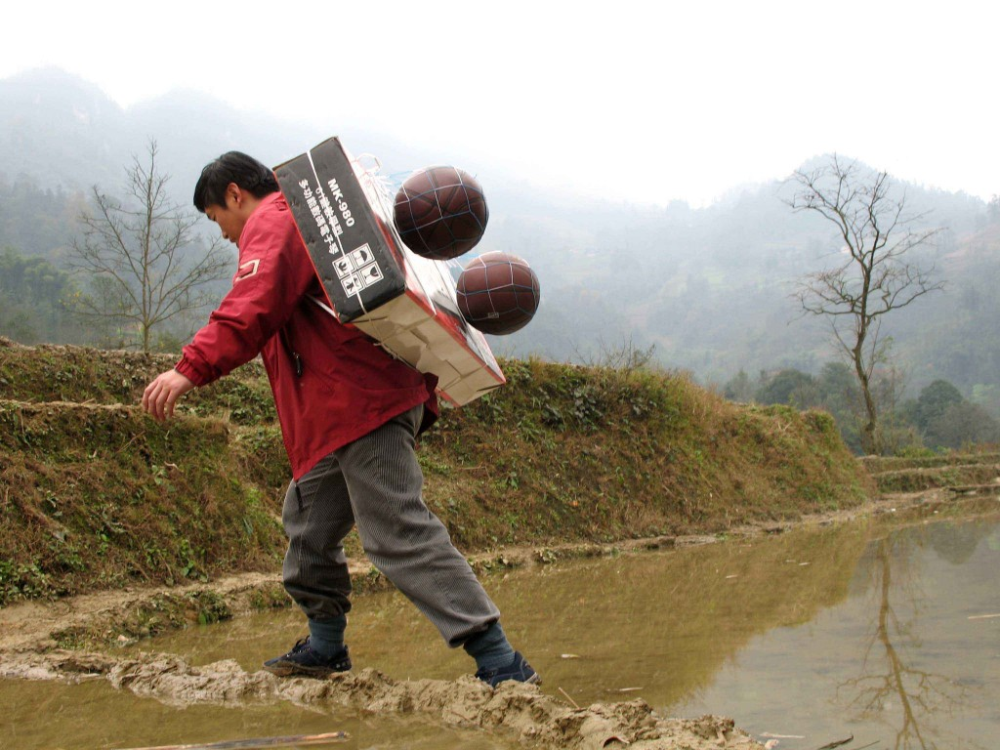

# ＜摇光＞我的支教观感——高考只是一个极次要的问题

**话是没错，教育有问题，需要解决，高考也需要改革。但是说来说去，农村孩子并不在他们的眼界之内。高考，无论考上或者是考不上，跟大多数农村孩子并无关系。对他们更加重要的是，在这个教育体系中落下的后果：缺乏自尊和自信，缺乏自行探索的能力，缺乏在一个现代化社会生存的能力。**  

# 我的支教观感

# ——高考只是一个极次要的问题

## 文 / [RDX](http://www.douban.com/people/RDX/)（芝加哥大学）

  看到最近豆瓣因为南周一篇农村孩子教育不平等的报道的讨论，准备写一下自己的经历。我不懂哪怕一点点教育理论，因此尽可能只描述事实然后做一些非理论性的评注。 

 2006年的时候，因为Mandy同学的邀请，和他们一同开始着手设计一个全新的支教项目。国内支教项目多如牛毛，满街乱走。我素来不喜欢仿制，结果明明是去帮忙的，倒越俎代庖，弄出一份计划来。支教存在的问题很明显。单纯地去提供暑假几周几门课的教学，耽搁了学生农忙的生计，又留不下什么东西（最多给农村孩子留下城市和外面世界不切实际的，甚至是打击性的印象）。可惜项目初创，人手经费均不足，也只能延循暑假交流的模式，做一点腾挪变化。当时我认为，农村的教育不平等是完全超乎想象的，因此对于农村的教育改革也要用超乎想象的模式。我猜测对于农村学生最需要的是实际的社会生存能力。我不是说什么创业能力，创新能力。而是最简单的，比如说怎样沟通，怎样说服，怎样表达自己，怎样在一个社团/社群中迅速占取重要地位，甚至比如怎样卖报纸，在简单的商品交易中赚取差价等等等等。我当时猜测，学生们最需要的不是考上大学（实际上也很难有可能），反倒是考不上大学以后怎么办，怎样活下去，怎样改变生活，怎样在辈辈务农以外寻找到不同的出路。 2007年，支教项目成行。（再次感谢刘泓同学的辛勤和努力，在2008年以后处理各种繁重细碎的运营任务，才把这个项目一直发展到现在，甚至还颇有些影响。）在我主要参与的2007年和2008年两年活动中，我的观感无不证实了我之前的假设，尽管其中的缘故与我的想象相去甚远。问题并不在于考得上或者考不上，而在于一个盘根错节的体系深处。主要的观感如下： 1、整体生存资源的极度低下。到21世纪，还有学生居住在山洞里，要校长或者老师一个一个去说服家长让学生来上学读书。我们造访的还并非特别穷困的地方，当地的小镇经济也已颇有一些模样。然而从家里出发要走几十里山路上学的也并非罕见（我父亲在70年代上学时也不过走15里山路而已），幸好学校大多有住宿，所以不用每日里奔波。在这种情况下，读高中本身就已经是一笔巨大的开支，无论是经济上的，还是心理上精神上的。虽然学校也常常在费用问题上帮忙腾挪，但是在某所我们造访的学校中，升入高三之前辍学的比例大约占到80%。一届庞大的学生群体，到最后读完高三的往往不过一百多人不到两百人。举一个切身的例子。中午下课的时候，一帮学生一起冲去餐厅。吃的是什么？每人打一碗白饭！掺上自带的辣椒或者辣椒酱，这就是一顿饭。做活动的时候大家一起打球，一帮当地学生撸起袖管几乎就只有骨架。在这种情况下，谈论高考本身就已经是一种奢侈。 2、整体生存资源低下背后的教育资源愈发惨不忍睹。即使是当地的“重点”学校也完全留不住外来教师。学校校长和教师反复跟我们抱怨，难得来一个有知识的外来老师，过段时间就几乎是“被吓跑”的。别说有没有待遇了。钱，住处都是其次。当地没有卫生的水，卫生的食物，有的是苍蝇蚊虫和惨不忍睹的卫生设施。如果是从城里长大的学生，到当地待一晚就活不下去了。于是教师大多是当地的小型师范学院甚至不那么正规的学校出来的。我得说，大家同病相怜，教师们理解不少学生的难处，也因此花下无数心力。但是有些问题没法解决就是没法解决。举个例子，英语。语法什么的都还好说，听力几乎完全无法练习。发下来的教材里有磁带，学生却买不起磁带机。除了上课偶尔听几次，再无练习的机会。语言的学习需要资源，练习和鼓励同步跟上。连磁带都无法听，对语言的恐惧和自卑自然也随之而来。随便找一堂英语课，学生们扭扭捏捏，或者沉默不语，也并非他们愿意如此。 

 受害的不只是英语。如果仅仅是英语也就好了。理科也是一样完全跟不上。在中国高中，理科教育有一种特别的套路：课本上的知识完全没法应付考试。稍有难度的考试，在课本的基础上稍作腾挪便难了几倍，却又完全不超纲。光光依靠课本的学习，几乎就是笑话。然而在农村，没有什么教师进修学校，也没有什么资源丰富的重点高中，只有一群教师围坐在一起，成年累月地花功夫钻研这种“腾挪”的套路，设计出一套套习题让学生模仿练习。（顺便说一下，在农村当地，即使是靠油印，也不能如城市一样不当一回事地印下一叠一叠的试卷。甚至有的神通广大，不靠关系也能押题神准。）当地没有这样的资源，甚至师资也不允许。于是农村孩子的理科成绩在镇里比比都颇不错，一拿到市里，当场惨不忍睹。 在农村高中，有一种奇怪的现象，即学习还不错的孩子都被归入了文科班。恰巧和城市相反。城市里文理分班，总有一种偏见说学习好的读理科班。但是在农村，只有文科，还有搏一搏的机会。单纯靠背书，真的一本一本都背下来，虽然没有名师指点，但是在高考上还有一拼的可能：毕竟文科重背功，而背功是真没有富贵贫贱之分的！这是多么无奈的举动！ 3、教育资源低下导致学生全无社会能力。这是一个奇怪的链条，但是却完全说得通：正是因为教育资源低下，教学能力差，于是就越是信赖“勤能补拙”，越是要花大功夫往下灌输。我读初中的时候，虽然是住校，但是下了课能出校门去外面逛逛，吃点好吃的，逛逛夜市。在农村，几乎个个学校都是封闭管理，每天除了读书还是读书。学生唯一的反抗也就是翻墙或者用别的方法偷跑去网吧。在这种完全封闭的社会里，学生没有办法培养哪怕一点点别的能力。让他们做三分钟自我介绍，说不出。让他们做才艺展示，说不出。运动倒是颇多不错，但是互相还生疏时也无人敢于展示。遇到有活动，大多数只能扭扭捏捏一番，然后迅速逃回人群里。这样的教育下来，就算考上了大学，又如何？我还记得我父亲也曾是这样的孩子，一个人拿着扁担背着衣物、米和梅干菜来到杭州读书，到了浙大的第一晚就手足失措。幸好那时刚刚恢复高考，校园里多的就是泥腿子，也没有什么紧张窘迫可言的。但是现在呢？ 于是问题就归结到一个很奇怪的方向：考上了，考不上，还是辍学了，又如何？缺乏基本的沟通能力，缺乏在一个现代城市化的，资本主义化的社会里生存的能力，别说求学赚钱了，基本的生存都有很多的问题。 

 很多教育专家认为我们需要解决的是“教育”问题，特别是改革高考。话是没错，教育有问题，需要解决，高考也需要改革。但是说来说去，农村孩子并不在他们的眼界之内。高考，无论考上或者是考不上，跟大多数农村孩子并无关系。对他们更加重要的是，在这个教育体系中落下的后果：缺乏自尊和自信，缺乏自行探索的能力，缺乏在一个现代化社会生存的能力。在支教的岁月里，我遇到了许多极为聪明的学生，远远比我聪明。我开的讲座都极难，但是依然有人一点即通。但是在并不愚笨的学生群体中，为何如此多的数量最终回家务农，或者外出打工？高考只是一个极次要的问题。  

（采编：宋晓慧；责编：黄理罡)

