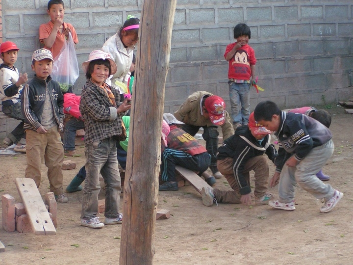

# ＜摇光＞我的支教观感Ⅱ  ——农村娃和城里人

**不喜欢读书没办法，那么如果他喜欢读书呢？那么他未来的路径就将和他的父亲一样：读高中，考大学，然后再回来。在城市里，一个二三流的大学生不值什么钱，但若愿意回来，升官发财指日可待。这是一个赤裸裸到了底的卖方市场。**  

# 我的支教观感Ⅱ

# ——农村娃和城里人

## 文/[RDX](http://www.douban.com/people/RDX/)（芝加哥大学）

 

下午的时候随意回忆了一下[支教的观感](/?p=12974)，没想到有这么多朋友的支持。于是决定再写一篇，反正不写也是忘了。这次不再谈教育，而讨论在支教时候观察到的一些社会变迁，特别是城乡二元化的冲突。和对教育学一样，我对于社会学所知甚少，特别是如城市化，社会阶层关系等之类的话题。所以尽可能准确地回忆事实，附带做一些评注。今次讨论两个话题，物质回报和精神追求。

1、物质回报。对于农村的孩子来说，教育是一笔巨大的家庭投入。期待教育的经济回报是再自然不过的了。因此做一个简单的投入产出分析。

细节讨论以前先提供一个社会背景。我印象最深的支教点是一个新兴城市。说是农村，有一些勉强。基本的城镇已经颇具风貌。完整的，将近现代化的官僚机构矗立眼前。市镇中央极难看出这是一个被我称作是“农村”的地方，有颇大的百货商场，各种饭店，网吧。简单地说，应有尽有。然而这依然是一个农村。大多数的居民并不在城镇中心居住。大多数的学生依然稀稀拉拉地分布在“山里”。这并不是一种比喻，好像说别人住在“乡下”。很多人的的确确住在山上，有在半山腰的石瓦房，零零散散养一点鸡，种一点田。甚至还有在山间连石瓦房都住不起的。他们不少是散居，三三两两，分布在各处。换言之，大多数的居民依然是典型的农民。这个城市不过是一个“正在形成中”的城市。

这个新兴城市有一个明显的特点，即城市形成的过程不断区分社会阶层，不断拉大他们之间的区别。城市中心的居住价格在上涨，生活成本也不低。没有文化的农民亦难以在城市中谋生。这反而阻止了农民的城市化。甚至因为城市化对土地的占用，反而把农民驱赶得越来越远。中心地愈中心，边缘地愈边缘。不巧的是，好的中学往往就在城市中心。因此在“城市”里上学，有着特别高昂的显性和隐性成本。交通，学费和食宿费用自然逃不过。而因为农村和城市的距离与分化，让孩子上学就意味着他们不可能随时赶回家里照顾农活。我的观察是，常常是爷爷奶奶们在照顾家禽，父亲母亲则不少外出打工。剩下的儿子女儿蜗居在学校里日夜苦读，完全无法补贴家用。对于一个农村家庭而言，让子女读书付出的不仅是显性的就学费用，也有隐形的农业生产成本。

如果说前者的费用还能够承受的话，后者则是一个几乎无可抵挡的压力：怎么可能让七八十岁的老人守着田地和鸡鸭？考虑到大多数的学生并不可能考上大学，早早地辍学，回家看田，或者干脆外出打工，反倒是最合算的选择。当然，有人会说，打工也要技能。有技能，有知识，才能往上爬得快啊。但是农家孩子哪儿等得了这么久？

问题还没完。既然是城市，自然也有相对富裕的家庭。当时造访了一位同学的家里。他的父亲是当时少数考上大学的“金凤凰”，后来当了一个小公务员。在官场上摸爬滚打一番，最后被派回到这个城镇。愿意接受这样选择的人不多，但是好处也显而易见。在一个严重缺乏大学生的地方，愿意回来的，“外面的”，大学生，自然是到处吃香。这位父亲虽然是回到了小地方，但是把检察官当得风生水起，也不亦乐乎。那位同学的家里完全是标准的城市化的小公寓，在客厅里目测大约至少六十平方米以上。他母亲拿出来的一袋一袋的零食也与我们平时习惯购买的毫无差别。他的母亲诉苦，说自己的孩子不好好读书，就知道上网！对，他的家里有电脑，有游戏机，或许是全高中惟一一个。不喜欢读书没办法，那么如果他喜欢读书呢？那么他未来的路径就将和他的父亲一样：读高中，考大学，然后再回来。在城市里，一个二三流的大学生不值什么钱，但若愿意回来，升官发财指日可待。这是一个赤裸裸到了底的卖方市场。

这意味着什么？即在一个扭曲的市场里，在这个具体的新兴城市中，教育变成了社会等级划分的工具。有钱有资源的家庭可以供养孩子读书上学。即使在大城市里呆不下去，只要愿意回来，就能够垄断这个新兴城市中的一切资源。教育的物质回报异乎寻常。而且他们可以很自信地肯定，不会有很多的竞争者。因为大多数的学生在高企的教育成本面前，早就辍学了。对于这些学生来说，教育只见投入，不见产出，明摆着就是一个无底洞。于是富的愈富，穷的愈穷。偶尔有几个学生，例如上文的父亲，会成为一只“金凤凰”，走入完全不同的社会等级，然而这样的“金凤凰”又有多少？

2、精神追求。人不能只靠物质追求活着。再穷困也有精神追求。就像许多当地的高中生极喜欢运动，还有学生难得凑了一点钱就买了吉他日夜苦练一样，大家都得靠精神追求过活。那么农村学生的精神追求是什么？给我留下印象最深的是两件事。第一，周杰伦和林俊杰的贴纸贴满了课桌——别忘了他们根本买不起磁带机，听不起歌。第二，去网吧除了游戏和QQ，喜欢上一个叫做51.com的社交网络。什么是51.com？很多人可能并不知道。这个网站在大多数“网友”的眼里令人不齿：充满着非主流，约炮等等等等，基本就是劲舞团的社交网站版本。

而对于当地的学生来说，51.com又意味着什么？这是一个新鲜的东西。这不但是一个充满着现代感的网站，而且是一个特别稀奇网站，叫做“社交网站”。在这个新东西里，能够满足使用者的一切幻想。页面花里胡哨，有各种各样的装扮功能，而这所有的功能都无时无刻不渗透着“科技感”。简而言之，51.com提供了一切农村学生渴望的元素：城市化，现代化，科技化，新奇。更加重要的是，51.com并不是一个“正常网民”经常访问的地方。相反，大多是拥有同样幻想的人，透过网络聚集到一起，拥有共同的信念和渴望，也提供了一种亲切的安全感。

周杰伦也是相同的故事。甚至对于“南下”，也是一样。“南下”对于当地的学生，是一个特殊的词汇。它意味着打工，也不意味着打工。“南下”不但能迅速带来可见的收入，也能满足许多幻想：在一个大城市的华彩中流连。我说的诗情画意，其实故事很简单。如果你在一个便器一定积满大粪的环境下长大的话，那么大城市的干净整洁，即使是城市人看不上的“脏乱”，也有莫大的吸引力。这个和“权力”、“解读框架”什么都无关。就是单纯的，最基本的，对于改变生活的渴望。有时候这种渴望比较抽象，渴望歌星，渴望现代性。更多时候这种渴望十分现实：渴望一碗干净饭或者一个干净一点的厕所。

然而即使是“南下”，他们也逃不过与社交网站一样的生活隐喻。因为这样或者那样的缘故，他们永远不会是，也不可能成为一个“城市人”，即使物理的生存在一个巨大的都市中，他们也只能互相取暖，在一个特殊的亚文化里既寻找渴望的实现，又寻找熟悉的安全感。

在很多时候，对于这种精神追求的向往，是支撑着学生们继续读书的动力。记得当时问当地的学生，你们喜欢什么，或者为什么要读书。不少人说，因为读书可以了解外面的世界，就能像你们一样了。

然而他们真的能如“我们”，“一样”？

 

（采编：宋晓慧；责编：黄理罡）

 
