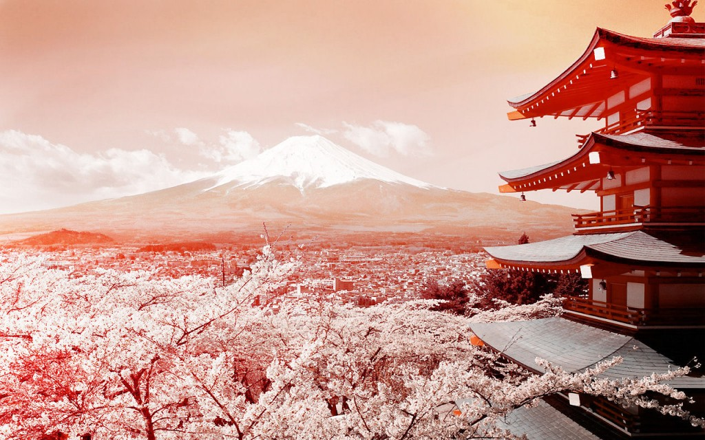
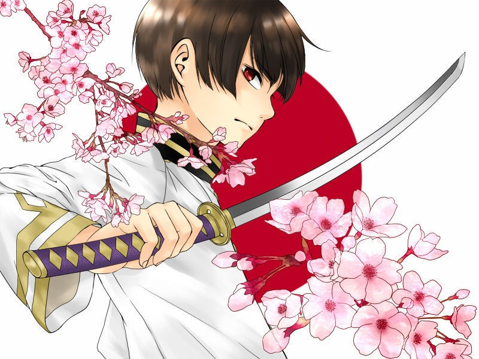
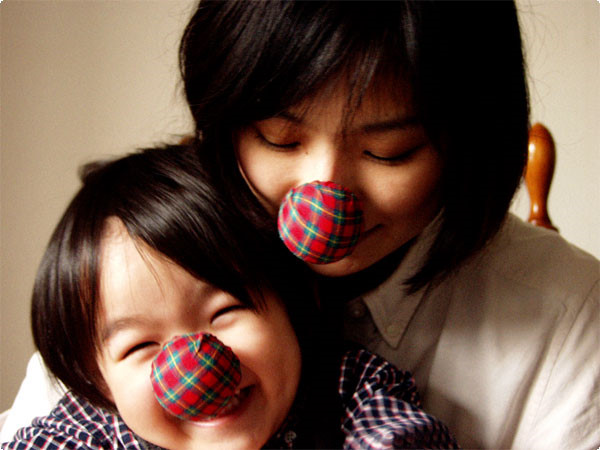
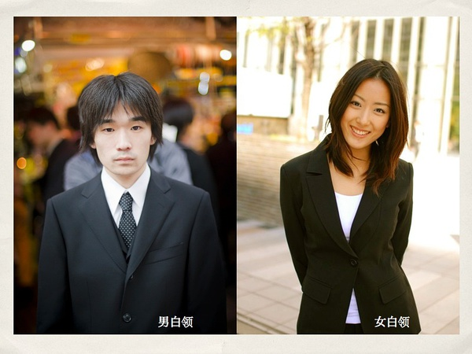

# ＜摇光＞我眼里的日本人——从为什么喜欢柯南说起

**“平城京是模仿唐朝长安城修建的，至今已有一千二百六十多年历史，作为历史性的遗产已列入世界遗产之中。”比较讽刺的是，我们的本体已经不再了，他们山寨的也就成为经典。**

# 我眼里的日本人

# ——从为什么喜欢柯南说起

## 文/朱逸欣（香港中文大学）

从来没去过日本、接触过的日本人也寥寥可数的我。要来谈日本人了……中国，作为一个发展中国家，日本社会的发展应该更完善一些，所以，学习应该是益大于弊的。总的来说，我觉得日本人和中国人还是很像的，当然也有一些不同的地方。

还是从柯南说起，其实柯南只是一个幌子。柯南的故事，是说一个大人又变回了小孩，这个故事有很多美好的部分，但我想的是，“变小”，是否是一个梦想。日本是一个性格很矛盾的民族，一方面，他们的礼节非常多，说话要用敬语，似乎是很刻板的民族；而另一方面，他们也非常擅长发展各种可爱的文化，比如动漫、甜甜私房猫、棋魂、樱木花道。动漫中的人物，常常是口不择言的，如果成年的日本人这般说话，不知要得罪多少人。但这些生活在繁文缛节的日本人，却着迷那些开口骂人的动漫人物，这就是一种矛盾。

这种矛盾，解释起来，从“诚”字开始。人刚刚出生的时候，必然是真诚的。随着年岁增长，日本人是适应并且崇尚等级制度和礼节的民族（比如“忠”“孝”其实也是中国人重视的），所以必然要生活在种种束缚中。成年的日本人，学会了繁文缛节并且推崇它，内心却向往最初的自由，这种感情很奇怪又很真实，在中国也是一样。在日本盛行的禅道，修炼中就非常强调“初心”和“空性”，某种程度上来说，也是日本特殊社会形态中人求得解脱的一种方式。修炼，其实并不一定要和宗教有关，为求的是超越。我看过的最动人的方式是：“在日出之前静坐在瀑布下边，让刺骨的水流过脊背……”很强大的中国味道吧。

日本人似乎难以掩藏对中国文化的感情，或者说这两国的文化，本来就难以分开。日本和中国都是山寨大国，中国的山寨实力估计大家都很清楚吧，我来说说日本。我们称唐为盛唐，也就是中国人对唐朝文化还是很自豪的，但可惜的是，中国大陆能看到唐朝风格的建筑物已经很少了，我们的长安也早已面目全非。那要看中国唐代建筑物，去哪儿看？答案是，去日本，去奈良。“平城京是模仿唐朝长安城修建的，至今已有一千二百六十多年历史，作为历史性的遗产已列入世界遗产之中。”比较讽刺的是，我们的本体已经不再了，他们山寨的也就成为经典。

在这个时代，我能感觉到现在两国文化上最大的差别是，日本人的情感表达艺术表达来得更加顺畅，这大概和中华民族历史创伤太多、有情感压抑的习惯有关，和现今社会的不够安稳也有关系，和经济不够好也有关。去听日本的音乐就知道，唱母爱，唱友谊、唱梦想、唱一切美好的东西，相比之下，中国的流行乐还是让我感觉浮躁而底气不足。日本是重视细节的民族，感情上也很细腻，《与光同行》是讲缺陷儿童的故事，却让我看得很感动，因为感觉到教育的力量，感觉到整个社会对孩子共同的爱与责任。这还是和社会发展程度比较大关系吧，天朝很多问题的处理还是比较简单粗暴的，我们很多人小时候也受过变态老师的欺负吧。

日本人是不是敌人呢？我想说的是，要成为敌人很容易，因为靠近因为相似。大家都知道，被最亲的朋友出卖最惨的，我们通常和邻居打起来而不是遥远的陌生人。日本人学中文是很快的。我也是接触了一些日本人，才相信抗日战争时期日本人可以混入我方的部队当间谍。日本人中文讲得好的，完全可以达到以假乱真的程度。那我们要不要恨日本人呢？这个就见仁见智了。中国日本关于爱恨的观点是相似的。有恩报恩有仇报仇。再详细一点就是两句：“滴水之恩当涌泉相报”；“君子报仇十年不晚”。“忠”、“孝”观念都是和报恩观念有关。报仇的是“君子”，是一个褒义词，就是说复仇这件事有时候可以是正义的，在中日文化中都是这样。

说到战争、灾难、死亡这些话题，日本人最显著的一个特点大概是重视“体面”。这个中国人也很重视，但日本人似乎更加极端。国民党进驻台湾的时候，有些民众非常失望，因为撤退的日本军人整洁体面，到来的国军却似一群乞丐。这个可以从两方面理解，当时的抗日队伍非常顽强，即使是这么差的环境下还在坚持作战；另一方面，就是日本人死要面子了，撤退也不能失体面。这和我们平时说的爱面子还是不一样的，更像一种信仰，这种信仰可以让地震后的日本人各自和平地守着自家区域（即使已成废墟），可以让逃难的日本人只是尽快转移而不惊慌大叫，可以让自杀的日本人在跳楼之前还要把两只鞋摆放整齐。这种性格解释起来有点变态，却也是日本强大的原动力。

说到死亡和灾难，就会想到日本人有那么多悲剧收场的故事，无论是小说还是电影。非常著名的有《日本沉没》，小说的结尾，日本国真的沉入深海（没有救世主哦），收留日本难民最多的是中国。我想没有哪个中国小说家会写出这种故事吧。日本人很偏爱悲剧，也许可以理解成死亡和受苦不是什么大不了的，人最重要的是精神的境界；在苦难中不变的精神力量才是最重要的，精神应该超越肉体。这一点中国人其实也相似，认为精神大于肉体，所以朝鲜战场上会有那么多士兵甘当人体炸弹。

好像没什么好说了，那么就结尾吧。中国现今首要问题还是内部的反省和发展，无论有没有恨，都像日本人那般保存体面赢得尊重吧。向强大的敌人学习，培养自己的国民素质。再者，一个集权而民族主义盛行的国家是危险的，因为那像极了二战前的日本和德国，我不希望我的祖国走他们的老路……

最后贴个歌，谷村新司《星》。其实我觉得，日本国内的舆论宽容度比天朝还是要好一点。例子是，这首歌的作者说自己的前世是中国人，这首歌也是为他梦中的中国所作，而他在日本却没有被唾液淹死，仍然是名望非常高的一位音乐人。我始终觉得音乐是没有国家的，是如同星空一般美好的东西。后边有一部分是用听不太懂的中文唱的……

踏过寂静我苦中找安宁   
踏过荒野我双脚是泥泞   
满天星光我不怕狂风，满心是希望过黑暗是黎明   
星光灿烂伴我独行   
给我光明   
星光引路风之语轻轻听   
带着热情我要找理想   
理想是和平   
寻梦儿去   
哪怕走崎岖险境   
明日谁在来引路   
也是星 
