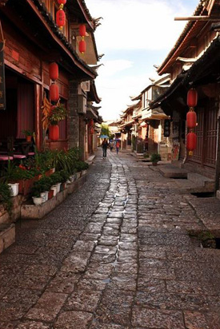

# ＜摇光＞把根留住？

**钱学森是个好榜样，但和生长在英国的第二代、第三代移民没有太多可比性。只有生于斯长于斯的人，才会产生那种浓厚的，要“把根留住”的感情。这是很难后天培养出来的感情。我觉得让在国外成长的华人后裔多回国看看，多了解中国文化很好，但你要知道，回国于他们未必适合。**  

#  把根留住？

## 文/ 陈萱（纽卡斯尔大学）

 

我在纽卡中文学校教课的时候，和朋友帮校董整理过一篇文章叫《辛亥革命对华文教育的启示》。这篇文章的主旨是要让海外华人极其后代多了解中国历史，以激发他们的爱国心，让更多的人像钱学森学习，将来回国做贡献。 

校董是位老华侨，其爱国之情和为此付诸的行动着实让人钦佩。我很赞同要让华人和华侨了解中国历史，因为人必须要知道自己来自哪里。但号召他们回到祖国，这似乎有点一厢情愿。回不回国，这还要他们自己说了算。一位朋友说得好，自己“首先是人，其次才是中国人，而人的本性就是到更适合生存的地方去”。若中国市场好，政策好，年轻人自然会回国发展。留学生和第二代移民回国有很多是出于这种考虑。 

今年夏天我去了几个地方，顺便思忖一下回国发展的机会。重回北京，没有了读书时的情怀，看着仿佛比读大学期间多了十倍的人，突然觉得我如果足够有本事，或许还是不要回国给帝都添堵的好。去杭州住了二十来天，在美丽的山水间发现我深深爱着中国文化，可惜这地方房价也高得吓人。回家看看郑州的就业信息，工资很低，而生活成本却不低。“郑州不是个幸福感指数高的城市”，已经工作了的朋友这么评价。 

中国人为什么那么在乎“根”，我觉得除传统观念外还有一个重要原因。因为中国人爱抱团，重人情轻规矩，这和中国社会法制不健全也有很大的关系。在这种环境下长大，离了根就觉得相当的没有安全感。为什么一定要买房子，要结婚，除了观念问题之外，也和社会保障制度不给力有关。第二代移民一方面没有这忧虑，另一方面，他生在外国长在外国，人脉大多也在外国，回国才是个冒险。第一代移民就不同，他的根在中国，“归鸟恋旧林，池鱼思故渊”，自然要“落叶归根”。因此他也希望孩子热爱中国文化，要不然没法沟通。 

有篇文章中讲 “幸福的定义，就是看着子女一天天长大，儿子或者女儿越来越像当年的自己，一样的傻气，一样懵懂，遇到过同样的事业和感情的问题。 幸福的定义，就是自己老了，有自己爱的人陪自己慢慢变老，然后再静静的看自己生命的延续，去奋斗，延续自己的激情。”这是或许大部分中国父母的想法吧。但我觉得这眼界有点狭隘。孩子不是私有财产，他的生命是他自己的生命，也是属于这个社会的生命。即使孩子不像自己，违背自己的意愿发展，父母还是愿意从他/她的角度考虑问题，这才叫爱。孩子生存的年代和父母不同了，遇到的事业和感情问题很可能是父母解答不了的新情况，而他/她最需要的其实是尊重、支持和理解。在我看来，就是让孩子自己选择，并且承担后果。 

不同的土壤，自然种出不同的果实。记住我们从哪里来，但不意味着一定要回那里去。在别人的土地上也能开拓出自己的天空，这才了不起。我认为中国人最大伟大的品质就是顽强的生命力。 

“树挪死，人挪活”，选择适合自己的土壤才能长得茁壮，我信奉这个道理。 

钱学森是个好榜样，但和生长在英国的第二代、第三代移民没有太多可比性。只有生于斯长于斯的人，才会产生那种浓厚的，要“把根留住”的感情。这是很难后天培养出来的感情。我觉得让在国外成长的华人后裔多回国看看，多了解中国文化很好，但你要知道，回国于他们未必适合。 

所以比较欣赏姚明的态度，海外华人要做的，是给下一代能够选择国籍的自由。 

追求自由都是要付出代价的，但在中国这代价格外高。我不知道我将来会到哪里去，但有一点不会改变：不想让未来的下一代因为想要突破自我而忍受太多的压抑和寂寞。希望中国有一天会是这样：普通的年轻人都能相对自由地成长，不必削尖了脑袋才能得到足够的生存空间、尊严和保障。 

作为现代女性，我欣赏的作家是刘瑜而不是六六。六六的《蜗居》描摹的是残酷现实，她的观念很正统，但不能给新时代压力山大的年轻人带来什么启示和希望。留美博士刘瑜写的也是现实，但她有温情，有悲悯，还有建设性的想法。可见走出去看世界是多么必要！ 

作为体制内的一个小螺丝钉，你很难不被大环境所吞没。但跳出来，说不定还能对同胞们产生更大的影响。创造另一种可能性也是为国做贡献。在瞬息万变的新时代，一元化价值观会被不断分解，千篇一律的励志故事已经渐渐失去了神话意味，我们需要的是更多元化的榜样。  

（采编：林静；责编：陈锴）

 
