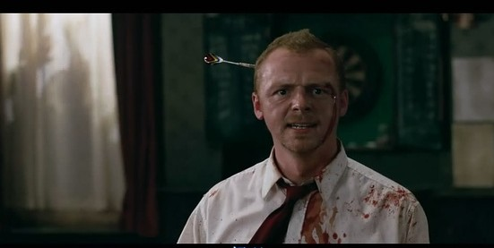

# ＜摇光＞挺尸症候群

**军阀战乱，急症横行，天灾临头……历史厚颜无耻地告诉你，生命自古至今，轻如鸿毛。** ******于是你在深夜大汗淋漓地惊醒，看着天花板一动也不敢动，死亡的尸布是一张轻柔的网，无声无息落下。你逡巡四周，镜子，茶杯，丝绸，连一枚塑料片都将比你存活得长久。**  

# 挺尸症候群

## 文∕吴昕悦 (Wellesley College)

 

我小时候是个天天盼望着把自己嫁出去的结婚狂。

不是因为有蛋糕，热闹的人群或者盛大美丽的婚纱，也不是因为我在梦想着什么白马王子──而是晚上如果有个人陪在旁边的话我就不会害怕得睡不着。

这种错误的印象始于我噩梦惊醒的时候会害怕得光着脚跑到爸妈的主卧，要求老爸下位，让我和妈妈睡。有时老妈会睡眼惺忪地陪我走回房间，轻言慢语唠叨几句然后梦游一般再回去接着睡，而如果吵醒的是老爸，他每回都理直气壮地把我踢回儿童间，我就又恨又怕地躺在床上咬着被子角发抖：我要是有老公就好了……

唯一的救兵爸爸妈妈也拒绝帮忙，被遣送回床上之后的时间最可怕。由于视力不好，天一黑看什么都是鬼影重重，木地板天气干燥时动不动“咔”的一声，我躺在床上犹如挺尸一般，手脚冰凉，头发湿透，大气都不敢出，生怕潜游在四周的夺魂者听见我的声响。直到黎明破晓，清洁工开始扫地，笤帚摩擦地面的声音和夜班的人把车子开回的马达声响起，我才如释重负地睡着。

在外面的世界沉睡的时候，儿童间里总是上演着一场与黑暗之间无声无息的孤军奋斗。童年的床上，蛇、杀人蜂、鲨鱼、小偷、强盗、鬼魂、贞子、僵尸全是枕间常客。

最初害怕的应该是鬼怪一类。当时的表姐无比乐衷于给我讲鬼故事（尤其是午夜凶铃刚出的时候家喻户晓，我至少两个月都不敢经过电视机），再加上我害怕又爱听，身为胆小鬼却完全没有自觉性,经常兴致勃勃地抓住基友给人家讲鬼故事，结果讲着讲着还没讲到包袱先把自己吓哭了，对方就看着我眼泪汪汪地打结巴。

后来变得比较实际了，担忧更多的是天灾人祸一类。尤其是当年在望京有一对老夫妇撞见小偷行盗，结果被追到楼下捅死。我高中的同桌就住在事发的小区里，绘声绘色地给我形容多次之后，这桩事件彻底成为我的心结。活生生的人比鬼怪还要可怕，而因此产生的恐惧并非身边多睡一个人就能解决的了：父母逐渐老去，所以有什么困难挺上的肯定是我；更何况作为一个壮硕如牛的击剑运动员，必要时刻我即便不是暴喝一声跳出来保护我的男朋友，也至少得协助他边打边退。

于是不知道从什么时候开始，从一个希望别人保护的人变成了一个让别人安心的人。基于对此产生的心虚，我就像实习医师预见到以后给自己做手术的都是昔日跷课同学一样暗自发抖。

尽管如此，那些令人颤栗的传说还是让我趋之若骛，我还是经常在恐怖漫画贴吧潜水，虽然让我眼前一亮的越来越少，自己也写了一些恐怖小说，但结果总是没有那么满意，一部又一部地看恐怖电影，捂着眼睛胆战心惊，按掉屏幕之后又嚼着爆米花和朋友指手画脚哪个特效逼真而哪个桥段矫情。

某次看完一部国产恐怖烂片之后，和朋友在簋街大啖黑暗料理，席间有个点辣不沾的哥们因为被我们拉来很是不爽，说辣味本身不是味道，而是一种痛觉，所以喜欢吃辣的人实际上多多少少有点自虐狂的倾向。我等一群吃货坦然承认：就是这样的痛觉才让人上瘾啊。如此想象，恐惧和辛辣应该很是相似，微量的恐惧是让人上瘾的，就像微量的痛感一样。文艺作品让人一窥自幻想中便长久潜藏的真正恐惧。

和窥探恐惧同样难以抑制的是好奇心：

我为什么恐惧？

什么使我恐惧？

又是什么使所有人恐惧？

恐惧的来源如同恐惧本身一样不可抗拒：来自于内在和外在的不可掌握性。

内在的恐惧从对信赖和亲密的背叛开始。悬疑推理小说一个无比俗滥屡试不爽的剧情就是，从开头一直青面獠牙的猥琐男最后很可能是炮灰，而那个看起来很无害的微笑小白兔则从背后默默抄出一把大砍刀。漫漫五百多集的《名侦探柯南》可说是过分利用如此心理的一个典范，导致我只要看见貌似忠厚的人出现就认定他最后定会被柯南用一阳指“凶手就是你”一击毙命。

日本恐怖电影中，父母和恋人的瞬间黑化也并不少见，一个段子曾经困扰了我很久：女孩和男友去爬山，女孩留在山腰，男孩和朋友们去登峰，时久，众人归来，哀痛地告诉她，男孩不幸在雪崩中遇难了。女孩很伤心，风雪封门，众人等待平息时一起下山，这时有人敲门，是男孩，他呼唤恋人开门，在刚才的雪崩中，他是唯一幸存的人──你信谁？

我靠，我至今也不知道应该信谁。

但是我知道这样的假设为何使我困扰。它推翻了一种潜台词式的亲密关系，那是我们在故事剧情设定和社会生活中已经理所当然接受的信任感──比如看起来慈祥温和的老人应是无害的，比如亲友总是和自己站在一边，比如人性普在──当它被强力剥离时，恐惧便随着陡然的孤独而生。这种亲密关系的对象甚至不必要是人物，比如著名的鬼故事“背靠背”便是侵入了“床下”这个亲密空间。

背叛亲密感的极端化就是对于自身人格的背叛。影片《致命id》《捉迷藏》《不请自来》都是很好的例子，书则推荐《向日葵不开的夏天》。失魂落魄躲入角落却发现手上沾了鲜血的是自己，在蒙太奇回放中引爆的是比被背叛更强烈的孤独感。

当然这手段并非谁都用得好，显而易见的，经广电总局核准上映的国产恐怖片往往在一系列装神弄鬼之后把一切都毫无责任感地解释为：都怪她/他有精神病，这是幻觉。犹记得当年看一部阿娇主演的恐怖片，前面分明大家都横七竖八得死光了，结尾竟然全部满血复活，阿娇骑着脚踏车用做卫生巾广告的愉悦语气說：原来是邪恶人士催眠了我们，后来我们都康复了……固然事前知是烂片，但是竟能烂到如此地步，还是一口老血喷了出来。

与内因相对的恐惧则来源于绝对的外在。如果说孤独感让自我无限放大的话，不可把握的强大外在则使得自我无限渺小。

无论是《电锯惊魂》还是《死神来了》，不管是莫名冒犯了笔仙还是被集体发配到只能幸存一人的荒岛，不能抗拒的外在规则都在残酷地胁迫你摸索这个世界的规则，服从是唯一命令，失败者没有第二次机会。

《死神来了》的第一部可谓个中翘楚，在我看来，其中最大的彩头应在于“死神即规律”这一概念，可惜它自己后来把这个亮点给否决了。为了弄死小强姑娘，堂堂死神竟然出动了各种声光电，甚至亲身降临──一道人形魅影忽地闪过，有人惊呼，我却大为憾叹。

从不可把握的残酷外在产生的恐惧感来源于人类生生灭灭传递下来的记忆。生活是最糟糕而高效的编剧，辛波斯卡将死神这暴君式的疏忽谑为“千百次还仿佛是头一遭”，快刀乱麻，肆意妄为。

大多数恐怖片和恐怖文学所强调的面临死亡威胁的煎熬感在现实中被反转──我们不得不承认，实际上我们看到的恐惧只是在三流剧情里面留给垂死挣扎的男一号的奢侈戏份。

不是持刀怪客的神出鬼没，不是大桶的血浆和刻意营造的酷刑，也不是异形生物的追杀，最深的恐惧是：你连感受恐惧的机会都没有，因为死亡是如此轻易。

军阀战乱，急症横行，天灾临头……历史厚颜无耻地告诉你：生命自古至今，轻如鸿毛。

于是你在深夜大汗淋漓地惊醒，看着天花板一动也不敢动，死亡的尸布是一张轻柔的网，无声无息落下。你逡巡四周，镜子，茶杯，丝绸，连一枚塑料片都将比你存活得长久。

我记得08年，志愿者李赛学长赴川援助归来，说起在摇篮中的婴儿在安睡中死去，提到挖出来三百具尸体密密麻麻横了一条街。300也许看起来不是一个惊人的数字，但那是一整条街有血有肉的人就这样消失了。

那么战争呢。一将功成万骨枯到底是怎样的残酷。

前一段时间看到柴静的报道，汶川遇难儿童们的父母在灾难之后再生的孩子也快到了上学了的年龄，离开的哥哥姐姐曾是同学，他们以后还要做同学。

人命如草芥，但也生生不息。

因为春风总会到来。

前几日北京气候异常，津唐交界又有地震，网上传言地磁指数一路暴跌，要有大地震降临。我从不信建筑物能如房地产商所说的那样抵挡八级地震：天灾百年一遇，遇上了也挡不住。

我问父亲，如果第二次唐山大地震来了你怕不怕。

老爷子眼珠一瞪：死就死了呗，咱们全家人不都在一起呢吗。

 

（采编：孙梦予；责编：何凌昊）

 
