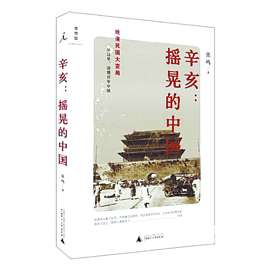
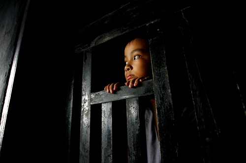

# ＜摇光＞摇晃的国家

**我们只是在这个宏大的时代下面艰难求生的蝼蚁，所希望的不过是平安走完本来就十分沉重的人生。然而总会有一些人为的制度上面的灾难让我们看不到美好的希望，大火中丧生的小孩，毒奶粉毒疫苗中蒙难的小孩，地震中躺在豆腐渣工程下面的小孩，列车事故中醒不来的小孩，他们中的多少人是这个民族未来的希望！**

 

# 摇晃的国家

## 文/朱一一（华中科技大学）

“1911年，岁在辛亥，10月10日夜的零星枪声，将一个疲态尽露的老大帝国摇晃得如泰山之崩。”这是刚刚买的那本《摇晃的中国》里面的一句话，总觉得历史会有惊人的巧合。

买这本书的时候，仅仅是因为想更好的了解一下那场事件，如作者说：从这里，读懂百年中国。我特别讨厌政治，一直以来的生活环境以及个性都让我对这些沾满权力斗争和血腥的东西保持距离，最后这种距离感便使我对这个时代也产生一种疏远的心态。我从媒体各种渠道了解到发生在这个国家的许多事情，也和许多人一样对某一事件有过感动，祈福，然后再变成了麻木，后来又变成了愤怒，再过一段时间，又出现新的事件，新的事故。这本书冥冥之中成为一个很好的契机，让我二十一年遵循的“勿谈国事”被满目疮痍折磨得粉身碎骨。

这是一个奇特的国家，越处久便越觉得自己身在动物农庄。一直以来我都以一个屁民心态生活在这样的一个制度之下，觉得精英层的决策与我无关，每天无外乎吃饭睡觉学习工作娱乐，工资虽然跟不上物价飞涨的速度，生活有些艰难，但是日子依旧要过，我已经过了喝婴儿奶粉的年龄，要说地沟油苏丹红之类的大概也有免疫力了，捐款的数额没有超过50，很少坐火车，没有家属在矿井，也不在地震区，哪怕是洪水来袭都会有其它的地方牺牲小我保护大我。我上我的学，睡我的觉，看我的新闻，不管是感动还是嗤之以鼻或者是义愤填膺，我保持对这个国家的认知，但永远保留我的看法，因为我太小瞧屁民的力量，我认为自己哪怕撑破我自己的天，也不会吹动这个国家一丝腐朽的空气。

现在，我真觉得以前的自己很可怕，更可怕的是，我相信在这个国家有很多个这样的自己。辛亥革命以摧枯拉朽之势掀覆了一个王朝，而开端仅仅是因为武昌城内一个策划已久的意外，随后便是薪火相传，殊途同归。历史不过是一个又一个的轮回，不论朝代的更换，制度的变迁，我始终相信一个由七百多年前的文人写出的道理：兴，百姓苦；亡，百姓苦。如果说百年以前的鲁迅纠结是否该叫醒黑屋子里睡觉的人们，那么百年之后这个国家呈现出这样的局面，黑屋子里面除了少部分人酣睡之外，大部分人都醒着，这些醒着的人有些人想出去但是却没有力量，有些人想出去但是没勇气，有些人觉得出去很好，但明白凭一己之力出不去，还不如睡着，最可怕的是，这群人中还有一群还不如睡着的人，他们不仅每天鼓吹这个黑屋子有多么好，还会对那些想出去的人进行抨击和谩骂，更有甚者掌握黑屋子里的武器，他们会暴力镇压，然后再用舆论来麻痹剩下的人。这是时代的悲哀，每当需要出现更换的时候，牺牲在最前面的总是这个民族最优秀的人，他们最先觉醒，最有力量，但是身后有着太多麻木的同胞，他们挑不起这样的重任。历史中出现过十几个个日本人一夜之间屠杀掉一个村庄的人的事件，最先挺身而出的竟然是老弱妇孺，这又是一个民族的悲哀。在这样一个摇晃的国家中，不幸中的不幸是，这个民族生活在由一个阶级用暴力镇压另一个阶级的制度之中，生活在这样一个时代之下，我们不仅看不到希望，而且满眼都是更深的绝望。

前段时间跑去给伟业贡献票房，后来看了一篇影评，说，这部电影不能算是马屁，因为夸一个迟暮的女人曾经很美，不是马屁。我很赞同这个观点，我们不能否认某些组织曾经的光辉岁月，曾经的汗马功劳，革命先烈抛头颅洒热血，前赴后继英勇无畏最终为我们挣来一个今天的生活。但在不饶人的岁月下，如果这个半老的徐娘 还一个劲的向人吹嘘青春的貌美，甚至打压讲真话的小孩，我们还有什么理由去承认她现在的美丽，我们只能认定，这是一个悲哀的女人，正如这个悲哀的国家一样，只能从以前的辉煌里不断繁衍谎言，用一个谎言遮盖另一个谎言。于是我们看到事故频发之后的各种歌功颂德，各种领导有方，各种组织有力，而那些伤亡人数事故原因以及牵涉到的各种罪恶统统被掩盖。这个奇特的国家总是用一个事故来遗忘另一个事故，毒疫苗事件后喉舌应该感激发生在王家岭的那一场矿难，而生死营 救的感人场面后的各方问责又得感谢5月那场青海的地震，国民的视线就在这样一个又一个事件中被转移，而真相永远被遗忘。调查永远止于一个领导下台，然后换来另一个领导上台，前任的错误成为掩盖后任的无能的最好的借口，民众所期待的真实，抵不过玛莎拉蒂后面的关系网，丧生在动车事故里面的孤魂，很快跟着列车的残骸以及事件的真实被掩埋。真相是最大的奢侈品，在这个屁民无法消费的物品面前，人命是弃之如履的草芥。

太多触目惊心的事件暴露出太多被修饰的罪恶以及更多被掩盖的真实。这是一个奇怪的国家，在它推崇之至的制度之下，大部分人渴望的真实被少数人所掩盖。无耻的歌功颂德，粉饰太平，无耻的官官相护官商勾结，它所鼓吹的没有阶级导致了最严重的两极分化，让贫民百姓衍生出扭曲后的仇富心态，让贫民百姓的生活充斥着谎言。当不健全的法制在金钱权势面前节节败退，当所谓的面子工程在重大事故面前被撕破脸皮，当普通民众的生活甚至都无法得到起码的安全保障的时候，这些貌似与我们无关的体制机制，精英决策的毒瘤已经深透入骨，每个人都慢慢经受灭顶之灾，终不幸免。这一回，喉舌们该怎么说，这是哪里的不幸？

我们只是在这个宏大的时代下面艰难求生的蝼蚁，所希望的不过是平安走完本来就十分沉重的人生。然而总会有一些人为的制度上面的灾难让我们看不到美好的希望，大火中丧生的小孩，毒奶粉毒疫苗中蒙难的小孩，地震中躺在豆腐渣工程下面的小孩，列车事故中醒不来的小孩，他们中的多少人是这个民族未来的希望！他们中很多人还不会唱红歌，不知道红领巾是烈士的鲜血染红的，不知道有一个爱做好事爱写日记的雷锋叔叔，他们也不知道有城管，有红X会，有铁X部， 有各级领导，有各种部门。有时候甚至会残忍的想，比起那么多无法逃离这个体制的人来，好在他们在不知晓这个世事的时候先离去了，不知道是幸运还是不幸。只愿他们在另一个世界里面生活的更好一些，那里不会矿难频发，没有食品安全问题，那里无国界，无阶级，欢声笑语草长莺飞，是真的世界大同。

 

**（采编：安镜轩；责编：陈锴）**

