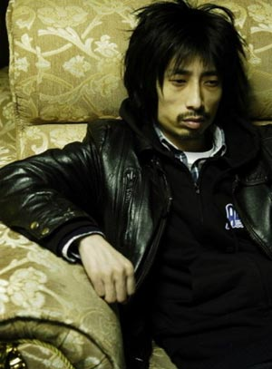

# ＜摇光＞摇滚在怀疑的路上

**既不出摇滚英雄，又已经没有了听众，中国的摇滚乐，中国的摇滚界，在怀疑与被怀疑的路上艰难前行。或许中国的摇滚只能继续在地下小众下去。我看到有人说，这才是摇滚最好的归宿。若真是这样，我也愿意相信，仍然有人会继续用摇滚批判世界，哪怕他们是掌握着真理或者极端错误的小部分。摇滚不死，但愿如此。** 

# **摇滚在怀疑的路上**

## ******文/陈思宇(厦门大学嘉庚学院）**

 

1994年，红磡体育馆，何勇带着一脸不屑登场了。在弹奏一段《姑娘漂亮》的前奏后，他停了下来，大声向香港的观众问道：香港的姑娘，你们漂亮吗？

得到满意的答复后，他高高跳起在空中完成了一个扫弦，然后继续唱了下去。

十几年后，当我第一次在现场看到何勇的演出时，他依然在问现场的姑娘，你们漂亮吗？现场的姑娘依然告诉他，我们漂亮。有那么一刻，我似乎看到他依然尽力起跳，想跳得比以前更高。

只是，那最终落地的，却已经是一个发福的中年人。没有海魂衫，没有新歌，有的只是唏嘘。

十几年过去了，这个当年的摇滚青年，已经摇成了中年。虽然我看到台下，依然有穿着海魂衫的青年，也依然有带着红领巾的我，但他唯一的一张专辑，如今也已不被这一代的多数年轻人喜欢。我们这一代人中的大多数，是听着港台的流行音乐长大的，不听崔健、何勇、张楚或者唐朝，却知道窦唯曾经是王菲的老公，还记得他烧过一辆汽车。

我记得，在九四年那场演出之前，何勇曾经说过，自己要彻底地把垃圾场清除掉，清光清净，而他自己，就是最大的垃圾。如今，他的这句严肃的玩笑话，在某种程度上确实应验了。他和中国摇滚乐，几乎从新一代的文化体系中被清除出去。

对于这个事情，我说不出个所以然来。也许，只有流行乐最能符合这个时代所倡导的精神。在当代，消费主义、拜金主义等等，已经是主流价值观的典范，哪怕许多人嘴上不肯承认，内心和脚上仍然趋之若鹜。而只有流行音乐那种批量生产的效率，才能不断满足多数人的胃口。

坦白地说，我自己也是听着港台流行音乐长大的，并非什么资深摇滚乐迷，只是在最近一两年间，才略微听了一些中国摇滚乐的代表作。但是在这真的为数不多的体验之中，我却时常能够被感动，被召唤。而其中最能感染我的，是他们那一代对于这个世界永不停息的批判和怀疑。

如果我的记忆没有错，大概是在上个世纪80年代，一个叫崔健的人，用一首叫《一无所有》的歌，真正打开了中国摇滚的大门。在这首歌的一开头，崔健就唱到 “我曾经问个不休，你何时跟我走，可你却总是笑我，一无所有”。这样一个问句，在那个动荡的年代，不知道打动了当时多少的追风浪子。

后来，经过那个动荡的春夏之交，人们陷入了更深的怀疑中。究竟我们追求的是什么东西？没有答案。没有答案，那就继续提问。于是，有了中国摇滚乐的黄金时代。从那时起，黑豹、唐朝、魔岩三杰，几乎成了一个时代音乐的代名词。

在那个时候，这些歌手或者乐队，其实并不归属于娱乐明星范围内。他们更属于时代先锋，属于文化符号，甚至属于知识分子。他们用带有批判性的音乐，向这个世界不断发问，有时走向极端，甚至会彻底否定主流价值。

我曾经听到，张楚为弱小的蚂蚁们歌唱，又高唱请上苍保佑吃饱饭的人民；窦唯将高级动物的丑恶摆在我们的眼前，问我们幸福会在哪里；何勇坐在钟鼓楼旁，盯着那只麒麟，不停地问自己，是谁出的题这么的难，到处都是正确答案……

他们的批判和质疑至今仍然掷地有声，尖锐刺耳，直击痛处。然而让所有人都没有想到的是，这些批判和质疑，都被流放在了那个时代，不再向前了。那一年，一位老人在中国的南海划了一个圈之后，这个国家开始向着以经济路线为中心的方向奔去，谁也来不及停下来认真地思考这些摇滚乐者留下的问题。

许知远曾经说过，在当时的情况下，人们听崔健以及摇滚乐，更多地是一种青春地发泄，而不会过多地去沉湎于其中地批判中去。我不记得他的原话，意思大概如此。如果真是这样，那么情况就是说者有心，听者无意。

可是如今再回过头去想想，摇滚乐如果不批判这个世界而只是在鼓噪青春，那么这种摇滚乐很可能只有被流行乐所取代的份。没有人会真正指望摇滚乐去改变这个世界，但是倘若失去了这种不一样的声音，则我们要去哪里找寻一种比摇滚更加归属于灵魂的激情？我们又要为那最后的理想主义情结留下什么曾经存在的证据？

不过，在中国这种大环境下，摇滚乐的退位，是必然。试问我们这一代人，有几个听得懂他们的音乐呢？如前所言，我们中的大多数，宁可追逐明天就会过时的流行歌，也不会选择听充满着不满和呐喊的摇滚乐。今天当你打开任何一张排行榜或者走进任何一家唱片店，你能找到的歌曲，十之八九都在谈情说爱。这种单调和媚俗成为主流，已经不是一年两年了。

我无法也无能去指责这是一种堕落或是什么别的怪象，我听流行乐的时间，绝对超过了听摇滚乐。这个世界本来就应该是丰富多彩的，人们都有媚俗的权利。但是，摇滚乐的衰弱却是不争的事实。

当崔健和魔岩三杰逐渐老去后，那些新的摇滚歌手，自身的实力，多半不足接班。我并不了解现在中国的摇滚乐坛到底是什么情况，这样的批判不来源于我，而是来自崔健。他曾经公开告诉他的后辈们：“不是我挡你们的道，是你们太差劲！”。尽管后来冒出了很多的乐队和歌手，也终于能够把所有的风格都补全了，然而，再也没有人唱出一首能够让一整个国家的青年为之摇滚的音乐来。

既不出摇滚英雄，又已经没有了听众，中国的摇滚乐，中国的摇滚界，在怀疑与被怀疑的路上艰难前行。或许中国的摇滚只能继续在地下小众下去。我看到有人说，这才是摇滚最好的归宿。若真是这样，我也愿意相信，仍然有人会继续用摇滚批判世界，哪怕他们是掌握着真理或者极端错误的小部分。

摇滚不死，但愿如此。

由此，我又想到了何勇。十几年来只出一张专辑的他，不写歌也就不会写出比之前差的作品。这样，他恰如其分地把自己留在了殿堂之上，而没有随着摇滚的衰弱而衰弱下去。

至少，作为伪摇滚迷的我还记得他早在九十年代就已经批判过这个世界“有人花钱减肥，有人饿死没粮”。

前一个，说的是各路的大国。后一个，则是何勇梦里的非洲。只是何勇啊，如今的你，还想去非洲吗？

 

(采编：何凌昊 责编：尹桑)

 
