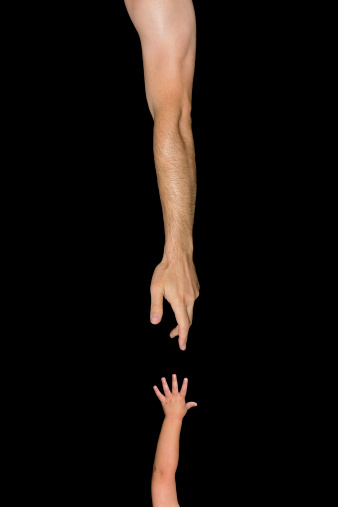
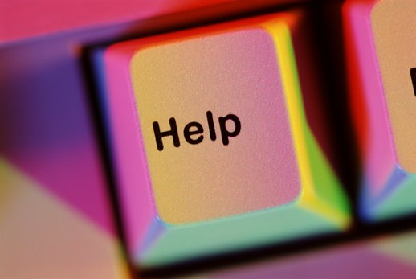

# ＜摇光＞救人与自救

**“救人”这一个情景其实是“助人”的极端版本。我唠叨了这么多关于救人的问题，并不是否定救人的必要性，只是试图尽可能全面一些地思考。“助人为乐”，“乐”在何处。不是说不该快乐，而是要明白快乐的由来。我们习以为常的“助人”一旦推到一个极端/性命攸关的场景----“救人”，就会激发出很多平时未曾想过的问题。**  

# 救人与自救

## 文/王晓龙（青岛大学）

 

2002年的全国高考语文作文题目是这样的：

有一位登山者，途中遇到暴风雪，他深知如果找不到避风之处必死无疑。他走啊走，突然脚下碰到一个僵硬的东西，他扒开雪地一看，原来是一个冻僵的人，他心想：是救他呢还是继续前行？经过心灵翻江倒海的思量之后，他决定救这个人。于是，他脱下手套，开始给那个冻僵的人全身按摩。经过一番努力，终于把他救醒了。于是，两人搀扶着走出雪地。

考试的立意是以“心灵的选择”为出发点。希望引导学生走向高尚的心灵。高尚的心灵体现为选择高尚的行为。

然而我觉得这个话题，这个材料有严重的欺骗性和危害。它美化了高尚行为的回报，美化了故事的结局而隐藏了一个并不难想到的可能后果，就是这位登山者不仅没有把对方救活，还把自己也冻死了。

高尚的人从来不得好报，或者很少得到该有的回报。2010年当武大学生赵小亭在贵州支教遇难后，很多网友留言质疑“好人好报”，为什么好人总没有好报呢？

当时我能想到的回答是，好人没有好报，因为好人担当了更多他可以不承担的事情。比如支教，赵小亭完全可以不去支教而是留在学校或者回家，这不是件强制的事情。山区是有危险的，这点毫无疑问，校园和家里则要安全得多。她选择了支教，就选择了担当一件她本可以袖手旁观的事情。也就选择了承担相应的风险。

也许如果提前知道有生命危险，赵小亭就不会去支教了。但是人永远存在于一种“后知后觉”中，这个世界太大了，人永远都是处在“信息缺乏”中。你对未来一无所知。

同样的例子有很多，比如雷锋。我们假设雷锋确有其人，确有其事，就像我们被告知的那样。

雷锋的死也是因为他是好人，他为了让战友熟悉驾驶，自己下车指挥，结果战友撞倒了晾衣杆击中了他。

一心一意为别人着想，也可能导致自己付出过大的代价。

当然我不是断言说，我们都不要为别人着想了，我们都自私自利才好。我只是把各种可能性都摆出来讨论。尽量让我们在做出选择和决定时，尽可能的处在一种“信息最大化”中。

第一种情况（1+1=2）：正如开头的高考题目，登山者救了快冻死的人，两个人互帮互助走出了险境。

第二种情况（1＋1-1=1）：有人落水了，见义勇为者下水相救，结果把对方救出来，自己却溺水身亡。（当年大学生张华舍身救一位落入化粪池的农民，以一个风华正茂的青年大学生的生命换来一位老农民的生命）

第三种情况（1-2=-1）：有人落水，多人下水相救，落水者被救起，但是多名救人者死亡。（为了抢救两名落水少年，长江大学十多名大学生手拉手结成人梯扑进江中营救，两名男孩获救，陈及时、何东旭、方招3名大学生不幸被江水吞没，英勇献身。）

第四种情况（1-1-1=-1）：有人落水，见义勇为者下水相救，结果两人都溺水身亡。

第五种情况（1+1-？=？）：有人落水，见义勇为者下水相救，把人救上岸来，发现自己的衣物和随身物品都不见了。（贵州小伙王洪到温州打工，见义勇为下水救人，可上岸后钱包身份证被偷，他的行为感动了群众大家纷纷生出援助之手，已有多家单位表示愿意录用这位年轻人。）

第六种情况（1+1-？=？）：一个老人摔倒了，你把他扶起来，他反咬一口，说是你撞到他的，要求赔偿，并且遇到个还真判你败诉让你赔偿的法官。（彭宇案）

当然具体情况是多种多样的，但是这些却都是做好人，或者说救人的各种可能性。

这里面最理想的状况当然是第一种，在这种情况下，救人就基本等于自救了。所以我说这个结局有美化的嫌疑。后面所有的结局都会动摇我们救人和做好人的决心。

y=g-n+x+a-b (当g＜n时，x为零)

y：救人/做好人的回报；g：做好人的付出（give）；n：救人所需要的（need）；x：被救者的心（人心是永远的未知数）；a：救人/做好事可能得到的来自救人者和被救者两者以外的好的回报，比如政府奖励，名誉等；b：来自两者以外的不好的回报，比如脱下衣服下水救人，上岸后发现衣服不见了，或者你救人结果自己受伤，造成医疗费和误工费等等。

这是一个我能想到的对于救人/做好人的回报一个比较简化的说明。只有g＞n时，比如落水者需要会游泳有体力的人去救，而你恰好有足够的游泳技术和体力，g-n＞0，那么最后的结果可能不是太坏。当然，如果被救者是个忘恩负义，以怨报德的人，也就是说x为负数，就像是彭宇案那样，救人者不仅花费了时间去扶起老人，还要为老人的以怨报德付出更多的金钱。

于是我们发现等式右边全是变量。这就造成了y可能性的极度复杂。

这让我想到了一个词，“测不准”。哪怕是科学实验，很多都是测不准的，比如天气预报经常不准。要想预测包括人心在内的事件，就根本不可能了。

到此为止，我并没有更深的思考能力了。结论似乎停留在一个没有结论的层面，那就是：该不该救人，或者好人有没有好报，这是一个“天时地利人和”的问题，决定因素不仅仅来自物理方面，还有心理方面的。

当然，救人等于自救，这个从心灵的角度来说，是有很重要价值的。人总是为自我所困。过于私自，或者过于关注自我。

一个最简单的例子来自狄更斯的短篇小说《圣诞欢歌》：主人公斯克鲁济是一位商人，他成天与钱柜、账本和发票打交道，一生只知道攒钱，毫无人性。他克扣员工的工资，拒绝外甥的问候和祝福，不施舍分文给穷人。然而，平安夜出现的三个精灵带领他回到了过去、现在和未来的一些生活情境，并让斯克鲁济从自制的陷阱和枷锁中解脱出来，领悟到圣诞节的意义和生活的意义。当圣诞节的清晨来临时，人们发现这位曾经一毛不拔的铁公鸡已经变成了一个仁慈、善良而又热情的人。

其实类似的观念并不陌生，中国也说“仁者寿”，“自我即牢笼”。现在有很多心理问题是由于过于专注于自我而引起的，比如前些日子非你莫属上的刘俐俐。

“救人”这一个情景其实是“助人”的极端版本。我唠叨了这么多关于救人的问题，并不是否定救人的必要性，只是试图尽可能全面一些地思考。“助人为乐”，“乐”在何处。不是说不该快乐，而是要明白快乐的由来。我们习以为常的“助人”一旦推到一个极端/性命攸关的场景----“救人”，就会激发出很多平时未曾想过的问题。

就像是我们都喜欢问小孩子，“你更喜欢爸爸还是妈妈”，或者问老公，“如果我跟你妈妈同时掉到水里，你先救谁”，这些都是对道德或者心灵选择提问的极端版本。这种将问题推至极端的思维模式，能够把问题提升为拷问，逼迫我们正视自己的内心。

 

（采编：佛冉；责编：陈锴）

 
