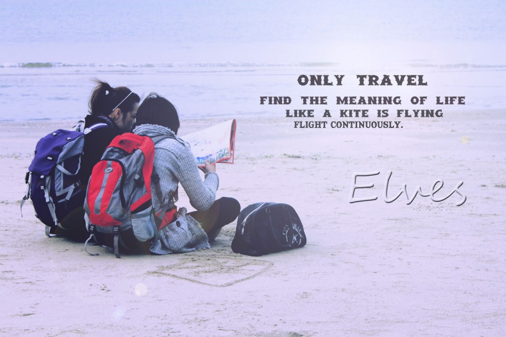

# ＜摇光＞旅行的意义

**这就是一个单向度的世界。人与人的差别仅仅在于手中使用的相机，景色与景色的区别仅仅在于爱好集邮的我们是否去过。我们自以为不同的旅行，能在这个技术天罗地网，价值观逐渐趋同的世界中赋予我们什么样的意义？这毕竟已经不是一个用双脚来丈量和感知天地万物的时代。快捷和高效面前，我们所牺牲和失落的，让人心痛，而更心痛的，是这种牺牲和失落的不为察觉。** 

# 旅行的意义

## 文/张益清（Syracuse University）

 

也不记得是从什么时候开始，文艺的和不文艺的青年们，都纷纷地谈论起了旅行的意义。仿佛旅行，是每一个还有一点点追求的人精神生活不可或缺的部分。时髦的写手告诉我们，旅行是拓展人生边界的重要手段。电视上骄傲的少女说，我已经去过30几个国家。经过大众媒体的渲染、扩张和加强，旅行正在，或者说已经成为精神生活的代名词。

而我自小的旅行经验大多是浅陋和不悦的。90年代初，观光旅游刚刚在中国形成风气，各大单位和企业纷纷开始组织一年一度或者几度的集体出游。大约是94年，我8岁，跟随父母进行长途旅行，只记得一路颠簸，到达景点下车拍乱哄哄的照，买五花八门的纪念品和土特产，再一窝蜂地上车离开。心里纵然不悦和抵触，但和大多数中国的小孩一样，在这件事情上大抵是没有多少自由，因为观了许多人造做作的光，看了许多离别即相忘的景。

到北京念书以后，得到多些自由，乐得不用再去各个名胜景观，像班级出游香山长城之类，我都设法逃脱。直到大学三年级，才和当时一个要好朋友坐车去到永远比火车都拥挤的长城。再等到了美国念书，我也推掉了迪士尼，热带度假海岛的邀约，并等足几乎快一年才去看仅有四个小时距离的，很多人心中的圣城纽约。

此前短暂地去了波士顿，造访了一些所在学校周边的景点，只发现，中国式旅游，只是现代资本社会全面武装人类的一个放大和典型（epitome）。在世界最大的瀑布尼亚加拉，15美元能够让你乘小小游轮进入瀑布深处。夏天的旺季，油轮上只有落脚之地，兴奋的游人大声说笑。游轮接近瀑布，水花迎面打来，四周嬉笑尖叫四起。我却突然想起高中时候听过，隔了好几年的，比约克给电影的主题歌。里面唱说：

Have you seen the Great Wall?

All walls are great if the roof doesn’t fall

……

Have you seen the Niagara Fall?

It’s water, that’s all

……

游客下了邮轮，就能在旁边的纪念品商店买到和瀑布相关的小饰品和纪念衫。大多为大批量制造的廉价物品，但也从来不缺乏购买的人。此后一次次发现，美国的大多游览景点，也几乎全部这样路数。在大都会博物馆，礼品商店永远络绎不绝。宗教主题、文艺复兴和中世纪艺术并不受欢迎，但梵高，莫奈与塞尚被印在明信片、记事本、马克杯上出售。在曼哈顿岛的边缘，付12美元，你就可以近距离瞻仰这个移民国家的象征——那位举着火炬的绿色的女士。付100美元，你就可以登上帝国大厦顶端，领略这城市传说中的非凡夜景。再付100到几百美金不等，你就可以看一场象征着这城市的文化和艺术的百老汇歌剧。

在黄石公园，所有景点都被标记、命名、划分。人们驱车前往，在同样风景前一起驻足张望，拍照，离开。礼品中心当然是不可缺少的，只是这次印在明信片上的不再是缺着耳朵的梵高，而是带着幼仔的母熊。一个间歇喷发的泉水面前，一百多个人同时拿出不同型号的相机齐按快门。

不管你怎么想，我坚持认为这是一个荒谬场景。

这就是一个单向度的世界。人与人的差别仅仅在于手中使用的相机，景色与景色的区别仅仅在于爱好集邮的我们是否去过。我们自以为不同的旅行，能在这个技术天罗地网，价值观逐渐趋同的世界中赋予我们什么样的意义？这毕竟已经不是一个用双脚来丈量和感知天地万物的时代。快捷和高效面前，我们所牺牲和失落的，让人心痛，而更心痛的，是这种牺牲和失落的不为察觉。

此前美国朋友问我，如果我去你的家乡，我能去看什么样的景致（attraction）？我想了半天，答不出来。云南是以所谓的旅游业闻名的，但这也是我最不愿意和别人谈论的关于我家乡的事情。景致如同名著，在不断的宣传和渲染中，成为“你不得不读，不得不看”的象征。而大多数的人，是只为象征而存在的。

而在这一点上，一个因为伍迪艾伦的《午夜巴黎》（或者莫奈的画）而有巴黎梦，一个因为《欲望都市》而有纽约梦，又和为了“一生不得不去”而观光的人，有什么区别？这种波西米亚的、嬉皮的轻浮梦想，不可能担当得起“精神生活”四个字所包含的重量，更和信仰无关。

这就是时代的悲哀，不是我们失落了田园，而是我们标价和消费着田园。

而在那首歌的结尾，女歌手唱说：

I’ve seen what I was and I know what I’ll be.

I’ve seen it all. 

（采编：董一儒；责编：应鹏华）

 
