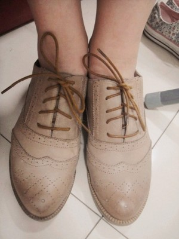

# ＜摇光＞时代小脚

**物质极大丰富之前的不自由是名副其实的不自由，小脚女人的行走不便是名副其实的行走不便；可有着一双双隐形小脚的我们所面临的不自由，不是更加凶险无奈么？想要的得不到，马克思不会骂你，改革社会发展生产力在他看来比清教徒式的禁欲更符合共产主义的梦想；想要的得不到，乔布斯不会骂你，不是因为他已经死了，而是因为他创造的不是苹果、而是原本并无必要存在的消费需求本身；想要的得不到，你自己也不会骂自己，因为你会骂高富帅、骂社会不公不义；正如同男人抱怨女人麻烦的时候，女人总可以回骂其不懂得怜香惜玉。**  

# 时代小脚

## 文/周雨霏（中国人民大学）

 

我妈给我寄了双鞋子，说她买了却穿不了。我一试正合适。穿着它们在寝室里走了一圈，室友评价说：“好女人。” 对此我沉思了片刻，意识到这话的意思是“不行”，因为一般情况下如果一个女人穿上一双鞋子却被评价很“女人”时，说明这个女人本身就不够女人，说明这双鞋的女性气质与她不契合，说明不行（或许还是后面那双匡威比较行）。

然后我又看着这双据称很英伦风的鞋想了想“女人”是什么意思。一念之间觉得大概是“不方便”。这双鞋略有跟，由于身高困境而从不穿高跟鞋的我踩在上面感觉略晃，后跟还有点磕脚；同时它太有气质了，有气质到上半身只能穿裙子，而且是精致、漂亮、“英伦风”的裙子；这也直接导致穿上它之后我整个人的行为举止都必须向着高雅的方向呈现，我必须欠身碎步、笑不露齿、巧笑倩兮、美目盼兮、等等等等。从匡威到高跟鞋，整个人也脱胎换骨；仅仅是一双鞋的变化，就使一个风驰电掣的我变成一个举步维艰的我。

或许“女人”真就是“不方便”的同义词吧。张爱玲世界里的女人一直给我这种不方便的印象。看她们吃的食物、穿的衣服、戴的首饰、品玩的物件、揣摩的心思，无不细到极处、精到缝里，她们的生活不只富足，还在格调、品味上下尽功夫，仿佛不如此生活就不能显示她们是名副其实的姨太太、名副其实的中国古典女性。胜博曾说“delicate”是最能形容张爱玲文学的单词，“delicate：娇嫩、精美、精巧、秀气、纤弱、柔弱、嫩、细、纤巧、易碎、优美、袅、娇致、馐、纤、纤小、肉嫩、忧、楚楚。”——这么多美好的形容词，总结起来也就仅仅是不方便，小脚一般的不方便。小脚把清代女性禁锢在方圆几步的闺房内，因为小脚太美太不方便了，所以她们必须像画廊里的画一样静止不动、像花瓶一样展览自己，坐在原处等着男人们推门而入，而不是自己走出去。等到她们守寡、改嫁、遭厄运、到了必须要自己走出去的时候，裙下的疼痛是她们美丽的代价，由此精致美就蜕变为悲情美。说张爱玲文学里“华丽的腐朽”大概也是这个意思。

读张爱玲之后还感到，原来女性婉约、娴静的内核是可以通过物质的极大丰盛与繁杂来体现的。由此“女人”的深意或许还包含着“物欲”。我有一个干妈甚爱华服，她有超级大的衣柜、设备齐全的缝纫箱，几乎每周她都会购置新品；同时她出色的审美直觉使她能够从一块窗帘布里看见一条漂亮的手工裙子，并且她还真能把这件裙子做出来。她生活最重要和最主体的事务就是处理她对于衣服那奔流不息的欲望。08年地震之后，我们都笑说她有没有抓起干粮和水躲进她的衣柜选择和她的衣服们厮守而不是向外逃命。这也是一双小脚。

当贫穷突然降临，女人的生活或许会比男人更悲惨。这是因为不必为生存担忧的女人往往倾向于遗忘基础的“生存能力”而去极大地发展她们的“生活能力”，而许多男人在物质方面缺乏开拓精神的本性使其往往只是满足于维持在“生存能力”的基本线上；即使有追求，也保留弹性（当然这只是我眼见的大多数男人，不具抽样代表性）。所以当生活跌落回生存，女人的自尊往往受到更大的打击。对此我深有感悟。去年听说胜博同学休学一年、周游全国，并且是以搭车徒步的穷游方式，当时我就心生羡慕，想着自己是否也能如此。可仅仅是一想即知绝无可能，看看我一柜子衣服、一盒子鞋、一排保养护肤品，还有吹头发的风筒、姨妈巾、零食……再看看他背的那么一个小小的登山包。那是我第一次感到自己身为女性难以抗拒客服的缺陷，原来我也有一双小脚。

物质极大丰富之前的不自由是名副其实的不自由，小脚女人的行走不便是名副其实的行走不便；可有着一双双隐形小脚的我们所面临的不自由，不是更加凶险无奈么？想要的得不到，马克思不会骂你，改革社会发展生产力在他看来比清教徒式的禁欲更符合共产主义的梦想；想要的得不到，乔布斯不会骂你，不是因为他已经死了，而是因为他创造的不是苹果、而是原本并无必要存在的消费需求本身；想要的得不到，你自己也不会骂自己，因为你会骂高富帅、骂社会不公不义；正如同男人抱怨女人麻烦的时候，女人总可以回骂其不懂得怜香惜玉。

然而这样的我们就是伟大光荣正确所向无敌的么？在各种可能的方面，我们都是裹着小脚的包法利夫人；在各种可能的领域，“毁灭我们的大多都是光鲜亮丽的事物”。欲望太多，以致每一种欲望的满足除了使我们的生活更加不方便之外，不能再带给我们任何“穷小孩吃到糖果”般的快乐。有一种历史观认为，我们时代的改变已经太多太快了，多到快到任何一个具体的改变都已不能被视为改变——无法为历史断代、不能使其成为一个时代；因此我们的历史正在步入一个因改变太多太快而完全静止不前的状态。或许这就是后现代。连现代化都还没完成的我们，同时还要面临和处理后现代的焦虑，真是命苦。然而提倡节约，既非弘扬革命精神也不是维稳、更不是宗教情怀，而仅仅是能让我们稍微安心一点的委曲求全之计。

正因如此我才真心佩服胜博。他对于事物的欲求近乎于零。买不到心爱的衣服我会痛苦，他不会；吃到美味的食物我立即就进入了“中华小当家”模式，而他云淡风轻，表示有米饭即可；我追求享受看重品味，他“安贫乐道”、易于满足。有一次我批评他，你怎么能对世界如此地缺乏热情，他答曰在那样艰苦危险的境况下走遍那么多的地方，身体已经已经太能屈能伸了、欲望已经太淡薄了、怎么样都够了。那一瞬间我就什么都明白了：我是假享受，他是真自由。

我还是穿我的匡威吧。

 

（采编：何凌昊；责编：尹桑）

 
