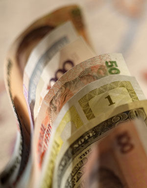

# ＜摇光＞春运三部曲之二：价格原理与“租值耗散”

**价格的神奇之处就在于，它不是去调查你成本是多少，收益是多少，它不仅调查你，还要你实实在在地拿出来。你路上看见一个人，你怎么知道他有多想吃巧克力，你问他怎么知道他是不是撒谎？所以靠不住。不如你卖个巧克力给他，问他愿意出多少钱，这很可靠。需求价格很贴近真实地代表了社会收益，供给价格很贴近真实地代表了社会成本，因为他们产生的每一步，都是要人实际地进行支付，而不是空口说白话。**

# 春运三部曲之二：

# 价格原理与“租值耗散”

## 文/卢卡翔（南开大学）

 

上篇文末说到要说价格。为什么经济学家那么爱使用价格工具，他们是不是脑子被烧坏了，得了强迫症，此文详细谈谈。

众所周知，经济学是考虑资源分配的学科，分配资源，考虑的就是成本与收益。要考虑成本和收益，就要找一个工具，去发现成本和收益。不是领导估计一个成本，就是真实的成本；或者说大家开个会，讨论半天，就知道了成本是多少。一个商品总由多个生产要素产生，每个生产要素的重要性是多少，如何才是最节省的方式，不是拍脑袋就能知道的。估计成本还算容易的，如何估计收益？经济学讲的收益最终要落在众人的幸福体验上，这个幸福体验由谁说了算？

价格的神奇之处就在于，它不是去调查你成本是多少，收益是多少，它不仅调查你，还要你实实在在地拿出来。你路上看见一个人，你怎么知道他有多想吃巧克力，你问他怎么知道他是不是撒谎？所以靠不住。不如你卖个巧克力给他，问他愿意出多少钱，这很可靠。需求价格很贴近真实地代表了社会收益，供给价格很贴近真实地代表了社会成本，因为他们产生的每一步，都是要人实际地进行支付，而不是空口说白话。

随着供给量的提高，单位商品的社会成本会提高；随着满足的需求量的提高，多满足一个需求量的收益会降低。这个叫边际成本递增和边际收益递减，经济活动一般在这个条件下进行。如何保证供给量不会太少以至于没有充分利用社会资源，供给量又不会太多以至于社会成本大于社会收益，只有价格是一个很好的衡量。供给量多了，体现商品收益的价格支付低于成本，供方不满意，就只好降低供给；供给量不足，意愿支付的价格高于成本，供方有利可图，就会提高供给。

当价格上涨被政府约束，就低于均衡价格。相对于均衡价格状态，在政府规定的低价上，需量更多，供量更少。如果是行政垄断行业，理论上政府可以保证供给量和均衡时一致，但实际上政府也不知道均衡产量该在哪里；需求量因为价格过低而增加就更不是政府可以控制的了。第一个损失就是市场将按照降低了的供给量来交易，社会资源没有得到最大化地利用。如果由政府来提高供给量，又不知道提高到什么程度为好，往往政府刻意满足消费者的需要，把供给量提高到一个成本高过收益的水平（这时候供给量依然可能低于需求量），贵国的铁路就是这样。

第二个损失就是“租值耗散”：供给量低于需求量的时候，供方损失的这部分价格并不是就由需求者得到。这是人们很容易犯的错误。以为火车票价格较低，就是坐火车的人得到了好处。这种错误忽视了价格只是表现竞争的一种方式，价格被压低了，不仅没有消除，反倒增加了竞争。这竞争不以价格的方式呈现，必然就将以其他方式呈现，比如排队，比如利用黄牛，比如走关系等等，这些都是变相的价格支付，只是比直接支付货币稍显隐蔽。谁最能排队，谁最能利用黄牛，谁最能走关系呢？必然不是穷人。以为火车票价格降低就是穷人得到了好处的，显然是想当然了。

就拿民工最擅长的排队来说。一天工资少说也有50元，多的100多元，花一天时间去排队，买一张低价火车票，这低价的部分值不值这一天的工资呢？当然有人说他可以一次多买几张，但是谁说只排一天队就一定能买到呢？再拿网友“斗西”的话来说：“电话订票一分钟9毛信息费，买张票话费起码也要搭三五十甚至上百。不光这些，时间呢？饭店服务员月薪都三千了，一天一百，排队一天就损失一百，上网刷一天12306又损失一百。让黄牛赚二百，轻轻松松买车票，不浪费时间不遭罪，服务质量比铁道部好多了！”

此外，这低了的价格，是无主产权，不仅仅需求方想要，供给方也想要。供方可以怎么要呢？他无法提价，他就可以放松服务质量、减少创新、把附属产品比如餐饮卖得贵一点。这个不只适用于铁路客运，石油、自来水、电力，价格管制的行业莫不如此。前几天有同学说到买火车票的遭遇极其凄惨，我吐槽说还请国家补贴售票员的态度，就是一个例子。

所以说，租值耗散使政府的价格管制几乎没有便利到穷人，反而造成无谓的浪费。人们可以把价格交给铁道部，然而国家从铁道部获得财政收入然后反哺穷人的好处，硬生生被消耗在隐蔽的价格竞争和各种避免票价上涨的机制设计中了。政府定价过低，导致车票供不应求，于是黄牛出现，于是要打击黄牛，于是黄牛要躲避打击，于是发明了实名制，于是黄牛继续寻找实名制的漏洞，人流量一大实名制就名不副实（我看很多地方人流量小的时候都名不副实），最后是实名制下的供不应求。绕了一大圈，从供不应求变为实名制下的供不应求，这时候中国人都觉得舒服了。（如果把这种舒服视作“正的外部性”的话，也算是价格管制找不到的几个好处之一了。）

明天写第三篇，顺便学习一下机会成本的概念。

 

（采编：楼杭丹；责编：麦静）

 
