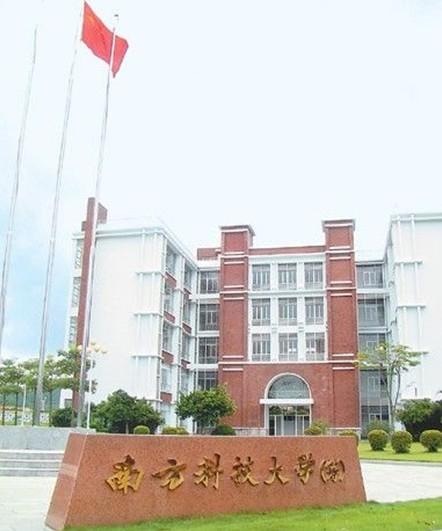

# ＜摇光＞是一个教育乌托邦吗？——我看南方科技大学

**本质的问题是南科大的步子迈得太大太急，理念当先，但是对操作路径和难度事前缺乏认识或者具体考量。我觉得也许靠谱的方法是应先建立类似中科院下属研究所性质的研究机构，建好硬件设备以后高新招聘海内外人才，同时招聘博士后，技术员，并与知名大学合作培养研究生。有一定规模和科研成绩以后再拉起学校大旗，建立本科部。**

# 是一个教育乌托邦吗？

# ——我看南方科技大学

## 文/酱油郎独占花魁

前一段时间南方科技大学朱清时校长来MIT开南科大宣讲兼招聘会，无论是朱校长还是南科大都是久仰大名，这样近在咫尺的机会自然要去观摩领教一番。朱老师的形象倒是很难与他那些在媒体上，会议上犀利的言辞联系起来，就是一副温文儒雅老科学家的样子，南方口音，说话语调不高，语速也不快，恂恂如常人也。但是听完宣讲会，我确实对南科大的现状和未来有点无法乐观。 媒体所报道的南科大消息，多侧重于渲染“去行政化”，“自主办学”等等概念，对于学校的实际操作运行层面鲜少揭示。而在宣讲会上，由于也是招聘会，朱校长具体地讲解了南科大目前的法律地位、资金来源，行政操作以及教学科研设计等等方面。了解得越多，不由让人越对南科大的未来更为担心。 对于很多人关心的南科大所处的法律地位与生存空间，我倒并不十分担心。北师大林伟在哈佛教育论坛会刊上的文章，切中肯綮地指出了南科大光环下面的隐忧，我颇有几处心有戚戚焉，然而也有存异之处。林文以为，南科大实际是深圳市地方行政政策的产物，在有限的地方法权的庇护下获得一定的生存空间，总体来讲处于无法可依的状态，未来充满了不确定性。未来的不确定之说诚然不错，然而依改革开放40年的经验来看，深圳市作为特区有足够政策甚至法律上的空间来操作此事。深圳有在当今法律大框架下“特事特办”的丰富经验，南科大的出现在深圳历史上开风气之前的事例中并不算特别出列的事情。甚至将来南科大的模式推广到全国也不是不可能的，其他的特区，直辖市，计划单列市，都会有这样的政策和法律空间----前提是，南科大要办的成功。只要南科大树立起一个成功的样板，这种办学模式的扩散可以出现在一夜之间。因为办一个好大学不但是带动地方经济提升教育的好事，也是政绩之一种。中国的事情总是好事大家蜂拥而上的，从这十几年来一波一波席卷全国的高新技术开发区热，房地产热，影视城热等等就不难预期这种扩散。 

然而，这一些都要建立在南科大成功的基础上，正是这一点我非常存有疑问。南科大目前的口号是，办一所“教授治校”的先进研究型大学。这种理念无疑是先进的，符合世界领先大学的潮流的。也许是朱教授在长校中科大期间，痛感大学行政机构和官僚主义对教学和科研之掣肘，才大声喊出“去行政化”“教授治校”的口号，希望以南科大这块试验田，来实践这种理念。这种勇气和开创精神，无论如何都是值得赞佩的。然而回归到具体操作层面，个人认为南科大对于实际的困难还是估计不足，策略的制定略偏理想化。不依托任何现有学校、科研机构，凭空造出一座空中堡垒似的“先进”研究型大学到底有多难？这真是一个问题。 在招聘会上很多人首先就提出了资金来源的问题，深圳市的财力，结合可能的其他资本，能否支撑一所先进研究型大学的出现？朱老师用具体的资金数字和南科大校园照片进行了回应，似乎并没有完全说服大家，因为大家对大学建立运营到底需要多少钱还是没概念，多少算多，多少算少呢？我倒觉得钱并不是南科大目前的最短缺的部分，我们也许可以从经济规模尺度上稍微分析一下为什么。说到凭空建一所好大学，我想香港科技大学也许是个是最近的“榜样”。港科大91年才建校，十几年间就蹿升成为香港理工科最好的大学，超越了老牌的香港大学和中文大学。如果说中国还有这样一片可以进行类似的教育乌托邦试验的场地，那就是深圳。从大范围着眼，香港2010年的GDP大约1万6千亿，深圳大约9500亿，约香港的一半多。而深圳的教育投资，09年约140亿元，约为GPD（7806亿元）的1.8% . 同期香港的教育投入为582亿港元，约486亿人民币。考虑到香港有好几所好大学而深圳目前只有一所深圳大学，深圳出钱办教育的能力并不弱于香港太多。如果南科大暂行管理办法，能够以深圳地方法的形式确立下来，保证每年深圳以一定的资金注入南科大，就差不多就能保证基本运营和稳步发展。全国其他很多省属，市属高校也是主要靠地方财政支持的，很多办得也不错。以深圳的经济实力，加上丰富的企业资源，办一个“不差钱”的大学至少是有可能的。 然而光有钱离“研究型大学”的目标还差得很远很远。朱夫子诗：问渠那得清如许，为有源头活水来。学校活力和发展的源头是人，是学生，是老师。而吸引好的学生投考的根本元素，还是“师”，“资”都还在其次。朱校长不远万里跑到美国来，就是为了招聘教师，而且是科研水平高的教师。在南科大的广告里，宣布要招收100名各级教授，从assistant professor到full professor都招，完全学习美国tenure track体制，还要招100名博士后。但我觉得恐怕现实要让朱校长失望了，因为南科大目前完全不具备吸引高水平科研人才的条件。南科大目前的教师，主要是朱校长利用人脉关系，从港大，港科大等学校请来的教授，虽然都是院士级人物，但一来他们早已功成名就，过了紧张的职业发展积累阶段，二来他们都是兼职，并没有放弃原学校的位置。长期来看一个大学显然不能靠兼职教授过日子。而南科大想要招聘的年轻教师则不同，他们都处于职业发展初期，需要快速地给自己积累学术资本，一个良好的科研环境是比个人待遇更重要的事情。如果说实验室和仪器的硬件条件还是可以靠钱堆出来的话，南科大目前连科研的主力军——研究生都不能招，谁又敢闯进去，一个人既教书又单枪匹马地搞科研呢？教师有限而且多半是兼职，能开设的课目也有限，所以林伟文称南科大更像是“高中理科基地班”或者“科大少年班”的延伸，是非常准确的。 

南科大号称全盘引用tenure track制度，实际只得其形，不得其神。Tenure制度不只是先试用再给铁饭碗这套东西。它同时也保证了Tenure track的faculty member一进学校，就可以建立独立的研究组，可以独立申请经费，独立地招博士生，博士后。通常学校还会给予足够前两到三年买仪器付学生、博士后工资，以及开展前期工作的启动经费，就是start-ups. 给予你你、充分的自由，充足的经费，让你用5,6年的时间证明你是否适合这个教学研究职位，这才是tenure track制度的要义，而不是只是assistant, associate以及full professor这些名头。没有博士生甚至硕士生，根本无法吸引科研人才加盟。南科大提出要招100名博士后，相对于100个教授职位来说，这个数字少得可笑。而且，博士后通常也是有心要走学术路线的年轻人，有多少人又敢把自己的博后生涯寄托在南科大这个毫无学术历史和声誉的学校呢？从这一点上来看，南科大要找到高水平科研人才，建立研究型大学，可以说希望渺茫。找不到教授，所谓“教授治校”的话也就成为空架子，到头来还是要靠朱校长一个人奔走。 香港科大之所以可以迅速成长，因为研究生招生不需要大陆这样的审批形式，另有一套灵活的评估方式。大陆即使存在有年的大学，要招硕士生博士生，也需要报硕士点，博士点到教育部审批，教育部根据过去数年的教学科研评估酌情授予。我觉得相对漫长严格的审批还是好处多于坏处，特别目前已经面临大规模扩招师资不足造成的文凭水化现象，研究生招生资格的口子绝不可以轻开，否则满地克莱登文凭不难预见。但这套制度也决定了，南科大这样本科招生尚属于“非法”状态的学校，获得研究生招生权毫无希望。 本质的问题是南科大的步子迈得太大太急，理念当先，但是对操作路径和难度事前缺乏认识或者具体考量。我觉得也许靠谱的方法是应先建立类似中科院下属研究所性质的研究机构，建好硬件设备以后高新招聘海内外人才，同时招聘博士后，技术员，并与知名大学合作培养研究生。有一定规模和科研成绩以后再拉起学校大旗，建立本科部。这样教师一边在研究所从事科研，一边在学校从事教学，教着南科大的本科生，也指导着其他学校的研究生。时机成熟以后再申请建立自己的硕士点，博士点就顺理成章了。即使目前南科大已经开始招收本科生，现在实行这套方案也许还为时不晚。其实很多大学都在深圳设有分部和科研院所，光清华大学就建了两个研究院，清华深圳研究生院和深圳清华研究院。以南科大的名义建立研究所，和这些学校合作，以人才和硬件资源换取分享研究生资源，并不是不可能，何况还有临近的广州和香港大学群。 

以上部分写于几个星期前，最近高考来临，又爆出了教育部要求南科大已经入学的学生参加高考而学生拒绝的新闻。大部分舆论，以及朱校长本人，都把学生参加高考视为“招安”。一旦接受了招安，这次试验就等同失败。我不认同这种想法，事实上，相比“教授治校”的主要改革目的，“自主招生”并不是特别的重要。无论什么样途径招学生进来，教的不都是学生吗？最重要的在于怎样教学生，而不是怎样挑学生。高考不是一个最好的招生办法，但是目前在中国没有别的办法比高考好，纠结在是否要高考，是否有形式大于实质之病？实在需要，也可以特招，降分录取嘛。其他大学，比如“华约”、“北约”的自主招生考试不是已经遍地开花了吗？所以，比起如何招生的问题，如上所言如何招老师，搞科研是更长远也更紧要的问题。 南科大的出现，人们除了觉得新奇和略存疑问，对于“教授治校”的研究型大学还都是翘首以盼的。所以更希望这个教育乌托邦的试验能够成功，在传统大学改革之外再开一条新路，而不是看到它暗淡收场。通过以上的简略分析，可见实在困难重重，朱校长和有决策权的人们实在是任重道远，惟愿他们秉持理念的同时，能够更脚踏实地一些，不能光以热情号召，而要辅之以因时因地制宜的灵活手段和决策。 **附：本文发表于《****哈佛中国教育论坛》网刊**** **

（采编：陈锴；责编：陈锴）
