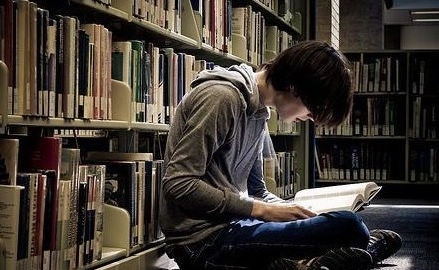

# ＜摇光＞暴民的基因

**我身上就流着党同伐异、消灭阶级敌人、打倒一切反动派的文革血液，我对外人的不正义眼里容不得一颗沙子，却从来没有意识到自己也是那个屌样。**  

# 暴民的基因

## 文/梁健航（暨南大学）

 

我讨厌同性恋是从高中的一个室友开始的（无论腐女们的良心如何泛滥，我都不得不正视这个事实）。先不说其他的，我是第一次真正目睹男生长胸毛的——总之除去他的言行举止，他拥有一个男性体征奇重的肉身。但是他喜欢细着自己沙哑的嗓子嗲嗲地说话，他喜欢扭着屁股走路，他从来不愿意在我们面前裸露上身，其他男生打他玩的时候，他的呻吟就像Ａ片女优那样高潮迭起。他还永远只和女生泡在一起，他像女生那样，喜欢背后窃窃私语地说人是非。

总之这一切让我面对他时非常不自然。我们一开始用恶毒的玩笑嘲笑他，到后来用枕头、纸箱一类不重的东西扔他，再到后来，我们发现他同他的姐妹说我们的是非，就开始在宿舍里面排挤他了。我们偷吃他的东西，把他的枕头、书之类藏起来，我甚至用性病广告编了一首很侮辱人的顺口溜，用水性笔抄，抄满了他的床头。他气得话都说不出了，好像想要杀人，前面说过，实际上他是一名非常健硕的男子，打架我是不一定打得过他的，我怕得马上帮他擦掉。总之，最后他只好调宿舍了。我们成功地排除了异己，有一种类似法西斯屠杀犹太人后的快感。

这些经历对我来说是耻辱的，我从来不会想起它们。因为今天的我骂这骂那，一副永远正义、永远正确的样子，必须得把这样的记忆抹掉。想起这样的事，并且厚着脸皮、冒着被同性恋者和娘娘腔和腐女喷死的危险写下来，是因为余秋雨大师最近接受台湾记者采访时，是这样批判中国人的：

“文革不是政治运动，是暴民运动”，“中国史家多着墨于批判暴君，而忽视了暴民”。他还向台湾记者强调：“大陆现在暴民状况比文革严重，过去言论出不了单位，而今因媒体而铺天盖地。”

看了后半句，再结合余老师诈捐之类的新闻，余大师指桑骂槐之意不言而喻。虽然他的结论好笑，但是他作为论据的前半句，起码是我，因为我高中迫害娘娘腔的行径，是怎么都躲不掉的。我身上就流着党同伐异、消灭阶级敌人、打倒一切反动派的文革血液，我对外人的不正义眼里容不得一颗沙子，却从来没有意识到自己也是那个屌样。

我认为歧视与迫害都自然而然并且难以避免。歧视的产生源自恐惧——作为异性恋者，不自觉地对同性恋产生恐惧；作为贫农阶级，不自觉地对地主阶级产生恐惧；作为雅利安人，不自觉对优秀且富有的外族产生恐惧，克服恐惧，就像克服悲伤、克服快乐一样困难。因为恐惧，就不得不转化为歧视，说是歧视别人，我认为本质是保护自己。而且让人尴尬的是，歧视所产生的快感是强烈的——渺小的人可以在群体里面找到存在感，不再感到自卑，而且狂妄自大、目空一切，通过迫害其他群体以证明自己强大。你以为反日反美反韩风潮一浪接一浪，是民间可以自发形成的吗？内部矛盾得不到解决，就给屁民打两针民族主义鸡血，这样转移矛盾，可是维稳于无声无色之中。

既然如此，就得多保持一些理智和谦卑。前段时间孙海英大摇大摆反同，我也跟着骂了两句，接着陷入了网络上一轮接一轮的论战之中，以致最后我就杯具了，被某同性恋呼朋引伴辱骂。我就知道，虽然大家都满口仁义道德，其实谁都剔除不了身上暴民的基因。我歧视你你歧视他，谁也不比谁更神圣。由此我学精了：喊“自由”“正义”之类的口号之前，别乱侮辱汉语，先想想自己般配不般配。

 

采编：麦静；责编：麦静

 
