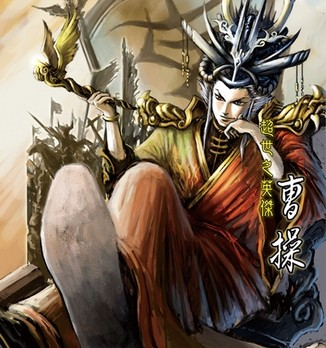
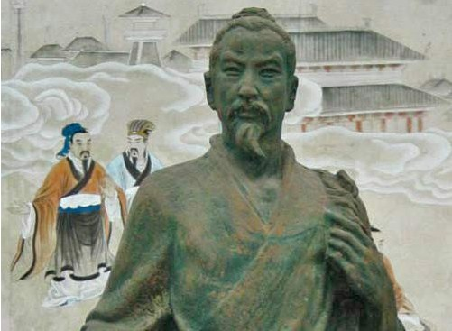

# ＜摇光＞曹操与杨朱：谁是最自私的人？

**令人唏嘘的是，“利己自私”的曹操掌握着所向披靡的暴力，更掌握着书写历史的权力；“权利自私”的杨朱却只能给后人留下屡遭曲解的只言片语。当曹操们用“江山社稷、太平盛世、家国天下”来蛊惑你献出“毫毛”的时候，你只能一遍遍地提醒自己，只有你自己才是这根“毫毛”的主人。**  

# 曹操与杨朱：谁是最自私的人？

## 文/方忱（外交学院）

 

谁是最自私的人？

这是一个很难回答的问题。天性决定了每个人都有自私的一面，完全“无私忘我”的人是不存在的。所以，无论在哪个文明中，一旦有人接近了“无私”的层次，人们总会视他为英雄。西方有为人类赎罪而甘心钉死在十字架上的耶稣，东方有为驯服洪水而三过家门不入的大禹——正是因为“无私”的格外难得，他们的故事才被代代传诵。相应的，由于“自私”是每个人的天性，极度自私的人当然比极度无私的人多得多。所以，要在那么多自私的人里找到最自私的那个，难度显然很大。

当然，我们并不是毫无线索。自私尽管是人的天性，但是在“无私”面前，它无法站在道德制高点。于是，凡是那些以“自私”之名传世的人物，基本全是反面人物、反面教材，他们的存在意义仿佛就是为了衬托“无私”的伟大和“自私”的卑鄙。

西方最出名的自私鬼可能就是犹大。“自私”的他为了30枚银币而出卖了“无私”的耶稣。从中不难看出，自私与许多其它的负面品格也是联系在一起的，比如背叛、贪婪、懦弱，当然还有吝啬——西方有葛朗台，东方有严监生。但是，把这些自私的家伙们放到一起比较，却很难比出个高低。除了他们各自的经历、背景没有可比性外，更重要的是，我们自己，包括笔者本人，难道能保证自己可以时时刻刻抵制“利”的诱惑而舍生取义吗？难道没有人干过比犹大为了金钱而出卖师长更自私的事情吗？答案恐怕是否定的。

所以，我们根本找不到那个“最自私”的人。我们只能退而求其次：谁说过最自私的话呢？

寻找这个答案似乎不那么难了。虽然每个人都有“自私”的一面，但极少有人会把自己的自私放到台面上讲。毕竟“自私”经常是贬义的，至多也只是中性的，产生不了任何道德优越感，甚至还会产生负罪感。不过，历史上竟还是有那么几个胆大包天的人物，偏要告诉世人自己有多么“自私”。他们不但丝毫不为自己的“自私”感到内疚，反而凭之以立，引以为豪。他们中的典型，就是曹操和杨朱。

先来说曹操。作为一个家喻户晓的人物，曹操的那句“宁教我负天下人，休教天下人负我”无疑是最能体现他“奸雄”本色的语录。虽然这句话出自《三国演义》，真实性不可考，但是无论这句话是否是曹操本人所说，它都能生动地与曹操在历史中的作为相呼应。在曹操的一生中，翻手为云、覆手为雨的权争和杀人如麻、白骨盈野的血战都是家常便饭。他为了维护自己或大或小的利益而牺牲臣子、牺牲朋友的故事比比皆是，更不用说牺牲普通百姓了。

当然，实际这么做的不仅仅是曹操。事实上，历代的帝王们都是“宁教我负天下人，休教天下人负我”的，只不过只有曹操一人把真相说了出来而已。如此看来，曹操的这句话真是再自私不过的了——他把“自己”放在“天下”之上，还有什么比这更“自私”的吗？

有。这个人就是杨朱。

杨朱是先秦时代的思想家，被认为是道家的早期代表。他的学说曾在先秦时代风靡一时，按照《孟子》的说法就是“杨朱、墨翟之言盈天下。天下之言不归杨，则归墨。”也就是说，当时的人们不是信奉墨子，就是信奉杨朱——这是多么巨大的影响力。然而，杨朱并没有作品传世，今天我们只能通过《列子》、《孟子》、《韩非子》、《吕氏春秋》等著作中的描述来构架他的思想了。

那么，杨朱主张什么呢？用四个字概括：一毛不拔。

《孟子》在谈及杨朱的时候，说他的思想是“拔一毛而利天下，不为也”。而《韩非子》则说，杨朱“不以天下大利易其胫一毛”。成语一毛不拔就是从此而来。似乎在杨朱看来，哪怕可以有利于全天下，哪怕他只需要付出一根毫毛的代价，他也不肯做——这岂不是比“宁教我负天下人，休教天下人负我”的曹操更自私？对于曹操来说，虽然“自己”比“天下”更重要，但是“天下”并非不重要。只要自己不付出什么实质性的代价，对那些有利于天下的事情当然也是欢迎的。如果天下一直“受害”，那对维持曹操自己的统治地位也没好处。所以，曹操的“自私”是指在“自己”和“天下”发生冲突时，选择“保全自己，牺牲天下”。然而，对于杨朱来说，哪怕“自己”和“天下”没有实质冲突，只须用毫毛便可换来天下之幸福，他也绝不交换——这真是“自私”到了极点啊！

我们不禁要问，如果杨朱的自私真是极端到了这种程度，他的思想怎么可能风靡天下？为什么连“拨一毛而利天下”这么合算的买卖也不做呢？为了回答这个问题，我们需要回顾《列子》记载的一段著名对话。

禽子问杨朱曰：去子体之一毛，以济一世，汝为之乎？杨子曰：世固非一毛之所济。禽子曰：假济，为之乎？杨子弗应。禽子出语孟孙阳。孟孙阳曰：子不达夫子之心，吾请言之，有侵若肌肤获万金者，若为之乎？曰：为之。孟孙阳曰：有断若一节得一国，子为之乎？禽子默然有间。孟孙阳曰：一毛微于肌肤，肌肤微于一节，省矣。然则积一毛以成肌肤，积肌肤以成一节。一毛固一体万分中之一物，奈何轻之乎？

这段话是说，一个叫禽子的人找到杨朱，问道：“如果拔您的一根毫毛可以匡扶天下，您会去做吗？”杨朱答：“世道并非一根毫毛就能拯救的。” 禽子追问：“如果可以，会去做吗？”杨朱不再回答。禽子出门后将此事告诉孟孙阳，孟孙阳说：“你不理解杨朱先生啊，还是让我来告诉你吧。如果，有人用万两黄金来换对你的一顿痛打，你愿意换吗？” 禽子答：“我愿意。”孟孙阳说：“如果断你一条腿，给你换取一个国家，你愿意换吗？” 禽子默然不答。孟孙阳接着说：“毫无疑问，毫毛不如肌肤重要，肌肤不如四肢重要。但是，没有毫毛哪来肌肤，没有肌肤哪来四肢？一根毫毛虽然微小，但它难道可以被轻视吗？”

从这里，杨朱“一毛不拔”的原因终于被揭开了。杨朱所谓的“拔一毛而利天下，不为也”并不是因为这根“毫毛”本身对自己多么重要，而是担心一旦这根“毫毛”因为“天下之利”而被献了出去，将来也许就得献一张皮、剁一条腿。“以毫毛换天下之利”看上去很美，但谁能保证它不发展成“以人头换天下之利”呢？如果，在被“天下”索取“毫毛”时无动于衷，等到“天下”来索取“人头”时，换是不换？

这，就是杨朱思想的深刻之处。曹操自私，在于他“损人利己”，更在于“就算不损人，也须利己”；杨朱看上去更自私，但实际上他并不是为了“利己”，而是为了保护“是否利天下”的决定权——假如是我自愿付出代价“利天下”，那么不要说“毫毛”，献出我的“人头”也可以。但是如果我不愿意，那么谁也不能用“利天下”为理由侵犯我的利益，哪怕这个利益如“毫毛”般渺小。更进一步说，曹操的自私是“利己自私”，而杨朱的自私是“权利自私”。

“利己自私”和“权利自私”有什么关系呢？不难发现，我们的历史正是一部大权在握、呼风唤雨的“曹操们”向手无寸铁、走投无路的“杨朱们”不断索取的历史。“曹操们”打着“天下之利”的旗号，索取“毫毛”、索取“肌体”，最终还要索取“人头”。从纸面上看，杨朱“拔一毛利天下而不为也”是最极端的自私，而那些自称“匡扶汉室，平定四方”的帝王将相却显得无私崇高。在“无私”的掩护下实现“自私”，正是历代暴君独夫的不二法宝。

令人唏嘘的是，“利己自私”的曹操掌握着所向披靡的暴力，更掌握着书写历史的权力；“权利自私”的杨朱却只能给后人留下屡遭曲解的只言片语。当曹操们用“江山社稷、太平盛世、家国天下”来蛊惑你献出“毫毛”的时候，你只能一遍遍地提醒自己，只有你自己才是这根“毫毛”的主人。

 

（采编：何凌昊；责编：尹桑）

 
