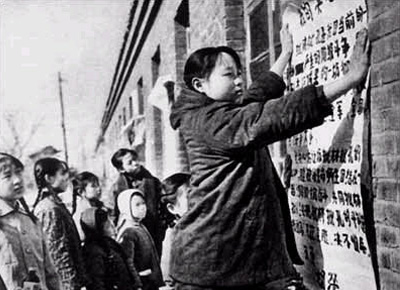
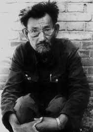

# ＜摇光＞最后一代

**我有时想，历史帐怎么算，被共产党欺负过的所谓的富农，地主，他们的苦怎么算。现在我觉得，历史的东西，恐怕过去就过去了。比如传统的这代人，就这样过去吧，一切的苦难，不公，愚昧，麻木。死掉，就过去了。以后的人们过好就可以了。**

### 

### 

# 最后一代

### 

## 文/侯川川（清华大学）

### 

有几个妇女，一块儿坐着车（大概是农用三轮车）去庙里烧香，路上出了车祸，死了好几个人——一辈子都在烧香拜神，祈求保佑平安，最后，死在了这上面。 假如这是个杜撰的，没有背景的段子，那就是个很好的讽刺故事，甚至可以用来教育小孩子封建迷信害死人。只可惜不是。这件事情发生在几天前，我家附近的一个村子里。这种事情和很多事情一样，在我心里没有任何理性意义，得不出什么结论，也没什么意义可以发掘，只有单纯的悲哀。 我上马哲课的时候，唐文明老师说过一个观点，以前的人们，有所谓的“封建迷信”，其实恰恰是理性的表现。很多现象自己无法解释，就会顺理成章的解释为什么神什么鬼，出于求生的本能，更会顺理成章的敬畏供奉这些东西。 就是这种理性的“求生的本能”以及这种本能的无法满足，以及为满足这种本能而出现的很多事情。让我总会产生很多感慨。 我家所在的村子，以前是极其穷的村子。地理位置不好，土壤不好，更要命的是缺水。在60年代以前完全是靠天吃饭。亩产最多在一二百斤左右。在40年代的时候，几乎是全村出去向南逃荒，只留下几个懒汉，回来以后发现全饿死了。（60年代大饥荒之后的全民水利确实彻底改变了农业面貌，因为有了水池和水库，本村粮食产量翻了数番）。我们村的老人们，都还记得逃荒到徐州的情景。 大概正是这种穷的磨难和记忆，产生了多少让我感慨的，人，干的事情啊。 

 我的伯父，一个农民，盼望致富，开始养猪。正好赶上猪瘟，死光了。从此以后，一个算命先生全家住进了他家里，吃他家里的，用他家里的。并且给他指出了明路：我奶奶的坟地，对他家不好，对我家倒是好的不得了（已然把我的考上大学算到我奶奶头上了），必须破掉。 于是，一个深更半夜，我伯父拿着一把桃木卷（象征着什么大家都知道吧），在我奶奶，他亲妈，的坟地周围钉了一圈。 我不知道用一个什么样的标准评价我的伯父的这种行为，用科学上的，愚昧？用亲情上的，不孝？用道德上的，心黑？用智力上的，缺心眼？ 我越来越感觉，我学到的一切的价值标准，其基本假定是用在一个拥有现代人格的人的身上。如果没有这个前提，根本不能用这些标准来评价一个人，比如说传统的中国农民，至少是我见到的中国农民。 苦难造成了很多东西，给人身上烙下了很多的印记，为了求生存，作出的很多事情，不符合理性，不符合逻辑，完全也不符合其自身的现实利益。 这就是我对我所知道的传统烙印多于现代熏陶的中国农民的行为模式的理解。 

 这样的传统中国农民，大概走到最后一代了。与我同代的农民，我当年的同学们，我不知道将来会是什么样，应该会有很大的改变吧？ 我有时想，历史帐怎么算，被共产党欺负过的所谓的富农，地主，他们的苦怎么算。现在我觉得，历史的东西，恐怕过去就过去了。比如传统的这代人，就这样过去吧，一切的苦难，不公，愚昧，麻木。死掉，就过去了。以后的人们过好就可以了。 

### 

### 

（采编：陈轩 责编：陈轩）

### 
