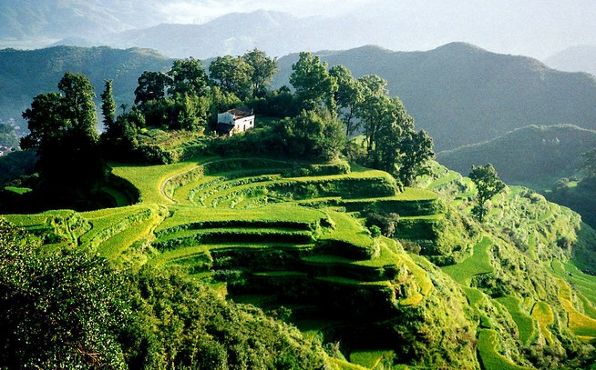

# ＜摇光＞最好的一年

**所以到这个年底的时候，我并没有被各种各样的报道制造出“忧伤”的情绪，我依然相信，在这个时代有你们和我同路，我们一起喝酒，唱歌，一起围观，讨论，一起观察，记录，是一件美好得无以复加的事。或许我们都选了hard模式，但是既然玩这场游戏，就不妨享受这种模式。**  

# 最好的一年

## 文/元淦恭（中国人民大学）

 

2011年的最后一天，是个工作日。来到办公室，做采访，写稿。这是最近四个多月来我工作日的常态。因为马上就要回成都，手头没有杂志稿，今天做了一个群体性事件的网络稿，最后还是因为种种原因没有发出。

对于媒体人来说，因为审查和自我审查，被删除稿件是常有的事。我统计过，作为一个实习生，在最近的四个半月里，我有至少两篇网络稿因为自我审查未发出，有至少五篇网络稿在上网之后因为种种原因被撤掉。

这是个资讯爆炸的时代，越来越多的个人都拥有表达和发声的渠道。我们用尽力气在微博上打捞沉没的声音，我们竭尽可能到大地中寻找真相。有许多的事实泛滥，也有许多的事实稀缺。

我的朋友蒋方舟，已经写过《纪事中国—2011》，许多的媒体人都做了各种各样的年终盘点，我没有必要再重复这些套路。我可以讲讲自己，和自己身边的人。

#### **时代之一粟**

我们，不是时代的弄潮儿。

我们，只是十三亿人中的沧海一粟。在这个基层人大选举年，全中国有成百万上千万的代表候选人，他们有的为人所知，更多的默默无闻。

阳光卫视主办的免费电子杂志《阳光时务》在年终的一期，列了一个140人的名单。这是这一场运动的冰山一角。我的名字赫然在列，同样在榜上的，还有我的朋友或是我曾采访过的人。

我曾经高调过，却在后来低调地远离了这场运动的中心，转型为这一场运动的观察者。

5月，我和魏欢欢、施济到从未去过的江西新余，看刘萍的厂里到底是怎样的状况，却收获了意料之中的一场新钢厂方的晚宴。那时候我还不是记者，我只是一个独立的公民个人。但是，观察和记录，已经成为我的一种生活方式。 后来，当我回到北京，意外地接到财新记者蓝方的电话，我成为她笔下的北京大三学生小金。蓝方是我同一个高中的师姐，也因为这样一层关系，我们从采访者和被采访者，逐渐成为朋友，再成为同事。而我与北京选举的关系，也悄然发生了变化。我开始做关于北京地方选举的网络报道，去采访像徐香玉这样的独立候选人。

“桥上的人在看风景，看风景的人在楼上看你”原谅我借用这样一句极度小资小清新的诗句，来形容我们所经历的这个2011。我们，都是风景里的人，我们都是被这个大时代所裹挟的个体。

正如蓝方和蒋方舟笔下的小金，也有他的爱与怕。每一个人对于这个时代，其实都充满了爱与怕。对于这个时代的剧烈变化，我们有期待也有彷徨。对于这个时代的每一天，我们享受着却又不免愤怒。

广州和北京的选举结束之后，我非常平静。我平实地描述了2011年秋天的北京选举，几乎不带什么感情的色彩。虽然宣布北京参选的独立候选人全军覆没，但对于这个偌大的国家，这一点消息其实算不得什么，这一场对独立参选运动的打压，我并不想上纲上线到像某些人说的那样，导致社会的断裂。它只是最近几年政治经济逻辑自然发展的必然产物。

#### **选择**

这一年，我做出了选择，关于我毕业之后的第一份职业。

记者，是我做的第二份带薪实习。之前，我在一家门户网站，做了接近四个月的网络评论编辑。在没有自采权（即自行采访报道）的中国网站，网编们的生活就是去四处搜罗有价值的平面媒体或官方网站（新华社、人民日报社、中央电视台和各地党委机关报所开办网站）报道。我们不“生产”信息，我们是信息的搬运工。

网络在某种意义上来说，已经成为比平面媒体更重要的信息来源。虽然网络本身不提供信息，但是网络作为信息交互平台的价值却日益放大。网站的实习，让我懂得尊重网络编辑，这并不是一个容易的工作，掌握渠道的他们生活在各种力量的夹缝之中，和记者一样，他们也会如履薄冰。

8月，我终于做了决定，毕业之后做一个记者，并且开始了我的记者实习。

有人说，“你是一个天生的记者”。其实我不是，我有每一个人都有的弱点，尤其是新记者。我会有采访恐惧症，当你被一个电话拒绝的时候你需要过很久才能平复，去打第二个电话。我缺乏很多做记者的技术，包括如何从一个守口如瓶的采访对象口中套出话来。许多时候，我会很紧张，甚至很腼腆。对于这个行业而言，我是一个彻头彻尾的新人。我所要经历了，和其他有志于进入这个行业的人所要经历的磨砺，并无二致。

主修国民经济管理的我，最后还是选择做一个记者。虽然这并不是我家人所期待的工作，虽然这并不是我当初年少时就计划的工作，但这是现在的我，所希望也热爱的工作。在这个复杂的时代，观察和纪录本身，是一件美好而有趣的事情。

我没有宏大的“新闻理想”，我更在乎每一天、每一个稿件和报道中，从细节和数字中流露的真实。这些真实的图景，存在于我们的社会里只是片断，而记者正要把这些片断拼接成图像。你可以有自己的立场，但你更重要的责任是在拼接的过程中让这些图像不致失真，这是一种职业责任，这种责任比“理想”更重要。

我的同事们会告诫我，记者不要介入事件。我们见过许多维权、抗拆和冲突，在这些事件发生的时候，你可以在心中持有立场，但绝不能用鸡蛋和墙的逻辑去构建报道，因为那样的报道偏颇会造成违背原则的误导。我不是一个勇敢的愿意冲在前线的社会运动实践者，在一个愤怒和浮躁的时代保持冷静是困难的。

#### **知识分子**

有人说，告不告别革命，不是知识分子说了算的。是的，既然知识分子说了都不算，我也不想过度地纠缠这个问题。

不要高估知识分子，因为知识分子个体和其他人一样，都只是时代之一粟。余秋雨不能号召知识分子，韩寒也不能号召知识分子，贺卫方不能号召知识分子，张维迎也不能号召知识分子。不管你是什么立场，不管你替谁说话，不管你读过的书多与少，粉丝的群落大与小，知识分子的号召力和影响力，都是有限的。

我不知道在陆丰的乌坎，有多少“知识分子”。但是我知道，虽然没有公知，没有意领，他们却造成了公知和意领都难以设想的“世外桃源”。有去过乌坎的人说，那个村子里，秩序井然，似有鸡犬相闻之感。在那里，你能感受到团结和温暖，这是抗拒恐惧的力量。

这是我们这个时代的真实。

我们有恐惧，我们有无奈，我们还有愤怒。

但我们却仍能聚集，仍能谈笑风生。

我不敢以“知识分子”自居，但我深切地了解什么是我所想要的生活。从来不求物质上的大富大贵，但却希望有机会用脚步丈量大地。从来不指望有一天被体制收编，但也绝不愿做无谓的牺牲。

我依然义无反顾，但是我也小心翼翼。我愿意记录这个复杂的时代，但绝不深陷在这个时代的任何一个局部的陷阱。周其仁有一次来跟我们讲他的世界和记者的世界的不同，他说你们记者总是要搞大新闻，总是强调个案。而我们看的是整体，我们做学者的不太愿意去把某一个个案拿来大说特说。

这是给我们的借鉴。你是以研究者的角度来看世界，还是以媒体人的角度来看世界？

如果一个媒体人能够尽可能保持理性，得到全局的基本判断，在以此为基础剖析个案。他可以寻得整体与个案间的合理关系。但如果永远从个案那里去看这个社会，永远想着“见微知著”，最终是你生命不能承受的重量。

中国一年有十多万起群体性事件，就算每起100人，大概是1000多万人次参加，如果每起1000人，参加者也不过一亿多。我们看到烽火，但我们不会渲染遍地烽火；我们看到对抗，但我们不想激化对抗；我们看到个案，去分析个案背后的深层矛盾，但我们更关心的，是除了这些个案当事人以外，这个国家和这个国家人民的普遍图像。

#### **乡村**

这一年，大家的目光都不可避免地投降了乡村。从开年的乐清寨桥，到年尾的陆丰乌坎。

在这个国家有无数的乡村，它们正在被城市吞噬。

在这个国家有无数的乡村，因为人口的外流慢慢枯竭。

在这个国家有无数的乡村，在留守儿童和老人的守望里变成灾难的温床。

蓝方去了徐州丰县，那里的一起车祸之后，传言满天飞。可是她知道，这些传言并不可信。她提醒说，有时候记者被道德感绑架，有的只是对抗、自我升华与感动以及情绪的宣泄，而不是对话、寻求解释并记录。

所以，其实我很警惕，在悲伤和愤怒的情绪下描绘中国的农村。

春天里，我去了徽州。歙县深处不起眼的古村落，到了油菜花开的季节，还是会游人如织。随便找户农家借宿，主人倒会很热情。这里的民风依旧淳朴，家家户户都记着：“几百年人家无非积善，第一等好事只是读书”。

秋天，我回到四川，在一个县城的农家又住了几日。退休的小学校长开的店家，价钱很公道，主客之间的关系融洽得很，就如朋友一般。

平安夜那天，金怀鱼讲了铁门坎的故事，他觉得那里的苗家是他所见过的最好的人。在最为贫瘠的贵州山村，门上写着“神爱世人，以马内利”，大陆的许多少数族裔和台湾原住民一样，对基督十分虔诚。一百多年来，传教士走过中国的乡村，共产主义也席卷过中国的乡村，但是中国的乡村仍然有属于她的气质，与生俱来的气质。

所以，乌坎的村民会有家族的旗幡，会鸣锣，会搭台。在他们的实践中，宗族社会和维权融洽的结合，他们用中国村民的方式，来试图解决中国的问题。

于是，我们可以在“华西村”之外去观察每一个曾被世界所了解的中国村落，一百年前的“中国铁门坎”，七十年前的“中国李庄”，2011年的“中国乌坎”。从帝制向民主共和的转型注定不会顺利，然而信仰、知识和人与人的守望相助，是乡土中国的每个片段都能带给现代化的启示。

快过年了，我们的村庄终于又要热闹起来。但我始终记得一个叫张建兴的乌坎人，还没过年他就从打工地珠三角返回乌坎，为了他和他们的村子。这个热血青年团员，在2011年，只有20岁。

家，是中国村庄的温暖符号。

#### **生活**

日复一日的平淡生活，总会有些潮起潮落

喝酒和饭局，总是让人兴奋的。虽然透过文字看到的我是道貌岸然，但在现实中的我，有时也会放浪形骸。对酒当歌，是我们对于这个时代最好的回应。一群可以喝酒的朋友，是这一年多来于我最珍贵的礼物。

我到南方旅行，我独自在乡村行走。

我尝试追女生，尝试恋爱。

这是我的生活。

我的确是个对政治与社会有着特殊兴趣的人，但这我也和每个人一样，喝酒，寻爱，旅行。

#### **年终策划**

每年，到了年末的一两天，就有一些期待，为了门户网站的“年终策划”。今年的“年终策划”，至少我看过的每一个，都有那么一丝丝忧伤的情绪。

我们，不可能轻易改变这个操蛋的世界。

做“邵氏弃儿”报道的记者，花了四年的时间，还原了邵阳的黑幕。然而，轰动的报道，没有改变地方当局的顽固，说好的“彻查”，真相却悬在空中。媒体不是万能的，在权力面前，中国媒体依然是脆弱的。

我欣赏一些同组的前辈，这些记者生动，有趣。他们或许每天面对的报道都是揭黑或者弊案，但他们每天的表情，却并不沉重。让工作的归工作，让生活的归生活。让公共的归公共，让私人的归私人。

所以到这个年底的时候，我并没有被各种各样的报道制造出“忧伤”的情绪，我依然相信，在这个时代有你们和我同路，我们一起喝酒，唱歌，一起围观，讨论，一起观察，记录，是一件美好得无以复加的事。或许我们都选了hard模式，但是既然玩这场游戏，就不妨享受这种模式。

希望你们能和我一样，用微笑和感恩的心情来告别2011。

明天是辛卯腊八，我旧历的生日，我的21岁即将和2011年一起翻过。这是我永远难忘21岁，这是我所经历过的最好的一年，因为这一年认识的人，了解的事，也因为这一年我做的选择。

 

（采编：应鹏华；责编：麦静）

 
