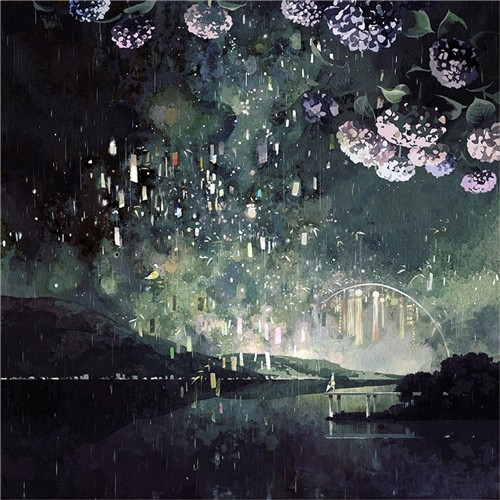

# ＜摇光＞最漫长的前戏

**他开始谈论一种叫作“矛盾的定语”的概念。他举了例子：“柔软的动词”、“无性的情诗”，然后他鼓励雅罗想更多例子。雅罗陷入沉思，极缓慢地报出几个她认为不错的例子：平静的雪崩……单色的蜡笔……沉重的酒精……她还在尽力思索下一组矛盾，她想到了名词“热带”正在斟酌合适的定语，而鲁宾突然插入她的身体，“你啊……”他幽然长叹了一声。很痛，可她并不觉得粗鲁。** 、 

#  最漫长的前戏

## 文/沈诞琦 (Princeton University)

 

我懒得细说他们如何知悉彼此，任何对于背景的写实都将歪曲发生在他们之间一切的真正意义。总之一开始是一句说者无意听者有心的谣言，或许都不是谣言本身，而是说话者的眼神，那飞扬的手势，那桌上的琉璃灯，让鲁宾立马爱上了谣言中的女主角，觉得她是他一直等待着的天造地设的女孩。这显然是荒谬的，世间从不存在天造地设，可是那恍若隔世却又熟稔至极的错觉，就像一个严重脱水的人，你递给他的不是水或者酒或者毒液，而是稚龄时他母亲常煮的桂圆水扑蛋汤。那一刻他生出了个可笑又坚定的冲动：他想和她赤条条地躺在一起，筋疲力尽，就像躺在一泡软绵绵的桂圆水扑蛋汤里。他不想与她恋爱，甚至不想交谈，只是一个手势一句话都不要，尽情地泄欲。

他鲁莽地打听到了她的地址，向她去信，她回复了，端庄平稳的信，讲述工作和共同朋友。几个月内他们互相收发了几次措辞稳重的通信，她态度中立，不厌恶也不欢喜。最后一次她问他，平时看什么书。鲁宾将信反复从信封中取出放回读了多遍，最后决定冒险：他到邮局向她家寄了三本书，弗洛伊德的《性爱三论》、卡萨诺瓦的《我的一生》、萨德的《闺房哲学》，在《性爱三论》的扉页他夹了一张明信片。明信片的正面是比亚兹莱的名作《孔雀裙》（从十二岁起他不知道对着这张图画自慰过多少次），明信片的背面他约她周末在市郊新开的公园见面。

雅罗赴约了，穿着云南风情的孔雀裙，对小小的冒险心怀忐忑。鲁宾从未见过她的相片，却立马认出了她。他在暗处观察了她五分钟，老实说他疯狂的头脑根本没有辨清她的皮肤是白是黑，她的鼻子是挺是塌。他就看到高耸的胸、挺翘的臀——这就足够了。他走上前招手，又是五分钟无言地打量，紧接着他握住她的手，雅罗以为他要将她的手背放到嘴边亲吻，而他却将它移到自己的裆部，嗫嚅着说：“这一切多傻啊！”顿了片刻，他拽起她的手往回奔，一边就事论事地说：“去我家。”她没有反抗，甚至（也许是他的错觉）轻轻笑了。他们进了地铁站，她呻吟般地哼了一声，把他引进了地铁站的公共厕所。在锁上门的蹲位间里，他们的身体刚一碰到就彼此抵达高潮。他们做了三次，没有前戏，极短，彼此都把持不住，鲁宾高兴得哭了。他没说一句话，没有吻她，没有抚摸她的秀发，而她毫不介意。二十分钟后他们已经在地铁上，彼此间保持着一米的距离。雅罗先到站，挥了挥手向他告别，她心中柔情似水，想象鲁宾那滚烫坚硬的裆部和那句“这一切多傻啊！”将是她青春最好的注解。鲁宾回家，对着比亚兹莱的《孔雀裙》又自慰了一次，然后他写信给雅罗，“我爱你妖艳的孔雀裙。我爱你。”他是这么写的。他确信这就是为他天造地设的女孩。

这些先验的误会和过于体贴的默契解释了他们前五次约会的唯一内容。五次后他们搬到一起同居。雅罗之前与父母住，可想而知她为之向父母撒了十几个互相关联的谎言，厚颜无耻地挨过了各式有意无意的盘问。他们潦草地选了一所交通不便的公寓，却精心布置家具摆放的位置：每一种几何造型背后都有撒旦淫荡的凝视。新居落成后，两人就专注于每时每刻的激情，极少进食，不放过任何交合的机会，到了亦痴亦傻的地步。直到他们同居了两个月，有天鲁宾和她赤条条地躺在一起，筋疲力尽，就像躺在一泡软绵绵的桂圆水扑蛋汤里，他才恍然大悟地说：“你算是我的女朋友吗？”雅罗没有生气，甚至也显得很困惑，许久后才点了点头。

那天起，每次做爱前鲁宾会长时间地抚摸她、亲吻她，雅罗将之看成温情脉脉的爱意。不久后（也就是两人认识九个月后），他们真正开始交谈，先是童年，再是家庭，再是彼此的情史，性经验史，再是文学历史哲学……最甜美畅快的谈话永远是关乎幼年的性记忆：对于哺乳的想象，对于双亲的爱慕，初恋情人留下的晕晕乎乎的残影。“记得我小时候……”总是这么起头的，话刚出口嘴角已经笑了起来，身体微向前倾，脖子弯着。正是从这些因自我保护意识而极度扭曲的回忆重现中，他们渐渐识破了天真美丽的谎言，学会了彼此宽容。他们尽量避免谈论实际工作或当下时事，两人对具体的现实都心存不屑。无数长夜都留给了无边际的畅谈，也许以极度疲惫的无梦的沉睡结束，也许以极度兴奋的流泪和大笑结束。那些长夜留下了刻骨铭心的回忆，雅罗觉得自己从未入睡，一直呼吸在爱抚和谈话中，她身边躺着的男人，他的心和身子她都摸得通透。

可是好景不长，鲁宾渐渐染上了个怪毛病：他会在性欲勃发的前戏中停下来，雅罗已经下身潮湿气喘吁吁，而鲁宾会突然忘记做爱这档事，凭空想出一些抽象难解的问题。雅罗头一次注意到这个怪病时，鲁宾在专心亲吻她的乳房，然后他抬起头，茫然若失，清晨的阳光射到他的侧面，他赤裸的身子像是一个过于做作的希腊悲剧人物。鲁宾趴在雅罗身上，她感觉到他的阴茎绝望地软下去，他开始谈论一种叫作“矛盾的定语”的概念。他举了例子：“柔软的动词”、“无性的情诗”，然后他鼓励雅罗想更多例子。雅罗陷入沉思，极缓慢地报出几个她认为不错的例子：平静的雪崩……单色的蜡笔……沉重的酒精……她还在尽力思索下一组矛盾，她想到了名词“热带”正在斟酌合适的定语，而鲁宾突然插入她的身体，“你啊……”他幽然长叹了一声。很痛，可她并不觉得粗鲁。

那之后的每一次前戏都会无一例外毫无征兆地被这些讨论打断。有时候从人物讲开，由维特根斯坦讲到天才的职责，由乔伊斯讲到对天才存心的浪费。有时候从意象讲开，由雪地上留下的脚印讲到记忆中连贯的线索，由俄罗斯套娃的最末一只讲到记忆的戛然而止。有时候，鲁宾开始讲一个故事，讲到一半被雅罗兴致盎然地打断了，“这让我想到一件事……”，于是一串有头无尾的故事螺旋状地连接起来，首尾是两个失眠多时的造梦者。这不再是鲁宾一个人的错。有那么几天他下定决心要连贯地完成性交，然后他触到了雅罗充满暗示的期待的眼睛，他温柔地停下来，“我们来讲讲1968年射出的子弹。”

那就讲讲1968年射出的子弹吧。在机场的滑行跑道上，他们向她腰际踢了一脚，随后走出来另两个拿枪的警察对准她脑袋开了一枪。她像落叶般瘫倒地上半天没有声响，然后咳嗽了一声，又鬼魂似地爬起来，于是再是啪——啪——两记枪声，自始至终我躲在候机厅的死角里，又惊又怕，几乎喊出来：“姐姐！姐姐！”他们将尸体粗鲁地拖进吉普车里，我看到她精巧的鼻梁被砂土磨出血珠。第二天他们到我家，进门就说：“交五分钱子弹费。”三粒子弹才五分钱，那是1968年4月30日。

那就讲讲1746年掷出的斧头吧。那天风大，下着雨，地上都是泥浆。我们的人分成几排一字站开，大家左手拿着斧头右手拿着铁叉。两里外我朦朦胧胧看到红衣白袜的皇军，哥哥说他们左手拿的东西叫手枪右手拿的东西叫步枪。族长叫喊着“冲啊”，我往前奔了几步，就被长枪管里飞出的小东西射中了大腿，倒下前我竭力一掷，斧头砍伤了皇军的马，马抽开蹄子疯跑，踏断了我的脊梁骨。那场仗只打了半小时，我们折了几千条汉子，皇军才死了五十人，那是英国国土上的最后一役，1746年4月16日。

“那就讲讲1583年射出的箭矢吧……”鲁宾顿了一顿，嘴里念念有词计算着前前后后，最后勉强一笑，“我可能把时间记错了。别管1583年，我们还是讲讲1421年射出的箭矢吧。”雅罗注意到鲁宾对时间偏执的敏感。他不在乎弄混人名、搞错地点，可他从不愿混淆时间。只要可能他竭力精确，他会说1968年4月30日的子弹是下午三点半射出的，他会说1746年4月16日的斧头是上午十一时掷开的。

那就讲讲1421年射出的箭矢，就讲讲988年抛下的巨石，就讲讲223年掉落的长矛吧。那就讲讲1915年蔡锷的妓女小凤仙，1793年丹东的妓女马丽昂，或者，你想听听圣子耶稣的妓女、贤帝哈德良的妓女吗？就讲讲我1785年为你写的小说《索多玛120天》，你记得吗，你带来的那卷纸被我的蝇头小字写得密密麻麻。你还记得吗，1897年我在狱中为你写的信，“亲爱的波西，惟有精美的、精美于思的，才能供养爱。但不管什么都供养得了恨。”要不然，雅罗，你至少记得1911年我写给你的遗书，“意映卿卿如晤，吾今以此书与汝永别矣！吾作此书时，尚是世中一人；汝看此书时，吾已成为阴间一鬼……”对了，雅罗，你看我昨天在狱中又给你写信了

亲爱的 最亲爱的

历史的长河中我们邂逅一千零一次公元前故事的引子到二十世纪才补上尾声幼发拉底河畔我掬起过一把细沙两千年间手心的冷汗让沙子结晶成石英我送给了英格玛伯格曼他造了一口没指针的钟那条咬死埃及艳后的毒蛇我取了蛇胆寄给博尔赫斯他吞下后睁开了第三只眼睛看完了八十万册藏书一千零一次我手无寸铁奥林匹亚山的诸神不是我的兄弟父亲情人我看着你遍历酷刑而死被鹰隼啄食心脏幸好维吉尔为我偷来一台时光机我钻进机器里去地狱对你说我__你__ 我__你__我__你__我__你——

这时雅罗突然打断他说：“我知道了，这不过是个前戏。”鲁宾沉默着，雅罗继续说：“整个历史，从第一只三叶虫第一头猛犸象，在我们这儿不过是一场漫长的前戏。”鲁宾拥被坐起，暗夜中她看不到他的表情，便伸手去抚摸他的脸，湿的，全是泪水。“是的，这是场最漫长的前戏。”他这么回答，转而压到了她身上。在这些无穷无尽的历史角色扮演游戏中，如果出于善良而必须永远扮演弱者，那么还是把历史看成一台前戏吧，那样才能忘怀善良已经死了成千上万次，才能承受得住穿梭了数百上千年还未抵达终点的箭矢和子弹。

这样的彼此折磨让鲁宾深深着迷。他花大量时间阅读，将历史中最贫乏的注解看作隐蔽的黄色笑话。他会整夜讲江南造船厂的辛酸往事，在筋疲力尽的叙述后感到情欲勃发。他越来越挑剔时间的细节，常常为核实一个时间点而把整个周末浪费在图书馆里。他还对那些无关紧要的小人物产生了兴趣，那个政治犯的弟弟，那个苏格兰士兵，他甚至多次走访档案馆探悉他们的姓名来历。他们的前戏越来越长，一天，一个星期，一个月……

最近一次做爱，他们花了四个月举行前戏。是的，“举行”，他们将之当作一个隆重的典礼，事先在草稿纸上计划每天必须完成的步骤，增删数次。有十多天他们分房而睡，夜夜研读历史典籍；有十多天他们互相朗诵《伊利亚特》与《奥德赛》，一人朗诵，另一人亲吻其下体；如此等等。最后一日，根据计划鲁宾要向雅罗讲述整场伯罗奔尼撒战争的来龙去脉，“我们先来讲讲伯罗奔尼撒战争的起因吧。”而雅罗出乎意料地打断了他：“不，不单单是伯罗奔尼撒战争，我们来讲讲世界上所有的战争，来讲讲世界起源和末日之战，来讲讲昨日的战争和明日的战争。我来背给你听，我们是怎么打起来的，又怎么一直打下去。”

“涿鹿之战，特洛伊之战，巴比伦之战，鸣条之战，牧野之战，第一次麦西尼亚之战，第二次麦西尼亚之战，春秋战国，波斯战争，罗马迦太基之战，马其顿战争，楚汉相争，罗马叙利亚战争，匈奴之战，啊，凯撒入侵不列颠，罗马内战，第一次犹太叛乱，啊，图拉真入侵帕提亚，啊，第二次犹太——叛乱，第三次犹太啊啊叛乱，黄巾之乱，三国乱战，八王之乱，哥特战争，磐井之乱，啊——罗马波斯之战，丽隋战争，啊，萨珊拜占庭之战，唐朝突厥之战，拜占庭阿拉伯之战，轻些，唐朝吐蕃之战，伊斯兰——征服埃及，再轻些，第一次伊斯兰内战，啊，壬申之乱，啊啊，怛——罗斯战——役，萨克森战争，维京人入侵欧洲，啊，阿拉伯征服西西里，啊五——代十国啊，诺曼征服英格兰，啊第一，第一次十字军东征，啊——第二次——十字——军东——征，啊，再快些——第三——次十字军东征，快啊，第四——次十字军东征啊——，啊第五啊——次十啊——字军东——征，快些快些，啊第六次，啊好棒第——七——次，啊啊噢——第——八——啊次啊啊啊——”

第一只三叶虫睡入化石，第一头猛犸象轰然而倒，战争依序而至，箭矢和子弹发射时间已精确到毫秒。鲁宾秉持的善良既不能让他提醒特洛伊的守军希腊人阴险的木马计，也不能把十字军东征的次数减少一二。历史像一本决定论的预言书，命运可选的余地如此促狭。可是那天晚上鲁宾从雅罗身上汗淋淋地下来，忽然明白了雅罗在他那几乎确定的命运判决书中扮演着什么角色：她是虚词、是停顿、是叹息、是随性所至的呻吟。如此的呻吟：“太美了，请停一下吧！”孔雀的尾羽飘进他密封的世界，震颤，悄悄破坏了乏味的平衡。

鲁宾和她赤条条地躺在一起，在空前巨大的感动下，他头一次想要一个儿子，一个吵闹肮脏的小兽，一个软趴趴的小阴茎与他一起躺在历史软趴趴的脐带下，就像躺在一泡软绵绵的桂圆水扑蛋汤里。他头一次想要雅罗婀娜的身体像气球一样吹起来，吹爆了，破布似地碎成一团，鲁宾就把那团破布爱不释手地揉进阴囊里。历史的箭矢和子弹一齐射过来，雅罗倒下了，莎乐美的孔雀裙里双腿大张着，裙摆下一滩殷红的血，血里包裹着一小团皱巴巴的半死不活的历史，那是施洗约翰血肉模糊的脑袋，正在哇哇大哭。

鲁宾躺在这么一条血迹斑斑的历史脐带下，泣不成声地向雅罗求婚。雅罗只是显得很困惑，许久后才点了点头。

（采编：尹桑；责编：尹桑）

 
