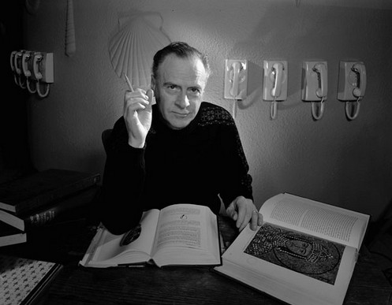

# ＜摇光＞机械与机心

**你会发现在当你长时间的泡在网上时，时间过得如此之快而自己却好像什么也没做；当你因为某种原因和网络隔断时，却不知如何度过如此无聊且漫长的时间；在面对需要认真独立思考的问题时，满脑子里都是那些搜索引擎，可是身处网络泛滥的信息洪流中却又无所适从......**  

# 机械与机心

## 文/石凯（曲阜师范大学）

 

“有机械者必有机事，有机事者必有机心。机心存于胸中，则纯白不备；纯白不备，则神生不定；神生不定者，道之所不载也。”

———《庄子》

读到这句话的时候，我发现旁边的同学又拿出了手机，开始上网。手边的书停在目录这一页。在学校里，这种类似的场景再也熟悉不过了：吃饭时会有人拿出手机上网浏览下每天的新闻，上课时会登陆人人网查看好友最新动态，开会时用QQ跟远方的同学抱怨领导的繁琐无聊，甚至早上起床后冲向厕所的时候手里拿的不是卫生纸而是手机......手机能上网了，它与人的亲密度又上了一个台阶。

人们如此的享受和依赖手机和网络带来的便利，以至于放松了对他们入侵自己“自由”的警惕。这种入侵在它一脸坏笑地给你一个又大又漂亮的苹果的时候就开始了，它悄无声息却寸土必争，行之以礼却心怀鬼胎。你会发现在当你长时间的泡在网上时，时间过得如此之快而自己却好像什么也没做；当你因为某种原因和网络隔断时，却不知如何度过如此无聊且漫长的时间；在面对需要认真独立思考的问题时，满脑子里都是那些搜索引擎，可是身处网络泛滥的信息洪流中却又无所适从......

网络用它的多姿多彩迷乱了人的双眼。德国古典哲学家黑格尔提出过“异化”的概念，马克思在其著作中多次引用，意指人被自己的创造物所控制和支配。观照当今，处处皆有“异化”的最佳案例。人们的生活已经离不开手机和网络，失去它们仿佛就是去了自己的左膀右臂。人们把重要的日期和事情交给手机来记忆，把大把的时间交给电脑来娱乐，却什么也没留给自己。这样说是有点过分，可不得不承认，人们已经让它们担负了我们以前自己担负的“职责”。加拿大学者麦克卢汉提出过“媒介即人的延伸”，即任何媒介都是人类感觉器官的延伸和扩展。纸媒延伸的是人类的视觉能力，广播延伸的是人类的听觉能力，电视是视觉与听觉的综合延伸，网络则是视听的双向互动延伸与扩展。可是在延伸和扩展的过程中，麦克卢汉认为媒介的独立性和自主性不断增强，这样一来，这些独立于人之外的客观事物就会以其独特的方式来改变 影响甚至控制人类。这便是“异化”现象。想到这里，便不免想起本文开始引用的庄子之语，“机心存于胸中，则纯白不备；纯白不备，则神生不定；神生不定者，道之所不载也”。庄子认为通过内在的精神渠道，“机械”可以对人产生反作用，这与“异化”理论有殊途同归之妙。

就网络本身而言，它不是传统媒介的简单整合和创新，它开创了一个时代。麦克卢汉还说过另外一句更重要的话：“媒介即讯息”，即从人类的每一个时代看，真正有价值有意义的不是各个时代里传播的内容，而是这个时代所应用的媒介和其改变社会形态的可能性。也就是说，没有印刷术，我们不知道文艺复兴会在什么时候开始；没有电子媒介，我们也不会知道“地球村”会什么时候成为现实。这些对社会宏观的影响 改变虽需要时日，可是改变终究会到来。网络满足了人们多样元化的需求，为个体自我独立平等 民主 自由意识的培养提供了有利条件。尤其在中国，网络问责在其他监督渠道成本较高情况下的甚是风行，更是成为每年最能引爆全民目光的媒体，这不得不说明网络确实在对这个社会做着什么，而这一切都是因为网络的平等开放 自由 互动能力远远超出其他媒介。 科学技术终究是人创造的，不可能十全十美。科学技术对人的影响也不止前面提到的“异化”现象。仍以网络而言，网络水军，网络公关，散布谣言等等极具群体感染和群体模仿的事物和行为很容易颠倒是非，混淆视听。轻者侵害人身自由权利，重则引发社会恐慌国家危机。而另一方面，权力组织利用其职权封锁网络信息 隔离受众则让知情权和言论自由大打折扣；商业利益的低俗娱乐资讯的过分泛滥则愚昧网民；急功近利，求奇求怪求刺激的各种红人则各据阵营挑战人们的承受底线；各种眼球经济快餐文化让本不宁静的社会更加浮躁......

技术主义者认为技术的发展可以解决这些问题，就像水污染了我们再创造一种净化水的技术，石油枯竭了我们再开发新的能源。可是技术的进步本身就是一个很大的问题。就人类的智商而言，其进步的可能性或许不是问题。但是技术更新的速度能否赶上问题产生的速度？而技术的进步需要的除了需要相关知识的积累，更需要体制的不断更新来保障人才资金 环境的稳定供应。就人类现在的情商来看，这更是问题。科学技术的诞生与人类的惰性有着肮脏的联系，自从第一个不知名的猿猴从树上跳下来学会烤肉吃之后，可怜的后代就被他拖入悲惨的技术怪圈，一圈又一圈，永无天日。人一思考上帝就笑了，这是因为我们总按自己的想法思考上帝思考他人。可谁知道，人一行动上帝就哭了，他哭我们笨得可爱 傻得简单。看看人类的蠢事就知道上帝的眼泪真多，他哭得好惨。

人之初，性本善；性相近，习相远。人是如此，网络亦然。网络本是承载着人类连通彼此的梦想，可许多不可预测的因素让人变得对网络爱恨交加。虚拟的力量能否带来一个乌托邦，怎么利用好网络这把双刃剑，如何选一个结实的缰绳来控制住技术这匹野马，这些问题都大得很。不过我还是喜欢那句老话，从我做起。谁都希望积极的阳关刺透阴暗的乌云。没人想做乌云，除非他不喜欢阳光。

 

（采编：王琨；责编：尹桑）

 
