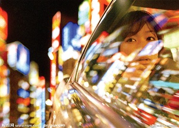
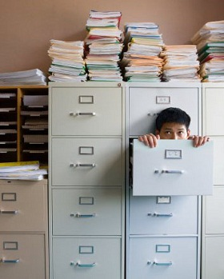
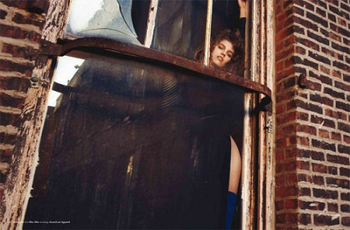

# ＜摇光＞根本没有外面的世界

**事实上，“生活”“在路上”这些字眼到底有没有人真正去思考？下班后不乘直达地铁，特地换三部公交车才回家，一路上听着音乐，啃着葱油饼，看着窗外下班高峰的车水马龙，那同样是“在路上”的小冒险；和喜欢的人手拉手逛夜市，就算一根橡皮筋两块钱，也和摊主讨价还价，十分钟后骄傲地拿着战利品，出现在大排档里，大口喝着王老吉，嚼着羊肉窜，你在印度能做的事情在家门口就可以做到，这就是“生活”朴实的乐趣。**  

# 根本没有外面的世界

# 

## 文/陈嘉倩（荷兰海牙大学）

  1. 

很有趣的一个现象：十岁的时候看二十岁，从心底里厌弃，怎么那么老！二十几岁的时候看中年人，也不免打从内心发出尖酸刻薄的鄙夷，活到那时候也就麻木了吧！

A写信给我，我该怎么办，在大学里，我读书的确很好，家境也可以，我很乖一直是个循规蹈矩的女孩，可是接下去呢？一份工作做个几十年，嫁人结婚生孩子，就这样了吗？

B写信给我，我该怎么办，刚刚大学毕业，没什么人生目标，也不知道自己能干什么，从不喜欢的专业毕业，接下去做一份不喜欢的工作一辈子，长得也一般，爸妈逼着去相亲，交往两年，然后结婚，有个孩子，过上和爸妈一样的生活，就这样了吗？

C写信给我，我该怎么办，和男友一起很多年了，也在办公室里做了同一份工作几年，我很想放弃一切去周游世界，现在的生活让我透不过气，因为接下去的轨迹我闭着眼都知道，结婚生孩子退休，照顾孙子孙女，就这样了吗？

我看了看爸妈，不知道他们怎么突然就一下子长那么大的，似乎自从我出生开始，他们从未年轻过。莫非，他们出生的时候，就被设定了某个功能叫“注定平凡”？

 2. 

不然，我们是要过什么样的生活呢？“轰轰烈烈的，丰盛的，有故事可说的”。是吗？于是17岁的时候，我决心要离家看看世界，总觉得外面的世界无比大，会很精彩，别人在过着我们所不知道的人生。

在澳门。早晨走路上学的时候，常看见小小的公车里挤满了穿制服的当地孩子们，和公车并排的是一辆辆家长接送的机动车，一张张被风吹得压抑而扭曲的年轻脸庞，还有背后沉重的书包。课余时间赚点小钱，给一个当地女孩补课，她就如同大陆的高考生一样，面对着升学课业的压力，脸上发了一颗颗巨大的痘痘，背英文的时候如同和尚念经。

在荷兰。身边很多的中国留学生不愿意出门，在家里吃中国泡面，交中国朋友，上中国网站，连小组功课的组员都是中国人；打工是看世界的方式，给一个香港女人做旅行公司助手，她逃离了拥挤的香港，但是在荷兰仍然过着港式生活：交香港朋友，讲广东话，喝早茶，下午收工前一只菠萝包，周末打广东麻将。

在爱尔兰。在一群各个欧洲国籍的交换生里，作为唯一一个亚洲人，我看见的也常常是一个个按照国籍扎堆的小团体：芬兰团，荷兰团，爱尔兰团，西班牙团。和西班牙人最熟悉，他们虽然热情友好，但仍大多时候只和自己国家的人凑成一堆，我认识的很多西班牙交换生在爱尔兰一整年，整天凑在他们自己人的派对里，英文都没有进步甚至开口都艰难。

在巴塞罗那。同公司的英国人，虽然会说点西班牙语，但一旦下班，有聚会有嘉年华，还是经常和在巴塞罗那的英国人一起参加。他们最常去的还都是英国酒吧，庆祝英国节日，讲着伦敦发生的事情，吃饭也不因为西班牙独特的时间表而影响。

在上海。爸妈仍然过着简简单单的生活，六点起床上班，晚上六点回家做饭，十点睡觉；认识了一群在这里工作留学的外国人，有的人在这里待了两年，只会说你好和谢谢，甚至一个中国朋友也没有，大多是和同是外国人的室友聚在一起。上班下班，买VPN爬墙刷Facebook，饿了麦当劳或者必胜客，半夜去迪斯科派对。

我发现全世界的人们都活在自己的“世界”，忙忙碌碌，差别不大，因为那就是所谓的“生活。”三毛曾在《万水千山走遍》里说过：“人生又有多少场华丽在等着，不多的，不多的，即使旅行，也大半平凡岁月罢了。”

3. 

到底，有没有外面的世界呢？

这个问题问给在象牙塔里的孩子们，一定是用力点头充满了期许。

再把这个问题扔给在国内那些渴望出国的人，也一定是更猛烈地点头。从小我们就听着一首歌，叫做“外面的世界很精彩，外面的世界很无奈。”光是听到精彩，就觉得激动，至于无奈，在现实生活里尝尽了各种无奈，似乎那精彩盖过了无奈风头就好。

可事实呢？永远记得第一次离开家，抵达澳门。一个人回到了住处，关上门突然世界安静了也落寞了。我意识到，到哪里生活都是一样的。房子里面的生活相差无几，床，冰箱，书桌。室内的生活恍惚还以为在上海。打开电脑，浏览的那些网页还是以前经常看的，打开QQ, MSN旧日高中同学也都在线，他们的那些状态也都和我出发前一模一样，一切还在原地，只不过是我去了另一个地方而已。

多少留学生在某个时刻对留学生活充满了失望，甚至盼望着立刻回家？

即使离家千万里，许多人过日子也不过是留在屋里玩电脑，和国内日子相差无几。认识的几个中国留学生都是在打工或者除了上课就是宅在宿舍里打游戏、上网，过着封闭的生活。还记得2005年，加拿大某大学3周内连续发生两起中国留学生自杀事件。他们都是顶尖博士生，但是平日都缺少朋友，与人交谈时总显得很忧郁。电脑和网络，就是生活全部。

等待中国时间，想念朋友，或者半夜起来，看他们上线了聊天；外国人好笑的东西自己笑不出来。可是如果只是为了这些，为什么要选择出国留学？如果来到国外就为了生活在中国人的圈子里，用中国人的方式生活和思考，每天使用中文甚至还学会了中国各地方言，吃着中国菜，窝在房间里上中国网站，即使最后拿到了文凭，那也只是一个证明而已，并不代表真的在国外生活过。

“平时的交友圈子还是中国人，吃饭就去中国城，不太愿意和外国人接触”。那么，即使走出去，也其实和留下来没有什么差别。

 4. 

一个大学毕业生说，想要出国想要受伤害去经历，那才是人生，可是父母不允许，年龄也摆在眼前，现在上班了，遇到了一群混日子的人，更想要逃走。

一个男孩说，没有出国前读你的文章，觉得很精彩，期待着。自己出国两个月了，才知道其中的酸甜苦辣自己最清楚。

一个优秀的中学出来的人，选错了大学，到了国外身边的国内人都是一些读不进大学，被父母重金砸出来的，每天这群人都在伦敦市中心唱歌夜店，日子混着混着就混到了毕业。

一个平凡家庭的女孩，出来后发现身边的人都在谈论逛街，买名牌化妆品，整日派对，在外国也有KTV，她觉得世界不一样了，和以前的淳朴不一样，看到了一个不一样的富二代世界。

一个家里被当做佛一样供着的大城市独生子女，出来后与人共享学生公寓，对于厨房的肮脏还有极品室友相处不和，叫苦连连。

难道，这就是我们要看的外面的世界吗？

善良的，恶毒的，有钱的，不负责任的…人心本就是相通的，世界可以被分割成一个个国家，一座座城市，但亲情友情爱情故事却是彼此不谋而合的。或者说，根本没有外面的世界，只要被把“人心”的世界看清楚，这个世界其实说穿了，很小很小。

 5. 

有的人去旅行，最后收获的只是几张寄给自己的明信片和数码相机里的“到此一游”；有的人在隔壁公园走一圈，看到的却是春夏秋冬别有韵味人生：散步的老阿姨，还有下棋的老男人，看到生命的恬淡和幸福。

一直以来痛恨一个问题: “你这次去了多少个欧洲国家啊？” 那充其量变成了儿时的旅游，只有临行前的兴奋，过后什么都不记得了罢。倒除了几张在标志物前的照片，打印出来放在家里的橱窗里积灰。

山山水水历史人文，都客观地在那里；全世界人的心，说到底都是肉长的，也都类似。

旅行或者远游真正的意义，是在于重新认识自己，重新打理你那个“世界”。 一段好的旅行，行走时抛开日常繁琐的一切，心境很空，像是直升飞机那样高瞻远瞩。给自己一个新的角度重新回想曾走过的路. 先不要想着去多少地方，这次飞行要多远，就带着一颗看风景游玩的心和一个简单的目标: 在路上重新认识自己，和心内的世界说说话。

世界很小，人心很大。所以一次好的旅行，带你看到这个广博的世界，也同时看到自己在地球上坐标的渺小。没出去之前，我们读着各式各样的旅行书，可以骑自行车，可以搭公车，可以做沙发客，可以不要很多钱就把世界周游了。阅读着书里的故事，看着那些照片，内心激昂地说，“这才是真正的生活啊！”“人就必须在路上。”

事实上，“生活”“在路上”这些字眼到底有没有人真正去思考？下班后不乘直达地铁，特地换三部公交车才回家，一路上听着音乐，啃着葱油饼，看着窗外下班高峰的车水马龙，那同样是“在路上”的小冒险；和喜欢的人手拉手逛夜市，就算一根橡皮筋两块钱，也和摊主讨价还价，十分钟后骄傲地拿着战利品，出现在大排档里，大口喝着王老吉，嚼着羊肉串，你在印度能做的事情在家门口就可以做到，这就是“生活”朴实的乐趣。

说白了，活着不就是吃喝拉撒的事儿吗？

 6. 

又绕来绕去，回到这个问题：非得要出国，才能自由吗？

所谓的自由，是在于心的自由，敞开接受这个世界，但同时保持自己的观点。是你被关在小屋子里，照样能在一张小纸上，画出广阔蓝天。是你即便不能走出去看世界，却心里怀有着对一草一木的珍惜和喜爱。

说到底，我们不是所有人可以去遍“人一辈子要去的100个地方”的，我也不觉得那些“一个月背包周游欧洲”的人，会真的把欧洲全部了解。你能坐在高考教室里，从一扇窗望出去的，照样是广阔蓝天，还有脑海里投射的最高的山脉，最深的海沟，最细柔的沙漠。

那，你照样是自由的。

而且，如果一个哑巴爱上了唱歌，一个聋子爱上了交响乐，想一想，比起他们，你是多自由。我常常推荐别人去关注社会新闻，不是去看别人活得比我们惨，而是另一个角度去看这个广大的世界。从一个不相干的人的角度去看一看你现在的世界。往往，我们不知不觉就把自己放进了玻璃罐头里，你需要换一个角度看，才能真正看清自己所处的位置。

阅读那些旅行书本，我们常常被吸引，觉得非要去一趟，可是现实不允许每个人都走。难道，就要不能活在自己的人生里面？再者，阅读这些书，还有自己走过的路，我发现每个角落的人，都在过着相似的人生。

人心是无国界，友谊，仇恨，梦想，懒惰，执着，厌倦，感动... 都是相通的。

 7. 

荷兰房东夫妇，两个人很老了，还是热爱骑着自行车周末四处踏青。平日里，男人在楼下做着他的活，每天早晨按时起床，夜晚做饭。女人买菜上班，偶尔孩子们有时候来看望。

巴塞罗那的普通家庭，周末有了点时间，就去加泰罗尼亚周边小镇逛一逛，晒晒太阳，平时男人要六点起床上班，下午两点下班，坐在沙发前看电视喝咖啡。女人九点起床，做做家务就去上班，晚上七点到家，继续做饭，男人睡去了，她继续在客厅看书。

上海的爸妈，春夏秋冬，两人六点半在广播闹钟里醒来，八点钟各自上班，晚上五点下班，吃完晚饭看电视，十点睡觉。过春节国庆的时候也懒得挤个人潮登个黄山，去个海南岛吃海鲜，倒是楼下小区散散步，路上遇到老张老王吹吹牛，去趟超市就买袋盐，日子过得挺欢快的。

不过是我们的心里，把外面和里面的世界建造了围墙，其实根本没有外面的世界。带着原来那个婴儿般的好奇，去观察去体悟，你会发现，全世界真的太小了，出乎意料的其实有迹可循，你无法接受的却其实非常合理。

Cape Diem, 活在眼前，活在当下。人生本就简单得可以一眼望底。全世界都会要工作，全世界也都会结婚生孩子，全世界都在过着简单的生活。我们吼着“不愿意活在制度内”，可为什么人活着，就是一个限定，你能活到三百岁吗？你能飞到太空吗？你能把一张一毛钱变成十张一百块吗？内心广大就是无限。能够生孩子，能够结婚，能够工作，能够退休，活到老死，不也是一种祝福吗？父母，祖父母，连个护照都没有，也有权利活得很快乐。

你想要过的生活，你正在过，不过是未曾发掘他的有趣之处。

你的世界，就是整个世界，根本没有外面的世界。

 如有想法，可与作者交流。 微博： [http://weibo.com/mejiaqian](http://weibo.com/mejiaqian) 博客：[http://blog.sina.com.cn/mejiaqian](http://blog.sina.com.cn/mejiaqian)  

（采编：何凌昊 责编：尹桑）

 
