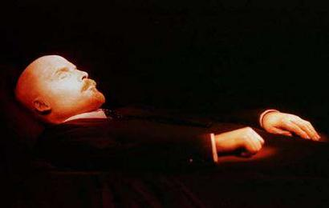
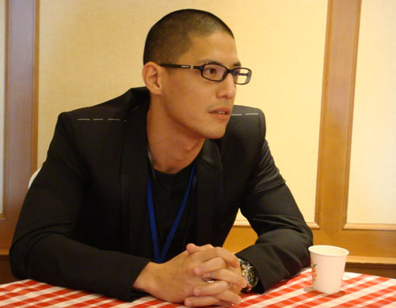
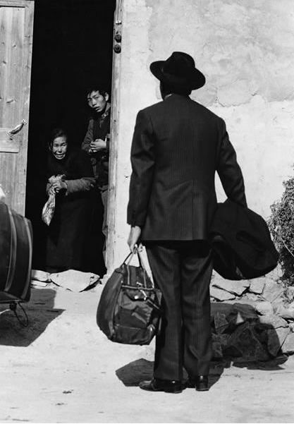
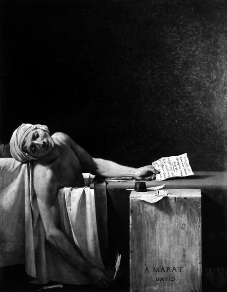

# ＜摇光＞水晶棺里的列宁

**“那些在书斋中酝酿着民主的志士们啊，如果你们已然做起了焚尸扬灰的梦，请恕我不能再与尔辈为伍了。我要的是苏亚雷兹，你却想给我马拉。既然如此，就别惊讶科黛姑娘的小刀来得太早。”** 

# 水晶棺里的列宁

## 文 / 迦南（北京外国语大学）

 通常认为，一个民主国家，不至于堂而皇之地将多数人的利益凌驾于少数人的基本权利之上。以此作为衡量一个国家的民主化程度的标准（之一），我想是合适的。而对于一个正处于民主转型过程中的国家，如何对待政治斗争中的失败者，往往决定了这个国家日后在政治上的走向。 苏联解体之后，关于是否迁葬列宁的争论从不曾停歇。有提议将列宁遗体赠与中国的杜马议员，有愿出高价购买遗体的美国巨富，有列宁遗体保存当作伟大医学实验的医生，当然，也有每逢纪念日便到墓前献花的红军老战士。 

 曾经的一段时间内，俄执政当局的倾向性表现得比较明显。毕竟苏联的变天来得突然，越是突然的事，其中的摩擦总是越剧烈。叶利钦与俄共之间确有些历史遗怨，这种主观上的相互排斥，往往阻碍掌权者做出理性的权衡。故而，叶利钦时代撤除了红场上的第一岗哨，且政府停止对列宁墓的维护拨款，此后的维护费用由俄共等左派发起的民间慈善机构“列宁墓慈善基金会”募捐和共产党员的捐款等组成。叶利钦甚至还公开提出“列宁给俄罗斯带来许多苦难”“应该将列宁土葬”等话。幸而由于国家杜马中以俄共为主的左翼掣肘，才未能如愿。否则，经历了共产革命和剧变的俄罗斯，族群间的裂痕怕是要进一步加剧了。 相对而言，普京在此问题上要明智一些，他说：“我将寻求符合大多数俄罗斯公民意愿的解决方案。我们的每项决定都要推动社会和谐及民族团结，而不是导致社会分裂。”还举例道：“90年代中期，我在西班牙期间曾经参观过佛朗哥墓。佛朗哥是个很有争议的历史人物，但他仍然埋葬在西班牙的名人墓地，享受尊崇。” 这样的表态无疑是聪明且合理的，一方面不对历史人物做出直接的价值判断，一方面也未将话说死，“符合大多数俄罗斯公民意愿”一说给日后可能的变数留下了余地。 对于历史人物的态度之争，在诸多转型国家都不可免。聪明者如普京，民众们既可以为红场上的列宁献花，也可以重葬邓尼金，纪念高尔察克（1）。遵循民主政治的处事原则，把无法取得多数民众谅解的，一时间无关痛痒的问题留给将来，不至于激化原本对立双方的矛盾。不智者如杜正胜（2），哪壶不开提哪壶，为“去蒋化”这种无关民生的事劳神奔波，吃力不讨好。 在我看来，无关民生的事，都是小事，一个建筑究竟是叫“中正纪念堂”还是“台湾民主纪念堂”并不重要。重要的是，首先不违反民主合法的议事决策规程；其次，如普京所言：“推动社会和谐及民族团结，而不是导致社会分裂。” 民主进步党中的诸多先行者，无论主张如何，其为推动台湾民主化所做之贡献与牺牲都值得当下的一声赞许，如因在狱中绝食而被政府强行从鼻孔灌食数千次的施明德先生，以及数位家人惨遭政治谋杀的林义雄先生。而如杜正胜之辈却为一党自私不遗余力，以加剧族群分裂为能事，实令其前辈蒙羞。 

 任何政治转型中，都不可避免地有人得意，有人失落。然切不可将得益者等同于胜利者，任何成功的民主转型都不可能只是单方的胜利。转型终究是手段，而非目的。试想，我们如何能觍颜将一场不能增进民众幸福的转型称为成功。若混淆了手段与目的，改革者距离他们所反对的人，也便不远了。 当年，那些随着蒋介石奔台的普通士兵们，住在自己潦草搭盖的窝棚里，将那永不可能兑现的“战士授田证”（3）细细收好。他们确信这腌臜的眷村不过是个临时的居所，不用太久，年迈的总统便要带他们打回去。谁想，这眷村竟成了三代人的栖身所在。他们随总统打了那么些年战，守着三民主义的节，与倭斗，与“匪”斗，现老了，抬枪的手或已举不起一支破拐，何等残酷无良之人才会迫不及待地去否定他们的一生，否定他们仍存的信仰与往昔的荣光。 无疑，在转型国家中，这个群体便是普京口中的那些“把自己的生活与列宁联系在一起”的人，“安葬列宁意味着他们虚度了生命”。如果一个现代国家连这样一个群体都容不下，那就请不要妄言民主了。毕竟，你的敌人和你所不喜欢的人，和你一样，享有坚守信念的自由和尊严。 耐心是一种美德，遗憾的是其往往不为改革先锋们所拥有。将自己心中那低级且热切的鞭尸欲望忍一忍究竟能有多难？待到自己及国民们可冷静客观地看待历史时，再将此纠结的议题抛出有何不可？当亲历者们都已死去，我们再来审视国家的历史时，或许可不再受那主观情绪的阻扰与左右。那时，通过合法民主的议事决策程序，将一切留与公意定夺，难道不比急切切地鞭尸而导致族群分裂好么？ 其实，列宁墓的去与留本不是什么重要的问题，重要的是转型中的得意一方，是否真有为国家锻造民主的愿望，若有，则必不会向那失败者身上踩去，而是开怀容纳那昔日的死敌，使反对派得以生长并在日后与其竞争（反对派在民主政治中的意义在此便不赘述了）。如苏亚雷兹（4）不顾弗朗哥遗老们的反对，慨然迎回在外流亡半个世纪的西班牙共产党。若无，那么就请等着下一个“还乡团”（5）吧。 

 杜正胜们以为在那慈溪悬棺（6）中存放的仅是蒋介石朽去的尸身，这是一个荒唐的错误。那里还有民主政治得以实现的基础——宽容。 1991年8月，莫斯科，在青年人纷纷上街的一片喧嚣中，几个胸前挂着旧日勋章的老人为自杀的苏联元帅阿赫罗梅耶夫举行了葬礼。元帅在遗书中写道：“我生命的全部意义遭到毁灭时，我无法再活下去。”合棺之际，元帅的妻子在丈夫冰冷的额头上留下最后一吻，道：“他从18岁起便参加了同德国法西斯的战斗，可是如今我们的国家被民主派法西斯分子从内部攻克了。” 我从不认为叶利钦是民主派法西斯，我只是想，一个为国家立下过功勋的人，是否可以不这样死去。如果我们更耐心一些，如果我们更温和一些。 那些在书斋中酝酿着民主的志士们啊，如果你们已然做起了焚尸扬灰的梦，请恕我不能再与尔辈为伍了。我要的是苏亚雷兹，你却想给我马拉。既然如此，就别惊讶科黛姑娘的小刀（7）来得太早。 

### 【注】

 **1. 邓尼金和高尔察克：俄罗斯内战中的白军将领。** **2． 杜正胜：曾任台湾教育部长，任内力推“去蒋化”，公开指责反对“去蒋化”的台湾普通民众。** **3． 战士授田证：国民政府迁台后，发给普通士兵的，承诺反攻成功后授田的文书。** **4． 苏亚雷兹：西班牙民主转型期间任西班牙首相，促成西班牙和平转型的成功。** **5． 还乡团：国共内战时期，受革命群众打压的地主乡绅组成的武装。还乡后，即报复乡中原参与土地革命者。** **6． 慈湖：两蒋灵柩“临时”停放地。** **7． 夏洛特·科黛：法国大革命中因不满雅各宾派的高压恐怖政策，刺杀雅各宾派领袖马拉者，行刺得手后被送上断头台。**
