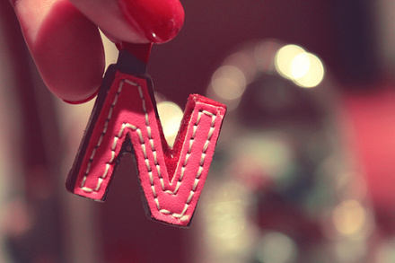

# ＜摇光＞没有反思的人生不值拥有——写给一个高一女孩（一）

**我们的教育直接将人降到了动物和机器的水平。如果说为“现代化建设”提供人才是他们明确表达的一个教育目的的话，那么他们更隐晦的、更终极的教育目的则是，培养一群有利于他们统治的听话的奴才。我们的教育首先是一种异化教育，他把人当做工具一样地生产出来；其次是一种奴化教育，这种教育的目的不是为了把我们的孩子培养成一个个人格健全和独立的人，不是为了培养成一个个有公民意识、有尊严有个性的人，而是为了培养一群不会用自己的大脑思考的服从其统治的奴才。**

# 没有反思的人生不值拥有

# ——写给一个高一女孩

## 文 /刘桂新（武汉大学）

你爸还说要我对你们姐弟俩的学习多给予一些指导呢，学习上的指导估计是挺不靠谱的，天高地远的，我自觉帮不上什么忙。我倒是很想就学习之外的一些问题跟你好好交流一下，特别是你已步入高中，开始了人生一段新的成长旅程。就我的经验而言，这个成长阶段对一个人的影响至为重大，因此就更想就你这个阶段我觉得你应该去思考的一些问题跟你好好聊一聊了。

我特别羡慕你们这个年纪，生命都才刚刚展开，充满了向各个方向扩展的无限可能。但在你们看来，现实生活又似乎并不是充满了无限可能的吧，因为每天不过就是按部就班地上学下学，把大量的时间耗费在课本和考试上，而你们似乎不用想太多或者说也没有你们自己想的空间，只需要按照大人以及身边几乎所有人的千篇一律的教导，好好读书，尽可能把成绩、名次往前面挤，最后挤进一所大学，一切就都圆满了。生命在你们面前似乎就只展现了这么一种可能，跟你们身边所有的人一样。这样的生活该会是多么的了无生趣啊。你可能也隐约地这么觉得吧。

不过这样的生活倒也简单，饱食终日，无所用心，没心没肺地读着书，至于最后能不能考上大学，以后想要有一个怎样的未来是全然不用考虑的，至少不用在这个年纪考虑。十五六岁也还算是天真烂漫的年纪，何妨随波逐流、随遇而安地得过且过。

**二**

不知道你喜不喜欢现在的生活，或者说喜不喜欢读书？也许这个问题你也没有想过啦，因为这个实在不是你所能选择的。我想即使你内心里有所厌恶你也绝不会去反抗吧，因为在你这个年纪似乎还没有反抗的资本，而且在你这个年纪，除了呆在学校好像也找不到更好的去处打发人生了，何况在学校还有那么一大群同龄人陪着玩，生活或许也挺美好的呢。

**一个人正在逐渐成熟的标志就是会更多地就自己所做的一切问一个为什么。比如，为什么要读书？难道就因为家人以及身边所有的人都认为你这个年纪就应该坐在教室上课所以你就应该抵制外面世界的诱惑、压抑自己内心真实的想法、不情愿地坐在教室里上课吗？那你自己的想法呢？我们为什么不能够听从自己的想法？**你或许会觉得，在你这个年纪还不适合就这个问题有自己的想法，至于穿什么颜色的衣服，你倒是可以有自己的想法了。我也得承认，这是一个不恰当的设问，因为在你这个年纪，在很多人生的选择上还是听从大人的建议会对我们更有好处。

但大人的建议仍然不能代替我们自己的思考，即使像要不要读书这样的问题，我也觉得，只要你有足够强大的理由说服别人，你就可以根据你自己的选择来。最后，每一个人都对自己的选择负责。人生是自己的，人生选择的责任最后都要自己来承担，所以，我们有权利拒绝任何人为我们的人生做出选择。不过，一个明智的人绝不会拒绝任何人的正确建议。之所以大部分情况下，子女都是选择听从父母的意见，是因为经验证明，父母作为更有社会经验和知识水准的人，基本上在很多问题的判断上都要比子女更正确。

所以，**问题不在于父母的意见必须遵从，而在于，凡事必须讲道理，而不应简单地根据自己的喜恶来选择。你不能只是说我不喜欢这个不喜欢那个，而应该说出，我为什么不喜欢。如果你说得有道理，那么就应该听你的。在道理面前，父母和子女是平等的，也不问子女年纪的大小。父母在大多数问题的判断上都要比子女正确，但并不是在所有的问题上都是如此。**另外补充一句，在要不要读书这个问题上，我跟你家人的意见是高度一致的。

跟你说这些，并不是怂恿你进行家庭暴动，造家长的反，而仅仅是举一个例子，告诉你，在你这个年纪，应该开始逐渐学会反思一些看起来理所当然的事情。

**三**

所以你就乖乖地呆在学校吧，即使这种生活有很多让你厌恶的内容。当然，这些都只是我的想象啦，或许你从来就没讨厌过读书，甚至喜欢学校的生活。而且据我所知，其实你一直很乖。再说，你也不忍心做出什么出格的事情伤害那么疼你的父亲，这个我懂。

那么你就只要坐在教室，做跟大家一样的事情，做家长和老师鼓励的事情，乖乖听家长和老师的话，什么都不用想，一心扑在学习上。反正你也觉得，在你这个年纪很多问题根本都还不需要你想，在你人生的这三年中，似乎只有一件事情需要你去做，那就是高考。我想你现在正是这么做的。

如果我也这么认为，那我就不需要颇费斟酌地给你写这封信了。

其实，在我上大学以前我就是这么过来的。受生存环境所限，我所能接收到的关于这个世界的信息都是教科书提供给我的，没有有文化的父母，没有遇到过一个明智的老师，没有图书馆，没有报纸杂志，只有一台整天放肥皂剧和官方新闻的电视机。那个时候我自以为很聪明，自以为比身边的人都见多识广，但现在回头想想，那个时候我关于这个世界，没有一点我自己的看法。

只是自己算是老天眷顾，考上了个大学，这个大学刚好又有不错的老师，不错的讲座和不错的图书馆。我开始接收到一些我以前从未接收到的或者与我以前所接收到的信息全然相反的信息。渐渐觉得，哦，原来很多东西并不像我们以前的教科书所说的那样。于是内心的不安定和不安分促使我花更多的时间去探索这个对我来说有些陌生和新奇的世界，并且一步一步走向这个世界的深处。渐渐地，我发现自己走进了一个让我豁然开朗的世界。这个世界的阳光照亮了我那蒙昧的灵魂，我顿时感觉整个灵魂都苏醒了。只有当它苏醒的时候，我才发现原来自己的灵魂一直都是沉睡着的。而以前在头脑中建构起来的那一套价值体系轰然崩塌，我发现我需要一件一件地重新清理那些强行灌输到我头脑中的观念。我开始用自己的大脑来思考，开始筛选和鉴别那些进入我大脑中的观念。大学对我来说是人生中一个极大的飞跃，也是从那个时候开始我才觉得自己的生命才真正展开。原来我曾经度过的那些人生竟然是如此地蒙昧、如此地如槁木死灰般寂静。

我是有多惋惜我的那些成长岁月啊。不过我也应该感到庆幸的是，好歹我现在走到了这里，并且能够回过头去惋惜自己的过往。我现在在想，我当时但凡只要有一个契机便可以让我的灵魂的苏醒少走很多弯路的啊。我更感到后怕的是，如果我的生命中从来不出现这样一个契机的话，我将在无知无识中、在蒙昧中度过一个无法辨识的人生。

有时候真的只能将一个人的成长理解为宿命，命中注定了你这辈子所能邂逅到的人与真理。命中注定了我要上大学，命中注定了我某一天要走进一个藏书量丰富的图书馆，满怀好奇地翻开一本一本的书。

所以，你知道吗，当我看到你一切都还未长成的样子，我就忍不住要自以为是地想成为你成长宿命中的一个因素了，因为既然我们相识天地间，那么或许我就是你成长宿命中的一部分也未可知。

生命就像一个谜，答案却不在我们自己手里。生命在未展开之前我们是一无所知的，只能尽己所能地去探索生命中一切的可能。只有到生命的最后一刻，谜底才会解开，到那一刻，我们才会知道，上帝为你安排了一个怎样的人生，到那个时候，你才会知道，什么是你的宿命。人努力地活着，不就是为了解开这个宿命之谜么？

四

我在这里说这些，不是因为我想让你成为某种具体的人。我唯一想的是，你能开始学会思考自己的人生，从而能够按照自己的想法独立、自由地成长为你自己想成为的人。苏格拉底说，没有经过反思的人生是不值得过的。人只有首先获得自己的主体性和独立性，人生只有真正按照自己的想法去安排，才说得上有意义或者无意义。

你或许从来没想过这个问题吧，因为你似乎还太小，还不适合思索这样的问题。而且在你这个年纪，似乎只需要不假思索地按照父母的期望，按照身边所有人的期望本能地成长就够了，而且也实在没有留下太多你们自我选择的空间。

甚至有时候你也许觉得自己一直都是按照自己的想法在成长，那些青春期的叛逆便是证明。

**叛逆往往正是独立思考的开始，叛逆代表了你开始有了更多你自己的想法，虽然这些想法不一定合理。还是要回到上面我所说的，叛逆不能是一种简单的对某些事物的厌恶情绪，我们所支持的叛逆是一种讲道理的叛逆，即你要能为你的叛逆行为提供有说服力的辩护理由。**

我不知道你对你这么多年从课堂上学下来的东西有没有那么一丁点的怀疑。课本上有很多的大道理，但你是否想过，这些大道理是否一定就是正确的，或者你应该都进一步地问一句，为什么是这样？比如，为什么一定要走社会主义道路？为什么一定要拥护共产党？为什么人生的真正价值在于对社会的贡献？为什么要坚持集体主义的价值观？当然，课本上也试着在跟我们讲道理。这些看似有道理的道理很多时候是被我们不假思索地接受下来的，因为老师都这么说，身边的人都这么说，新闻联播也这么说，这个在我们面前展开的如此统一祥和的世界我们怎么可能对它产生怀疑？但仔细想想就会发现，他们讲的这些道理都是他们的一面之词，我们的教育只提供一种答案，根本不给我们选择其它答案的机会，如果一个人这样跟你讲道理，你觉得他可信吗？

我们所提供的教育本身就没有传授给我们怀疑的能力，它只是要你单纯地接受他们给你灌输的真理，单纯地接受他们一面之词的道理。你也许也对此觉得无所谓，因为反正只要把标准答案填到试卷上就能得高分，至于它究竟是不是对的，你也懒得去管，你那么小的年纪，何必去思考那么累的问题。

但是我想问你一句，你希望别人骗你吗？当你觉得别人在骗你的时候你心里会是什么感受？

我们来好好考察一下我们中国的教育是什么样子的。

我们经常听人说，我们中国的教育是一种应试教育，注重的是学生的考试能力，而忽视了学生的综合素质的培养。这是对中国教育问题一个避重就轻的或者说流于表面的诊断。中国教育的真正问题在于教育作为一种政治工具或者说政治的附庸而存在。

教育的目的应该是什么？我认为教育的目的应该是培养具有健全的人格、独立的思考能力的人。教育的功能应该从人的全面发展和解放的角度来理解。学校首先应该是培养人、其次才是培养人才的地方。

但**当下中国的教育是什么样的教育呢？我们强调科教兴国，教育的首要目的在于为国家的现代化建设输送人才。这种将学生作为社会主义机器上的螺丝钉来生产的思维依然没有转变。因此我们的教育模式就是按照一个标准将学生成批量地生产出来。这还只是我们当下的这种教育导致的一个直观结果，并且很多人觉得这并没有什么问题，只要这些学生从学校出来能找到相应的工作并且能胜任相应的工作就可以了。**

但是更严重的问题却是，这种教育没有把学生当做人来培养。人是人世间最高贵的存在啊，他不是只要找到一份工作，过着充裕的物质生活就够了啊，他还要思考，要有自己的想法，要有充分的自由来选择自己想过的生活啊。我们的教育直接将人降到了动物和机器的水平。

如果说为“现代化建设”提供人才是他们明确表达的一个教育目的的话，那么他们更隐晦的、更终极的教育目的则是，培养一群有利于他们统治的听话的奴才。

我们的教育首先是一种异化教育，他把人当做工具一样地生产出来；其次是一种奴化教育，这种教育的目的不是为了把我们的孩子培养成一个个人格健全和独立的人，不是为了培养成一个个有公民意识、有尊严有个性的人，而是为了培养一群不会用自己的大脑思考的服从其统治的奴才。

我们的教科书宣称它垄断了真理，他告诉你，你只需要把教科书上的东西一股脑儿地接受下来就可以了，不要怀疑党的领导，不要怀疑社会主义道路。我们的教育直接抹杀了每一个学生的独立思考能力，这正是我们中国的教育最为险恶的目的，解除你们独立思考的武装，解除你们提出怀疑的能力，从而制造出一群有利于其统治的顺民、奴才。

这个时候你可能有话说：政府都当我们学生是傻逼是吗？政府以为教科书上天天讲社会主义、共产主义、集体主义我们就会信这些？

其实政府也不是傻逼，政府也知道你们早不信这些东西了，但为什么政府还要继续在课堂上教这些东西？因为这个政府前面的统治者撒了谎，后面的人不想垮台必须将这个谎言继续说下去；另外，政府才不在乎你们是否真的相信这些呢，政府真正在乎的是，你们脑子里什么都没有，只要你们不会独立思考，不会反驳，不会质疑，不会站出来跟政府讲道理，那么政府就会觉得江山稳固、高枕无忧了。

这就是目前中国的教育现状，这就是我所说的我们这个国家、这个政府为我们年轻一代所设计的成长陷阱。

（未完待续）

编者注：本文主标题为编者所拟。

(荐稿：廖汉斯 责编：黄理罡)

